# Interact with Sales Agent

## Introduction

In this lab, you will interact with the AI agent using natural language to explore your data and uncover insights. Instead of building reports, you’ll ask questions and receive instant answers, visualizations, and explanations. This demonstrates how analytics becomes conversational, enabling faster and more intuitive decision-making.

Estimated Time: X

### Objectives

In this lab, you will:
* Access the AI Agent Interface
* Interact with the AI Agent

### Prerequisites

This lab assumes you have:
* Completed all prior labs

## Task 1: Access the AI Agent Interface
In this task we will explore different ways to access the Sales AI Agent Interface to ask business questions.

1. **Click** Navigator from the Home page, then Catalog.

	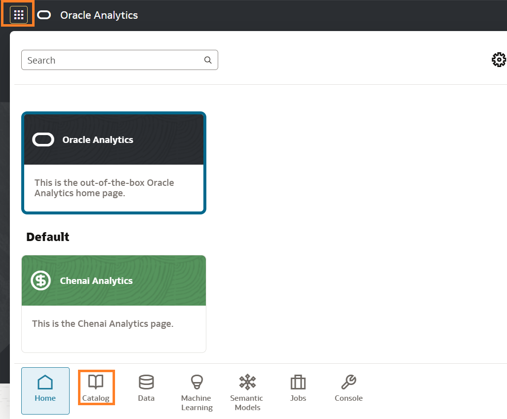

2. Locate the folder in which the AI Agent is Saved, then **Click** Actions menu and Open in a New Tab 

    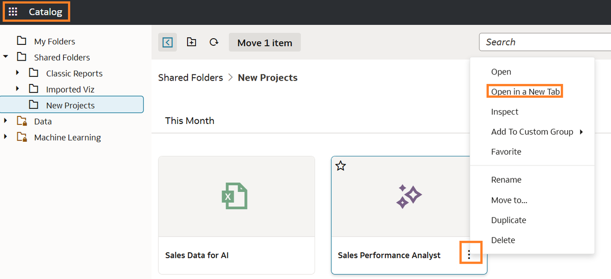

3. Alternatively, on the Home Page, **Scroll** until you see the AI Agents folder, then **Click** Actions to Open the AI Agent.

	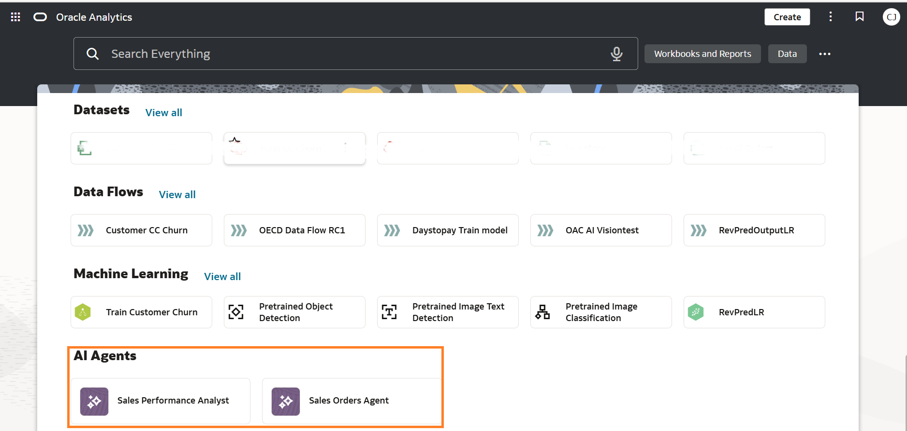

    > **Note:** You can customize your home page layout so that it is easier to find objects using the **Page Menu** -> **Customize Layout** 

    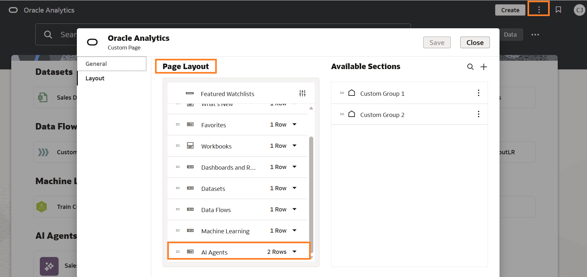

4. The last/easiest method is to use the **Home Page** Search to find the AI Agent. Under **AI** Click AI Agent

	  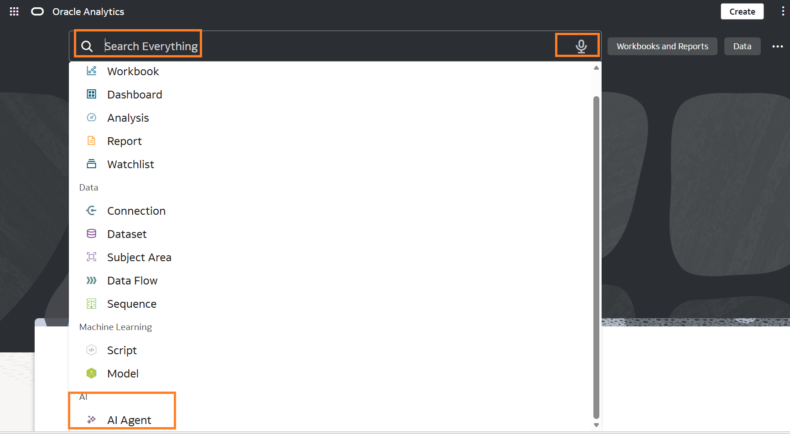
  

## Task 2: Interact with the AI Agent
In this task, you will interact directly with the AI agent using natural language to explore your data. By asking business-focused questions, you’ll receive instant insights, visualizations, and explanations without building reports manually. We will test the Agent's capabilities like basic understanding of facts, critical reasoning, ability to follow business rules and solution recommendations.This demonstrates how analytics becomes conversational, enabling faster and more intuitive decision-making.

1. **Validate** Basic Understanding. "Break down orders, sales, and profit by region"

    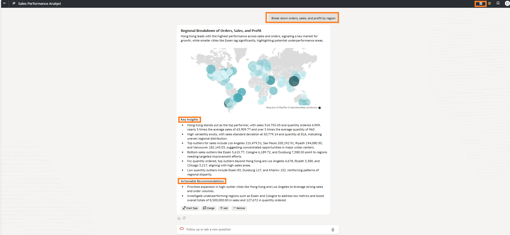

    > **Note:** At any time you can clear the Agent history by clicking the Delete icon on the right corner. Verify the response against your Dataset e.g Chicago Order 10081, Profit is $236.7 and Sales is $1846.4.

    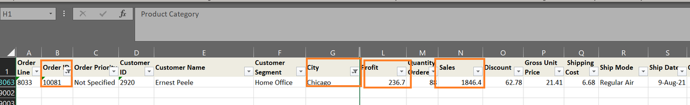

2. **Click** Additional Insights.The Agent generated insightful info such as Top and Bottom 3 Cities. The Agent also created additional visualizations breaking down Sales Revenue by City, Sales Revenue by Order Identifier and etc.

    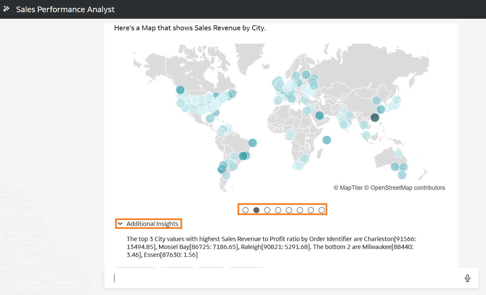

3. **Hoover** your mouse on the visualization to access options such as **Export, Add to Watchlist and Maximize Visualization**

    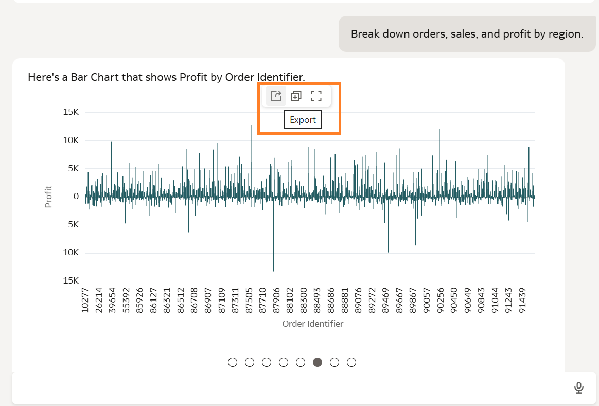

4. **Validate** Critical reasoning and understanding of relationships across dimensions."How does order priority influence shipping choices and associated costs"

    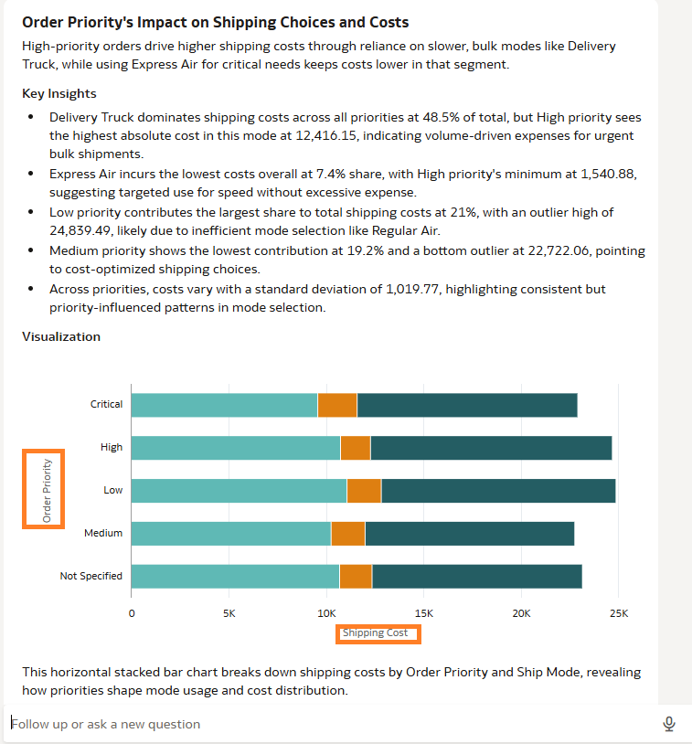

    > **Note:** The Agent generated a comparison of shipping methods by priority and impact on costs

5. **Validate** The ability to follow business rules, RAG, docs to prove it's a trusted enterprise agent. "Highlight sales with excessive discounts"

    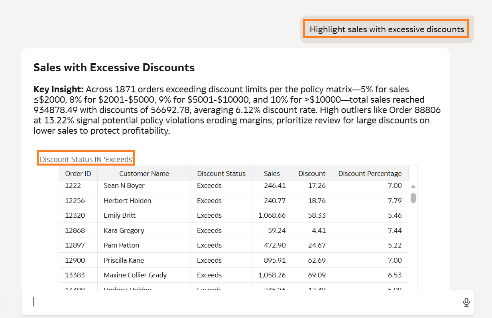

    > **Note:** The Agent used the sales discount document we uploaded to verify if the discount exceeds policy or not. If you don't see expected results this is where adding semantic descriptions work to help your AI Agent correctly interpret and explain discount behavior.

6. **Validate** the ability to recommend solutions whilst adhering to corporate policy. "How can we improve profitability while staying within policy?"

    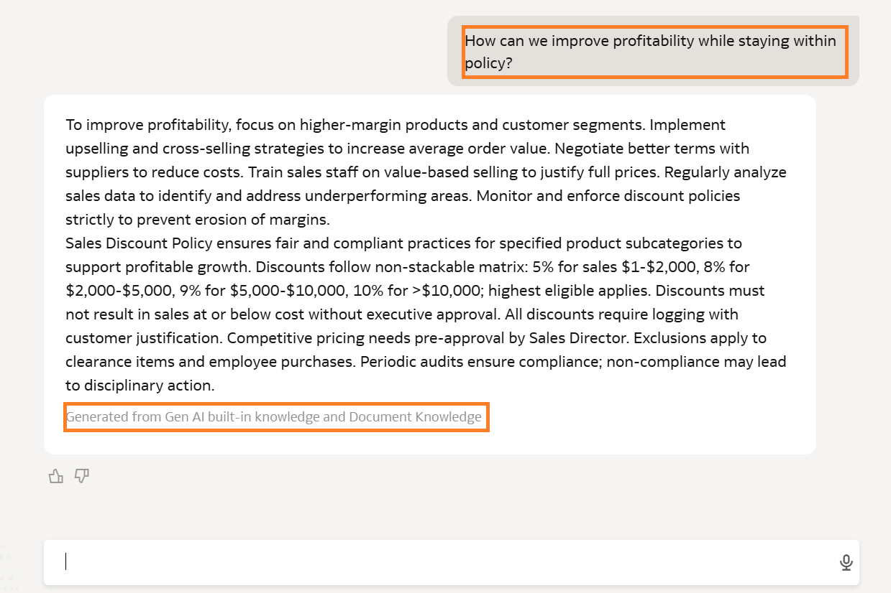

    > **Note:** The Agent generated a response based on built-in knowledge and also tied it our sales discount policy

You may now **proceed to the next lab.**

## Learn More

* [About Oracle Analytics Cloud AI Agents](https://docs.oracle.com/en/cloud/paas/analytics-cloud/acubi/oracle-analytics-ai-agents.html)

## Acknowledgements
* **Author** - Chenai Jarimani, Cloud Architect, ONA
* **Last Updated By/Date** - Chenai Jarimani, May 2026
