# Connect Agent to Workbook

## Introduction

In this lab, you will integrate the AI agent directly into an OAC workbook, making its capabilities accessible within a familiar dashboard environment. This allows users to seamlessly transition from visual exploration to conversational insights without leaving the workbook.

Estimated Time: X

### Objectives

In this lab, you will:
* Attach the AI Agent to a Workbook.
* Validate the AI Agent.

### Prerequisites 

This lab assumes you have:
* You have completed prior labs

## Task 1: Attach the AI Agent to a Workbook
In this task, you will attach the AI agent to an OAC workbook, enabling users to access its capabilities directly within their dashboards. This integration allows seamless interaction between visual analytics and conversational insights, enhancing the overall decision-making experience.

1. **Click** Create, then Workbook from the HomePage.

	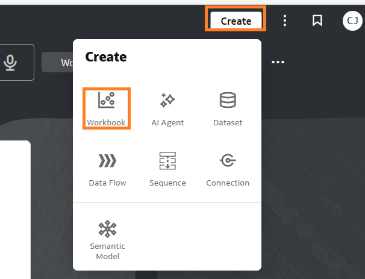
	
2. **Type** Sales Data for AI or your subject area name if using Semantic Modeler, then Add to Workbook

	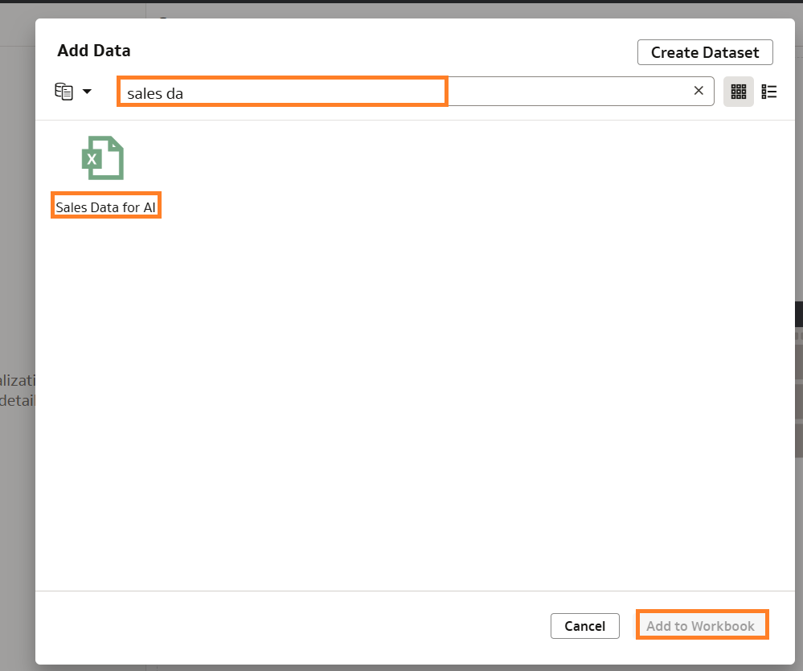

3. **Click** AutoInsights tab then Insights

	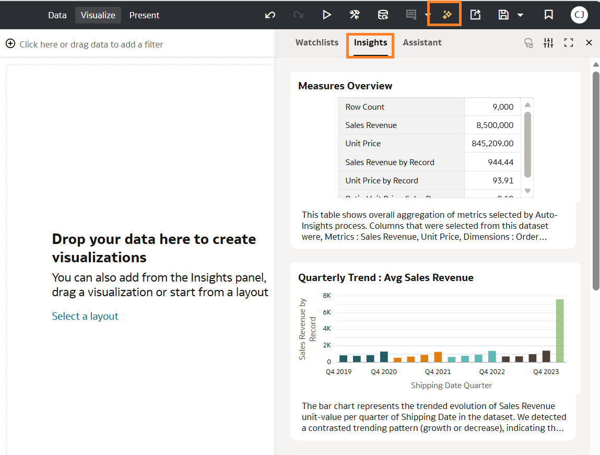

    > **Note:** Autoinsights uses AI to automatically analyze your data, uncover patterns, trends, and anomalies, and present them as meaningful, easy-to-understand insights without manual exploration. It is the same menu you access Watchlist and the AI Assistant.

4. **Select** a few visualizations and drop in the canvas.

	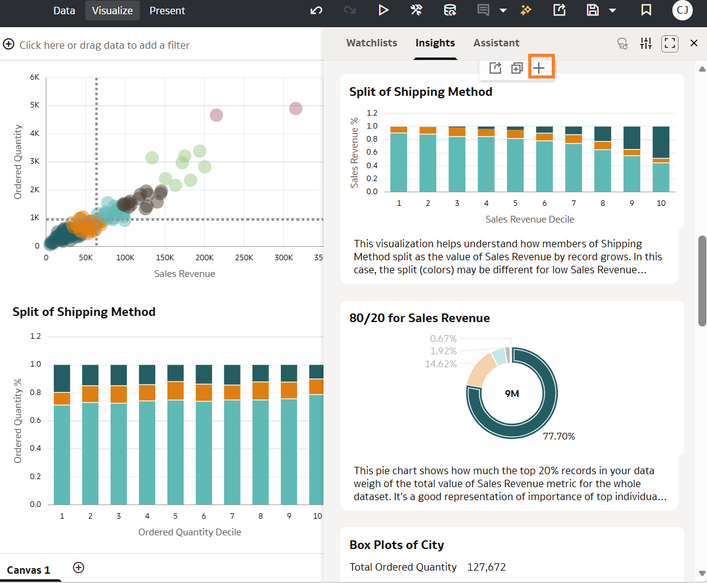

    > **Note:** You can always change the default attributes and metrics which Insights use to generate to align with your use case. At any time you can reset to default settings

    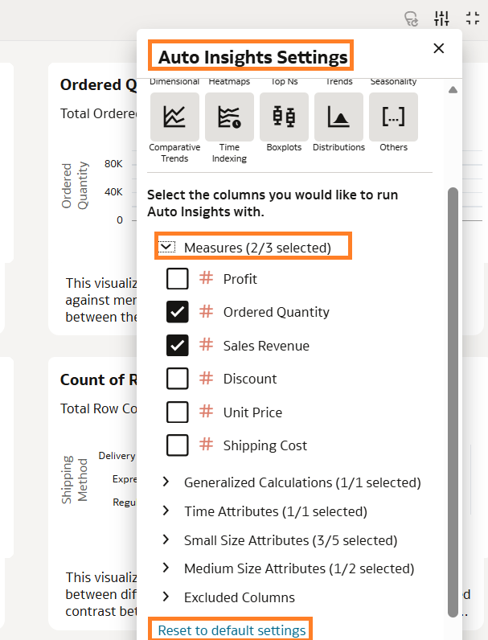

5. **Save** Workbook.

	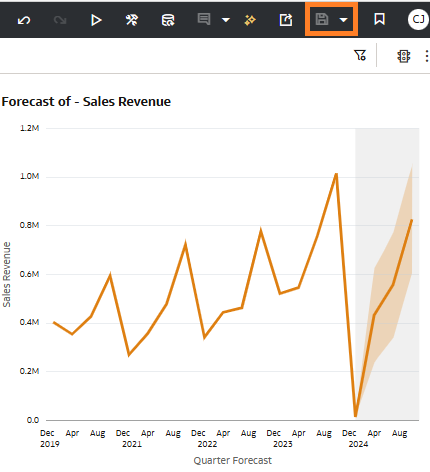

6. **Click** Autoinsights, then Assistant then AI Agents

	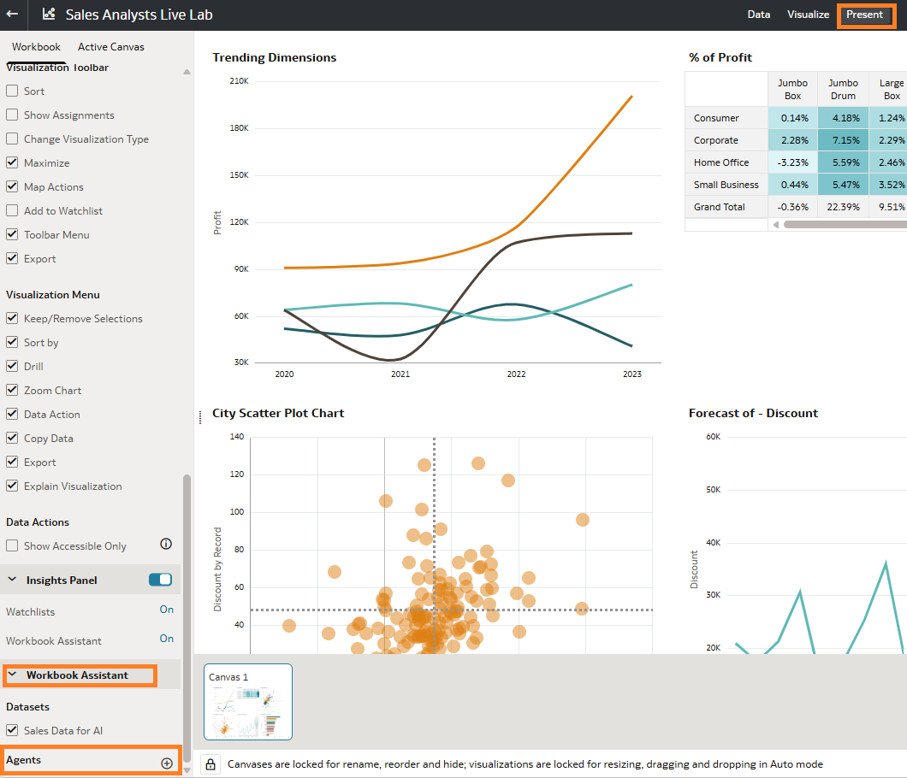

7. **Select** The Sales Performance Analyst Agent that was created in **Lab 3**, then OK

	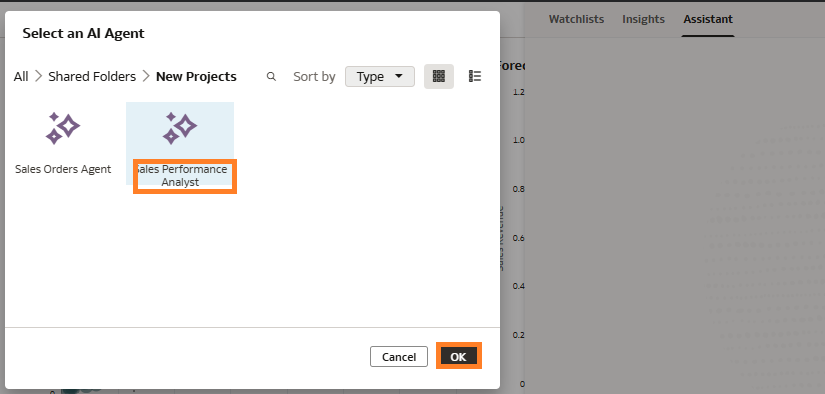

    > **Note:** You can click again AI Agents it should display the agent we just attached then Save.

    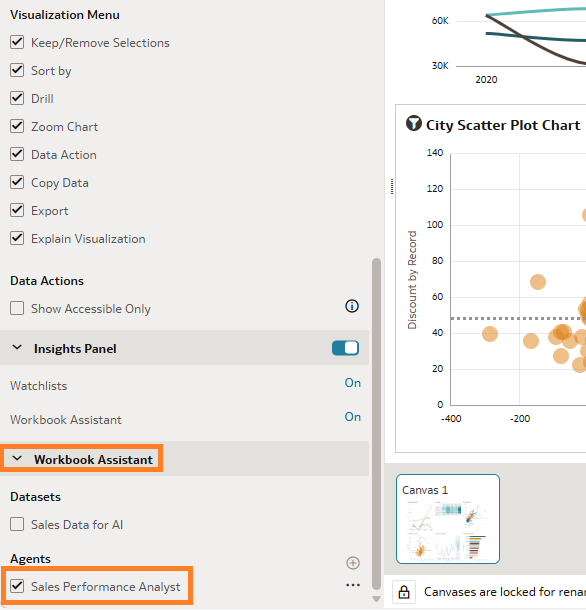

8. **Click** Present Mode to enable the Workbook Assistant. **Locate** the Insights Panel and toggle to turn it on, then Save

	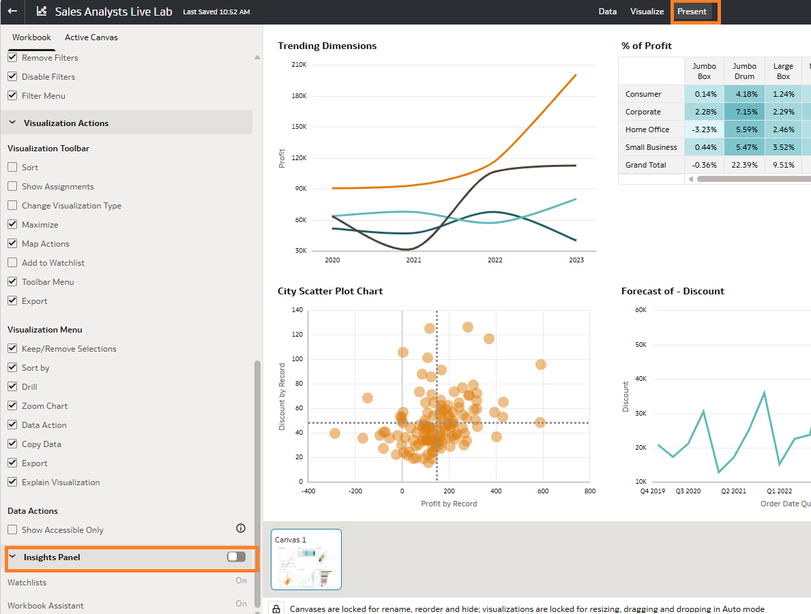

    > **Note:** OAC AI Agents are available to end users when dashboards are accessed in Present Mode. Once an author enables the Workbook Assistant, the attached agent is enabled by default.

## Task 2: Validate the AI Agent

1. **Click** Preview to view Workbook as an end user.

	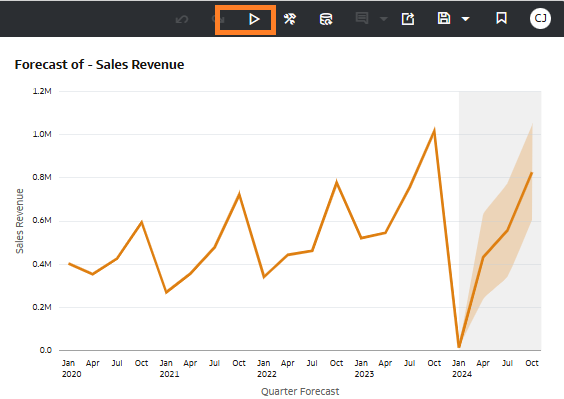

2. **Click** Autoinsights, then Assistant.

	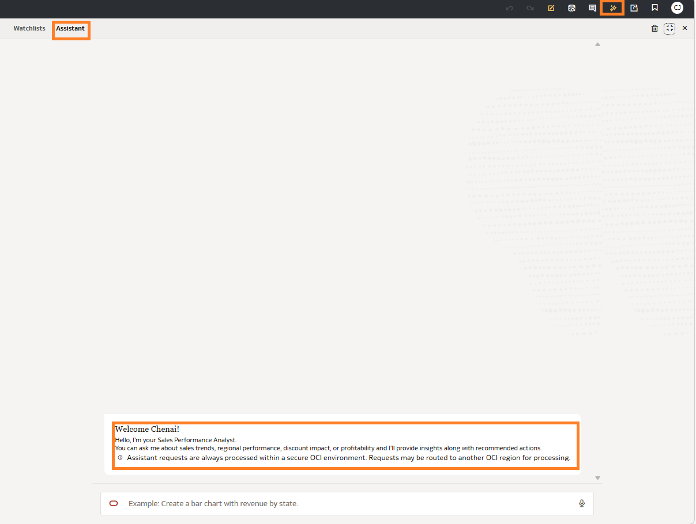

    > **Note:** The Sales Performance Analyst displays the greeting message that was configured in Lab 2. This is the same agent we accessed via the Agent Interface.

    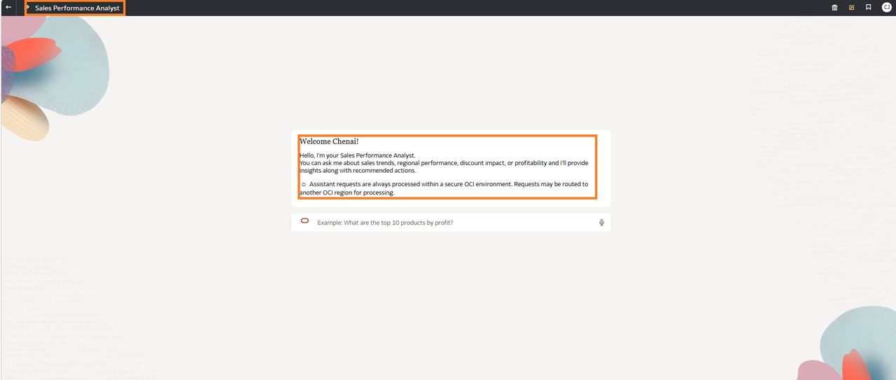

3. **Validate** Slicing and dicing across dimensions:- "Can you break down sales and profit by region and product category?"

	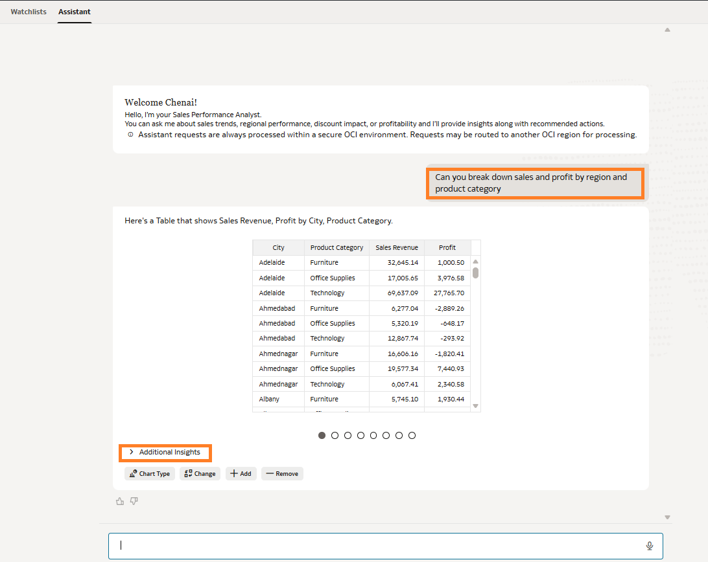

4. **Validate** Deep Dive:- "Which combinations of region and product are driving the lowest profitability?"

	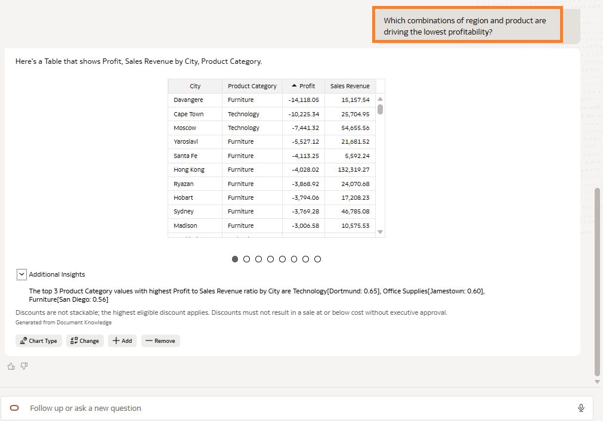

5. **Validate** Ability to verify with RAG/Enterprise Documents:- "Which transactions or regions exceed our discount policy thresholds?"

	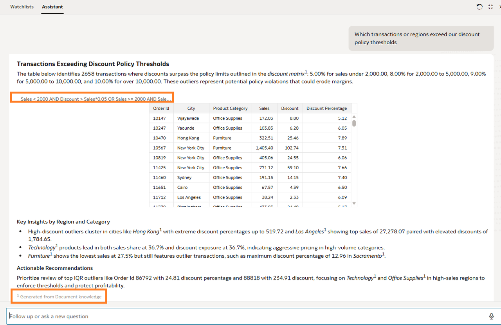

     > **Note:** Both Austin and Sacramento have 2 orders that were given 12% and 13% discount rates which exceed the 10% max discount stated in the Sales Discount Policy

6. **Validate** Trend Analysis:- "How have sales and profit trended over time by region?"

	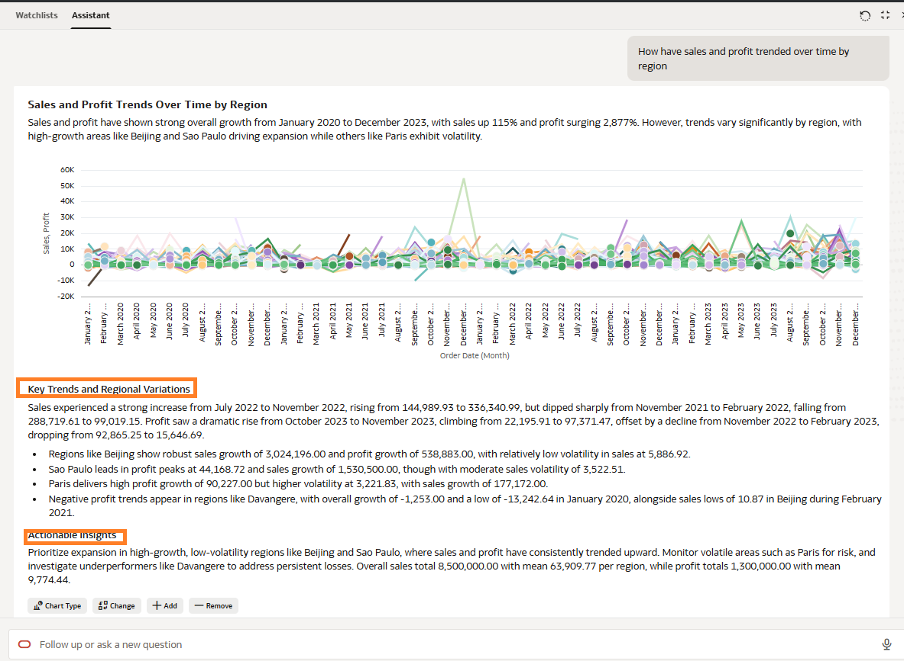

You have successfully completed all the labs

## Learn More
* [Attach AI Agent](https://docs.oracle.com/en/cloud/paas/analytics-cloud/acubi/make-oracle-analytics-ai-agent-available-workbook.html)
* [Auto Insights in OAC](https://docs.oracle.com/en/cloud/paas/analytics-cloud/acubi/use-auto-insights-get-immediate-insights-your-data.html)

## Acknowledgements
* **Author** - Chenai Jarimani, Cloud Architect, ONA
* **Last Updated By/Date** - Chenai Jarimani, May 2026
