# Create Sales Agent

## Introduction

In this lab, you will create an AI agent in Oracle Analytics Cloud that acts as a domain-specific business analyst. By defining its purpose, attaching the dataset, and providing clear instructions, you shape how the agent interprets data and responds to questions. This transforms your data into an interactive, intelligent experience where users can ask questions and receive meaningful insights instantly.

Estimated Time: X

### Objectives

In this lab, you will:
* Create the AI Agent Using a Dataset
* Create the AI Agent Using a Semantic Model


### Prerequisites

This lab assumes you have:
* Optionally a working semantic model/rpd
* All previous labs successfully completed.


## Task 1: Create the AI Agent Using a Dataset
In this task we will create the Sales AI Agent using the dataset build in Lab 1. We will add Supplemental Instructions to guide the agent's default behavior, First Message to introduce the agent, set context or clarify capabilities and lastly upload a corporate document to guid the agent responses. Link to download the file [Sales Discount Policy Document](https://objectstorage.us-ashburn-1.oraclecloud.com/n/natdsepltfrmanalyticshrd1/b/DocumentAI/o/Sales%20Discount%20Policy_AIAgentDemo.pdf)

1. Navigate to the **Homepage**, **Click** AI Agent

	 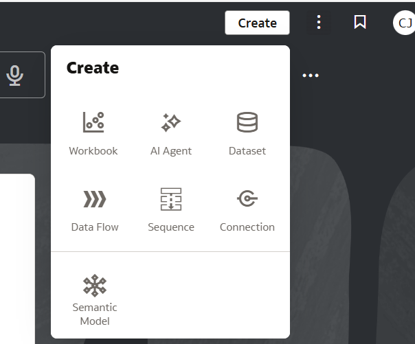 

2. Select the **Sales Data for AI**, then  **Add to Agent**.

  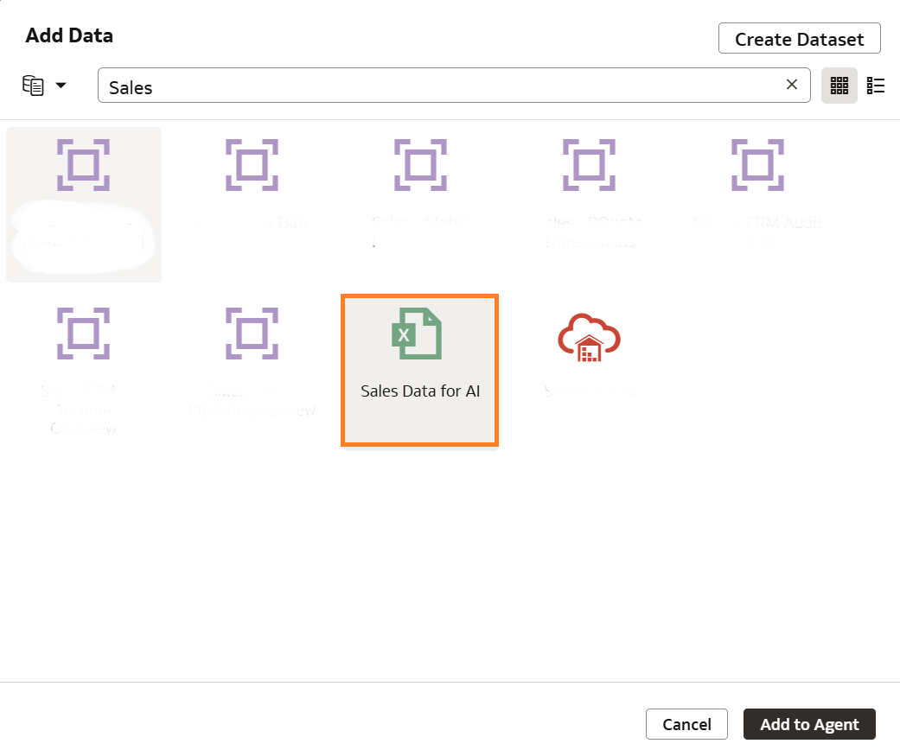

3. **Verify** the Dataset

  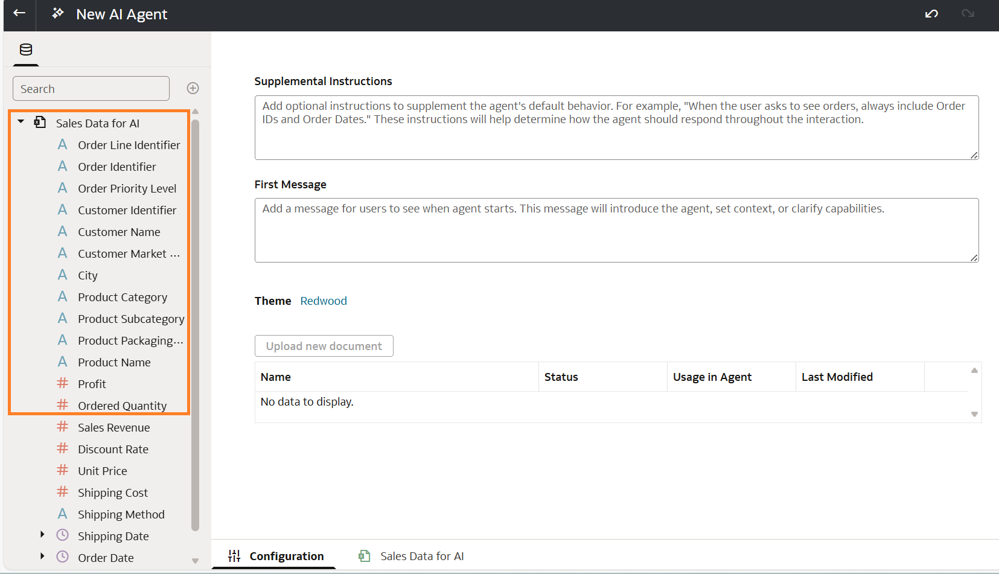

4. **Navigate** to Sales Data for AI tab to select or deselect which attributes to use in the Agent 

  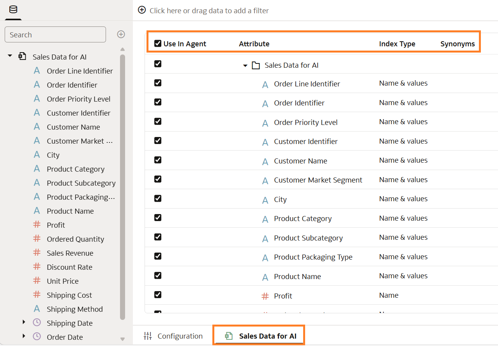

5. **Navigate** to Configuration tab, Under **Supplemental Instructions** Add below

   ```
    <copy>
    You are a senior sales strategy analyst advising executive leadership.
    Focus on Orders, Sales, Discounts, Region, and Profit, and synthesize insights into clear business narratives.
    Explain not just what is happening, but why it is happening, highlighting key drivers, trends, and deviations.
    Identify risks and opportunities by calling out underperformance, margin erosion due to discounting, and high-performing regions or segments.
    Always provide comparative context across time periods, regions, and product segments to frame performance.
    Deliver concise, insight-driven responses with a strong emphasis on implications and recommended actions to improve revenue growth and profitability.


    </copy> 
   ```

6. Under **First Message** add below

   ```
    <copy>  
    Hello, I’m your Sales Performance Analyst.
    You can ask me about sales trends, regional performance, discount impact, or profitability and I’ll provide insights along with recommended actions.

    </copy>
   ``` 

7. **Click** Save

  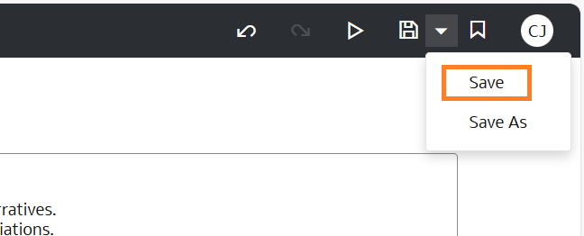

8. **Upload**  a Sales Discount Policy document, then **Click** Save

  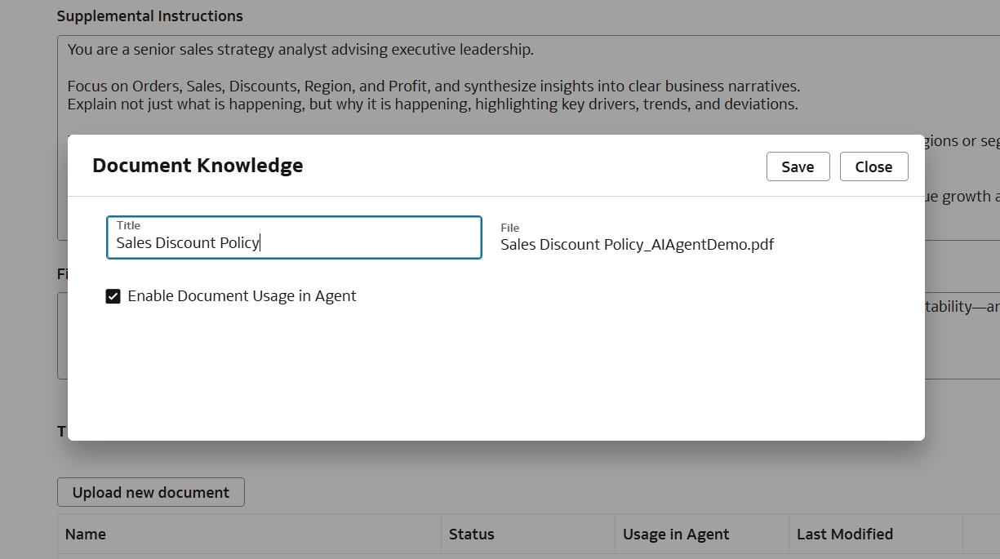 

  > **Note:** You can add up to 10 pdf and txt documents

9. **Click** Save, then **Run**

  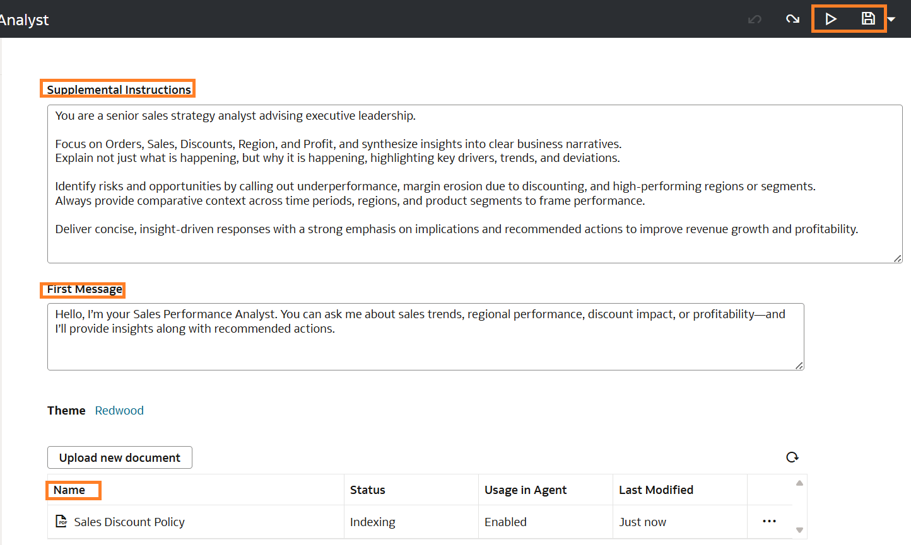

  > **Note:** Notice the knowledge document is indexed so that its elements are used by the LLMs

 10. Running the Agent opens the Agent UI with the First Message you configured on **Step 6** displayed.You can start typing or speak using the mic to ask questions

  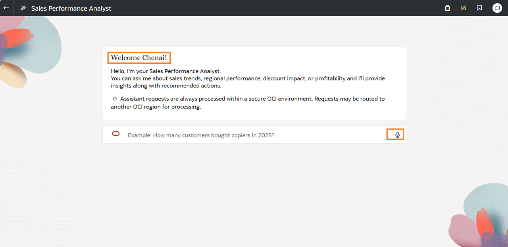

 

## Task 2: Create the AI Agent Using a Semantic Model
In this task we will create the Sales AI Agent using the semantic subject area. A semantic model ensures the AI agent speaks the language of the business, not just the language of data thereby delivering insights that are accurate, consistent, and decision-ready. They give the AI agent business context—so instead of guessing what ‘revenue’ means, it knows exactly how it’s defined and how it relates to other metrics.

1. Navigate to the **Homepage**, **Click** AI Agent

	  

2. **Click** the All Data icon to filter out Subject Areas.

  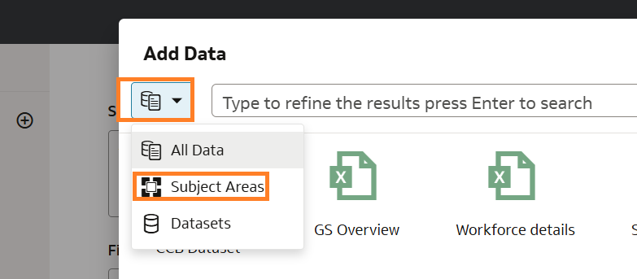

3. Select the **Subject Area**, then  **Add to Agent**. In my case it is SampleApp

  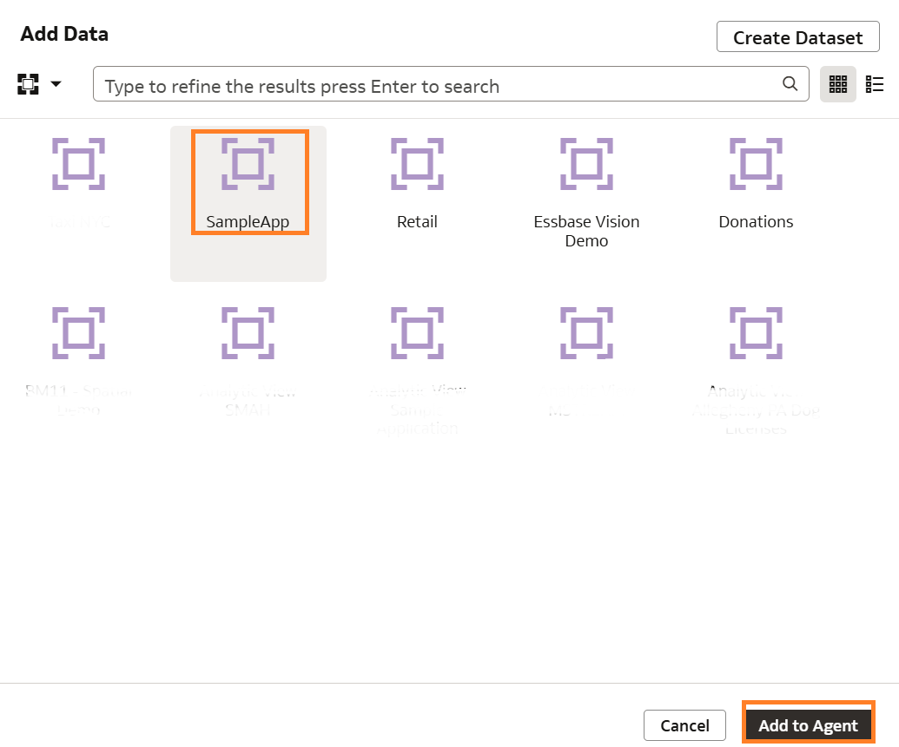

4. Verify the Subject Area is added,  **Expand** each folder to verify attributes and measures

  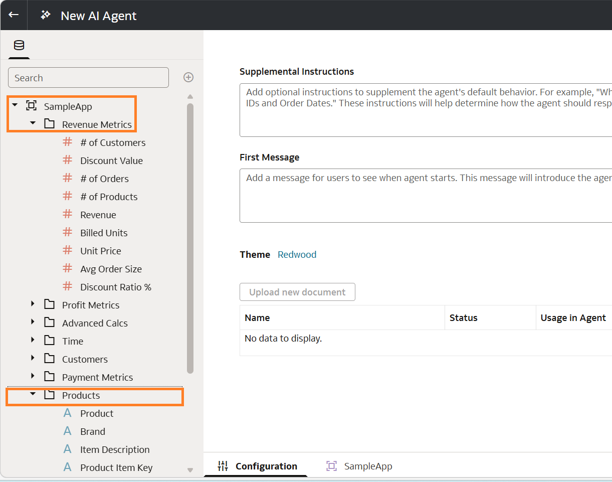

  > **Note:** Repeat **Steps 4 to 10 from Task 1** to finish configuring your AI Agent. Also, remember to configure/enable  data model search indexing for the subject area you'd use for this exercise via the console.

  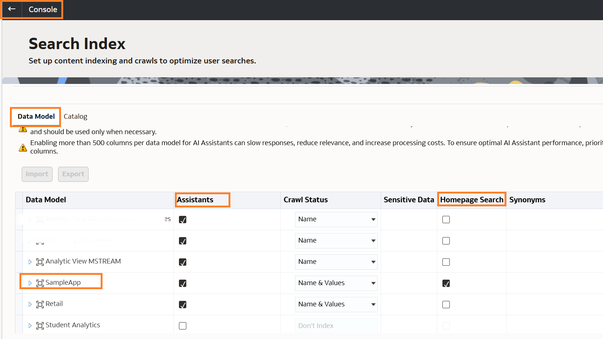


You may now **proceed to the next lab.**

## Learn More

* [Create an Oracle Analytics AI Agent](https://docs.oracle.com/en/cloud/paas/analytics-cloud/acubi/create-oracle-analytics-ai-agent.html)
* [Configure Data Model Search Indexing ](https://docs.oracle.com/en/cloud/paas/analytics-cloud/acabi/configure-data-model-search-indexing.html#GUID-64DDEF84-75B8-4D0D-A625-17E9538435F0)

## Acknowledgements
* **Author** - Chenai Jarimani, Cloud Architect, ONA
* **Last Updated By/Date** - Chenai Jarimani, May 2026
