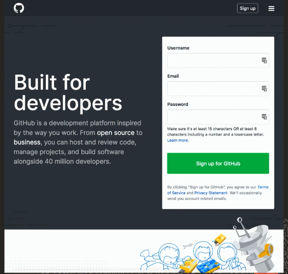
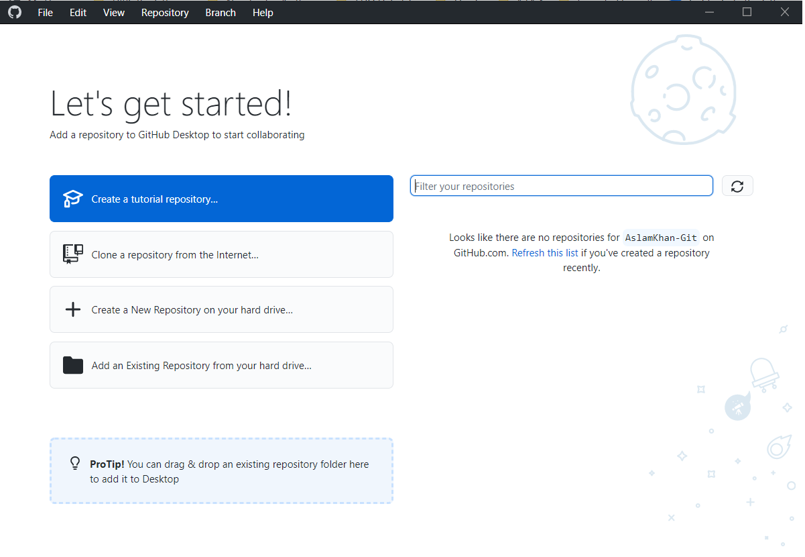
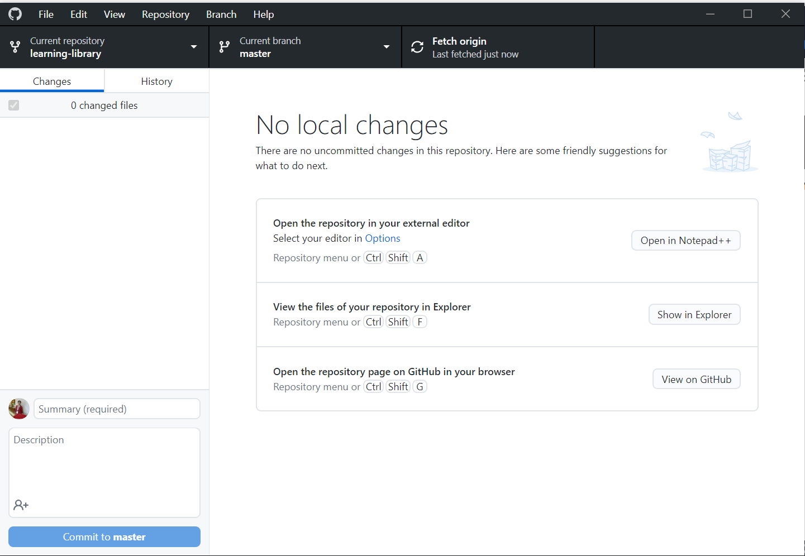
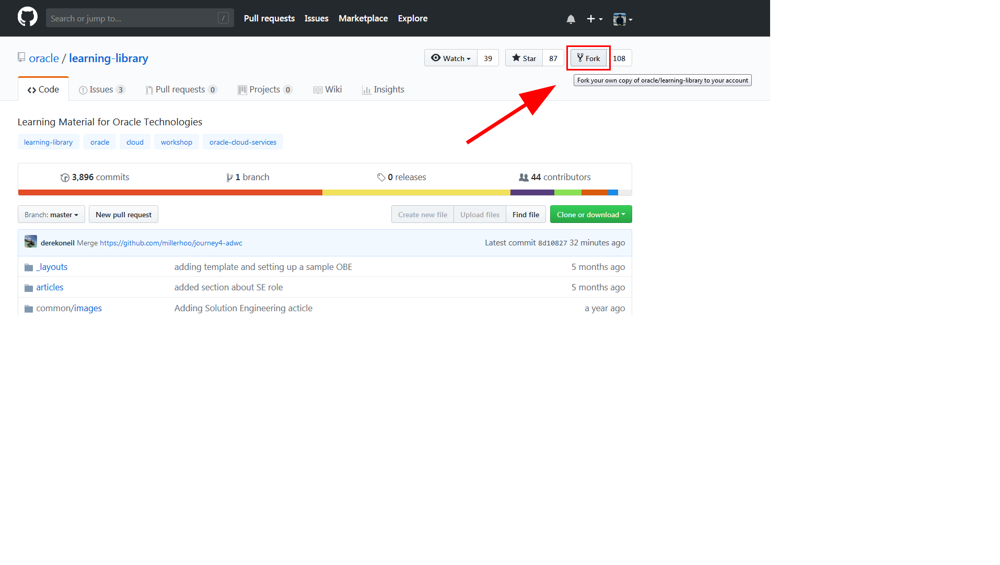
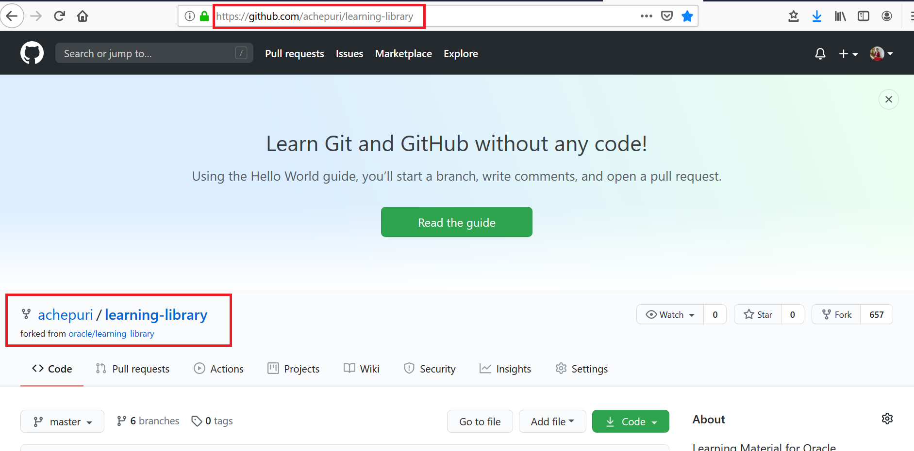
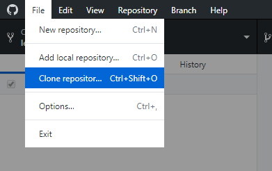
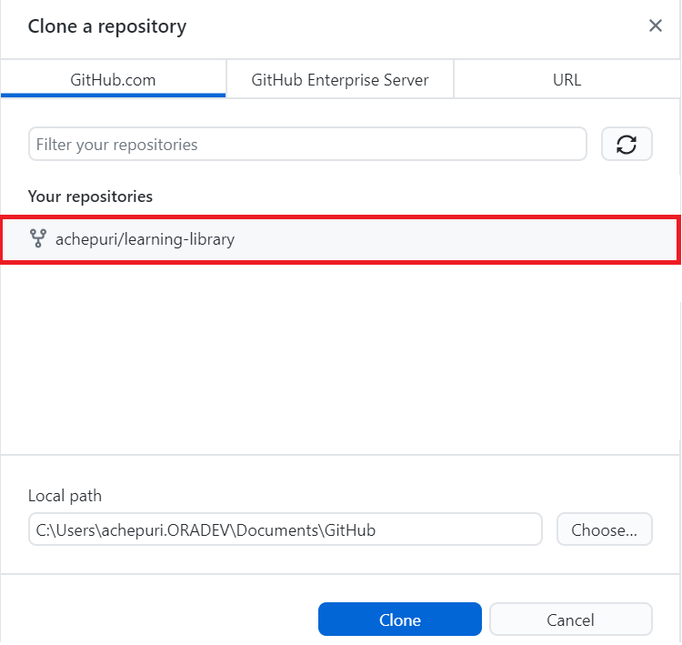
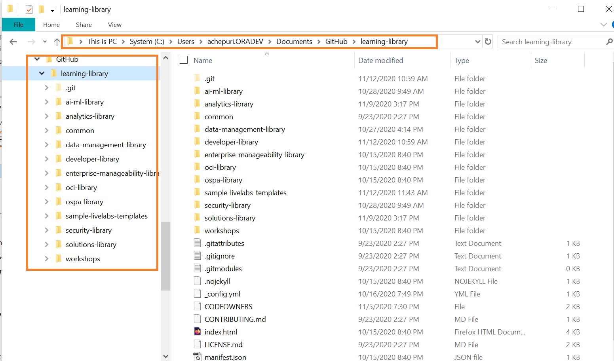
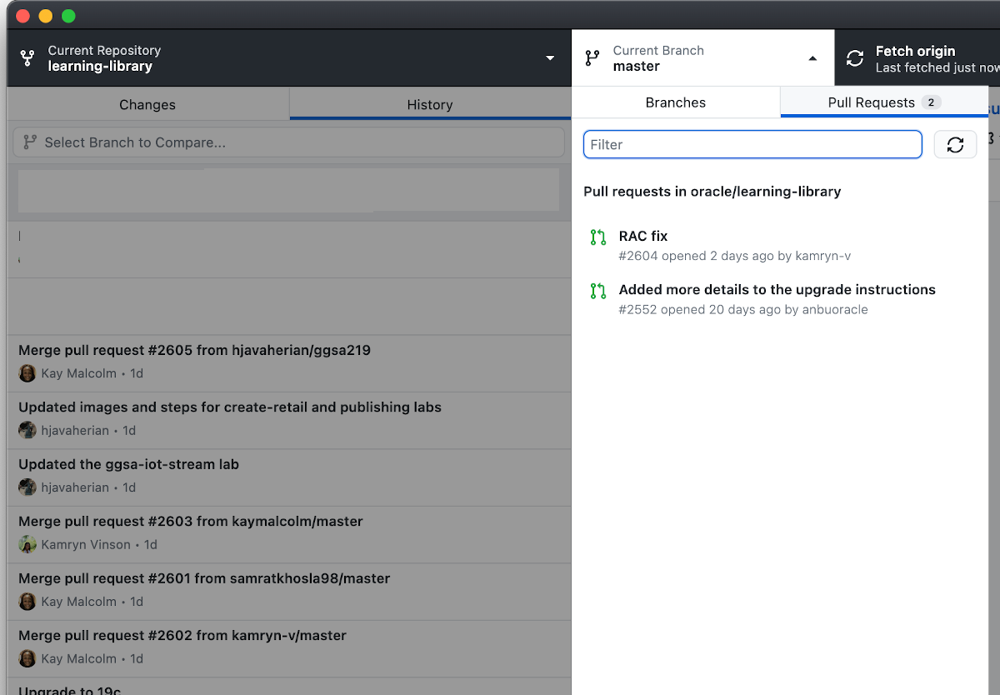
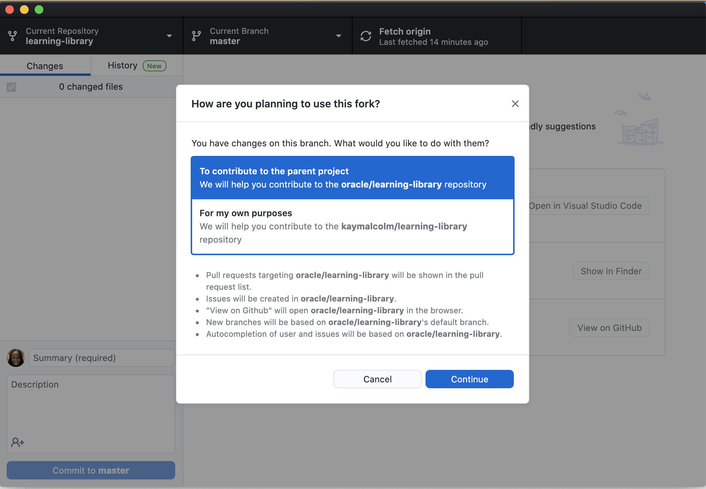

#  Get Started with Git and Set up the GitHub Environment

## Introduction

In this lab, you will learn how to create a GitHub Account and associate it with your Oracle email account, request that your GitHub account is added to the Oracle GitHub Organization (OGHO) at [github.com/oracle](github.com/oracle), set up the GitHub development environment, and install GitHub Desktop.

### Objectives
* Submit a LiveLabs workshop request using the **Oracle Workshop Management System (WMS)**.
* Create a GitHub account and add it to the Oracle GitHub Organization.
* Set up your GitHub environment.
* Install GitHub Desktop Client (recommended for User Assistance Developers).

### What Do You Need?

* Access to the **Oracle Workshop Management System (WMS)**
* Access to the **Develop LiveLabs Workshops and Labs Using Markdown** internal documentation
* Familiarity with HTML and/or Markdown is helpful but not required

## Task 1: Submit a Workshop Request to the Oracle Workshop Management System

Before getting started, you should submit your LiveLabs workshop request to the WMS. Submitting a workshop informs the Oracle ecosystem that you are working on a workshop and submits your idea to the Workshop Council. We urge you not to delay this step. There are hundreds of workshops already, this step is important to helps us preserve the quality and integrity of the workshop catalog.

1.  Login to Corporate VPN.

2.  Access the **Oracle Workshop Management System (WMS)** page.
    > **Note:** This page is only accessible to Oracle Employees.

3.  Click **Submit a New Workshop**.

4.  Fill in the required fields including the **Workshop Abstract** field *thoroughly*.  Failure to do so will prevent your workshop from being approved.

5.  Click **Create**.

6.  We recommend you don't start working on your workshop until your workshop has been approved by a council member.

Once your workshop is submitted, it will be sent to the workshop council.  The workshop council will approve your workshop or ask for more details.  Once approved, you will be entered into the workflow and given additional steps to progress through to production.

> **Note:** If you are a developer, QA, or PM, you can create and publish a Custom image of the on-premises product to OCI Market place. See the [Creating Compute Images for Marketplace](https://oracle.github.io/learning-library/sample-livelabs-templates/create-labs/labs/workshops/compute/?lab=6-labs-setup-graphical-remote-desktop) LiveLabs workshop.

## Task 2: Create and Set Up Your GitHub Account

In this Step, you will create and set up your GitHub account.

1. Create a free GitHub Account here: [GitHub Web UI](https://github.com/) if you don't have one.
    

2.  If this is a new account, use your Oracle email ID to register.

    > **Note:** Do not create a secondary new account to join GitHub. Ensure that your GitHub account is associated with your @oracle.com email ID.

3. Go to [GitHub Settings](https://github.com/settings/profile) and configure the following:
    *   Set your Name as it appears in your Aria employee page.
    *   Add your Profile Picture.

4. Click **Account** to add your user name in the **Enter a user name** dialog. For example, achepuri, LauranSerhal, and so on.

5. Set up a 2 Factor Authentication here: [GitHub Security](https://github.com/settings/security).

    

If you are an Oracle employee working on GitHub projects, you must be a member of the **Oracle GitHub organization (OGHO)** at [github.com/oracle](github.com/oracle), and be successfully listed under the **People** tab. To request access as a contributor to existing repository such as the **Oracle** project and its **learning-library** repo where your LiveLabs workshop will be stored, your GitHub account must be in accordance to the OGHO requirements. Once you complete the above steps, request membership to the **OGHO** as follows:

1. Go to the **Oracle Identity Management (OIM)** system to Request Access.
    > **Note:** **OIM** is only accessible to Oracle Employees.

2. On the **Home** tab, click the **Request Access** tile, and then select **Request for Self** from the context menu. The **Request Access** tab is displayed.

3. In the **Catalog** tab, enter **github** in the **Search** field, and then click **Search**. In the search result list, click **+ Add to Cart** in the row for the **GitHub Oracle Organization** (GitHub). The text changes to **+ In Cart** and it is grayed out. If this is the first time you are requesting access to a GitHub Organization, the system will automatically add the **GitHub** account to your cart. Click **Next**.

4. In the **Cart Details** page, enter a justification for your request in the **Justification** field, and then click **Submit**. Provide your GitHub username if required on the page. The justification _MUST_ include the link to the GitHub repository that you intend to contribute to such as [https://github.com/oracle/learning-library](https://github.com/oracle/learning-library). Follow the prompts or instructions. You usually will get an email notification once you submit your request and another once your request is approved.

> **Note:** If the GitHub username field is displayed on the **Cart Details** page, you must provide your GitHub username. To find your GitHub username, login to GitHub. Your GitHub username is displayed on the left side of the page, next to your picture. In addition, you can click the drop-down arrow next to your picture on the right-hand side of the banner, and view your GitHub username in the **Signed in as** menu item. If you click the **Your profile** menu item, your username is visible under your full name on your profile page. It is also part of your profile URL, i.e. https://github.com/<GitHub_username>. You should only provide the username in the required field and nothing else (especially not your email address).

5. Wait until you receive an approval email from the Oracle GitHub Organization (OGHO) before contributing content to the [https://github.com/oracle/learning-library](https://github.com/oracle/learning-library) repository. Follow the instructions in the approval email.

## Task 3: Download and Install the latest version of Git (Optional Step)

> **Note:** For User Assistance Developers (UAD), Oracle recommends using GitHub Desktop client because of its simple and user friendly user interface, and it is also much easier to use than the Git command line; therefore,  if you are a UAD, skip this task and follow the instructions in **Task 4: Install GitHub Desktop**.

To install Git:

1. Install Git for your operating system from the [Git download site] (https://git-scm.com/downloads).

2. Click the required option under **Downloads** (**Windows** in this example) and save the installer file.

3. Browse to the downloaded location and double-click the file to launch the installer.

4. Click **Yes** in the **User Account Control** dialog box.

5. Click **Next** in the **GNU General Public License** dialog box.

6. Under **Choose the default behavior of `git pull`**, leave the selected **Default (fast-forward or merge)** option as is and click **Next**.

7. In the **Configuring experimental options** dialog box, click **Install**.

## Task 4: Install GitHub Desktop

The GitHub Desktop application is a UI client for Windows and Mac that simplifies the complex set of GitHub command line arguments. GitHub Desktop is a fast and easy way to contribute to projects and it simplifies your development workflow. It is much easier than using Git command line.

To setup the GitHub Development Environment and install **GitHub Desktop**:

1. Download and install **GitHub Desktop** from [GitHub Desktop](https://desktop.github.com/).

2. When the software is successfully installed, open the **GitHub Desktop**.

  

3. Click **File > Options > Sign in**, enter your GitHub **Username** or **email address**, **Password**, and then click **Sign in**. You will receive an authentication code to your cell phone. Enter this code in the **Authentication code** field in the **Sign in** dialog box.

    > **Note:** The authentication code is valid only for a few seconds.

  You are now logged in to **GitHub Desktop**.

  

## Task 5: Fork the learning-library Repository on Your GitHub Account

  We create workshops and labs in the **learning-library** repository of the **oracle** project. You must fork the **learning-library** repository to create a duplicate personal copy of the repository on your GitHub account. You own the forked (stage) **learning-library** repository and you can edit its contents without affecting the parent **learning-library** (production) repository.

  For example, if a user named achepuri forks the **learning-library** repository in the **oracle** project, a duplicate repository [achepuri/learning-library](https://github.com/achepuri/learning-library) is created.

  To fork the **learning-library** repository:

1. Log in to the [GitHub Web UI](http://github.com), using your GitHub account.

2. Navigate to the [oracle/learning-library repository](https://github.com/oracle/learning-library).

3. Click **Fork** to display the following message: **How are you planning to use this fork?**.

  

4. Select the option that indicates your local repository.
In the following example, user achepuri has forked the **learning-library** repository.

  

In the next Step, you will clone this forked repository.

## Task 6: Clone the Forked Repository
A clone is a copy of your forked repository that lives on your local computer instead of on [GitHub Web UI](http://github.com). When you clone your forked repository, you can edit the files in your preferred editor, such as **Atom** editor, and use the **GitHub Desktop** client to keep track of your changes without having to be online.

To clone the forked repository:
1. Open your **GitHub Desktop** application and log in using your GitHub account.
2. Click **File > Clone repository** to display the **Clone a repository** dialog box.

    

3. Select your own repository such as **your account/learning-library** from **Your repositories**. In this example, there is only one repository displayed named **achepuri/learning-library**. Under **Local path**, select the local path on your machine where the repository is going to be cloned (copied). This is where the project files get copied to your local file system. In this example, the local path is **C:\Users\achepuri.ORADEV\Documents\GitHub**.  

    

4. Click **Clone**.

  The **learning-library** repository files appear in the local path you just specified. You can now start working on your labs and workshops!

  

  > **Note:** The local cloned repository is connected to the remote fork version. You can push your local clone changes to the remote fork version when you are online to keep them in sync.

  **Important Note**: The **create-labs** folder (shown in the above screen) and its contents are internal to this "**Creating Labs and Workshops**" workshop. This folder is not available at the production. This means that when you fork the **oracle\learning-library** repository to your fork, such as **your account\learning-library**, you will not find the **create-labs** folder, and thereby it will not be available in your cloned repository as well.

  When you make a clone, you can create your own project folder, edit the files in your preferred editor, such as **Atom**, and use **GitHub Desktop client** to keep track of your changes without having to be online.

  The repository you cloned is still connected to the remote version (your fork) so that you can push your local changes to the remote to keep them synced when you're online.

5. You can also use Github Desktop to Synchronize the changes that you have made in your local file system to the forked content on your github repo, more details on using Github Desktop in Lab 4 of this workshop and also on Otube [Working with GitHub Desktop](https://otube.oracle.com/media/t/1_bxj0cfqf).

  

6. When asked how you plan to use the fork select **To contribute to the parent project**.

  

This concludes this lab. You may now proceed to the next lab.

## Want to Learn More?

<!-- * [Setting Up Environment](https://otube.oracle.com/media/Setting+Up+GitHub/0_93stcjpb) -->
* [Download and Install Git for Windows and Mac](https://git-scm.com/download/win)
<!-- * [Using GitHub Desktop to merge, commit and make pull requests](https://otube.oracle.com/media/t/1_bxj0cfqf) -->

## Acknowledgements

* **Authors:**
    * Anuradha Chepuri, Principal User Assistance Developer, Oracle GoldenGate
    * Lauran Serhal, Principal User Assistance Developer, Oracle Database and Big Data
* **Contributors:**
    * Tom McGinn, Database and Database Cloud Service Senior Principal Product Manager, DB Development - Documentation
    * Madhusudhan Rao, Principal Product Manager, Database
    * Aslam Khan, Senior User Assistance Manager, ODI, OGG, EDQ

* **Last Updated By/Date:** Lauran Serhal and Anuradha Chepuri, November 2021
