# Setup the Environment

## Introduction

This lab walks you through the steps to prepare your OCI Environment to be able to carry all the next steps needed to create a function, create data pipelines, run OCI Language Service as well as visualize your data in OAC.

Estimated Time: 90 minutes

### Objectives

In this lab, you will:
* Verify Compartment and Group
* Set up Policies
* Create VCN with the right access
* Create an API Gateway
* Confirm access to OCI Language Services


### Prerequisites

This lab assumes you have:
* An Oracle account
* All previous labs completed


## **Task 1**: Create Compartment and Group

Talk to your Administrator to verify the name of compartment you are to use for this lab as well as the group. In our scenario, we are using compartment "oac-compartment" and "oac-developer" for the group. If these are not created you can refer to the below steps to create.

1.	Open the Oracle Cloud Infrastructure Console navigation menu and click **Identity & Security**. Under **Identity**, click **Compartments**. A list of the compartments you have access to is displayed.

    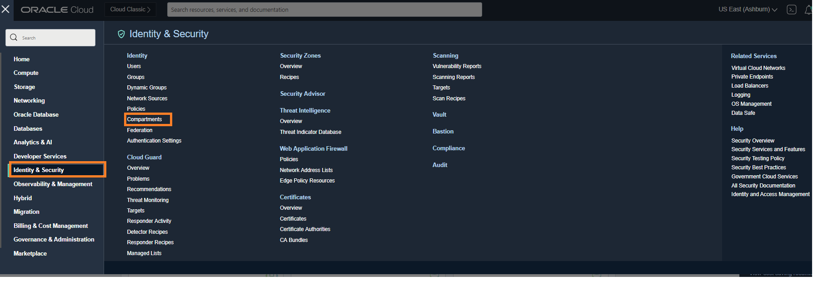

2. Navigate to the compartment in which you want to create the new compartment:
    * To create the compartment in the tenancy (root compartment) click **Create Compartment**
    * Otherwise, click through the hierarchy of compartments until you reach the detail page of the compartment in which you want to create the compartment. On the **Compartment Details** page, click **Create Compartment**

3. Enter the following:
    * **Name**: A unique name for the compartment (maximum 100 characters, including letters, numbers, periods, hyphens, and underscores). The name must be unique across all the compartments in your tenancy. Avoid entering confidential information.
    * **Description**: A friendly description. You can change this later if you want to.
    * **Compartment**: The compartment you are in is displayed. To choose another compartment to create this compartment in, select it from the list.
    **Tags**: If you have permission to create a resource, then you also have permission to apply free-form tags to that resource. To apply a defined tag, you must have permission to use the tag namespace. For more information about tagging, see Resource Tags. If you are not sure whether to apply tags, skip this option (you can apply tags later) or ask your administrator.

    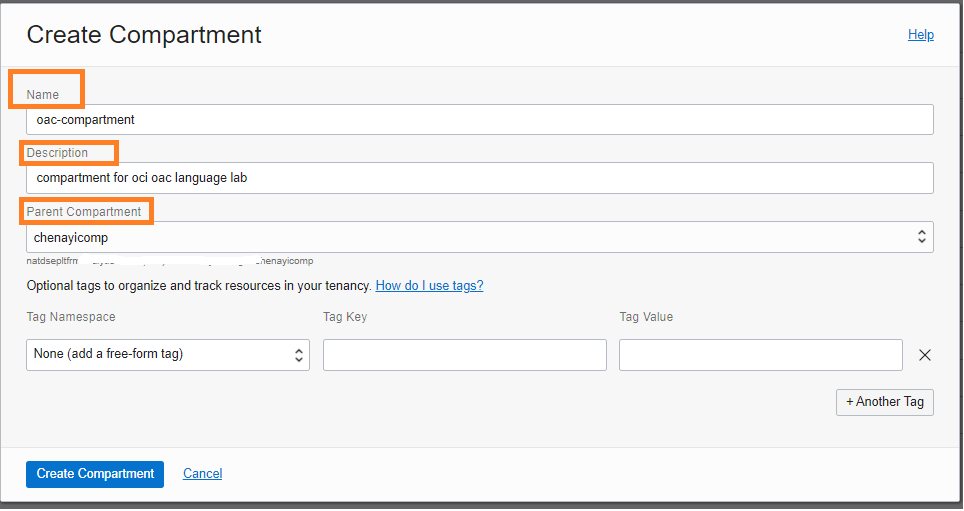

4. Click **Create Compartment**.

  For compartment : See [Documentation](https://docs.oracle.com/en-us/iaas/Content/Identity/Tasks/managingcompartments.htm) for more details.

5. Open the Oracle Cloud Infrastructure Console navigation menu and click **Identity & Security**. Under **Identity**, click **Groups**. A list of the groups in your tenancy is displayed.

    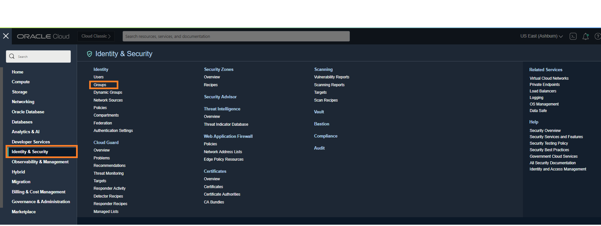

6. Click **Create Group**

7. Enter the following:
    * **Name**: A unique name for the group. The name must be unique across all groups in your tenancy. You cannot change this later. The name must be 1-100 characters long and can include the following characters: lowercase letters a-z, uppercase letters A-Z, 0-9, and the period (.), dash (-), and underscore (_). Spaces are not allowed. Avoid entering confidential information.
    * **Description**: A friendly description. You can change this later if you want to.
    * **Tags**: If you have permission to create a resource, then you also have permission to apply free-form tags to that resource. To apply a defined tag, you must have permission to use the tag namespace. For more information about tagging, see Resource Tags. If you are not sure whether to apply tags, skip this option (you can apply tags later) or ask your administrator.

    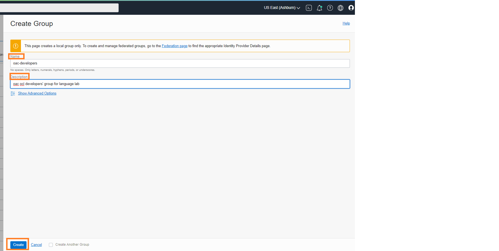

8. Click **Create Group**.

  In the next steps, you will create policies for the group.    

  For Groups : See [Documentation](https://docs.oracle.com/en-us/iaas/Content/Identity/Tasks/managinggroups.htm) for more details.

## **Task 2**: Setup Policies

  Talk to your Administrator and make sure you can: Create VCN Networks, Functions, API Gateways, use AI Services (Language) and Data Integration.

1.	Open the Oracle Cloud Infrastructure Console navigation menu and click **Identity & Security**. Under **Identity**, click **Policies**

2.	Click **Create Policy**

3.	In the **Create Policy** panel, complete the following fields:
    * For **Name**, enter a name without any spaces. You can use alphanumeric characters, hyphens, periods, and underscores only.
    * For **Description**, enter a description to help other users know the purpose of this set of policies.
    * In **Policy Builder**, use the manual editor to add the following statements, then click **Create**.

   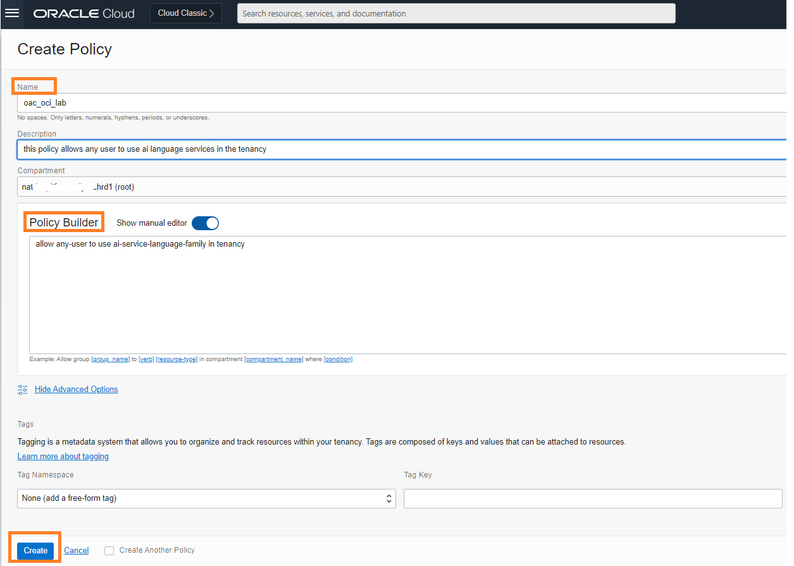

   **Note** When creating policies the one which says 'in tenancy' must be created/run in the root compartment of the tenancy. All other policies should be created in the respective compartments.

4.	The following policies should be set:

    ```
    <copy>
    allow any-user to use ai-service-language-family in tenancy
    </copy>
    ```
    ```
    <copy>
    allow group <oac-developers> to manage dis-workspaces in compartment oac-compartment
    </copy>
    ```
    ```
    <copy>
    allow group <oac-developers> to manage dis-work-requests in compartment oac-compartment
    </copy>
    ```
    ```
    <copy>
    allow group <oac-developers> to use virtual-network-family in compartment oac-compartment
    </copy>
    ```
    ```
    <copy>
    allow group <oac-developers> to manage tag-namespaces in compartment oac-compartment
    </copy>
    ```
    ```
    <copy>
    allow service dataintegration to use virtual-network-family in compartment oac-compartment
    </copy>
    ```
    ```
    <copy>
    allow group <oac-developers> to use object-family in compartment oac-compartment
    </copy>
    ```
    ```
    <copy>
    allow group <oac-developers> to use functions-family in compartment oac-compartment
    </copy>
    ```
    where **oac-developers** represents the name of your user group and **oac-compartment** represents the name of your compartment.

5.	Once you have created an API gateway (**Task 3** in the lab) and Functions (**Lab 2**), you will also need to set the following policies:

    ```
    <copy>allow any-user to use functions-family in compartment <functions-oac-compartment> where ALL {request.principal.type= 'ApiGateway', request.resource.compartment.id = '<api-gateway-compartment-OCID>'}</copy>
    ```
    where **functions-oac-compartment** is the name of your compartment and **compartment-OCID** is OCID # of the compartment.

6.	Once you have created a Data Integration workspace (**Lab 4**), you will also need to set the following policies:

    ```
    <copy>
    allow any-user to read buckets in compartment <oac-compartment> where ALL {request.principal.type = 'disworkspace', request.principal.id = 'data-integration-workspace-ocid', request.operation = 'GetBucket'}
    </copy>
    ```
    ```
    <copy>
    allow any-user to use functions-family in compartment <functions-oac-compartment> where ALL {request.principal.type= 'disworkspace'}
    </copy>
    ```
    ```
    <copy>
    allow any-user to manage objects in compartment <oac-compartment> where ALL {request.principal.type = 'disworkspace', request.principal.id = '<data-integration-workspace-ocid>'}
    </copy>
    ```
    ```
    <copy>
    allow any-user to manage buckets in compartment <oac-compartment> where ALL {request.principal.type = 'disworkspace', request.principal.id = '<data-integration-workspace-ocid>', request.permission = 'PAR_MANAGE'}
    </copy>
    ```


## **Task 3**: Create VCN with the right access levels

We will create a virtual cloud network that will serve as the home for our serverless function and the API gateway we will create.

Create a VCN with Internet access.
1.	Open the navigation menu, click **Networking**, and then click **Virtual Cloud Networks**.

    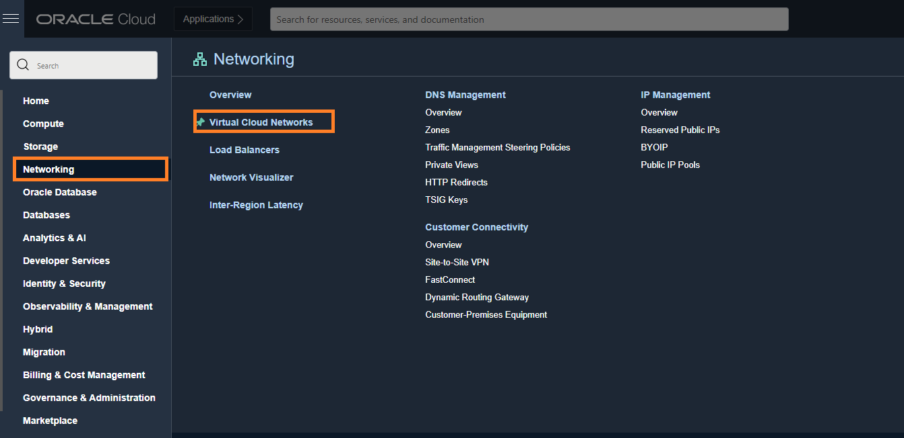

2.	Click the button **Start VCN Wizard**.

    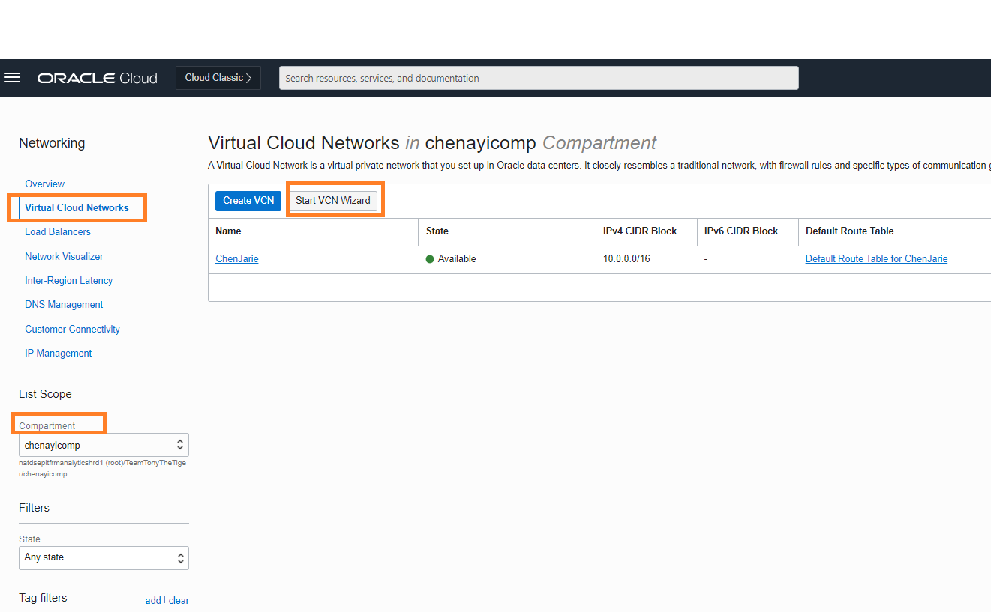

3.	Select **Create VCN with Internet Connectivity**

    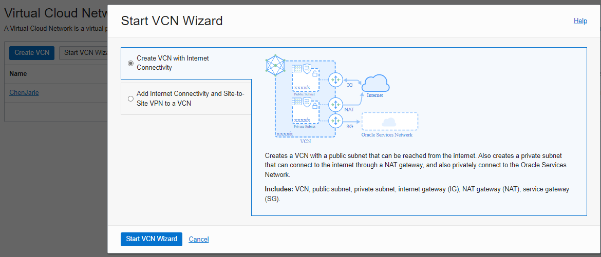

4.	Click **Start SVN Wizard**

5.	Enter a name for the VCN and click **Next**

    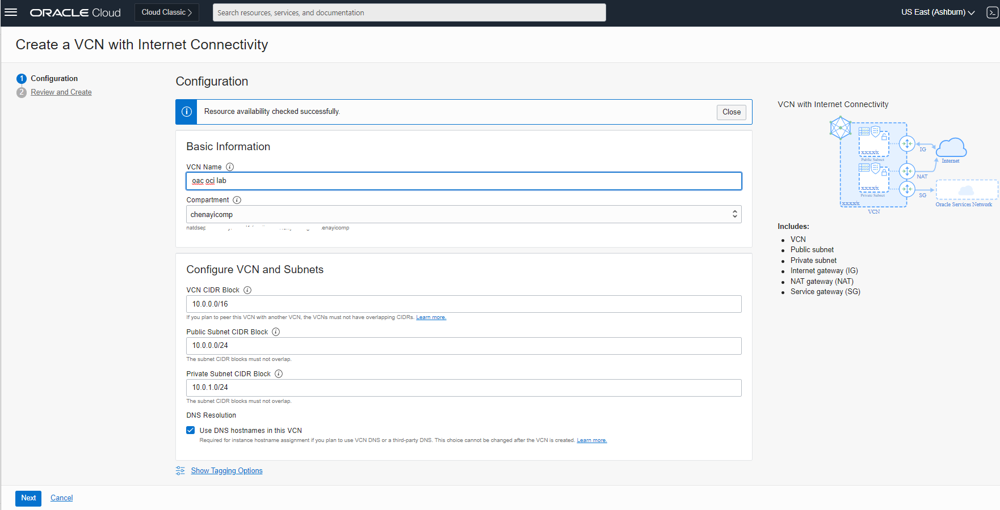

6.	Click **Create**

Make sure your VCN can be accessed from the Internet.
The API Gateway communicates on port 443, which is not open by default. You must add a new stateful ingress rule for the public regional subnet to allow traffic on port 443.
1.	Open the navigation menu, click **Networking**, and then click **Virtual Cloud Networks**.
2.	Select the VCN you just created.
3.	Click the name of the public regional subnet.
    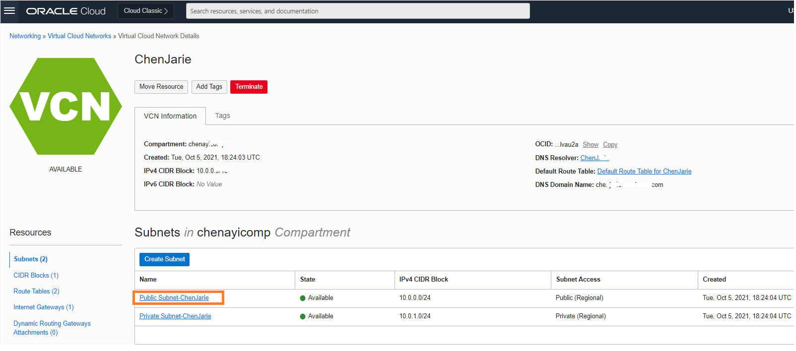

4.	In the **Security Lists** section, select the Default Security List
5.	Click **Add Ingress Rules**
6.	Specify:
    * Source Type: CIDR
    * Source CIDR: 0.0.0.0/0
    * IP Protocol: TCP
    * Source Port Range: All
    * Destination Port Range: 443
   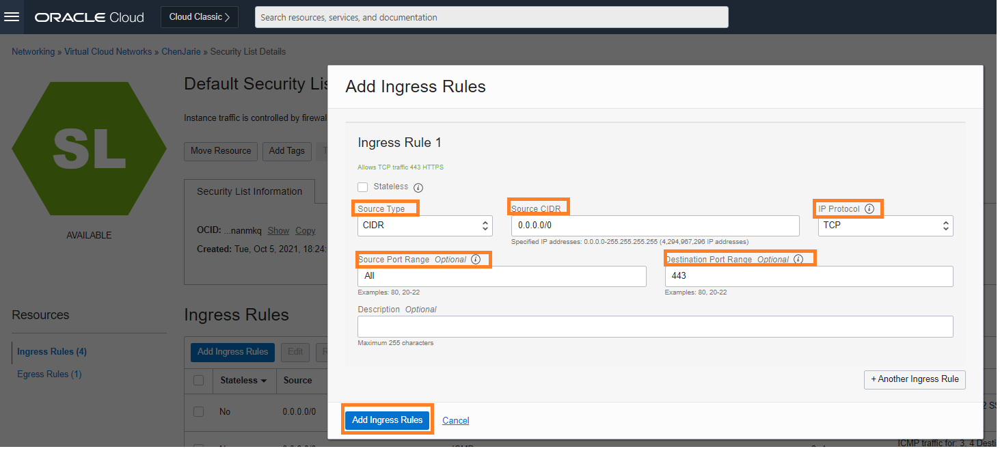
7.	Click **Add Ingress Rules** to add the new rule to the default security list.
    See [Documentation](https://docs.oracle.com/en-us/iaas/Content/APIGateway/Tasks/apigatewaycreatingpolicies.htm) for more details.


## **Task 4**: Create an API Gateway

 An API Gateway allows you to aggregate all the functions you created into a single end-point that can be consumed by your customers.

1. On the console, go to **Developer Services** and click **Gateways**

    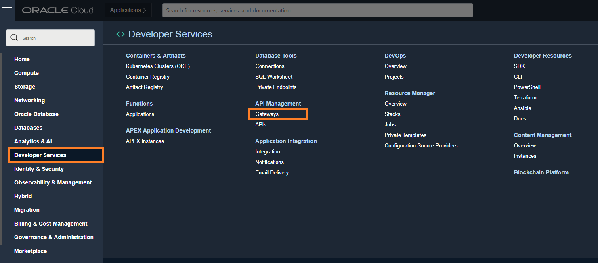

2.	Click **Create Gateway**

3.	Specify:
    * a name for the new gateway, such as lab1-gateway
    * the type of the new gateway as **Public**
    * the name of the compartment in which to create API Gateway resources
    * the name of the VCN to use with API Gateway (the one you just created)
    * the name of the regional subnet in the VCN, select the **Public subnet** you just modified.

    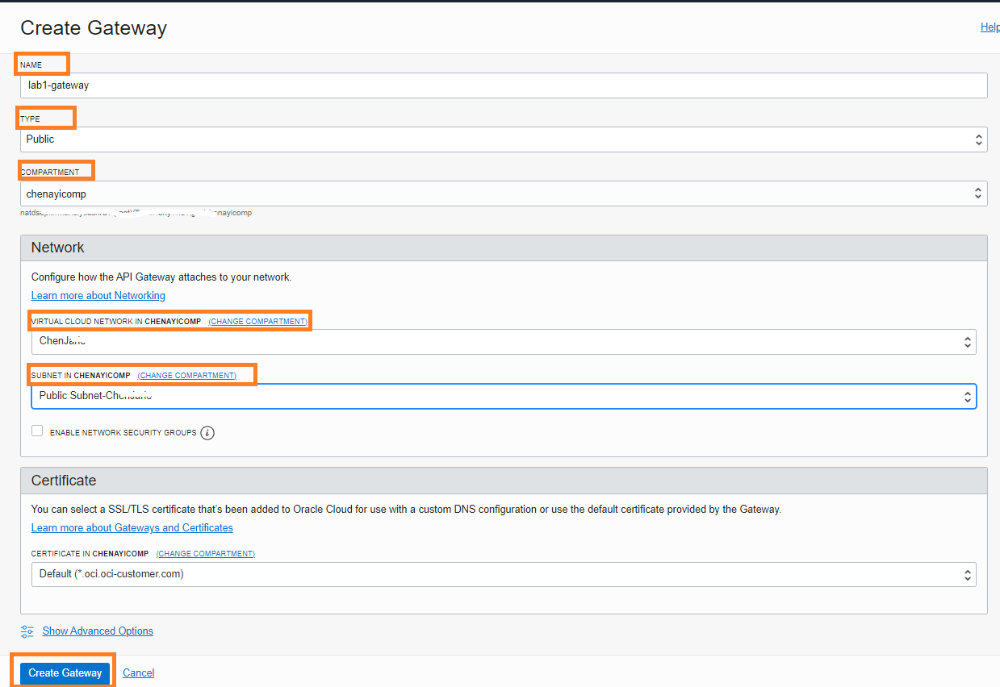

4.	Click **Create Gateway**.

When the new API gateway has been created, it is shown as Active in the list on the Gateways page.
See [Documentantion](https://docs.oracle.com/en-us/iaas/Content/APIGateway/Tasks/apigatewaycreatinggateway.htm) for more details.


## **Task 5**: Confirm access to OCI Language Services
This step ensures you can access OCI Language Service.

Policy Pre-requisites:
Please verify the below policy that was created on Task 2, if it does not exist go ahead and add it.


    <copy>
    allow any-user to use ai-service-language-family in tenancy
    </copy>


Get familiar with the Language AI Service
1.	On the console, navigate to **Analytics & AI** > **Language**

   

2.	In the Pre-trained models' section, you can enter any text to analyze (or just keep the text there)

   

3.	OCI Language has several capabilities, including sentiment analysis and entity extraction. Make sure those capabilities are selected

4. Select the tab **Text Analytics** and enter your text and click **Analyze**

5.	Inspect the results you get. If you cannot analyze the text, you may have to check that your policies are set correctly.

   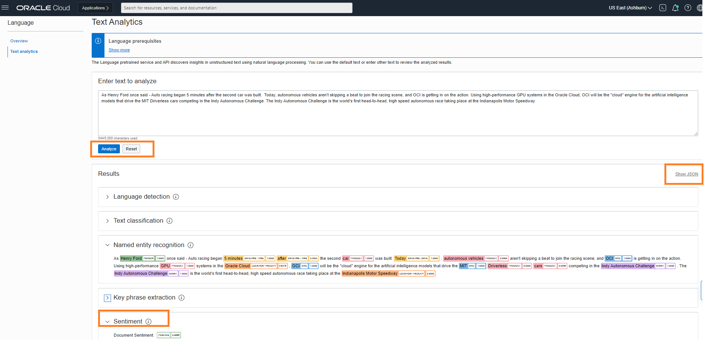

6.	Click the **Show JSON** button on the output of the analysis so that you can see the schema of the JSON that you get by calling each of the capabilities.

We need to call the endpoint from Python code (or using some other SDK). In **Lab 2** we will write a couple of functions that will call OCI Language Service.

This concludes this lab. You may now **proceed to the next lab**.

## Learn More
[Overview of OCI Networking](https://docs.oracle.com/en-us/iaas/Content/Network/Concepts/landing.htm)
[Users and Groups](https://docs.oracle.com/en-us/iaas/Content/GSG/Tasks/addingusers.htm)

## Acknowledgements
* **Author** - Chenai Jarimani, Cloud Architect, Cloud Engineering, Luis Cabrera-Cordon, Senior Director, AI Services
* **Contributors** -  Paridhi Mathur, Cloud Engineering
* **Last Updated By/Date** - Chenai Jarimani, Cloud Engineering, April 2022
