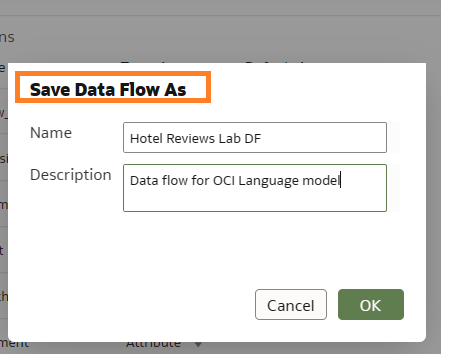

# Use OCI Language Models in Oracle Analytics(OAC)

## Introduction

This lab walks you through the steps to apply OCI Language models built in OCI with data flows to perform sentiment analysis on raw reviews data directly in Oracle Analytics Cloud.

Estimated Time: 40 minutes

### Objectives

In this lab, you will:
* Register OCI Language Models in Oracle Analytics(OAC)
* Create Data Flow to Run Sentiment Analysis
* Create a Workbook to Visualize the Data

### Prerequisites

This lab assumes you have:
* An Oracle account

## **Task 1**: Register OCI Language Models in Oracle Analytics Cloud

1.	Sign into Oracle Analytics Cloud.  
    **Return** to the **Oracle Cloud Infrastructure console** and click on the menu icon on the left.
    **Navigate** to **Analytics & AI** and then **Analytics Cloud**.  

    

2. **Open** the Cloud Analytics **URL** associated with your instance by using the three dots menu button on the right-hand side of your instance information and select **Analytics Home Page**.  

      
    > The **Oracle Analytic**s page will open in a new browser **window/tab**.

3.	On the top right-hand side of the screen, click **3 dots**, then **Register Model/Function**, and then **OCI Language Models**

    

4.  On the **Register a Language Model** dialog, **click** the name of the connection to your OCI tenancy.

    

    If you need a reminder on how to set up OCI Tenancy in your OAC, See [Create a Connection to Your OCI Tenancy](https://docs.oracle.com/en/cloud/paas/analytics-cloud/acubi/register-and-use-oci-functions-data-flows.html#GUID-C495BCD7-16E7-48B7-993E-BDBED37C7BD0).

5.  On the **Select a Model** dialog, **select** the **Pretrained Sentiment Analysis** model that you'd like to make available in Oracle Analytics.

    
    
6.  Specify the name of the staging bucket for the model under **Staging Bucket Name** field. Then click **Register**

    

**Optional**: To confirm that the model was registered successfully, from the **Home** page, click **Navigator**, click **Machine Learning**, then click **Models** to display registered models and confirm that the model was registered successfully. Click **Inspect** to check that you've configured the model correctly

 
## **Task 2**: Create a Data Flow to Run Sentiment Analysis 

Performing analysis requires the laborious curation, combining, organizing, and regular updating of large spreadsheets and other data sources. Oracle Analytics Cloud simplifies the manual effort of data preparation with the **Data Flows** feature, which enables you to easily create and maintain sophisticated data preparation workstreams that transform raw data sets into exactly what is needed for further analysis. Data flows can be scheduled, easily modified as needed with a visual editor, and enriched with custom calculations. We can also use data flows to train machine learning models, apply AI models such as Language, Vision and etc.

1. Go to **Home Page** > **Create** > **Data Flow**

   

2. Choose the **Data Set** then click **Add** .In our case we pick the Hotel Reviews Data that we downloaded on our local machine. [Dataset](https://objectstorage.us-ashburn-1.oraclecloud.com/p/Ei1_2QRw4M8tQpk59Qhao2JCvEivSAX8MGB9R6PfHZlqNkpkAcnVg4V3-GyTs1_t/n/c4u04/b/livelabsfiles/o/oci-library/hotel.zip )

   
   
3. Click the **+** next to Hotel Reviews > **Apply AI Model** 

   
   
4. Now let's choose the model we registered as part of **Task 1** .Choose **Pretrained Sentiment Analysis**. OCI Language models include Language Detection, Text Classification, Key Phrase Extraction, Named Entity etc. For more reading check out Language Overview [Language Overview](https://docs.oracle.com/en-us/iaas/language/using/overview.htm)

    

5.	Verify the **Output** fields. By default the system generated below output fields. You can select and unselect fields as needed.
    - Analysis level - what is being analyzed in the data (a word, phrase, sentence)
    - Sentiment text - the field in which the model is being applied, in this case reviews
    - Offset - the location where the aspect/sentence starts in the original text
    - Length - the total charaters of the word, phrase or sentence being analyzed
    - Sentiment - polarity results such as positive, negative, neutral or mixed
    - Scores - confidence score for the sentiment. Scores closer to 1 indicate a higher confidence in the label's classification
    - Status Summary - whether a row from csv was processed or was there any error

    

6.	Then click **Parameters** to select **input**(contains data to be analyzed), **reference column**(for aggregating the data) and **analysis level**.  For **Analysis level** there are 3 levels : 
    - Aspect - analyze and score individual terms within the dataset
    - Sentence - analyze and score each sentence in the dataset
    - Aspect & Sentence - when both options are compiled

    

    

7.	Click the **+** button and click **Save Data**, 

    
    
8.	Then click **Save Data Flow** 

    

9.	Then **Run Data Flow** 

    

Depending on the volume of your data the data flow may take as little as 5 mins to an hour or so to complete the run. 

Before we start visualizing the data let's inspect the output data from the data flow

10. Go to **Navigator** > **Data** > **Datasets** and identify the output data you saved on Task 2 step 7.

    

11. Then click the **Actions Menu** and select **Inspect** > **Data Elements** to verify output fields and the data is populated. 

    

## **Task 3**: Create the Visualization (Workbook) - Auto Insights

When you create a **Workbook** out of a **Dataset**, you have a blank canvas to start with.  
You can avoid _blank canvas syndrome_  using the new [**Auto Insights**](https://docs.oracle.com/en/cloud/paas/analytics-cloud/acubi/let-oracle-analytics-suggest-best-visualizations-dataset.html) capability, which provides automatic visualization suggestions that give you great insights and a starting point into your key data elements within a Dataset.  

1.  An empty **Canvas** is presented in **Visualize** tab.  
On the toolbar, the Auto Insights icon is white when Oracle Analytics is calculating the best insights for the dataset. When the insights are ready, the Auto Insights icon turns yellow  and Oracle Analytics displays suggested visualizations with a textual description of the insight that you can gain.

    

2. In the **Auto Insights** panel, hover over the visualizations that you want to include in your workbook and click **+** to add them to your workbook canvas. Close X **Auto Insights** panel.

   

## **Task 4**: Create the Visualization (Workbook) - Explain

Another way to let the system generate useful insights about your data is **Explain**.  
It works on both **Attributes** and **Measures** columns and helps to analyze important and non-obvious patterns in data.  
The insights that Explain delivers are based on the column type or aggregation that you chose and will vary according to the aggregation rule set for the chosen metric. Explain generates only the insights that make sense for the column type that you chose.

1.  Open a new **Canvas**  
Click on **Add new Canvas** icon 

2. Explain for **Attributes**  
    **_Basic Facts_** insights (distribution across categories)  
    **_Key Drivers_** list columns that influence attribute values and their distribution  
    **_Segment_** tab visualizes segments where the value for the attribute can be identified with certain confidence based on other columns in the dataset  
    **_Anomalies_** tab performs combinatorial analysis between selected attribute and other attribute columns and shows groups that exhibit unexpected behavior

3. Explain for **Measures**  
    **_Basic Facts_**  
    **_Anomalies_** insights based on the aggregation rule

4. Let's start to explain **SENTIMENT**  
In Data Pane Select **SENTIMENT**, Right-Click, and select **Explain SENTIMENT**

      

    Explain displays its findings to you as text descriptions and visualizations. You can select key visualizations and add them to your Workbook's canvas.

5. A new page is opened. Explain on attributes generates basic factual insights, key drivers, segments, and anomalies.

     

6. Interesting visuals can be selected to be added to the canvas.  
Select **Basic Facts about SENTIMENT**, hover the mouse over the pie chart and click on the top right of the insight its checkmark (_Select for Canvas_)

   

7. Go to **Segments that Explain SENTIMENT**.  
 Notice how the tool allows you to modify max number of segments within your data, and also the types of segments.

   

   
   
8. Anomalies tab exhibits groups in the data that show unexpected results.  
Select the first two visualizations, click on the top right of the insight (_Select for Canvas_) and go to the top right corner of the page and click **Add Selected**

   

9. Returning to the canvas you notice the 3 selected insights as visualizations.  
Note that the canvas name has changed to **Explain SENTIMENT** and under _My Calculations_ you get measures and attributes created by explain.  

   

## **Task 5**: Create the Visualization (Workbook)

In this task, we'll create a new **Canvas** from scratch to visualize the insights from our sentiment data. If needed use the **Data Editor** to massage your data further or combine with other data sets you may have. 

1.  Open a new **Canvas**  
Click on **Add new Canvas** icon 

2.	Drag  a stacked bar visualization into the canvas.

     

3.	Navigate to the **Data** tab 

4.	Open the contextual menu (Right click) on the **My Calculations** table and select **Add Calculation**  
For **Name** select '# REVIEWS'  
For the **Function** enter 'COUNT(DISTINCT review id)'  
Click **Validate** and **Save**

    

5.	Drag **# Reviews, Row Count, Analysis Level, Sentiment** as shown below.

    

6.	For the **Color**, select **Color**, click downward arrow next to color and **Manage Assignments**

    

7.	Set **Negative** to Pink, **Neutral** to Blue, **Mixed** to Yellow and **Positive** to Green.

    

8. Sort the graph Right Click > **Sort By** > **Row Count** > **Low to High** .

    

9.	From **Data** tab select **Review ID, Sentiment, Sentiment Text, Level, Positive Score, Negative Score, Mixed Score and Neutral Score** > Right click  and select **Pick Visualizaton** > choose **Pivot Table**  . 

    

10.	The tool creates a visualization and place it next to the existing stacked graph. Modify the pivot table to place all the attributes under **Rows** , measures under **Values** and Sentiment under **Color** . Then use the **Properties** tab to  update the visualization properties like Title, Font, Legend Position and etc as needed.

    

11.	Oracle Analytics provides easy and powerful filter interaction capabilities on dashboards that empower users to slice and dice data quickly, perform deeper data analysis, and narrow down to the data that users are interested in. Filters can be applied at the **Workbook**, **Canvas**, and **Visualization** . To Create a [Dashboard Filter](https://docs.oracle.com/en/cloud/paas/analytics-cloud/acubi/filter-data-using-dashboard-filter-visualization.html)  Drag **Dashboard Filters** from **Visualizations** tab

    

12.	Add **Analysis Level**, **Sentiment**, **Sentiment text**, and play with selections

    

13.	Lastly, let's explore a plugin visualization for highlighting text such as sentiment in the data. If you don't have it download it here [**Oracle Analytics Extensions**](https://www.oracle.com/business-analytics/data-visualization/extensions/) Go to **Visualization** > **Custom Visualization** > **Text Highlight Plugin**, and drop into the canvas

    

14.	Add **Review ID, Sentiment, Sentiment Text, Offset, Length, Review**,Convert **Offset** and **Length** to attributes as these are the fields the text plugin uses to highlight the topics or phrases being reviewed in the review

    

15.	You can see the texts being highlighted with corresponding sentiment color.

    

16.	Follow the same pattern and customize your canvases to meet your needs. You can try different visualizations.  
    - Oracle Analytics Cloud has over 45 visualizations available to use, in addition the tool provides custom extensions to further your visualization capabilities such as the **Text Highlighter** . [**Oracle Analytics Extensions**](https://www.oracle.com/business-analytics/data-visualization/extensions/)
    - You can use also use Top N to filter the top reviews, and statistics such as trendiness to view average review ratings over a some time.

    
17.	**Save** your Workbook.  
Click the **Save** icon on the top right, provide a **Name** and click the **Save** button.

    

   

You have just finished learning how to **Register**  OCI AI Language models, **Apply** the models in OAC using **Data Flows** and then  a **Workbook** to analyze and share the results.

This concludes this **workshop**

## Learn More
* [Modeling Your Data with Self-Service Data Sets in Oracle Analytics](https://blogs.oracle.com/analytics/post/modeling-your-data-with-self-service-data-sets-in-oracle-analytics)  
* [Five Ways to Quickly Discover and Repair Data Issues in Oracle Analytics](https://blogs.oracle.com/analytics/post/five-ways-to-quickly-discover-and-repair-data-issues-in-oracle-analytics)
* [Begin every data journey with Auto Insights](https://blogs.oracle.com/analytics/post/begin-every-data-journey-with-auto-insights)  
* [Analyze Data with Explain](https://docs.oracle.com/en/middleware/bi/analytics-desktop/bidvd/analyze-data-explain.html#GUID-D1C86E85-5380-4566-B1CB-DC14E0D3919E)  
* [Leveraging Oracle Analytics Cloud with Autonomous Data Warehouse](https://apexapps.oracle.com/pls/apex/r/dbpm/livelabs/view-workshop?wid=812&clear=180&session=9585530339306)
* [Language Overview](https://docs.oracle.com/en-us/iaas/language/using/overview.htm)

## Acknowledgements
* **Author** - Chenai Jarimani, Analytics & AI, Cloud Engineering
* **Last Updated By/Date** - Chenai Jarimani, Analytics & AI, April 2023
