# Use OCI Language models in OAC

## Introduction

This lab walks you through the steps to apply OCI Language models built in OCI with data flows to perform sentiment analysis on raw reviews data directly in Oracle Analytics Cloud.

Estimated Time: 60 minutes

### Objectives

In this lab, you will:
* Register OCI Language Models in OAC
* Create Data Flow to Run Sentiment Analysis
* Create a Workbook to Visualize the Data

### Prerequisites

This lab assumes you have:
* An Oracle account

## **Task 1**: Register OCI Language Models in Oracle Analytics Cloud

1.	Sign into Oracle Analytics Cloud.  
    **Return** to the **Oracle Cloud Infrastructure console** and click on the menu icon on the left.
    **Navigate** to **Analytics** and then **Analytics Cloud**.  

    

2. **Open** the Cloud Analytics **URL** associated with your instance by using the three dots menu button on the right-hand side of your instance information and select **Analytics Home Page**.  

      
    > The **Oracle Analytic**s page will open in a new browser **window/tab**.

3.	On the top right-hand side of the screen, click **3 dots**, then **Register Model/Function**, and then **OCI Language Models**

    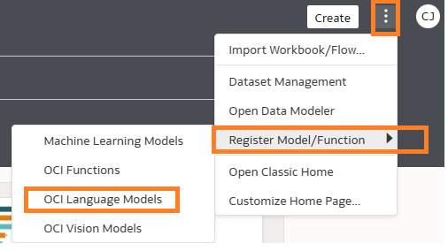

4.  On the **Register a Language Model** dialog, **click** the name of the connection to your OCI tenancy.

    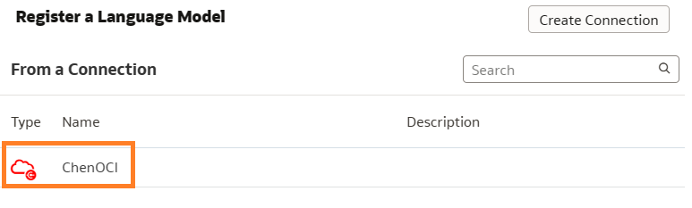

    If you need a reminder on how to set up OCI Tenancy in your OAC, See [Create a Connection to Your OCI Tenancy](https://docs.oracle.com/en/cloud/paas/analytics-cloud/acubi/register-and-use-oci-functions-data-flows.html#GUID-C495BCD7-16E7-48B7-993E-BDBED37C7BD0).

5.  On the **Select a Model** dialog, **select** the **Pretrained Sentiment Analysis** model that you'd like to make available in Oracle Analytics.

    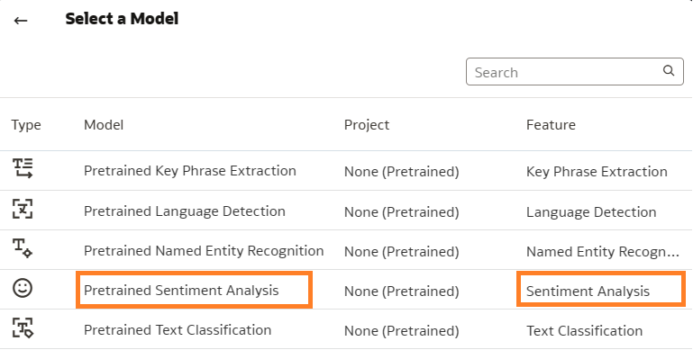
    
6.  Specify the name of the staging bucket for the model under **Staging Bucket Name** field. Then click **Register**

    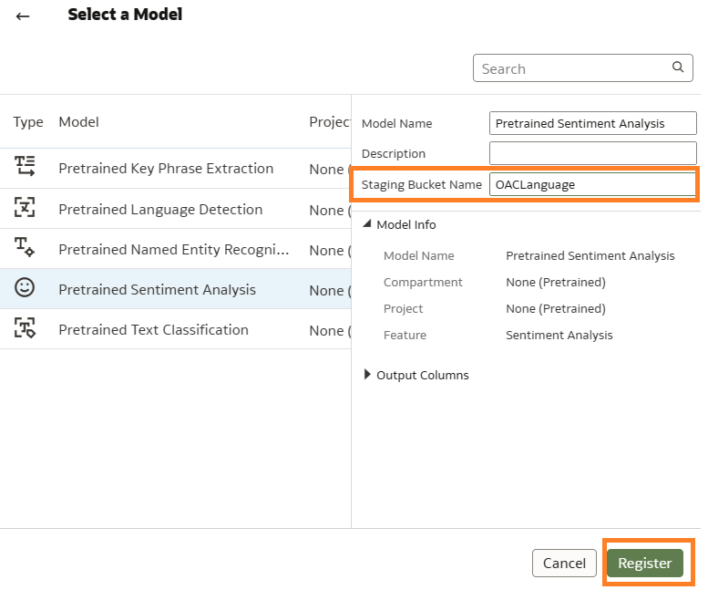

**Optional**: To confirm that the model was registered successfully, from the **Home** page, click **Navigator**, click **Machine Learning**, then click **Models** to display registered models and confirm that the model was registered successfully. Click **Inspect** to check that you've configured the model correctly

 
## **Task 2**: Create a Data Flow to Run Sentiment Analysis 

Performing analysis requires the laborious curation, combining, organizing, and regular updating of large spreadsheets and other data sources. Oracle Analytics Cloud simplifies the manual effort of data preparation with the **Data Flows** feature, which enables you to easily create and maintain sophisticated data preparation workstreams that transform raw data sets into exactly what is needed for further analysis. Data flows can be scheduled, easily modified as needed with a visual editor, and enriched with custom calculations. We can also use data flows to train machine learning models, apply AI models such as Language, Vision and etc.

1. Go to **Home Page** > **Create** > **Data Flow**

   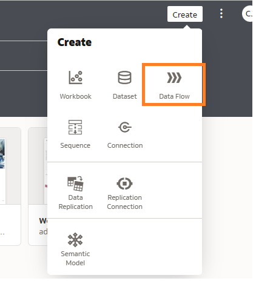

2. Choose the **Data Set** then click **Add** .In our case we pick the Hotel Reviews Data that we downloaded on our local machine. [Dataset](https://objectstorage.us-ashburn-1.oraclecloud.com/p/Ei1_2QRw4M8tQpk59Qhao2JCvEivSAX8MGB9R6PfHZlqNkpkAcnVg4V3-GyTs1_t/n/c4u04/b/livelabsfiles/o/oci-library/hotel.zip )

   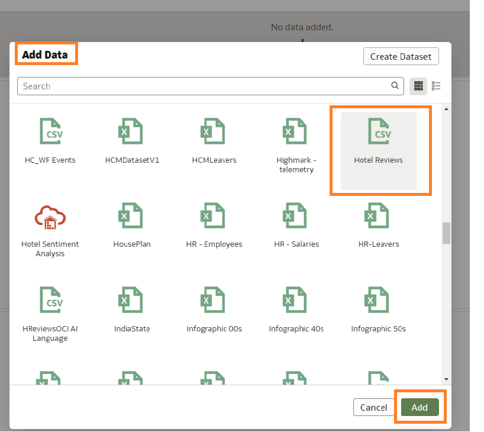
   
3. Click the **+** next to Hotel Reviews > **Apply AI Model** 

   
   
4. Now let's choose the model we registered as part of **Task 1** .Choose **Pretrained Sentiment Analysis**. OCI Language models include Language Detection, Text Classification, Key Phrase Extraction, Named Entity etc. For more reading check out Language Overview [Language Overview](https://docs.oracle.com/en-us/iaas/language/using/overview.htm)

    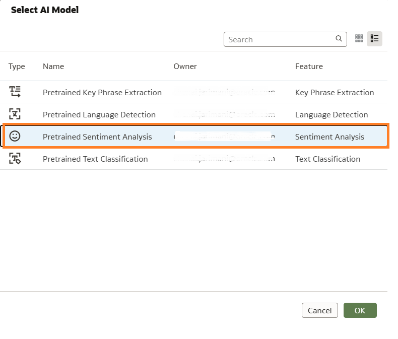

5.	Verify the **Output** fields. By default the system generated below output fields. You can select and unselect fields as needed.
    - Analysis level - what is being analyzed in the data (a word, phrase, sentence)
    - Sentiment text - the field in which the model is being applied, in this case reviews
    - Offset - 
    - Length - the total charaters of the word, phrase or sentence being analyzed
    - Sentiment - polarity results such as positive, negative, neutral or mixed
    - Scores - confi
    - Status Summary 

    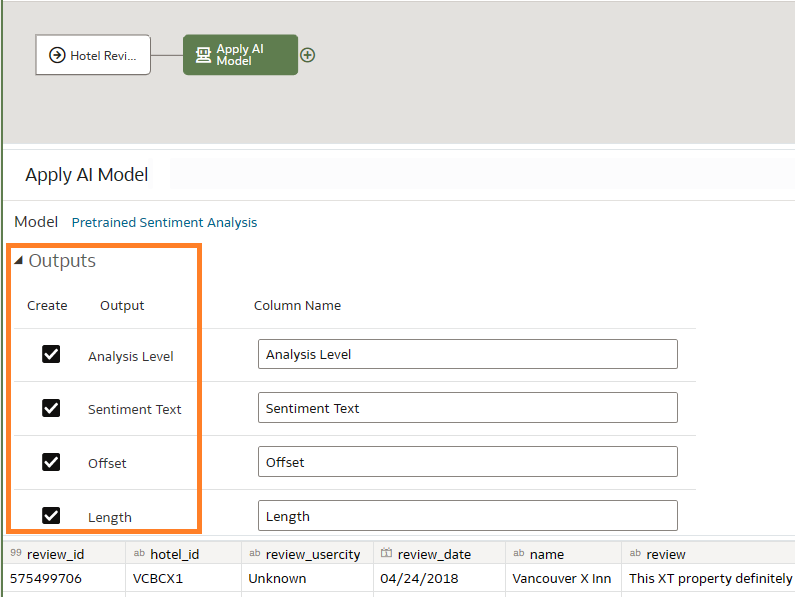

6.	Then click **Parameters** to select **input**(contains data to be analyzed), **reference column**(for aggregating the data) and **analysis level**.  For **Analysis level** there are 3 levels : 
    - Aspect - analyze and score individual terms within the dataset
    - Sentence - analyze and score each sentence in the dataset
    - Aspect & Sentence - when both options are compiled

    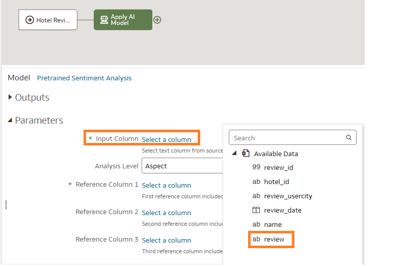

    

7.	Click the **+** button and click **Save Data**, 

    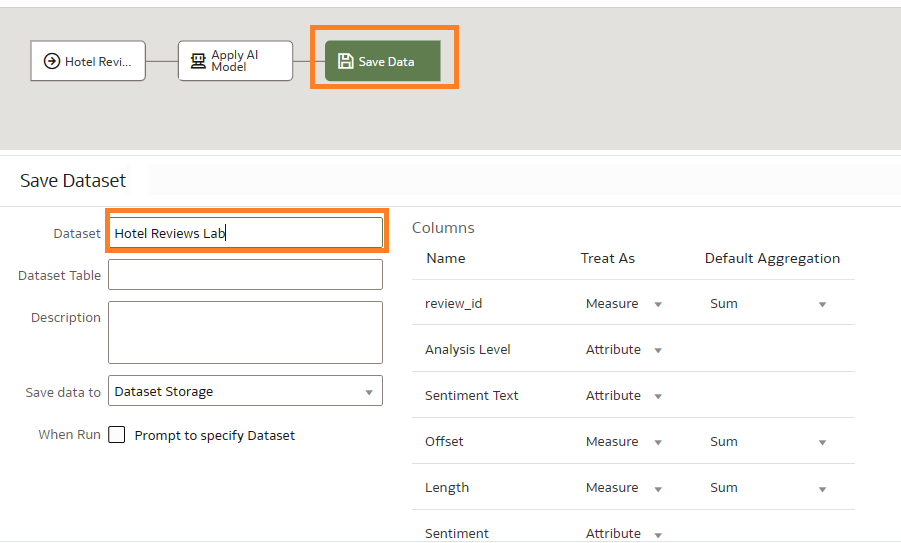
    
8.	Then click **Save Data Flow** 

    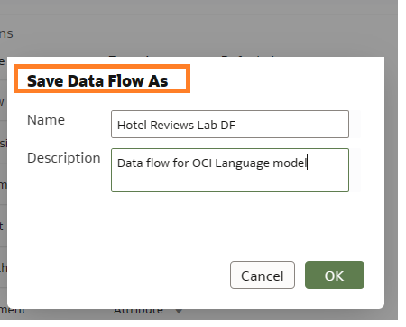

9.	Then **Run Data Flow** 

    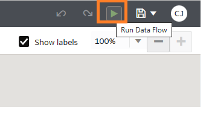

Depending on the volume of your data the data flow may take as little as 5 mins to an hour or so to complete the run. 

## **Task 3**: Create the Visualization (Workbook) 

Before we start visualizing the data let's inspect the output data from the data flow.

1. Go to **Navigator** > **Data** > **Datasets** and identify the output data you saved on Task 2 step 7.

    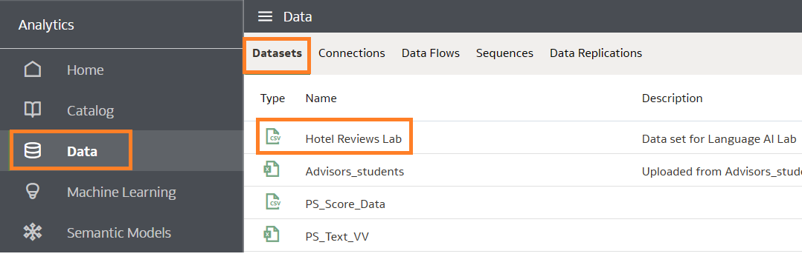

2. Then click the **Actions Menu** and select **Inspect** > **Data Elements** to verify output fields and the data is populated. 

    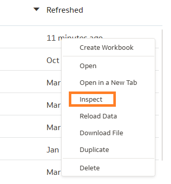
   

3. Now we can create the workbook to analyze the results of sentiment analysis. For this step you can reference **Lab 6** above on various ways of creating visualizations. If needed use the **Data Editor** to massage your data further or combine with other data sets you may have. See below examples of how we can slice and dice the data. Oracle Analytics Cloud has over 45 visuazations available to use, in addition we provide custom extensions to further your visualization capabilities such as the **Text Highlighter** that is being used to highlight sentiment in the below visualizations. [**Oracle Analytics Extensions**](https://www.oracle.com/business-analytics/data-visualization/extensions/)

    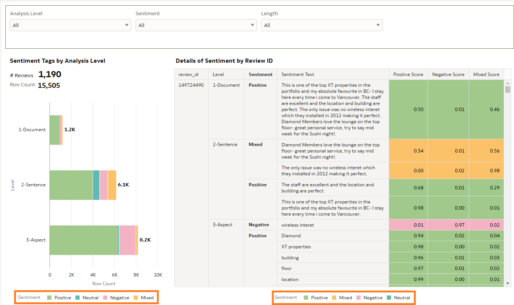

    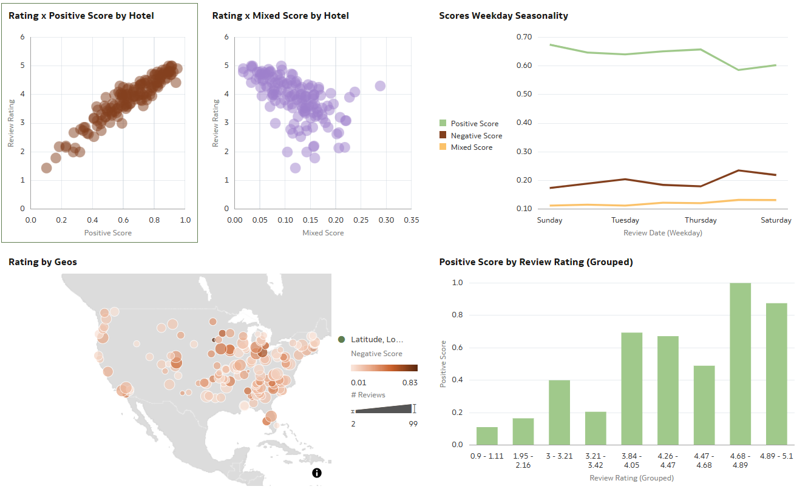

    

You have just finished learning how to **Register**  OCI AI Language models, **Apply** the models in OAC using **Data Flows** and then  a **Workbook** to analyze and share the results.

This concludes this **workshop**

## Learn More
* [Modeling Your Data with Self-Service Data Sets in Oracle Analytics](https://blogs.oracle.com/analytics/post/modeling-your-data-with-self-service-data-sets-in-oracle-analytics)  
* [Five Ways to Quickly Discover and Repair Data Issues in Oracle Analytics](https://blogs.oracle.com/analytics/post/five-ways-to-quickly-discover-and-repair-data-issues-in-oracle-analytics)
* [Begin every data journey with Auto Insights](https://blogs.oracle.com/analytics/post/begin-every-data-journey-with-auto-insights)  
* [Analyze Data with Explain](https://docs.oracle.com/en/middleware/bi/analytics-desktop/bidvd/analyze-data-explain.html#GUID-D1C86E85-5380-4566-B1CB-DC14E0D3919E)  
* [Leveraging Oracle Analytics Cloud with Autonomous Data Warehouse](https://apexapps.oracle.com/pls/apex/r/dbpm/livelabs/view-workshop?wid=812&clear=180&session=9585530339306)
* [Language Overview](https://docs.oracle.com/en-us/iaas/language/using/overview.htm)

## Acknowledgements
* **Author** - Chenai Jarimani, Cloud Architect, Cloud Engineering
* **Last Updated By/Date** - Chenai Jarimani, Analytics & AI, April 2023
