# Create a Function

## Introduction

This lab walks you through the process of creating a serverless function that will only run on demand. The function will conform to the schema required to be consumed by Oracle Data Integrate. The serverless function will call an AI service (OCI Language in this case).

Estimated Time: 120 minutes


### Objectives

In this lab, you will:
* Background
* Create an Application
* Create a Sentiment Function
* Deploy the Function
* Invoke the Function
* Connect the Function to API Gateway


### Prerequisites

This lab assumes you have:
* An Oracle account
* All previous labs completed


## **Task 1**: Background

Currently, OCI Language works on a single record at a time, as shown in the example below:
	**OCI Language sample input**

    <copy>		
		{
   	"text": "I would like to buy a new XBox, because my Playstation
             uses a resistor ACM-3423 that is not sold anymore."
		}</copy>


The sample output would be:
	**OCI Language sample output**


    <copy>{
    "entities": [
        {
            "text": "XBox",
            "type": "PRODUCT",
            "score": 0.9795951843261719,
            "offset": 26,
            "length": 4,
            "isPii": false
        },
        {
            "text": "Playstation",
            "type": "PRODUCT",
            "score": 0.9898978471755981,
            "offset": 43,
            "length": 11,
            "isPii": false
        },
        {
            "text": "resistor ACM-3423",
            "type": "PRODUCT",
            "score": 0.8866055011749268,
            "offset": 62,
            "length": 17,
            "isPii": false
        }
    		]
			}</copy>


Oracle Data Integration today supports calling functions, where the data payload is a single base 64 encoded string that contains the records to process, and a set of parameters.

Sample **Oracle Data Integration Function Input**:

		<copy>{				"data":"eyJpZCI6MSwiaW5mbyI6Ilpvb20gbm93IGNsYWltcyB0byBoYXZlIDMwMCBtaWxsaW9uIG1lZXRpbmcgcGFydGljaXBhbnRzIHBlciBkYXkuIEl0IGNob3NlIE9yYWNsZSBDb3Jwb3JhdGlvbiBjby1mb3VuZGVkIGJ5IExhcnJ5IEVsbGlzb24gYW5kIGhlYWRxdWFydGVyZWQgaW4gUmVkd29vZCBTaG9yZXMgLCBmb3IgaXRzIGNsb3VkIGluZnJhc3RydWN0dXJlIGRlcGxveW1lbnRzIG92ZXIgdGhlIGxpa2VzIG9mIEFtYXpvbiwgTWljcm9zb2Z0LCBHb29nbGUsIGFuZCBldmVuIElCTSB0byBidWlsZCBhbiBlbnRlcnByaXNlIGdyYWRlIGV4cGVyaWVuY2UgZm9yIGl0cyBwcm9kdWN0LiBUaGUgc2VjdXJpdHkgZmVhdHVyZSBpcyBzaWduaWZpY2FudGx5IGxhY2tpbmcgYXMgaXQgYWxsb3dzIHBlb3BsZSB3aXRoIGRpc3R1cmJpbmcgem9vbWJvbWIuIn0KeyJpZCI6MiwiaW5mbyI6Ikx1aXMgbGlrZXMgdG8gd29yayBhdCBPcmFjbGUgYW5kIGxlYXJuIGFib3V0IGRhdGEgaW50ZWdyYXRpb24ifQ==","parameters":{"column":"info"}
    }</copy>

Note that the encoded data is the base 64 encoded version of a set of JSON Lines format (each line is a JSON for each record). Each record has an ID that will be used to associate the output.

   	<copy>{
			"id":1,"info":"Zoom now claims to have 300 million meeting participants per day. It chose Oracle Corporation co-founded by Larry Ellison and headquartered in Redwood Shores , for its cloud 	  infrastructure deployments over the likes of Amazon, Microsoft, Google, and even IBM to build an enterprise grade experience for its product. The security feature is significantly lacking as it allows people with disturbing zoombomb."
 	 	}

		{"id":2,"info":"Luis likes to work at Oracle and learn about data integration"
		}</copy>

The output of the **Oracle Data Integration Function** will be a list of results that has the shape of a table. Currently, Oracle Data Integration does not support the nesting of complex structures.

This is what the sample output should look like. Notice that it does not have nested structures.

    <copy>{
        "id": 1,
        "is_pii": false,
        "length": 4,
        "offset": 0,
        "score": 0.9817479849,
        "text": "Zoom",
        "type": "ORG"
    },
    {
        "id": 1,
        "is_pii": false,
        "length": 11,
        "offset": 24,
        "score": 0.9844536185,
        "text": "300 million",
        "type": "CARDINAL"
    },
    {
        "id": 2,
        "is_pii": true,
        "length": 4,
        "offset": 0,
        "score": 0.9824903011,
        "text": "Luis",
        "type": "PERSON"
    },
    {
        "id": 2,
        "is_pii": false,
        "length": 6,
        "offset": 22,
        "score": 0.9826752543,
        "text": "Oracle",
        "type": "ORG"
    }</copy>


Since we need to integrate the OCI Language service through an Oracle Function, we can use the function to serve as the entity that will:
1.	Read the function input (decode the input)
2.	Call the AI service multiple times (once for each record)
3.	Aggregate the output of each call into a shape that Data Integrate can receive.
(optional) Step 1 opening paragraph.

## **Task 2**: Create an Application

To add a function, first, we need to create an **Application**.
1.	Go to cloud console (cloud.oracle.com) and navigate to **Developer Services** > **Applications**

   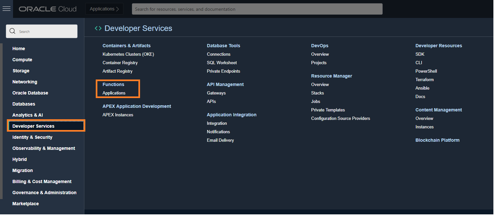

2.	Click **Create Application**
	You can think of an application as a bounded context where several functions can live.
3.	Give it a name (we will refer to this name as <app-name> for the rest of the tutorial), pick the VCN you just created, and the public subnet that was created for that VCN.(from **Lab 1**)
4.	Click **Create**


Set up CLI so that it can deploy functions to the right compartment and container registry are used.
1.	When you are in your Application, select **Getting Started**

   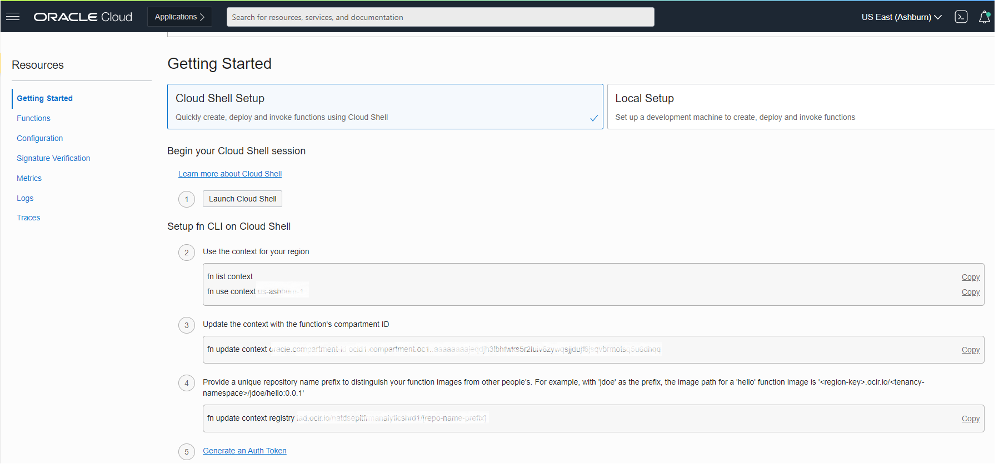

2.	Click **Cloud Shell Setup**
3.	Click the **Launch Cloud Shell** button.
 This will start a Linux virtual machine with all the configurations to set up functions.
4.	Follow steps **1** through **7** under the “Setup fn CLI on Cloud Shell” section
 	* If you need guidance, see this [Video](https://www.youtube.com/watch?app=desktop&t=483&v=TdQ6BL58Zfk&feature=youtu.be)
	* If you need more specific and detailed instructions, see this [Document](https://docs.oracle.com/en-us/iaas/Content/Functions/Tasks/functionscreatefncontext.htm)
	* You can select any term for OCIR-REPO, it is just a prefix that will be used as the name of the container registry to use to deploy the function.
5.	Before proceeding to the next lab test the connection to the docker and log in: steps **8** to **11**

   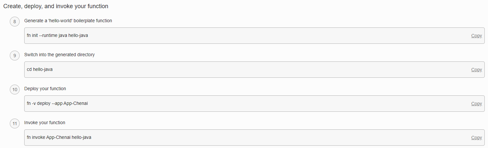

   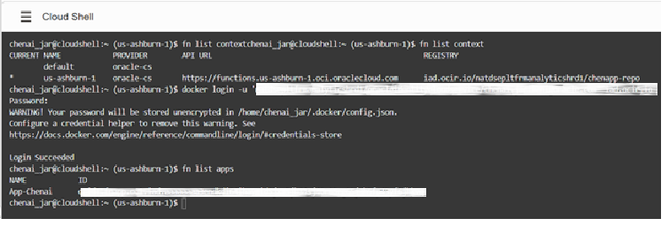

## **Task 3**: Create a Sentiment Function

We will now create the function in the application. The function will do sentiment analysis on the input. The input will conform to the format that OCI Data Integration will generate (base 64 encoded Jason lines). The fastest way to set things up is to have the system generate a **python template** for us that then we will modify.

1.	Run the following commands on the cloud shell:

    ```
    <copy>
    cd ..
    </copy>
    ```
    ```
    <copy>
    fn init --runtime python sentiment
    </copy>
    ```
    ```
    <copy>
    cd sentiment
    </copy>
    ```
    ```
    <copy>
    ls
    </copy>
    ```


   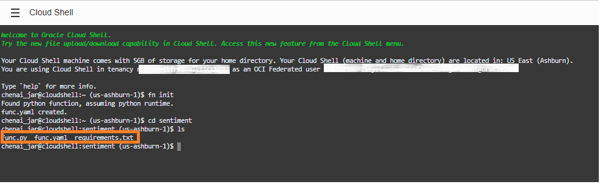

2.	Notice that this will generate three files for you (**func.yaml**, **requirements.txt** and **func.py** ). Modify the files with the content shown below. You can use an editor like **vi** [URL](https://docs.oracle.com/cd/E19683-01/806-7612/6jgfmsvqn/index.html) to do so.

3. 	**func.yaml**

		<copy>schema_version: 20180708
		name: sentiment
		version: 0.0.32
		runtime: python
		entrypoint: /python/bin/fdk /function/func.py handler
		memory: 256
		timeout: 300</copy>

4. 	**requirements.txt**

		<copy>fdk
		pandas
		numpy
		avro-python3
		oci>=2.39.0</copy>

5. 	**func.py**

		<copy>import io
		import json
		import logging
		import pandas
		import base64
		from avro.io import DatumReader
		from avro.datafile import DataFileReader
		from avro.io import BinaryDecoder
		from fdk import response
		import oci
		from oci.ai_language.ai_service_language_client import AIServiceLanguageClient
		def handler(ctx, data: io.BytesIO=None):
		    signer = oci.auth.signers.get_resource_principals_signer()
		    resp = do(signer,data)
		    #resp = '[{"id":1,"length":4", "nested":[{"a":1}, {"a":2} ]}]'
		    return response.Response(
		        ctx, response_data=resp,
		        headers={"Content-Type": "application/json"}
		    )
		def nr(dip, txt):
		    details = oci.ai_language.models.DetectLanguageSentimentsDetails(text=txt)
		    le = dip.detect_language_sentiments(detect_language_sentiments_details=details)
		    if len(le.data.aspects) > 0:
		      return json.loads(le.data.aspects.__repr__())
		    return ""
		def do(signer, data):
		    dip = AIServiceLanguageClient(config={}, signer=signer)
		    body = json.loads(data.getvalue())
		    input_parameters = body.get("parameters")
		    col = input_parameters.get("column")
		    input_data = base64.b64decode(body.get("data")).decode()
		    print(input_data, flush=True)
		    df = pandas.read_json(input_data, lines=True)
		    df['enr'] = df.apply(lambda row : nr(dip,row[col]), axis = 1)
		    #Explode the array of apects into row per entity
		    dfe = df.explode('enr',True)
		    #Add a column for each property we want to return from entity struct
		    ret=pandas.concat([dfe,pandas.DataFrame((d for idx, d in dfe['enr'].iteritems()))], axis=1)
		    #Drop array of aspects column
		    ret = ret.drop(['enr'],axis=1)
		    #Drop the input text column we don't need to return that (there may be other columns there)
		    ret = ret.drop([col],axis=1)
		    str=ret.to_json(orient='records')
		    return str
		</copy>

6. Verify your 3 files look exactly as above with no spaces, additional code, etc.


## **Task 4**: Deploy the Function

Once you have edited the files in **Task 3**, deploy the function to your application, by running this cloud shell command. Make sure to replace **app-name** for the name of your application

  	<copy>fn -v deploy -app app-name</copy>

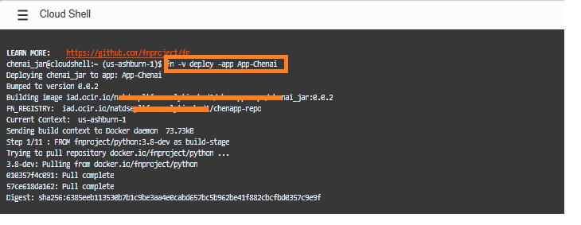

If successful you can see it listed under Functions in your Application

  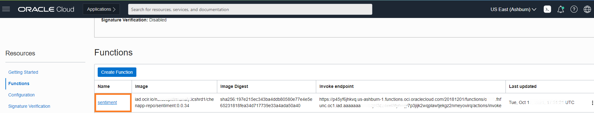

## **Task 5**: Invoke the Function

1.	Test the function by calling the command below. Make sure to replace **app-name** for the name of your application:

		<copy>echo '{"data":"eyJpZCI6MSwiaW5wdXRUZXh0IjoiVGhlIEV1cm9wZWFuIHNvdmVyZWlnbiBkZWJ0IGNyaXNpcyB3YXMgYSBwZXJpb2Qgd2hlbiBzZXZlcmFsIEV1cm9wZWFuIGNvdW50cmllcyBleHBlcmllbmNlZCB0aGUgY29sbGFwc2Ugb2YgZmluYW5jaWFsIGluc3RpdHV0aW9ucywgaGlnaCBnb3Zlcm5tZW50IGRlYnQsIGFuZCByYXBpZGx5IHJpc2luZyBib25kIHlpZWxkIHNwcmVhZHMgaW4gZ292ZXJubWVudCBzZWN1cml0aWVzLiBUaGUgZGVidCBjcmlzaXMgYmVnYW4gaW4gMjAwOCB3aXRoIHRoZSBjb2xsYXBzZSBvZiBJY2VsYW5kJ3MgYmFua2luZyBzeXN0ZW0sIHRoZW4gc3ByZWFkIHByaW1hcmlseSB0byBQb3J0dWdhbCwgSXRhbHksIElyZWxhbmQsIEdyZWVjZSwgYW5kIFNwYWluIGluIDIwMDksIGxlYWRpbmcgdG8gdGhlIHBvcHVsYXJpc2F0aW9uIG9mIGFuIG9mZmVuc2l2ZSBtb25pa2VyIChQSUlHUykuIEl0IGhhcyBsZWQgdG8gYSBsb3NzIG9mIGNvbmZpZGVuY2UgaW4gRXVyb3BlYW4gYnVzaW5lc3NlcyBhbmQgZWNvbm9taWVzLiBUaGUgY3Jpc2lzIHdhcyBldmVudHVhbGx5IGNvbnRyb2xsZWQgYnkgdGhlIGZpbmFuY2lhbCBndWFyYW50ZWVzIG9mIEV1cm9wZWFuIGNvdW50cmllcywgd2hvIGZlYXJlZCB0aGUgY29sbGFwc2Ugb2YgdGhlIGV1cm8gYW5kIGZpbmFuY2lhbCBjb250YWdpb24sIGFuZCBieSB0aGUgSW50ZXJuYXRpb25hbCBNb25ldGFyeSBGdW5kIChJTUYpLiJ9Cg==", "parameters":{"column":"inputText"}}' | fn invoke App-Chenai sentiment </copy>

2. The output should be JSON with aspect level sentiment information as below:

		<copy>[{"id":1,"length":15,"offset":137,"scores":{"Negative":0.9999850187,"Neutral":0.0000149813,"Positive":0.0},"sentiment":"Negative","text":"government debt"}]</copy>

3. Note that the function is registered in your container registry
  	*	From the Console, click **Developer Services** > **Container Registry**
		* You should be able to see the functions you just deployed in the container registry.
		* Sometimes the registry is saved in the root compartment and you can always move to your personal compartment

		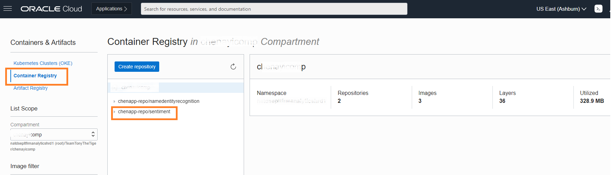


## **Task 6**: Connect the Function to API Gateway

We need to map your newly created function to an API endpoint that is accessible externally such as Postman.

1.	From the Console, click **Developer Services** > **Gateways**, and select the gateway you created earlier in the lab.

2.	Click **Deployments**

3.	Click **Create Deployment**
		Give the deployment a name and a prefix (i.e. /language)

   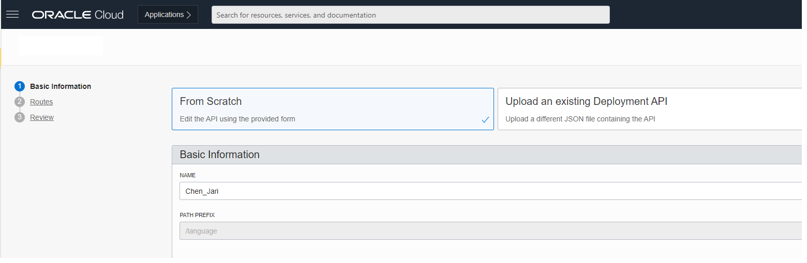

4.	Click **Next**, now you can add routes to your deployment.

5.	Then **Add a Route**
	- Specify a **path**, for instance /sentiment
	- For **methods**, select POST (since we will be sending a body on the request)
	- **Type**: Oracle Functions
	- Select the sentiment **application** you created in Section 4
	- Select the name of the **function** “sentiment”

   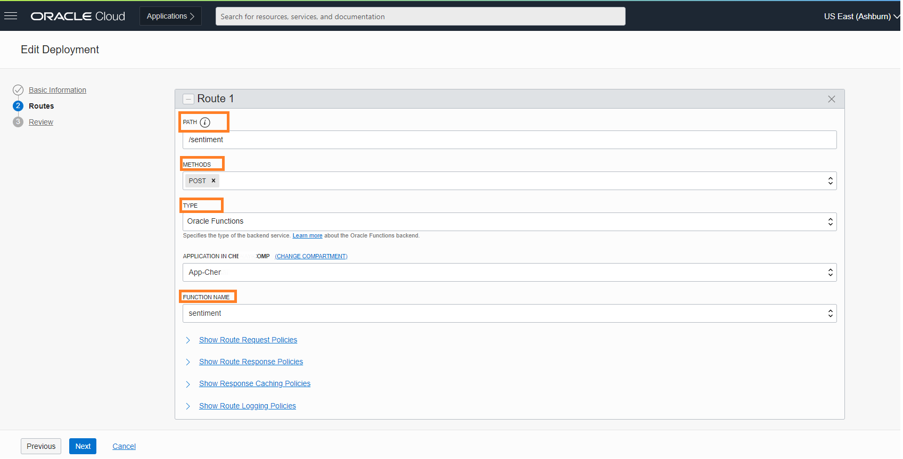

6.	Click **Next** to review your route.

7.	Review your Route and click **Create**
	- It will take a few minutes to deploy your API
	- Test that you can hit your functions externally
	- Now we will test the function you just created

8.	From the Console, click **Developer Services** > **Gateways**, and select the gateway you created earlier in the lab.

9.	Click **Deployments**.

	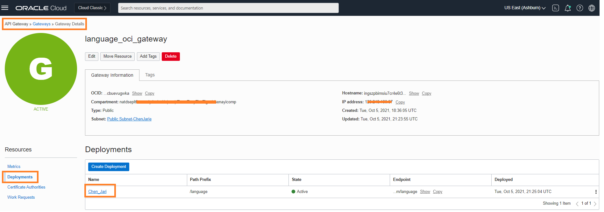

10.	Select the deployment you just created (**language**)

11.	This view will show you any metrics and calls made to these APIs.

12.	In the **Deployment Information** section, you can click on the **Endpoint** to show the actual endpoint you can hit using Postman.

	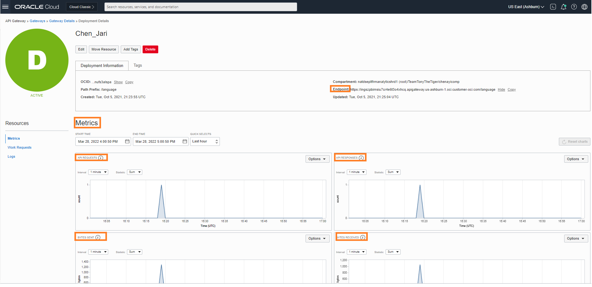

13.	Copy the endpoint, it will look something like this:

		<copy>https://ingszpbimsiu7cr4e6t3o4xhcq.apigateway.us-ashburn-1.oci.customer-oci.com/language</copy>

14.	Append your route information to hit the endpoint, for example, try making this Post call from [Postman](https://www.postman.com/downloads/) or any other tool that allows you to issue **POST** commands.

   For **POST** command

	 	<copy>https://ingszpbimsiu7cr4e6t3o4xhcq.apigateway.us-ashburn-1.oci.customer-oci.com/language/sentiment</copy>


	For **Body** command

		<copy>{"data":"eyJpZCI6MSwiaW5mbyI6Ilpvb20gbm93IGNsYWltcyB0byBoYXZlIDMwMCBtaWxsaW9uIG1lZXRpbmcgcGFydGljaXBhbnRzIHBlciBkYXkuIEl0IGNob3NlIE9yYWNsZSBDb3Jwb3JhdGlvbiBjby1mb3VuZGVkIGJ5IExhcnJ5IEVsbGlzb24gYW5kIGhlYWRxdWFydGVyZWQgaW4gUmVkd29vZCBTaG9yZXMgLCBmb3IgaXRzIGNsb3VkIGluZnJhc3RydWN0dXJlIGRlcGxveW1lbnRzIG92ZXIgdGhlIGxpa2VzIG9mIEFtYXpvbiwgTWljcm9zb2Z0LCBHb29nbGUsIGFuZCBldmVuIElCTSB0byBidWlsZCBhbiBlbnRlcnByaXNlIGdyYWRlIGV4cGVyaWVuY2UgZm9yIGl0cyBwcm9kdWN0LiBUaGUgc2VjdXJpdHkgZmVhdHVyZSBpcyBzaWduaWZpY2FudGx5IGxhY2tpbmcgYXMgaXQgYWxsb3dzIHBlb3BsZSB3aXRoIGRpc3R1cmJpbmcgem9vbWJvbWIuIn0KeyJpZCI6MiwiaW5mbyI6Ikx1aXMgbGlrZXMgdG8gd29yayBhdCBPcmFjbGUgYW5kIGxlYXJuIGFib3V0IGRhdGEgaW50ZWdyYXRpb24ifQ==","parameters":{"column":"info"}}</copy>


		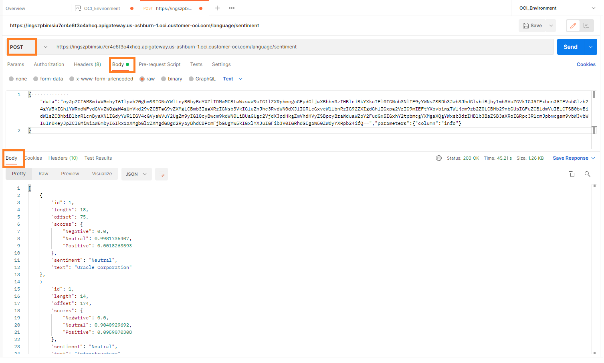

	**Note** If you get an internal server error, most likely something is wrong with your permissions. In that case, make sure that
	- You have enabled an Ingress rule for destination port 443 (see Section 2)
	- Your API gateway has permissions to invoke a function. (See this [Document](https://docs.oracle.com/en-us/iaas/Content/APIGateway/Tasks/apigatewaycreatingpolicies.htm) for how to create the policy.)


		```
	    <copy>ALLOW any-user to use functions-family in compartment <functions-compartment-name> where ALL {request.principal.type= 'ApiGateway', request.resource.compartment.id = '<api-gateway-compartment-OCID>'}</copy>
	    ```

This concludes this lab. You may now **proceed to the next lab**.

## Learn More
[Overview of Container Registry](https://docs.oracle.com/en-us/iaas/Content/Registry/home.htm)
[Overview of Functions](https://docs.oracle.com/en-us/iaas/Content/Functions/home.htm)
[Working with API Gateway](https://docs.oracle.com/en-us/iaas/Content/APIGateway/home.htm)

## Acknowledgements
* **Author** - Chenai Jarimani, Cloud Architect, Cloud Engineering, Luis Cabrera-Cordon, Senior Director, AI Services
* **Contributors** -  Paridhi Mathur, Cloud Engineering
* **Last Updated By/Date** - Chenai Jarimani, Cloud Engineering, April 2022
