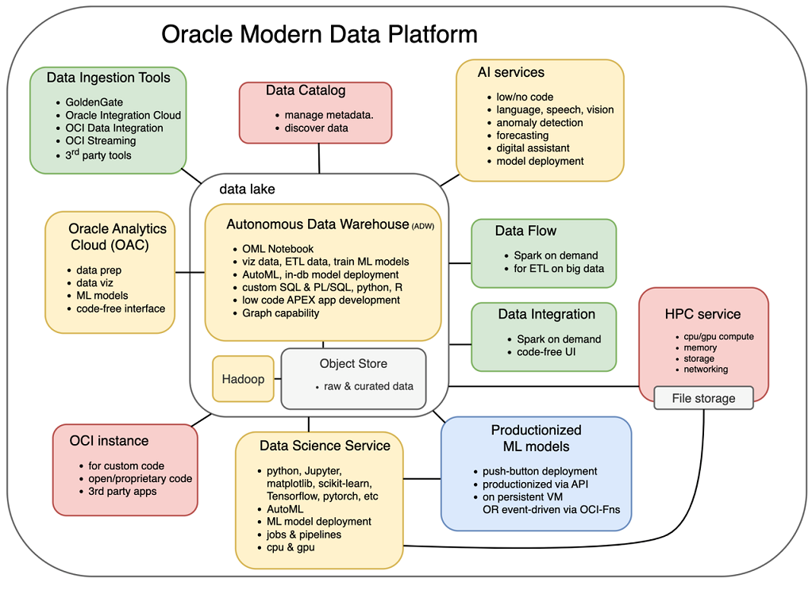

# Introduction

## About this Workshop

About 80% of the world's data is in an unstructured format: Video files, PDFs, spreadsheets, images, and so on. Many of these unstructured documents contain plain text written in prose. Even databases have many semi-structured tables because they contain textual fields, such as descriptions or customer support requests. Dealing with large quantities of text data is a complex task, but this information is valuable!

What if we could apply state-of-the-art AI models to unstructured data to extract insights from it? Oracle Cloud Infrastructure (OCI) now offers several AI services that allow you to harness the power of artificial intelligence. They offer pre-trained models ready for you to use and easy-to-train custom models that any developer can tweak. AI Services are geared toward developers, and you don’t need to be an expert data scientist to consume them.

In this workshop, we describe a pattern where we use OCI Language, one of our AI services, as part of an enrichment pipeline that allows you to ingest unstructured textual data and extract insights from it to analyze and visualize insights in Oracle Analytics Cloud(OAC). We'll use the OCI Language models accessed directly in Oracle Analytics Cloud(OAC). 

Estimated Workshop Time: 60 minutes.

### Objectives

In this workshop, you will learn how to:
* Provision OCI artifacts
* Register OCI AI Models in Oracle Analytics Cloud(OAC)
* Use Data Flows to apply OCI AI Models to Data sets
* Visualize and Analyze data using Oracle Analytics Cloud(OAC)

### Prerequisites

This lab assumes you have:
* Familiarity with Oracle Cloud Infrastructure (OCI)
* Some understanding of cloud, database, and visualization fundamentals

## Acknowledgements
* **Author** - Chenai Jarimani, Cloud Architect, Cloud Engineering
* **Contributors** -  Raja Pratap Kondmari (Pratap), AI Language Product Manager
* **Last Updated By/Date** - Chenai Jarimani, Cloud Engineering, April 2023
