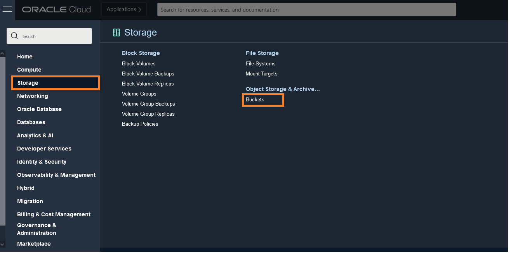
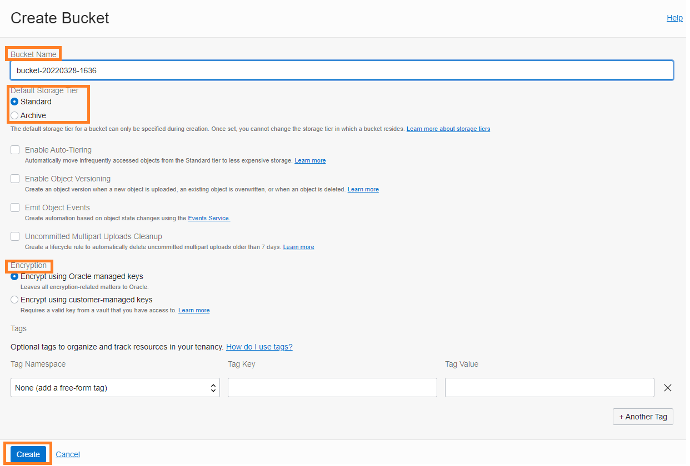
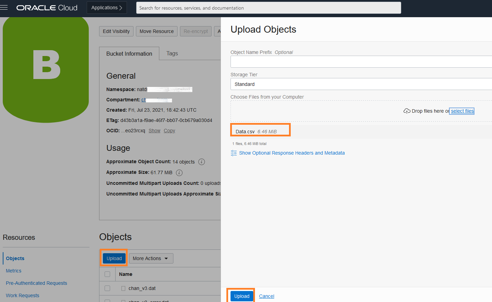
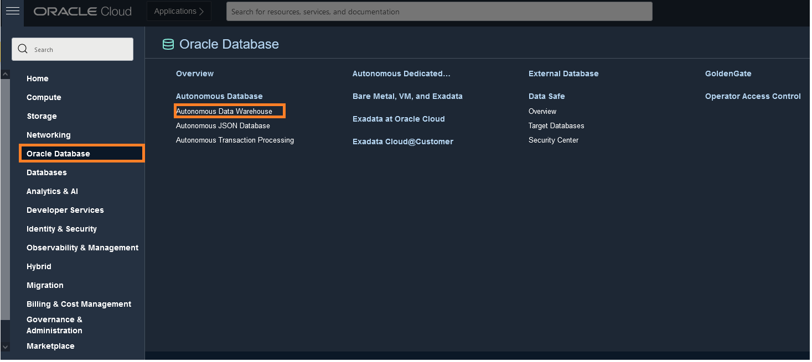
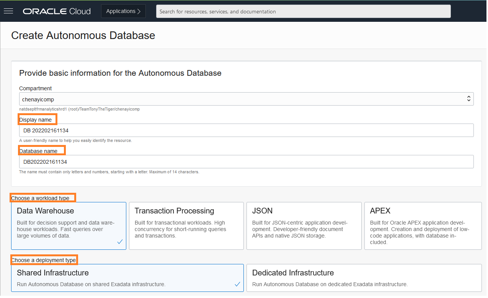
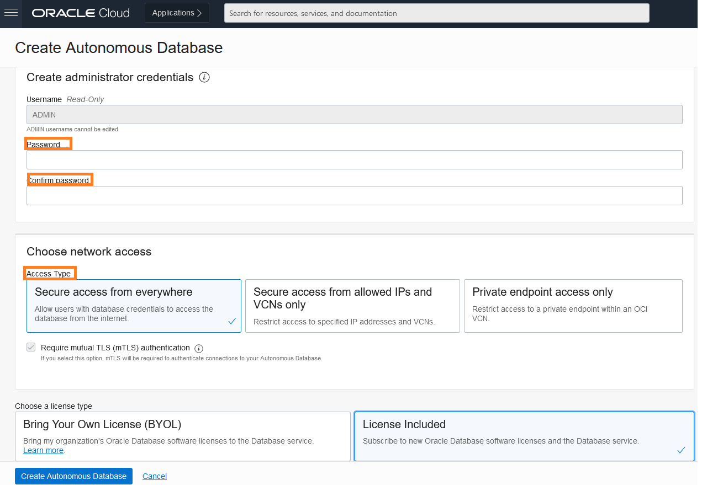
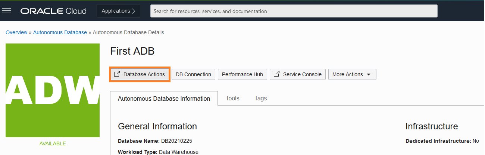
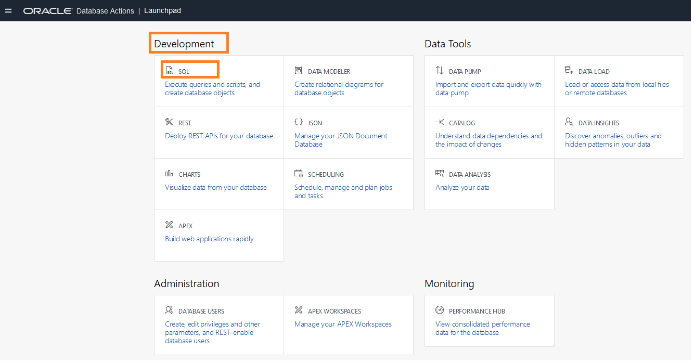
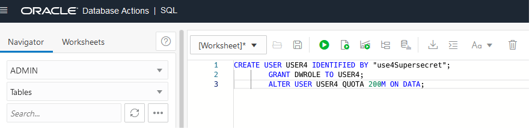

# Prepare Data Sources

## Introduction

This lab walks you through the steps to prepare the sample data that will be used to perform sentiment analysis, in this case, a set of hotel reviews. We will also create the buckets and databases to save the processed data.

Estimated Time: 60 minutes

### Objectives

In this lab, you will:
* Create Object Storage Bucket
* Download and Upload Sample Data
* Prepare Target Database
* Create Tables to Store Output Data

### Prerequisites

This lab assumes you have:
* An Oracle account
* All previous labs completed

## **Task 1**: Create Object Storage Bucket

In this task, we'll create 2 buckets one for storing source files with reviews and the other for staging. The staging bucket is a 'location' where OCI Data Integration needs to dump intermediate files before publishing data to a data warehouse.

1.	In the Oracle Cloud Infrastructure Console navigation menu, go to **Storage**, and then select **Buckets**.

   

2.	**Create a bucket** and name it “source-bucket”

3.	Click **create** accepting all defaults.

    

4.	Repeat steps **1** to **3** and name the bucket “data-staging”

## **Task 2**: Download and Upload Sample Data

For this exercise, we will assume that you have a set of customer reviews for a set of hotels.

1. 	Download this [Dataset](https://c4u04.objectstorage.us-ashburn-1.oci.customer-oci.com/p/EcTjWk2IuZPZeNnD_fYMcgUhdNDIDA6rt9gaFj_WZMiL7VvxPBNMY60837hu5hga/n/c4u04/b/livelabsfiles/o/oci-library/hotel.zip ) to your local machine. This file contains hotel reviews for a handful of hotels, and we will use that as our data source. We will perform sentiment analysis using Data Integration and AI Services.

2.	In the Oracle Cloud Infrastructure Console navigation menu, go to **Storage**, and then select **Buckets**.

3.	Select the 'source-bucket' you created on **Task 1**.

4.	On the bucket details page, under **Objects**, click **Upload**.

   

5.	In the Upload Objects panel, drag and drop the **data.csv** to the drop zone, or click **select files** to locate it on your machine.

6.	Click **Upload**, and then click **Close**.

## **Task 3**: Prepare Target Database

In this task, we'll create and configure your target Autonomous Data Warehouse database to add a schema and a table.

1.	In the Oracle Cloud Infrastructure Console navigation menu, go to **Oracle Database**, and then select **Autonomous Data Warehouse**.

   

2.	Select your compartment and **Create Autonomous Database**.

3.	On the options, set a **Display Name** and **Database Name**

   

4.	Workload type: **Data warehouse**.

5.	Remember your password (**labDatabase01**)

6.	Access type **Secure access from allowed IPs and VCNs only**

7.	Click **Create Autonomous Database** (Wait for your dataset to provision which may take up to 15mins)

   

8.	On your database details page, click **Database Actions**.

   

9.	Under **Development**, click **SQL**.

   

11. Create a Contributor user. Autonomous Databases come with a predefined database role named **DWROLE**. This role provides the common privileges for a database developer or data scientist to perform real-time analytics. Depending on the usage requirements you may also need to grant individual privileges to users.

	Run the following script as shown in the image below:

	    <copy>CREATE USER USER1 IDENTIFIED BY "<enter user1 password here>";GRANT DWROLE TO USER1;ALTER USER USER1 QUOTA 200M ON DATA;</copy>

   

## **Task 4**: Create Tables to Store Output Data

Whilst we are in the Database Actions dashboard, we will create 2 Tables

1.	A table **REVIEWS** to store the extracted aspects and related entities
2.	A table **SENTIMENT** to store the raw reviews
Follow the scripts below:

  **Create Raw Reviews Table**

			<copy>CREATE TABLE USER1.REVIEWS
			("RECORD_ID" INT,
			"HOTEL_ID" VARCHAR2(200 BYTE),
			"HOTEL_NAME" VARCHAR2(200 BYTE),
			"REVIEW_DATE" DATE,
			"REVIEW_RATING" INT,
			"REVIEW" VARCHAR2(2000 BYTE),
			"REVIEW_TITLE" VARCHAR2(200 BYTE)
			)SEGMENT CREATION IMMEDIATE
			PCTFREE 10 PCTUSED 40 INITRANS 1 MAXTRANS 255
			NOCOMPRESS LOGGING
			STORAGE(INITIAL 65536 NEXT 1048576 MINEXTENTS 1 MAXEXTENTS 2147483645
				PCTINCREASE 0 FREELISTS 1 FREELIST GROUPS 1
				BUFFER_POOL DEFAULT FLASH_CACHE DEFAULT CELL_FLASH_CACHE DEFAULT)
				TABLESPACE "LANGUAGE";</copy>

  **Create Sentiment Table**

		  <copy>CREATE TABLE USER1.SENTIMENT
	 	  ("RECORD_ID" INT,
		  "HOTEL_NAME" VARCHAR2(200 BYTE),
		  "ASPECT" VARCHAR2(200 BYTE),
		  "SENTIMENT" VARCHAR2(200 BYTE),
		  "OFFSET" INT,
		  "LENGTH" INT
		  ) SEGMENT CREATION IMMEDIATE
		  PCTFREE 10 PCTUSED 40 INITRANS 1 MAXTRANS 255
 		  NOCOMPRESS LOGGING
		  STORAGE(INITIAL 65536 NEXT 1048576 MINEXTENTS 1 MAXEXTENTS 2147483645
			  PCTINCREASE 0 FREELISTS 1 FREELIST GROUPS 1
			  BUFFER_POOL DEFAULT FLASH_CACHE DEFAULT CELL_FLASH_CACHE DEFAULT)
			  TABLESPACE "LANGUAGE";<copy>

This concludes this lab. You may now **proceed to the next lab**.

## Learn More
 [Overview of Object Storage](https://docs.oracle.com/en-us/iaas/Content/Object/home.htm)
 [Overview of Autonomous Database](https://docs.oracle.com/en-us/iaas/Content/Database/Concepts/adboverview.htm)

## Acknowledgements
* **Author** - Chenai Jarimani, Cloud Architect, Cloud Engineering, Luis Cabrera-Cordon, Senior Director, AI Services
* **Contributors** -  Paridhi Mathur, Cloud Engineering
* **Last Updated By/Date** - Chenai Jarimani, Cloud Engineering, April 2022
