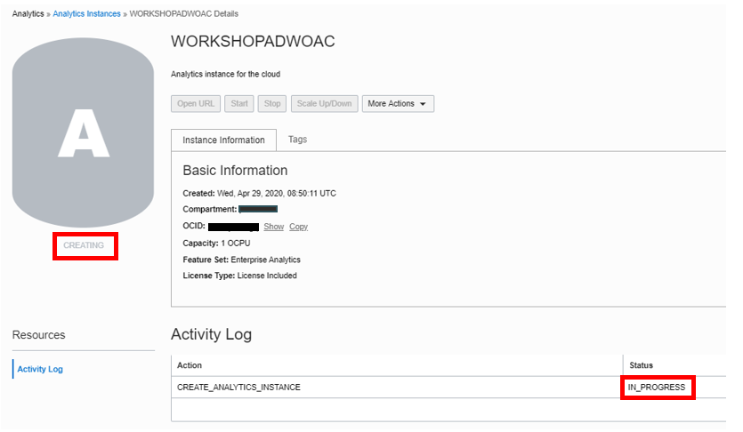
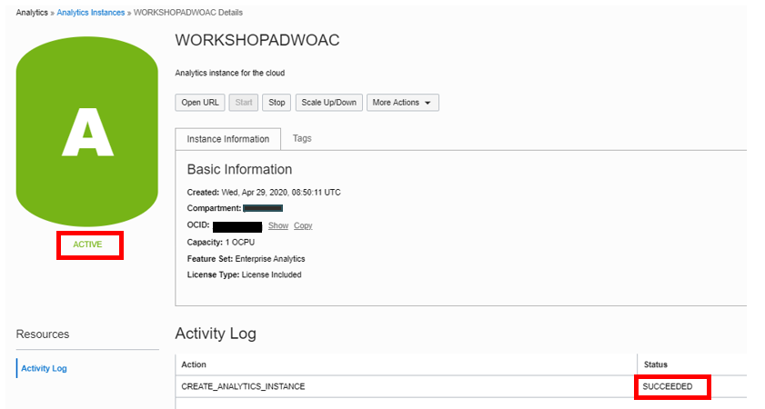

# Provisioning your Oracle Analytics Cloud (OAC) instance

## Introduction

This section describes the process of deploying **Oracle Analytics Cloud** instances on Oracle Cloud Infrastructure Gen 2, which is the default for newly provisioned accounts in **EMEA** and **US**.

Your Oracle Cloud Free Tier account will use the Oracle Cloud Free Trial **credits** while this instance is provisioned, as Oracle Analytics Cloud is not part of the **Always Free** cloud services.

Provisioning an Oracle Analytics Cloud instance can take over **40 minutes**.

Watch our short video that explains how to provision your Oracle Analytics Cloud instance:

Estimated Time 15 minutes.

### Objectives
- Create an Oracle Analytics Cloud Instance

## Task 1: Create an Oracle Analytics Cloud (OAC) Instance

Return to the Oracle Cloud Infrastructure Console accessing from **Oracle Home Page** (oracle.com) and sign in into your cloud account.
Click in **View Account** and **Sign in to Cloud**.

1. Go to the **Home Console Page** and navigate to **Analytics & AI** section and then **Analytics Cloud**.

    

2. Select **Create Instance**.

    Complete the form using the following information:

    - **Compartment**: Select a valid compartment in your tenancy

    - **Instance Name**: `WORKSHOPADWOAC`

    - **Description**: &lt;optional&gt;

    - **Feature Set**: Enterprise Analytics (important)

    - **Capacity**: 1 - Non Production

    - **License Type**: "Subscribe to a new Analytics Cloud software > license and the Analytics Cloud." (You will use this service as part of the free Oracle Cloud trial that you requested for this workshop).

3. Select **Create**.

    

4. On the **Confirmation** screen, select **Create**.

    The Analytics instance page will be displayed with a status of **CREATING**.

    

    ***Reminder***: Provisioning an Oracle Analytics Cloud instance can take over **40 minutes**.

5. The Analytics instance page will be displayed with a status of **ACTIVE**.

    

This concludes this lab. You may now **proceed to the next lab**.

## Acknowledgements

- **Author** - Priscila Iruela - Technology Product Strategy Director, Juan Antonio Martin Pedro - Analytics Business Development
- **Contributors** - Victor Martin, Melanie Ashworth-March, Andrea Zengin
- **Last Updated By/Date** - Chenai Jarimani, April 2023
