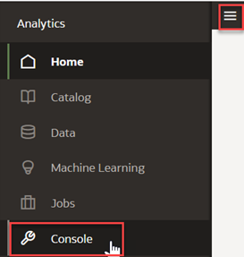

# Visualize the Data in OAC

## Introduction

This lab walks you through the steps to visualize and analyze the extracted data of the reviews using Oracle Analytics Cloud.

Estimated Time: 90 minutes

### Objectives

In this lab, you will:
* Create a Connection to Autonomous Datawarehouse
* Create a new Dataset
* Create a Workbook

### Prerequisites

This lab assumes you have:
* An Oracle account
* All previous labs completed

## **Task 1**: Create a Connection to an Autonomous Data warehouse

1.	Sign into Oracle Analytics Cloud.  
    **Return** to the **Oracle Cloud Infrastructure console** and click on the menu icon on the left.
    **Navigate** to **Analytics** and then **Analytics Cloud**.  

    

2. **Open** the Cloud Analytics **URL** associated with your instance by using the three dots menu button on the right-hand side of your instance information and select **Analytics Home Page**.  

      
    > The **Oracle Analytic**s page will open in a new browser **window/tab**.

3.	On the top right-hand side of the screen, click **Create**, and then **Connection**.

    

4. Choose **Oracle Autonomous Data Warehouse**.

    

5.	Enter the credentials to the data warehouse (target database) you created in **Lab 3: Prepare data sources > Task 3: Prepare Target Database**. If you need a reminder on how to get the wallet, See [Download a Wallet](https://docs.oracle.com/en/cloud/paas/autonomous-data-warehouse-cloud/cswgs/autonomous-connect-download-credentials.html#GUID-B06202D2-0597-41AA-9481-3B174F75D4B1).  
Click **Save** to save your new connection **information**.

  

## **Task 2**: Create a new Dataset  

When you create a Workbook, you add one or more **DataSets** containing the data that you want to **visualize and explore**. Datasets contain data from Subject Areas, Oracle Applications, databases, or uploaded data files such as spreadsheets. You can also add multiple data sets to your existing projects.  
Before you create your first dataset you enable [Auto Insights](https://docs.oracle.com/en/cloud/paas/analytics-cloud/acubi/let-oracle-analytics-suggest-best-visualizations-dataset.html) so that Oracle Analytics can suggest which visualizations will gain the best insights.

1. Toggle **Auto Insights** for all Datasets.  
Go to **Home Page** > **Navigator** > **Console**

   

2. Go to **System Settings** > **Performance and Compatibility** > **Enable Auto Insights on Datasets**

   
   

3. Go back to the **Homepage**.  
Click on the **Go Back** arrow from the top left and then click **Navigator** and select **Home**

   
   

4. Now let's create a **Dataset** using the data warehouse connection you've just created.  
On the top right-hand side of the ***Oracle Analytics*** Home Page, click **Create**, and then **Data Set** to display the Create Data Set dialog.

    

5.	Select the data warehouse connection you just created.

    

6.	The **Dataset Editor** is opening with the connection pane that displays the data source connection's schemas and tables.  
Drag the two tables from the USER1 database that you just populated into the canvas: **REVIEWS** and **SENTIMENT**  
By default, when you drag and drop tables to a dataset containing multiple tables, any joins defined in the data source are automatically created between the dataset's tables. Oracle Analytics also automatically creates joins based on the column name matches it finds between the tables. However, Oracle Analytics can't always figure out how to automatically build joins. In such cases, you must manually add joins before you can save the dataset.  

    

7.	The **Dataset Editor** displays now a **Join Diagram** tab with all of the tables and joins in the dataset and the **Dataset Table Page Tabs** for each table in the dataset.  
Also, Oracle Analytics analyzes the quality of the data and provides a visual summary known as a **Quality Insight** in a tile above each column. The quality summary is based on a sample of the data, but changes that you make are applied to all of your data. Quality insights display a frequency tile for text or a histogram for dates and numbers

     

8.  Click the **SENTIMENT** tab to go to the Transform editor to transform or enrich the table's data.  
We are going to change the **RECORD\_ID** column from Measure to **Attribute**. Select **RECORD\_ID** column, go to **Data Type** click Measure, and select Attribute.

     

9.  Click the **REVIEWS** tab to go to the Transform editor to transform or enrich the table's data.  
We are going to change the **RECORD\_ID** column from Measure to **Attribute**. Select **RECORD\_ID** column, go to **Data Type** click Measure and select **Attribute**.

     

10.  Notice that both **REVIEW\_RATING** and **REVIEW\_TITLE** columns are empty and can be removed.  
Hover **REVIEW\_RATING** and click on the three dots (**Options**) and choose **Delete**.  
Do the same for the **REVIEW\_TITLE** column.

     

11. Let's go back to the **Join Diagram** tab and inspect the default joins.  
Click on the join sign and then click **Add Join Condition**. It will automatically add a **RECORD\_ID** new inner join.  

     
    > **Note**: With this dataset data you can keep or delete the default HOTEL\_NAME inner join, it's the same hotel on both tables. As a best practice, you should avoid joins based on names as well as multiple unnecessary joins, so hover the mouse over HOTEL\_NAME join and press **delete icon**

12. Click on the **SENTIMENT** table and select **Preserve Grain**.  

     

13. Right-click on the **REVIEWS** table and notice there are **Missing or Null** values on the SENTIMENT, OFFSET, and LENGTH columns.  
We are going to use a Filter based on valid and invalid data in quality insights.

          

14. Hove over **SENTIMENT** column, click on Filter Icon  and select **Filter by Invalid or Missing**.  

     

15. Hove over **SENTIMENT** column, click on Filter Icon  and select **Filter by Invalid or Missing**.  

     

16. Double-click **Missing or Null**, then enter the following values for the RECORD\_ID 477003835:  
   - ASPECT: 'hotel'
   - SENTIMENT: 'Positive'

     

17.	**Save** your Dataset.  
Click on the **Save button **on the top right > Enter your Dataset Name and click **OK**.

  

## **Task 3**: Create the Visualization (Workbook) - Auto Insights

When you create a **Workbook** out of a **Dataset**, you have a blank canvas to start with.  
You can avoid _blank canvas syndrome_  using the new [**Auto Insights**](https://docs.oracle.com/en/cloud/paas/analytics-cloud/acubi/let-oracle-analytics-suggest-best-visualizations-dataset.html) capability, which provides automatic visualization suggestions that give you great insights and a starting point into your key data elements within a Dataset.  

1.  An empty **Canvas** is presented in **Visualize** tab.  
On the toolbar, the Auto Insights icon is white when Oracle Analytics is calculating the best insights for the dataset. When the insights are ready, the Auto Insights icon turns yellow  and Oracle Analytics displays suggested visualizations with a textual description of the insight that you can gain.

    

2. In the **Auto Insights** panel, hover over the visualizations that you want to include in your workbook and click + to add them to your workbook canvas. Close  **Auto Insights** panel.

   

## **Task 4**: Create the Visualization (Workbook) - Explain

Another way to let the system generate useful insights about your data is **Explain**.  
It works on both **Attributes** and **Measures** columns and helps to analyze important and non-obvious patterns in data.  
The insights that Explain delivers are based on the column type or aggregation that you chose and will vary according to the aggregation rule set for the chosen metric. Explain generates only the insights that make sense for the column type that you chose.

1.  Open a new **Canvas**  
Click on **Add new Canvas** icon 

2. Explain for **Attributes**  
    **_Basic Facts_** insights (distribution across categories)  
    **_Key Drivers_** list columns that influence attribute values and their distribution  
    **_Segment_** tab visualizes segments where the value for the attribute can be identified with certain confidence based on other columns in the dataset  
    **_Anomalies_** tab performs combinatorial analysis between selected attribute and other attribute columns and shows groups that exhibit unexpected behavior

3. Explain for **Measures**  
    **_Basic Facts_**  
    **_Anomalies_** insights based on the aggregation rule

4. Let's start to explain **SENTIMENT**  
In Data Pane Select **SENTIMENT**, Right-Click, and select **Explain SENTIMENT**

      

    Explain displays its findings to you as text descriptions and visualizations. You can select key visualizations and add them to your Workbook's canvas.

5. A new page is opened. Explain on attributes generates basic factual insights, key drivers, segments, and anomalies.

     

6. Interesting visuals can be selected to be added to the canvas.  
Select **Basic Facts about SENTIMENT**, hover the mouse over the pie chart and click on the top right of the insight its checkmark (_Select for Canvas_)

   

7. Go to **Segments that Explain SENTIMENT**.  
Select **ASPECT** and check the results

   

8. Anomalies tab exhibits groups in the data that show unexpected results.  
Select the first two visualizations, click on the top right of the insight (_Select for Canvas_) and go to the top right corner of the page and click **Add Selected**

   

9. Returning to the canvas you notice the 3 selected insights as visualizations.  
Note that the canvas name has changed to **Explain SENTIMENT** and under _My Calculations_ you get 4 new measures and 1 new attribute.  

   

## **Task 5**: Create the Visualization (Workbook)

In this task, we'll create a new **Canvas** from scratch to visualize the insights from our sentiment data.

1.  Open a new **Canvas**  
Click on **Add new Canvas** icon 

2.	Drag  a stacked bar visualization into the canvas.

     

3.	Navigate to the **Data** tab 

4.	Open the contextual menu (Right click) on the **My Calculations** table and select **Add Calculation**  
For **Name** select '# SENTIMENT'  
For the **Function** enter 'COUNT(SENTIMENT)'  
Click **Validate** and **Save**

    

5.	Drag **# SENTIMENT** into the Value (Y-Axis) of the visualization.

    

6.	For Category X-Axis, select REVIEWS: REVIEW DATE: Quarter.  
Right-click on the REVIEW_DATE field in Category (X-Axis) and select Show by… **Quarter**.

    

7.	For the **Color**, select **Sentiment**.

    

8.	Right-click on the bars shown, and click **Color > Manage Assignments**

    

9.	Set **Negative** to Orange, **Neutral** to Yellow, and **Positive** to Green.

    

10.	Open the contextual menu (Right-click) on the **My Calculations** table and select **Add Calculation**  
For **Name** select '# REVIEWS'  
For **Function** enter 'COUNT(REVIEW)'  
Click **Validate** and **Save**

    

11.	You want to enhance the current visualization and add information around the number of reviews by aspect, filtered by positive and negative sentiment.  
Drag a **Tag Cloud** visualization into the canvas.

    

12.	From **Data** tab select **Aspect**, **Sentiment** > Right click  and select **Add to Selected Visualization**  

    

13.	Drag **SENTIMENT** to **Filters** and select **Positive**  
You can see that what most customers liked were the Location and Rooms

    

14.	Select **Menu** > **Edit** > **Duplicate Visualization**

    

15.	Click **Filters** > **Modify Filter** and select **Negative**  
Customers did not enjoy Breakfast and neither did they like the Parking Policy.  

    

16.	You are interested now to select the last four quarters' date.
  Keep pressing your mouse left button and circle the last 4 quarters.

    

17.	Notice the corresponding data points are also highlighted in the other visualizations on the canvas.  
This is [Pattern Brushing](https://docs.oracle.com/en/cloud/paas/analytics-cloud/acubi/brushing-visualizations-canvas.html)

    

18.	Create a [Dashboard Filter](https://docs.oracle.com/en/cloud/paas/analytics-cloud/acubi/filter-data-using-dashboard-filter-visualization.html)
  Drag **Dashboard Filters** from **Visualizations** tab

    

19.	Add **Year**, **SENTIMENT**, **ASPECT**, **REVIEW** and play with selections

    

20.	Follow the same pattern and customize your canvases to meet your needs. You can try different visualizations.  
    - By clicking on each aspect say Parking you can drill to the next page for a more detailed view of the reviews about Parking in a Table. This is useful to further investigate what aspects of Parking policy need attention to help management formulate strategies that'll improve this area of concern
    - You can use also use Top N to filter the top reviews, and statistics such as trendiness to view average review ratings over a some time.

    
21.	**Save** your Workbook.  
Click the **Save** icon on the top right, provide a **Name** and click the **Save** button.

    

22.  Bonus: [Integrate Oracle Functions with OAC Data Flows](https://docs.oracle.com/en/cloud/paas/analytics-cloud/acubi/register-and-use-oci-functions-data-flows.html#GUID-93BB53BC-8463-4957-8B0B-40206AF9805A).  
**Oracle Analytics Cloud** can natively consume **OCI Functions**, directly invoking the FaaS function from within an OAC Data Flow safely and securely.  
Please check the following videos and documentation:  
    - [Oracle Analytics Making OCI Functions Compatible with OAC](https://www.youtube.com/watch?v=oS4TUwjx9e4&list=PL6gBNP-Fr8KVWVRE0U8HQAvoU5mU31KVs)  
    - [Running Custom OCI Functions in Oracle Analytics Cloud](https://www.youtube.com/watch?v=TpHgZsAnNT0&list=PL6gBNP-Fr8KVWVRE0U8HQAvoU5mU31KVs)
    - [Register and use OCI Functions in Data Flows](https://docs.oracle.com/en/cloud/paas/analytics-cloud/acubi/register-and-use-oci-functions-data-flows.html#GUID-9EF52034-D1BA-4B2C-8378-AE505A4B1009)

You have just finished learning how to **Load** and **Prepare** your **Data**, how to create your first **Workbook** as well as basic **editing** and **filtering**.  
You have also learned how to explore the **Explain** **ML** feature and  **Auto Insights**, which enable insights that you can immediately start with, instead of a blank canvas.

This concludes this **workshop**

## Learn More
* [Modeling Your Data with Self-Service Data Sets in Oracle Analytics](https://blogs.oracle.com/analytics/post/modeling-your-data-with-self-service-data-sets-in-oracle-analytics)  
* [Five Ways to Quickly Discover and Repair Data Issues in Oracle Analytics](https://blogs.oracle.com/analytics/post/five-ways-to-quickly-discover-and-repair-data-issues-in-oracle-analytics)
* [Begin every data journey with Auto Insights](https://blogs.oracle.com/analytics/post/begin-every-data-journey-with-auto-insights)  
* [Analyze Data with Explain](https://docs.oracle.com/en/middleware/bi/analytics-desktop/bidvd/analyze-data-explain.html#GUID-D1C86E85-5380-4566-B1CB-DC14E0D3919E)  
* [Leveraging Oracle Analytics Cloud with Autonomous Data Warehouse](https://apexapps.oracle.com/pls/apex/r/dbpm/livelabs/view-workshop?wid=812&clear=180&session=9585530339306)

## Acknowledgements
* **Author** - Chenai Jarimani, Cloud Architect, Cloud Engineering, Luis Cabrera-Cordon, Senior Director, AI Services
* **Contributors** -  Paridhi Mathur, Cloud Engineering
* **Last Updated By/Date** - Chenai Jarimani, Analytics & AI, March 2023
