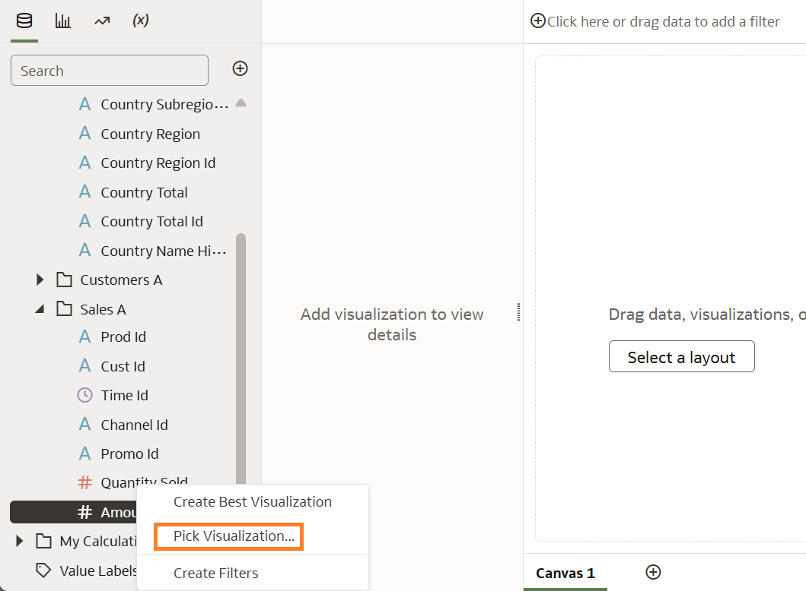
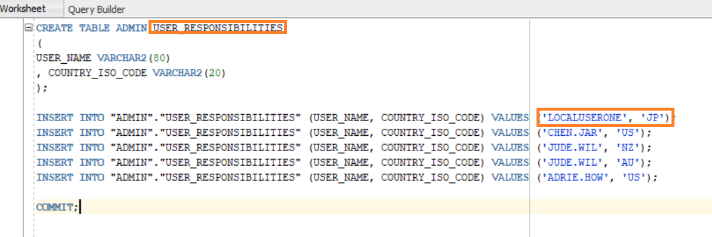
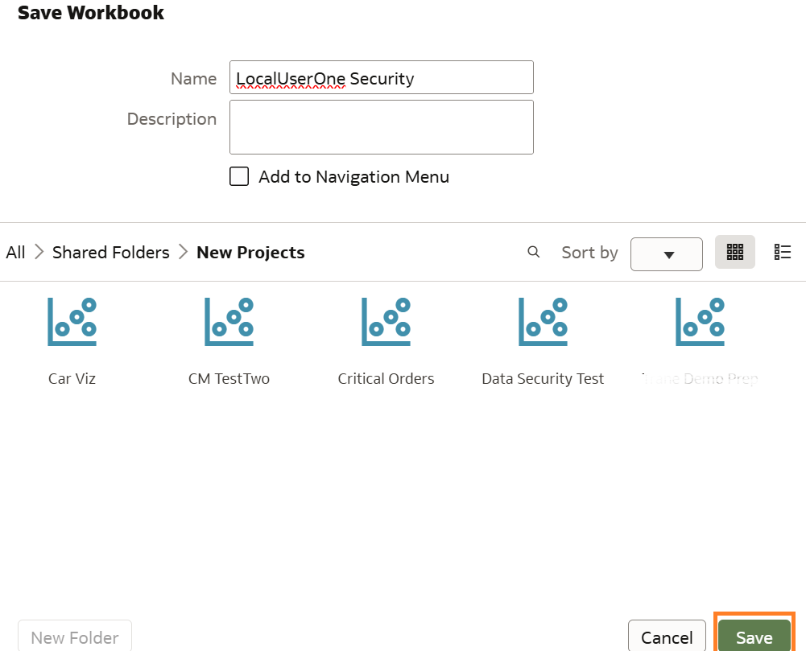

# Configure Security

## Introduction

This lab walks you through the steps to configure the data-level security in the semantic modeler using the application roles and session variables defined in the previous tasks to filter the data. The Data Filter is where the expression is created that is appended to the Oracle Analytics Where clause for each query. Please note Data Filters are not executed for users who explicitly or implicitly have the BI Service Administrator role.

Estimated Time: 20 minutes

### Objectives

In this lab, you will:
* Create data filters in the Semantic Modeler
* Create a Workbook to verify the filters
* Use Developer tools to analyze the queries

### Prerequisites 

This lab assumes you have:
* Working knowledge of the Semantic Modeler
* Modeled a few tables to apply the Row-Level Security

## Task 1:  Create a Data Filter on the Countries Table

In this scenario there are three tables:- Countries, Customers and Sales modeled in the Semantic Modeler. The goal is to apply data filters such that each user can only view Sales amounts applicable to their specific country/region. The regions were defined in Lab 1 in the User Responsibilities security table.

1. Review the joins of the 3 tables

	

	> **Note:** The **COUNTRIES** table is secured.  It is also secured with a join to the **SALES** table. The **COUNTRY ISO CODE** values are used to filter the data returned to an Oracle Analytics query.

2. Navigate to **Presentation Layer** , double click **Countries** table, click **Data Filters**

  

3. Under **Add** search for the **CountryRole** that was created in Lab 3.

 

4. Click **CountryRole**, then **f(x)** and Open Expression Editor and enter below code

     ```
      <copy>
      Country Iso Code =VALUEOF(NQ_SESSION.USER_RESPONSIBILITIES)
      </copy>
     ```
     
5. Click **Validate** and then **Save** 

 

   > **Note:** A data filter is created on the **Countries** table to restrict what rows are returned to the user.  

  

## Task 2:  Create a Data Filter on the Sales Table

In case the user does not choose the **Countries** table for the analysis, the **Sales** table needs to be filtered so sales totals are displayed only for the countries the user is permitted to see. The appropriate joins to the **Countries** table are added to the filter.

1. Navigate to **Presentation Layer** , double click **Sales** table, click **Data Filters**

  

2. Add the below using the expression builder:

    - Click **Sales** table -> **Cust ID** then Type (=)
    - Click **Customers** table -> **Cust ID** then Click AND
    - Click **Customers** table -> **Country ID** then Type (=)
    - Click **Countries** table -> **Country ID** then Click AND 
    - Click **Countries** table -> **Country ISO CODE** then Type (=)

    **Enter** VALUEOF(NQ_SESSION.USER_RESPONSIBILITIES)

 

3. Click **Validate** and **Save** 

 

   > **Note:** A data filter is created on the **Sales** table with joins to the **Customers** and **Countries** tables

4. **Save** the Semantic Modeler, **Check Consistency** and **Deploy**

  


## Task 3:  Validate Data-Level Security

 1. **Sign in** as one of the users defined in the security table.

 

 2. Create a **Workbook**

 
 
 3. In **Add Data** select the Subject Area in which you configured security, click **Add to Workbook**

 

 4. In the **Data pane**, expand **Countries** , select **Country Name** and select **Amount Sold** from **Sales**. Right-click, select **Pick Visualization**.

 

 5. Select the **Table visualization** type.

 

 6. The results show user **LocalUserOne** can view sales data for Japan.

  

   > **Note:** This is based on the User Responsibilities security table that was set up in the Database.

   
 
 7. Click **Save**. In Save Workbook, enter **Name**, and then click **Save**

  

 8. View the Session Log using **Developer**

 
 
 9. Under **Performance Tools** click **Refresh**

 

 10. Click **Execution Log** then scroll to view the **Physical Query** sent to the Database. Notice the assigned country in the **where** clause

 

 11. Login with a user with **BI Service Administrator**, run same report.

 

   > **Note:** The report displays all the countries

 12. View the Session Log using **Developer**

 

   > **Note:** Data Filters are not executed for users who explicitly or implicitly have the BI Service Administrator role.


## Learn More
* [Build a Semantic Model](https://docs.oracle.com/en/cloud/paas/analytics-cloud/acmdg/build-semantic-models-physical-layer.html)
* [Deploy Semantic Model](https://docs.oracle.com/en/cloud/paas/analytics-cloud/acmdg/deploy-semantic-model.html)
* [Build a Workbook in OAC](https://docs.oracle.com/en/cloud/paas/analytics-cloud/acubi/begin-build-workbook-and-create-visualizations.html)
* [Developer Options in OAC](https://docs.oracle.com/en/cloud/paas/analytics-cloud/acubi/developer-options.html#GUID-5A0BD6CE-EEB3-4028-B64C-BE3178B69C21)


## Acknowledgements
* **Author** - Chenai Jarimani, Cloud Architect, NACI
* **Last Updated By/Date** - Chenai Jarimani, April 2025
