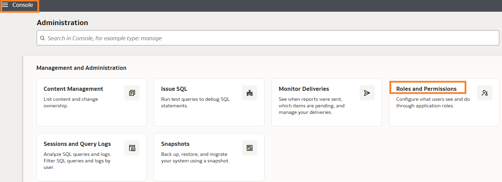
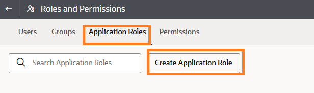
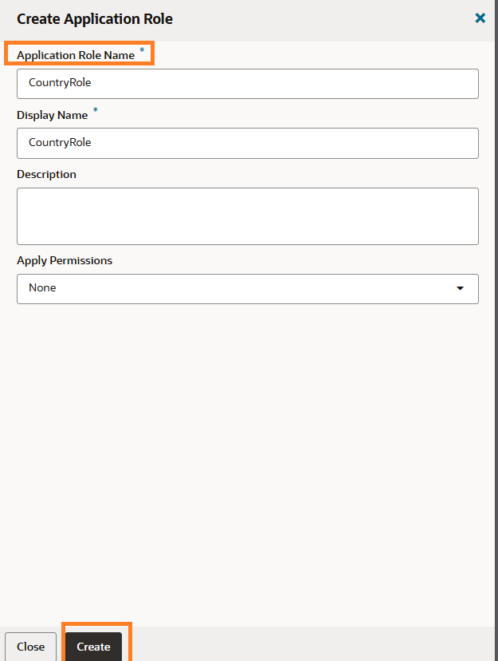
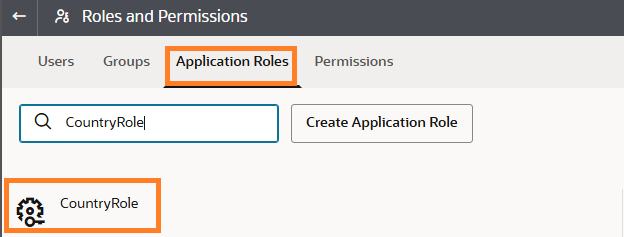
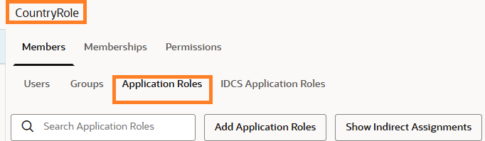
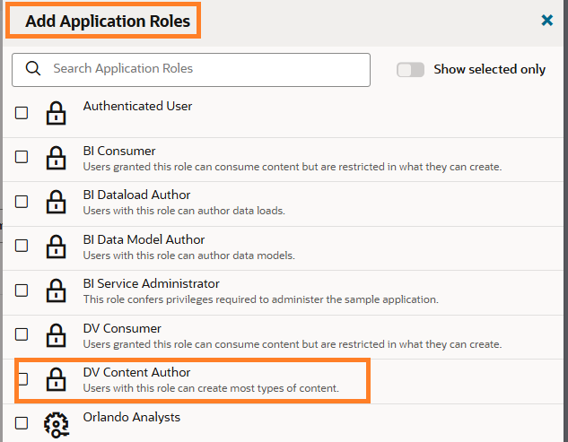
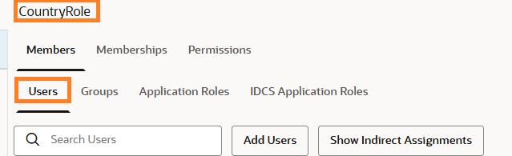
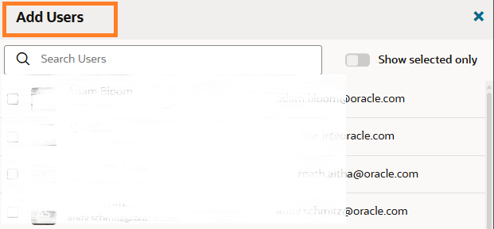
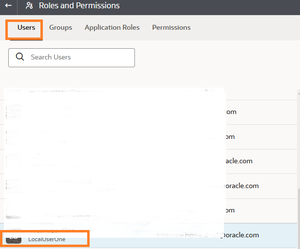
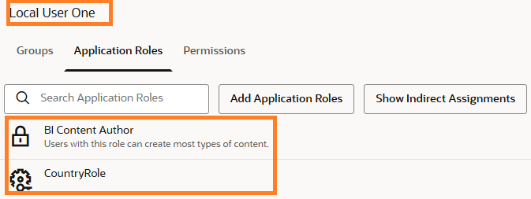

# Create a Custom Application Role in OAC

## Introduction

This lab walks you through the steps to create a custom application role to use in the semantic modeler to assign permissions. An application role comprises a set of permissions that determine what users can see and do after signing in to Oracle Analytics Cloud.

Estimated Time: 10 minutes

### Objectives

In this lab, you will:
* Create a custom role in OAC
* Add DV Content Author role to the custom role
* Add users or groups to the application role
* Validate User's assigned application roles

### Prerequisites

This lab assumes you have:
* Users and groups already created in the IDCS
* All previous labs successfully completed

## Task 1: Create a Custom Application Role

1. Navigate to the **Console**

	  click **Navigation**.	

2. Click **Console**, then  **Roles and Permissions**

  

3. Click **Application Roles** then **Create Application Role**

  

4. In the dialog box enter **Name** and **Display name** for the Application Role, then click **Create**

  

## Task 2: Add Application Role to the Custom Application Role

1. Click the **CountryRole** to edit

  
	
2. Under **Members** click **Application Roles**

  

3. Click **Add Application Roles**, then add **BI Content Author** and click **Add Selected**

    

## Task 3: Add Users or Groups to the Custom Application Role

1. Under **Members** click **Users**

  
	
2. Click **Add Users**, then add users you created or group and click **Add**

  

## Task 4: Validate User's Application Roles

1. Navigate to Users tab and pick the user

	

2. Click **Application Roles**, then you should see all application roles including the CountryRole

  

You may now **proceed to the next lab.**

## Learn More

* [About Application Roles](https://docs.oracle.com/en/cloud/paas/analytics-cloud/acabi/application-roles.html#GUID-3CEED4DB-F124-45AF-A115-75AF7392974C)

## Acknowledgements
* **Author** - Chenai Jarimani, Cloud Architect, NACI
* **Last Updated By/Date** - Chenai Jarimani, April 2025
