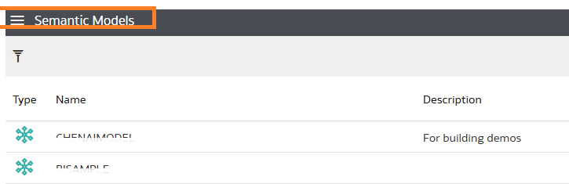
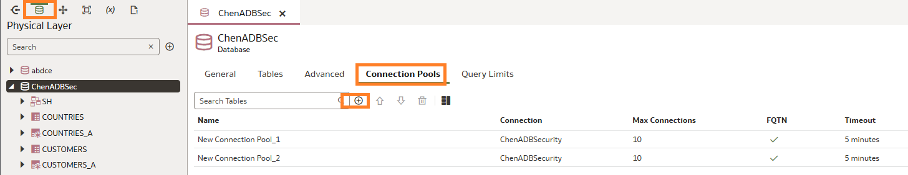
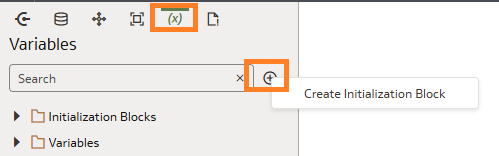
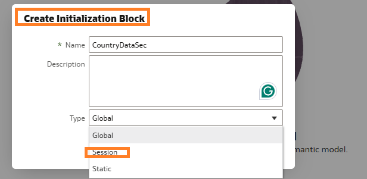
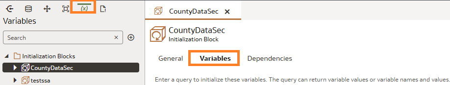
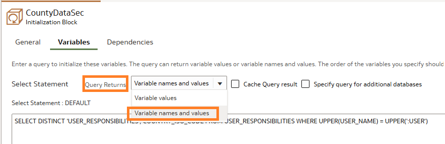
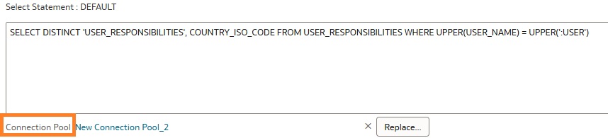
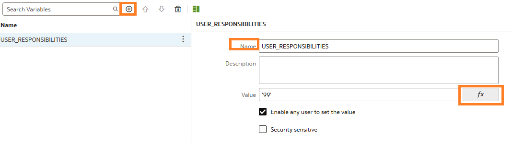
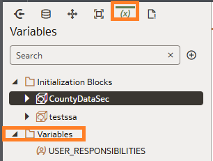

# Create Initialization block in OAC

## Introduction

This lab walks you through the steps to create an initialization block with a session variable that execute each time a user logs into Oracle Analytics. The block will query the security table to identify which countries each user is allowed to see. The initialization query references the data source's tables that supply the variable values.

Estimated Time: 20 minutes

### Objectives

In this lab, you will:
* Create an Initialization Block
* Configure the Session variable

### Prerequisites

This lab assumes you have:
* A working Semantic Modeler
* Created Database connection


## Task 1: Create the Initialization Block

1. Navigate to **Semantic Models**, then click the Semantic Model to open it

	

2. Navigate to **Physical Layer**, click the **Database**, **Connection Pool** and verify the second connection pool exists, if not click the **+** to add

  

  > **Note:** For initialization blocks you need a separate connection pool 

3. Navigate to **Variables** tab, click Create Initialization Block **+** 

  

4. Enter **Name**, and under **Type** select **Session** 

  

  > **Note:** Once you **Save**, the Initialization block opens the **Variables** tab


## Task 2: Configure the Session Variable

1. Navigate to **Variables** tab, click **CountyDataSec** Initialization Block , then **Variables**

  

2. Paste below query in the Select Statement pane:
    ```
    SELECT DISTINCT 'USER_RESPONSIBILITIES', COUNTRY_ISO_CODE FROM USER_RESPONSIBILITIES WHERE UPPER(USER_NAME) = UPPER(':USER') <copy></copy>.</copy>
    ```
3. Under **Query Returns** select **Variable names and values** 

  

4. Select **Connection Pool** to configure 

    

5. Click **+**, Detail View tab, enter Name **USER_RESPONSIBILITIES** , click **fx** Enter ('99') and **check** Enable any user to set the value 

    

6. Click **Save**

7. The new session variable is listed under **Variables** 

    


## Learn More

* [Create and Use Variables in a Semantic Modeler](https://docs.oracle.com/en/cloud/paas/analytics-cloud/acmdg/create-and-use-variables-semantic-model.html)

## Acknowledgements
* **Author** - <Chenai Jarimani, Cloud Architect, NACI>
* **Last Updated By/Date** - <Chenai Jarimani, April 2025>
