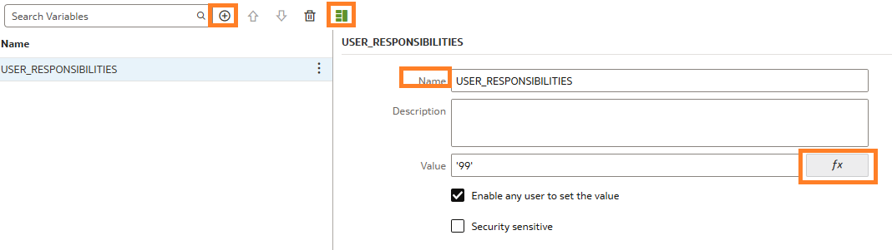

# Create Initialization block in OAC

## Introduction

This lab walks you through the steps to create an init block with a session variable that execute each time a user logs into OAC. The block will query the security table to identify which countries each user is allowed to see.

Estimated Time: 20 minutes

### About <Product/Technology> (Optional)
Enter background information here about the technology/feature or product used in this lab - no need to repeat what you covered in the introduction. Keep this section fairly concise. If you find yourself needing more than two sections/paragraphs, please utilize the "Learn More" section.

### Objectives

In this lab, you will:
* Create an Initialization Block
* Add the session variable
* Test the variable

### Prerequisites (Optional)

This lab assumes you have:
* A working semantic modeler
* Created your database connection to the OAC instance


*This is the "fold" - below items are collapsed by default*

## Task 1: Create the Init Block

1. Navigate to Semantic Models, then Click the Semantic Model to open it

	

	> **Note:** Use this format for notes, hints, and tips. Only use one "Note" at a time in a step.

2. Navigate to Physical Layer, Click the **Database**, **Connection Pool** and verify the second connection pool exists, if not Click the **+** to add

  

  **Note:** For init blocks you need a separate connection pool

3. Navigate to **Variables** tab, Click Create Initialization Block **+** 

  

4. Enter Name, and under Type choose **Session** 

  

  **Note:** Once you Save the Init block opens the **Variables** tab


## Task 2: Configure the Session Variable

1. Navigate to **Variables** tab, Click CountyDataSec Initialization Block , then Variables Tab

  

2. Paste below query in the Select Statement pane:
  ```
    SELECT DISTINCT 'USER_RESPONSIBILITIES', COUNTRY_ISO_CODE FROM USER_RESPONSIBILITIES WHERE UPPER(USER_NAME) = UPPER(':USER') <copy></copy>.</copy>
    ```
3. Under Query Returns Choose **Variable names and values** 

  

4. Select Connection Pool, Add the one you configured 

    

5. Click **+**, Detail View tab, Enter Name **USER_RESPONSIBILITIES** , CLick **fx** Enter ('99') and Enable any user to set the value 

    

6. Click Save 

7. Under Variables the new Session Variable is listed on the left side 

    


## Learn More

*(optional - include links to docs, white papers, blogs, etc)*

* [URL text 1](http://docs.oracle.com)
* [URL text 2](http://docs.oracle.com)

## Acknowledgements
* **Author** - <Name, Title, Group>
* **Contributors** -  <Name, Group> -- optional
* **Last Updated By/Date** - <Name, Month Year>
