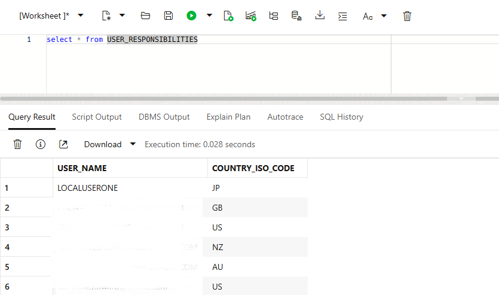

# Create Security Table

## Introduction

This lab walks you through the steps to create a database table USER_RESPONSIBILITIES which contains country assignments for analytics users.

Estimated Time: 20 minutes

### Objectives

In this lab, you will:
* Configure the security table in ADB
* Test the security table

### Prerequisites 

This lab assumes you have:
* An Oracle Cloud account
* All previous labs successfully completed
* You have a running ADB instance


## Task 1: Configure the security table

1. Navigate to the Database Schema

	

	> **Note:** You can use any sql interface of your choice (SQL Developer, Toad, Database Actions and etc

2. Copy and paste the SQL Code in the worksheet

  ```
   </copy> CREATE TABLE ADMIN.USER_RESPONSIBILITIES 
(
  USER_NAME VARCHAR2(80) 
, COUNTRY_ISO_CODE VARCHAR2(20) 
);

INSERT INTO "ADMIN"."USER_RESPONSIBILITIES" (USER_NAME, COUNTRY_ISO_CODE) VALUES ('LOCALUSERONE', 'JP');
INSERT INTO "ADMIN"."USER_RESPONSIBILITIES" (USER_NAME, COUNTRY_ISO_CODE) VALUES ('CHEN.JAR', 'US');
INSERT INTO "ADMIN"."USER_RESPONSIBILITIES" (USER_NAME, COUNTRY_ISO_CODE) VALUES ('JUDE.WIL', 'NZ');
INSERT INTO "ADMIN"."USER_RESPONSIBILITIES" (USER_NAME, COUNTRY_ISO_CODE) VALUES ('JUDE.WIL', 'AU');
INSERT INTO "ADMIN"."USER_RESPONSIBILITIES" (USER_NAME, COUNTRY_ISO_CODE) VALUES ('ADRIE.HOW', 'US');

COMMIT; </copy>
    ```

  
## Task 2: Test the security table

1. Test your table is configured by writing a select * statement

  


## Learn More


## Acknowledgements
* **Author** - <Name, Title, Group>
* **Contributors** -  <Name, Group> -- optional
* **Last Updated By/Date** - <Name, Month Year>
