# OAS Augmented Analytics in Data Visualization

## Introduction ##

Oracle Analytics Server features powerful, intuitive data visualization capabilities that enable analysts to create self-service data visualizations on an accurate and consistent data set.  One of the more sophisticated features of Oracle’s self-service offering is the ability to leverage Augmented Analytics and Machine Learning at the click of a button directly within your self-service projects and data flows.

Augmented Analytics are statistical functions that you apply to enhance or apply forecasting to the data already displayed on your canvas.

There are also a set of pre-built machine learning algorithms which can be used to extract information from your data sets such as sentiment analysis, predicting outcomes and time-series forecasting.

As well as the pre-built options available in the user interface, you can also call custom advanced analytics or machine learning scripts either using Evaluate Script function from within your self-service projects or by adding custom scripts as part of your Data Flow when preparing data.

*Estimated Lab Time:* 30 Minutes

### Objectives ###
* This exercise will introduce you to the capability to readily add augmented analytic functions such as Trendline, Forecast, Cluster & Outlier identification to your analysis.

* In this lab, you will play the role of an HR Analyst.  The VP of HR has noticed an increasing rate of attrition.  

* As an analyst, you have been tasked with identifying what is happening internally in order to decrease the rate of attrition and identify potential strategies to mitigate risk. Additionally, you will identify those employees who are at greatest risk for leaving.  

### Prerequisites
This lab assumes you have:
- A Free Tier, Paid or LiveLabs Oracle Cloud account
- You have completed:
    - Lab: Prepare Setup (*Free-tier* and *Paid Tenants* only)
    - Lab: Environment Setup
    - Lab: Initialize Environment

The following files <if type="external">referenced in [Lab: Initialize Environment](?lab=init-start-oas) should already be downloaded and staged as instructed, as they</if> <if type="desktop"> staged under *`/opt/oracle/stage/OAS_OML_Workshop_LabFiles`*</if> are required to complete this lab.

- File to be downloaded:
     - AttritionTraining.xlsx
- DVA File:
     - Employee+Analysis.dva

## Task 1: Adding Trend Line, Forecast, Clusters and Outliers to charts
This exercise will introduce you to the capability to readily add augmented analytic functions such as Trendline, Forecast, Cluster & Outlier identification to your analysis.

1. If not already connected to Oracle Analytics Web UI, refer to [Lab: Initialize Environment](?lab=init-start-oas) for the details.
    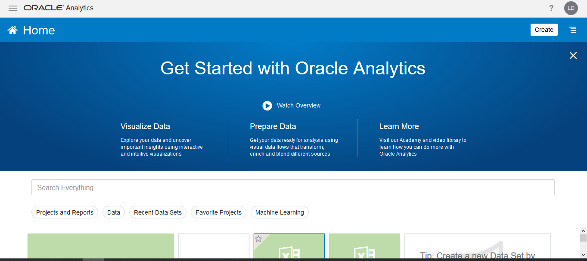

2. Click on **Create** -> **Project** to start a new self-service project.
    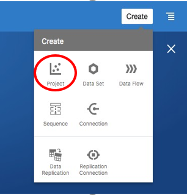

3. Select the “**Sample App**” subject area and Click “**Add to Project**”.  
    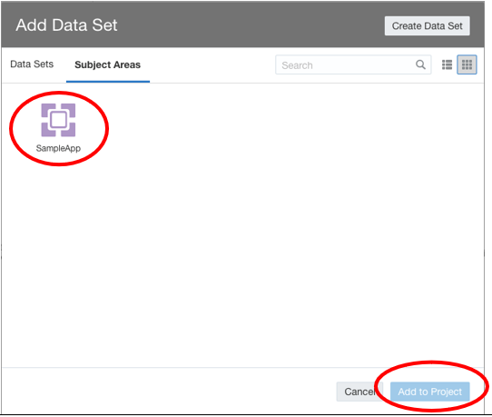  

4. While holding the CTRL key, **select** “Profit Ratio %”, “Revenue” and “Month.”  Then **Right Click** and select the **Pick Visualization** option. Select the **Combo** chart.

    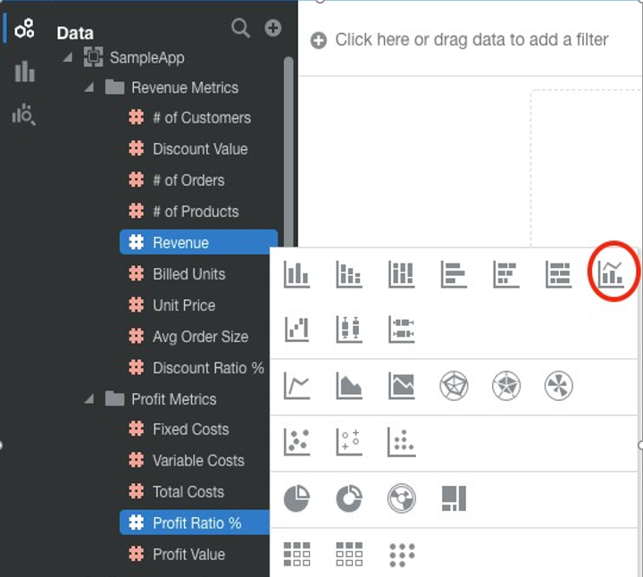

5. Click “**Profit Ratio %**” and select “**Y2 Axis**.”
   Enlarge the visualization for a better view.  
    

6. On the bottom LHS panel **Select** the “Analytics” panel, then **Click** the + to add Add Statistics and **Select** “Trend Line”.   
    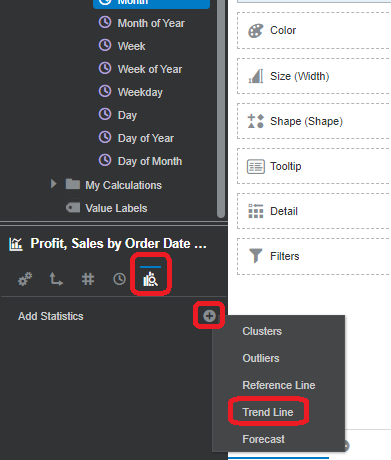

7. You have now created a management report that shows both Revenue and Profit Ratio % with their corresponding trendlines all with no coding.

    Repeat the above steps but this time chose “Forecast” as the statistic to be added. This will extend out the lines for both measures by 3 months into the future (default setting) enabling you to visualize a forecasted Revenues and Profit Ratios.    

    This may take a few moments, please wait.  
    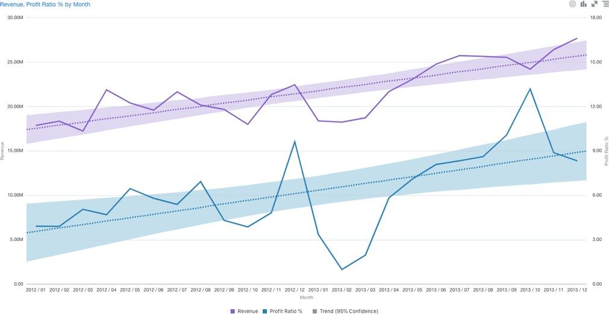  

8. At the top RHS of the canvas you will see a button to Save your Project.  Give it a name that makes sense and save it.
    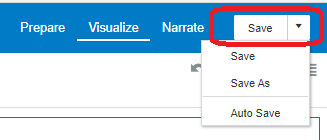  

    *Note:* This lab's Step 3 builds on this concept by showing how to identify Clusters & Outliers in your data using a scatter chart.

## Task 2: Using OAS Machine Learning to accelerate root cause analysis

We will use the data profiling and semantic recommendations functionality to repair and enrich your data. These recommendations are based on the system automatically detecting a specific semantic type during the data profiling step.

You will learn how the Explain feature uses machine learning so you don't have to waste time guessing and dropping random data elements on the canvas to create a visualization for data insight. Explain helps eliminate bias from your analysis.  Consider  asking 10 different people in your organization why employees are leaving. It is very likely that you will get 10 different opinions and such scenarios often lead to wasted time as each tries to prove their hypothesis. In contrast, Explain runs a series of algorithms against the data giving you an unbiased view of key attributes and measures which contributed to the employees leaving.

We will also leverage the BI Ask functionality as part of data visualization. This feature provides an interactive way to integrate data into your visualization projects.

1. In this exercise we use a data set on employee attrition to explore information related to experience, performance and incentive information and use this to predict whether the employee has left the organization.

    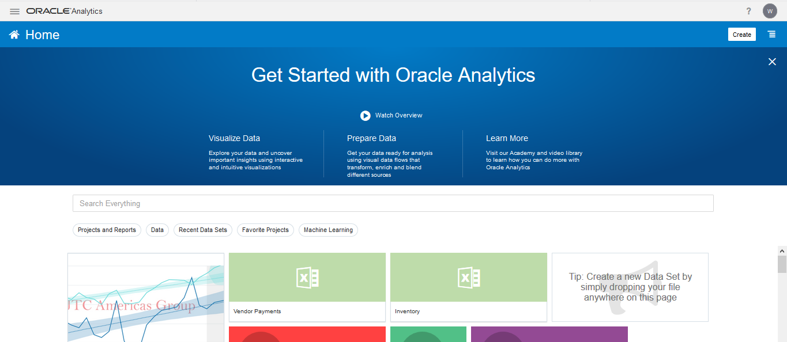

2. From the homepage we create a new project and upload the data set to start analyzing the data set.

   We will be leveraging the data visualization machine learning features to generate rapid insights of the data added to the project.

   **Select** Create -> Project

    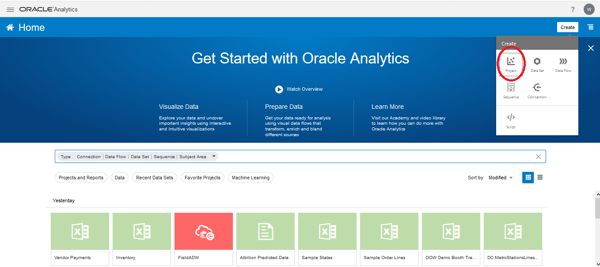

3. Select > **Create Data Set**.
      

4. Drag and drop, or browse and select the file **AttritionTraining.xlsx** from <if type="external"> the staging area where you unpacked the downloaded artifacts as instructed in [Lab: Initialize Environment](?lab=init-start-oas)</if> <if type="desktop"> *`/opt/oracle/stage/OAS_OML_Workshop_LabFiles`*</if>

      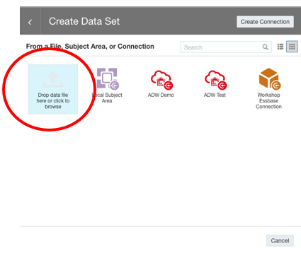
      <if type="external">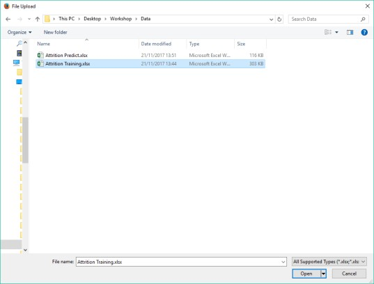</if>
      <if type="desktop">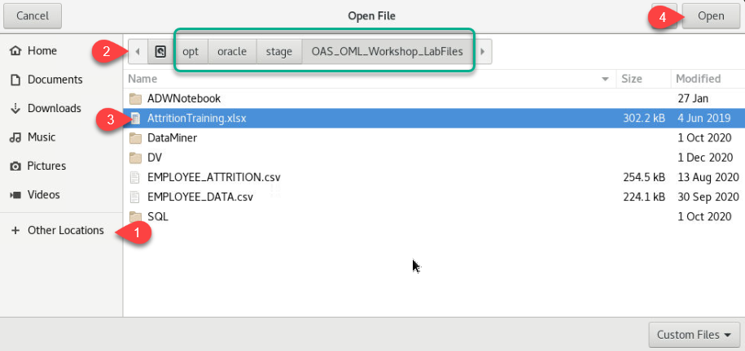</if>

4. In the prepare pane you can check to see the definitions of each of the columns from the data set.

    Ensure that the  ‘EmployeeNumber’ and ‘Education’ columns are both set to be attributes.

    To do so choose each column then using the properties panel on the bottom LHS of the page to change the data type from Measure to Attribute.

    Once complete **Select** the Add button on the top Right hand side.

    Your data will now be analyzed and profiled.

    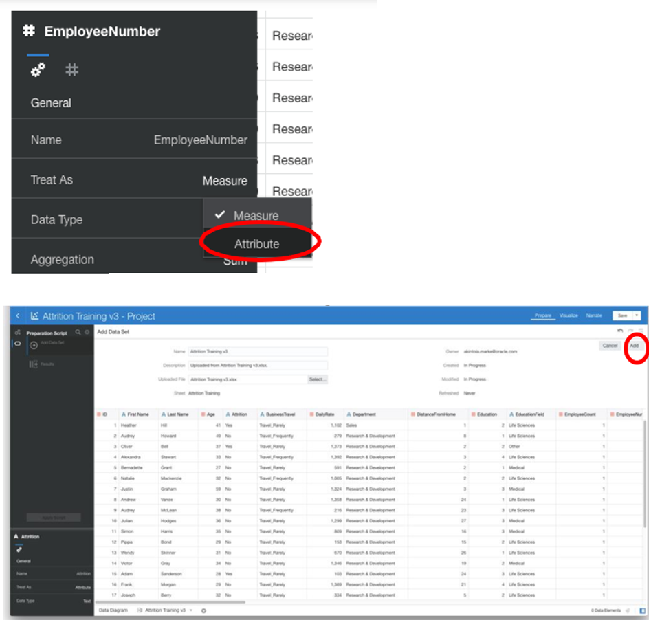

5. Upon Adding a data set, the data set undergoes column-level profiling which produces a set of semantic recommendations enabling you to repair or enrich your data. These recommendations are based on the system automatically detecting a specific semantic type during the profile step.

    There are various categories of semantic types such as geographic locations identified by city names, a specific pattern such as a credit card number or email address, a specific data type such as a date, or a recurring pattern in the data such as a hyphenated phrase.

    A set of column transformation “Recommendations” will be displayed on a pane to the right.

    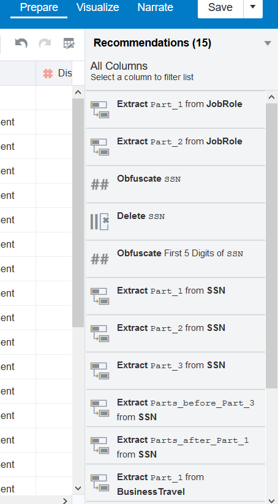

6. During the data profiling a column with data that has **Social Security Numbers (SSN)** was detected and recommendations on what to do with this column are presented.

    We will obfuscate the entire SSN. Select the “**Obfuscate SSN**” recommendation. Select the check mark which appears when you hover over the recommendation.

    Select the “<” to return to the rest of the recommendation suggestions.

    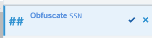
    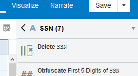

7.  On the left-hand pane notice that the transformation and enrichment operations are displayed.
    Select “**Apply Script**”. Then select the “**Visualize**” tab at the top RHS of the page.
    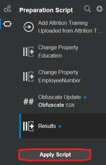
    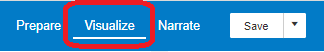

8. We will start by using the ‘**Explain Attribute**’ function which enables us to generate rapid insights about attribute columns in our data set automatically without having to manually create visualizations.

    Select **Attrition**.

    Right Click and Select **Explain Attrition**.

    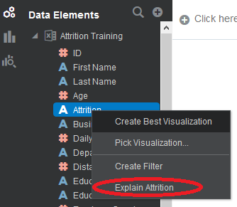

9. This will generate an Explain window with insights on the attrition column divided into  4 categories as shown.

    This first tab will give us basic facts about our attrition attribute.

    In this case it will perform automatic aggregations on the distinct rows.

    Attrition is a binary variable so it will be split into a yes or a no. The pie chart at the top shows a breakdown of employees who did or didn't leave the company.

    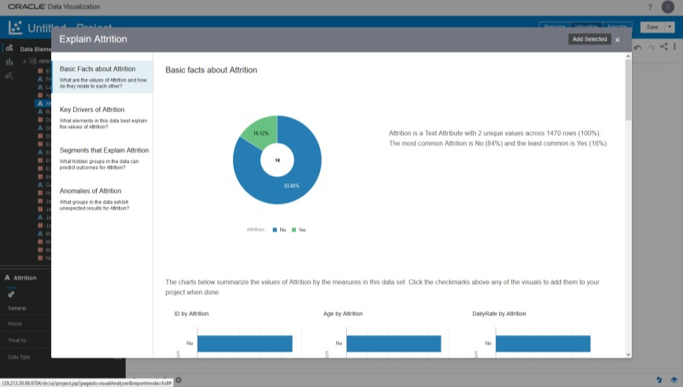

10. Explore the charts a bit to see what is automatically generated.

    If there is a chart you want to add to your project you can do so by selecting the tick mark in the top of the chart.

    You can select multiple charts from each tab and continue your analysis.

    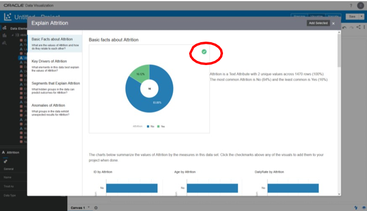

11. Navigate to the second tab, which shows the key drivers of our attrition attribute. i.e. columns which the Machine Learning algorithm detects as having a strong relationship with the column '**attrition**'.

    It then displays a bar graph showing the distribution of attrition across each of the key driver columns.

    *Note:* Disregard order and screen placements of charts in explain.

    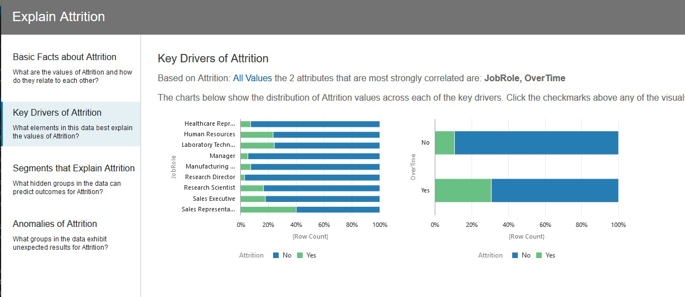

12. Tab three generates information on the segments that explain the column attrition. i.e. in what scenarios it is more or less likely that attrition will be a yes or a no.

    You can use the bar at the top to toggle through the different explain features for different attribute columns.

    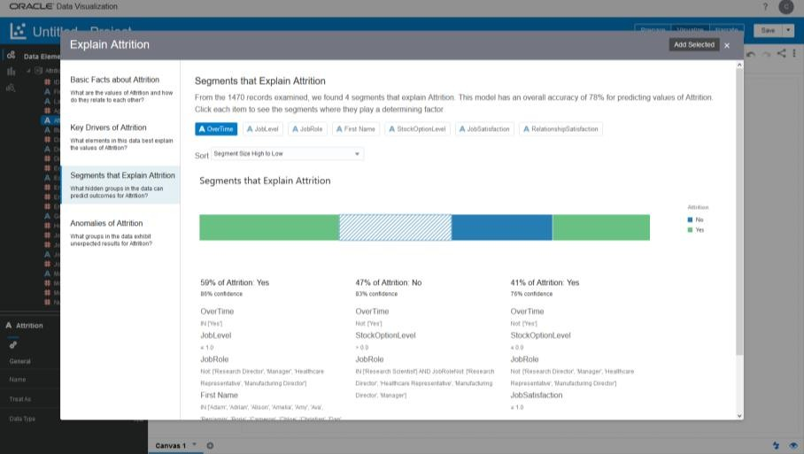

13. The fourth tab illustrates the anomalies of our attrition attribute.

    This tab shows us the combinations of each distinct value of attrition against all columns in the dataset to identify top outliers.

    It visualizes the actual value, expected value and highlights the places where actual and expected value do not match.

    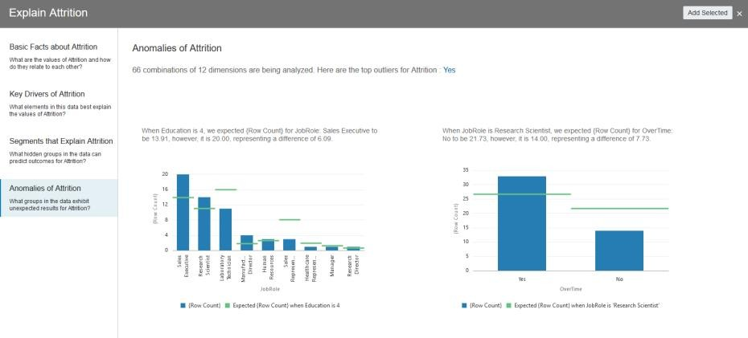

14. After exploring the tabs of explain we can click on '**add selected**’ to add interesting visualizations to our project canvas.

    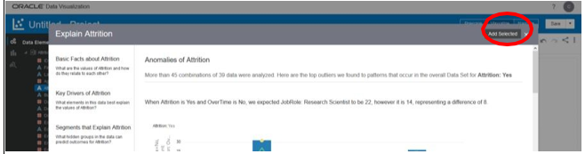

    This will then create a new tab in the project called 'Explain'. Attrition’ and contain all of the visualizations that we want to keep or explore further.  

    Before selecting **add selected** be sure to select the following charts:  

    - **Basic facts:**  
        * Attrition pie chart  
        * YearsAtCompany by Attrition

    - **Key Drivers:**  
        * JobRole

     - **Anomalies of Attrition**  
        * JobRole

    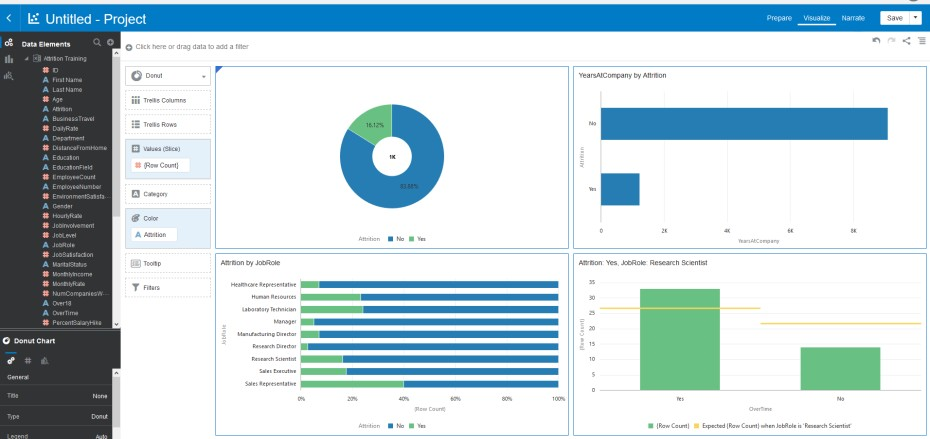  

15.  We can perform further explain functions on other attributes in our project data set, and for each column we explain and generate visualizations for a new explain canvas tab will be added to the project.

    Try explaining the 'Education' attribute and add some visualizations to the project

    Highlight the following charts from the explain education dialogue box:  

    * **Education Pie chart**  
    * **NumCompaniesWorked by Education**  
    * **Education anomalies chart by JobRole**  

    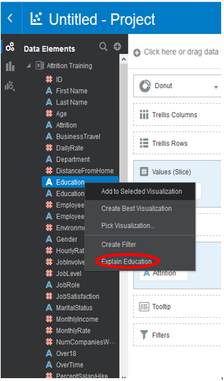

16. Select ‘**Add Selected**’ to the project.

    Add a new canvas to the project and we will continue building up the analysis.

    Before going further, save the project in the shared folder as ‘**Attrition Analysis**’

    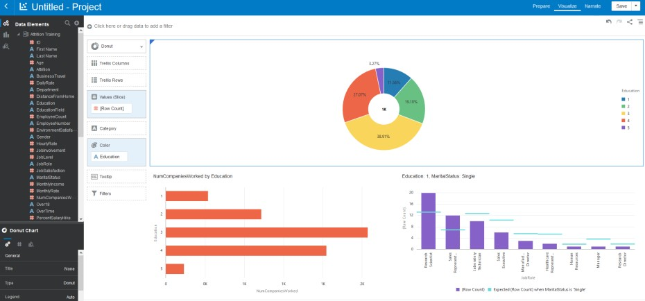

17. We are going to further explore the data we have in this project now.

    One area we have not analyzed extensively yet is gender in attrition.

    Add another canvas to your project.

    Name the canvas > **Gender Analysis**

    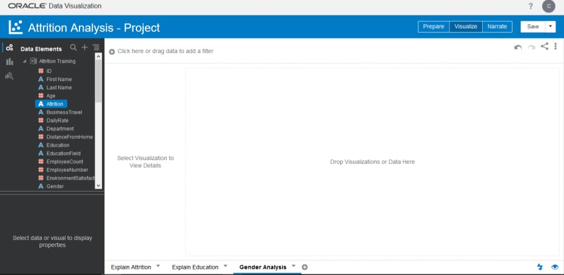

18. Use the **BI Ask** icon to generate a visualization for this. To do this select the magnifying glass icon.

     The **BI Ask** feature lets you query your data set and even build visualizations by searching for measures and attributes you’re interested in.

     This is particularly useful when dealing with a large or unfamiliar data set.

    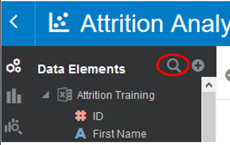

19. Type the following:

    “**EmployeeCount**” , “**Attrition**” and “**Gender**”

    Using your mouse **Click** on these three new elements and drag them anywhere onto your new canvas.

    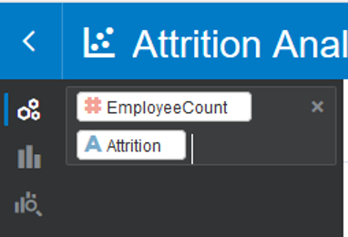  

20. Using the chart type selector at the top RHS of the chart and change it to a horizontal stacked chart.

    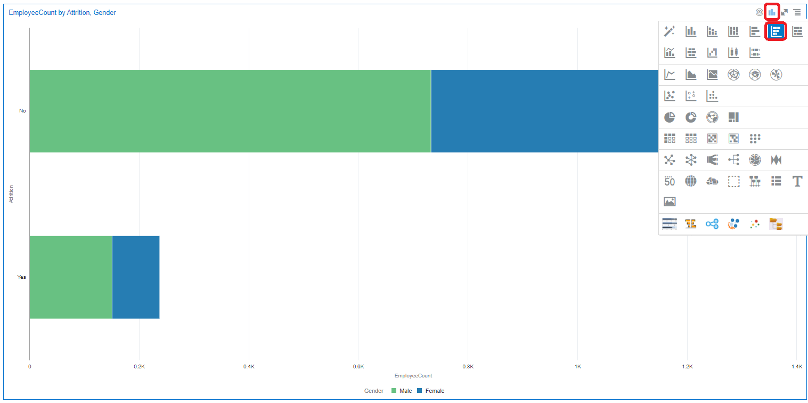

    We can now see that more men than women left the organization but proportionally more women actually left.

    Let us use the in-built advanced analytics features to determine potentially why this might be the case.

21. Select the **“x”** to remove your BI Ask elements.
    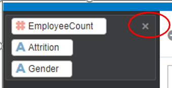

    Select the following items from the data elements pane

    ‘**Gender**’,‘**EnvironmentSatisfaction**’,‘**WorklifeBalance**’ and ‘**Last Name**’

    Right click and pick visualization ‘**Scatter**’.
    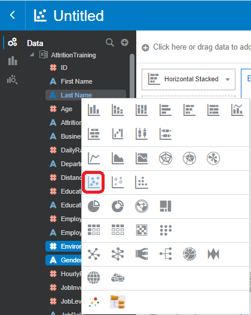

    Move “**Gender**” to “**Trellis Columns**”.

    Your visualization should look like this, with the scatter plot trellised by gender.

    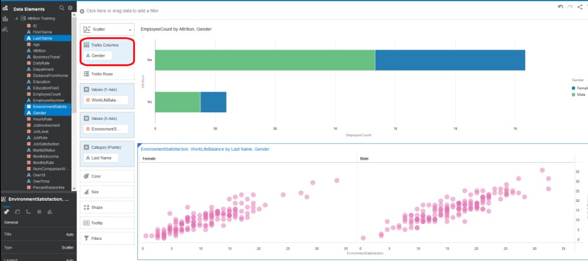  

22. In the pane on the left select the ‘**Analytics**’ tab. Select ‘**Outlier**’ and drag it onto the scatter plot “**Color**” section.

    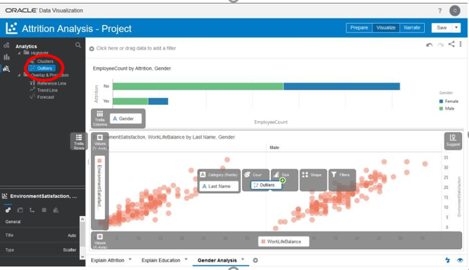

23. Looking at the outliers you can see that typically female employees have a lower satisfaction level and work life balance. This could explain why women are proportionally more inclined to leave the organization than men.

    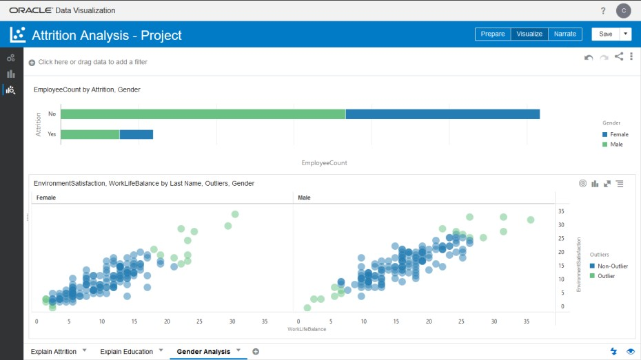
    Save your analysis and go back to the home page.  

## Task 3: Leveraging OAS native Machine Learning to predict attrition

This exercise explores how self-service machine learning models are available and can be leveraged within OAS to enable various forms of predictive  analysis.   

It is worth noting that this type of work may be more efficiently off-loaded to the Oracle Database where it is possible to handle significantly more data, many more attributes and to evaluate & leverage more machine learning algorithms than one might wish to attempt using OAS.  In fact, the current roadmap for OAS calls for a transparent mechanism which will effectively and transparently offload a majority of machine learning processing to the Oracle Database.

1. We are now going to extend our analysis by seeing how we can predict whether an employee is likely to leave the organization.

    For this we will be using a **Binary Classification** model.

    Before we venture any further let us try to understand briefly what Binary classification is.

    Binary classification is a technique of classifying elements of a given dataset into two groups on the basis of classification rules for example Employee Attrition Prediction, i.e. whether the employee is expected to Leave or Not Leave.

    These classification rules are generated when we train a model using training dataset which contains information about the employees and whether the employee has left the company or not.

    In the home page, click on create and select  **Data Flow**.
    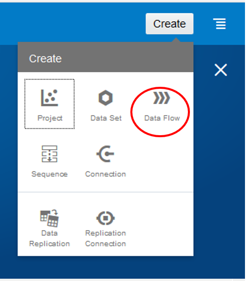

2. Select the data we were analyzing > “**Attrition Training**.”

    Click on **Add**.
    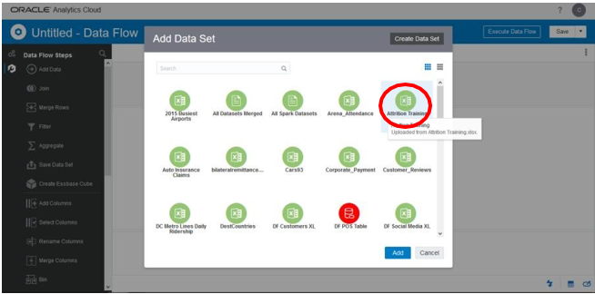

3. This data set will be added as a source for our data flow.
    

4. In the last example we saw that there is attrition in our department and there appears to be some drivers identified using the explain function.

    What we want to do now is build and train a machine learning model in order for us to be able to predict whether someone is likely to leave the organization.

    Select the ‘**plus icon**’ on the source data and select ‘**Train Binary Classifier**’
    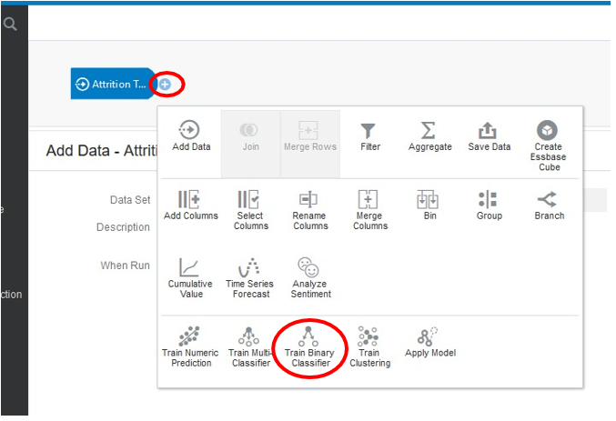

5. We need to select which binary classification model we want to use.

    Select ‘**Naïve Bayes for Classification**’ and click OK.
    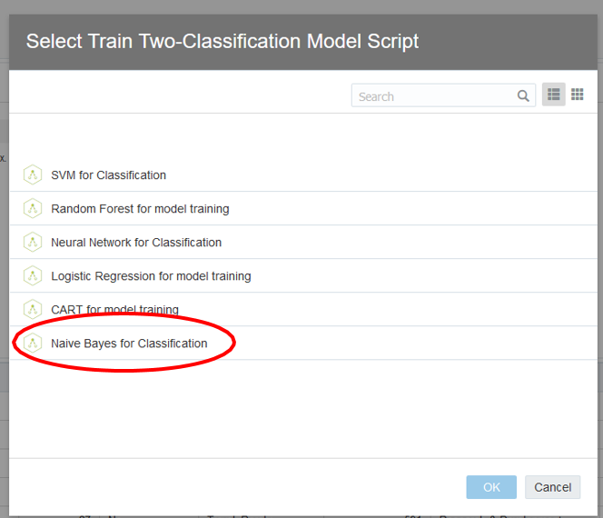

6. Select the ‘**Attrition**’ attribute as the target column for the model.

    Make sure positive class is ‘**Yes**’ and leave the other options as the default settings
    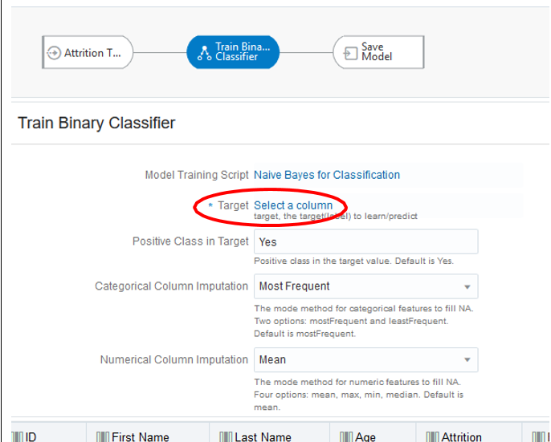

7. Click ‘**Save Model**’, rename model name from Untitled to ‘**Attrition Predict**’.
    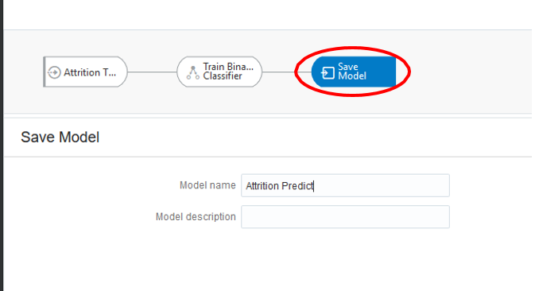

8. Save the data flow, similar to how you save a Project, giving it the name ‘Attrition Train Model – Naïve Bayes’.
    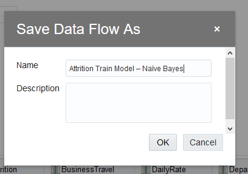

9. Once saved, using the Run Data Flow button next to the Save button, Run the data flow. This trains your machine learning model so wait for the data flow run operation to complete.
    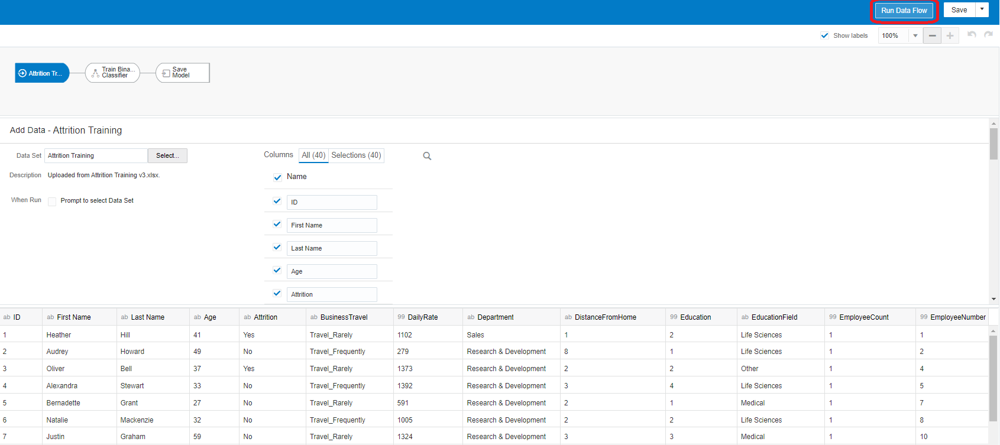

10. Go to the **Machine Learning** tab and we can see we have our new classification model.
    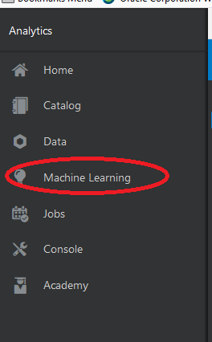

11. We can inspect the Quality of our Machine Learning model to determine how well it might do in predicting employees likely to leave.

    Right Click and select **Inspect**.
    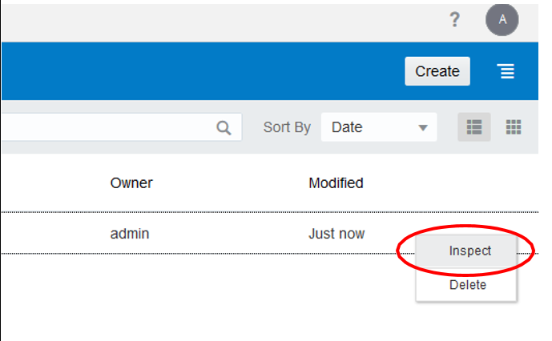

12. Now we will use a current, data set for remaining  employees and apply our machine learning model in order to predict those employees most likely to next leave the organization.

    In order to do this we go back to the Home page and select ‘Create’/‘import’ in the Page Menu (hamburger) to import a project previously created which analyzes the current employees of our organization

    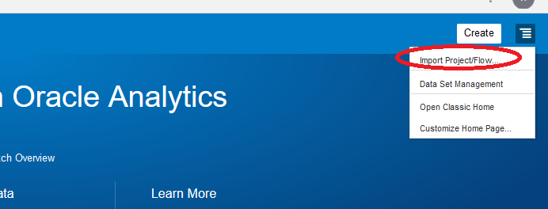

13. Import the “**`Employee_Analysis.dva`**” file. Drag and drop, or browse and select the file **`Employee_Analysis.dva`** from <if type="external"> the staging area where you unpacked the downloaded artifacts as instructed in [Lab: Initialize Environment](?lab=init-start-oas)</if> <if type="desktop"> *`/opt/oracle/stage/OAS_OML_Workshop_LabFiles/DV`*</if>

    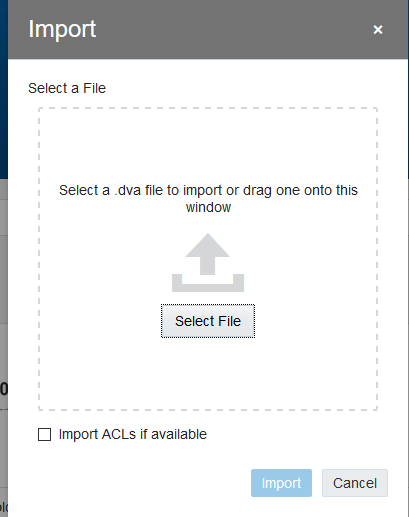
    <if type="external">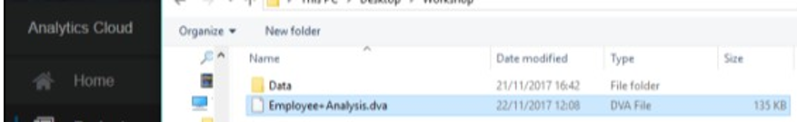</if>
    <if type="desktop">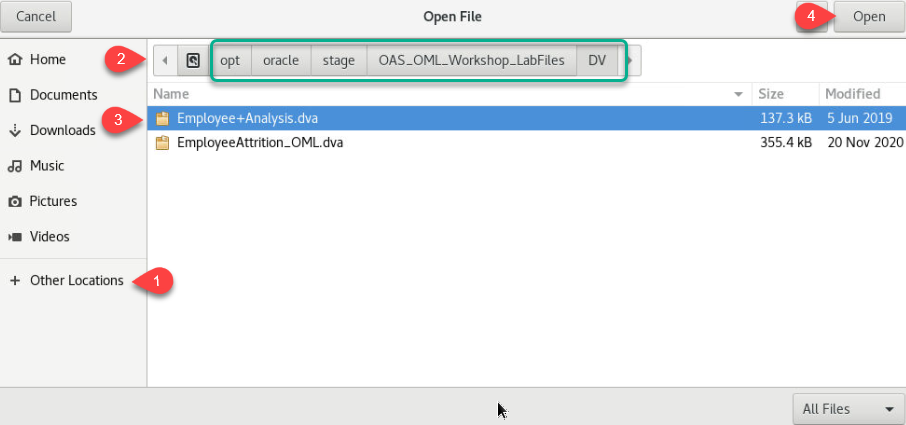</if>

14. Enter the password “**Admin123**”.
    

15. Find and open the project named Employee Analysis.

    Here we have an existing project for the 470 employees in our organization.

    We’re going to apply our new classification to this data set which we imported with this project.
    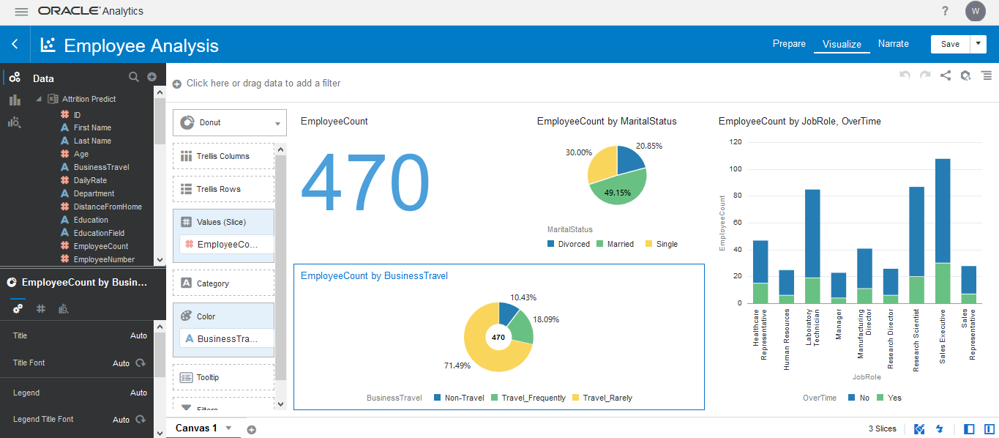

16. Go to the **Home** tab and create a new **Data Flow**.
    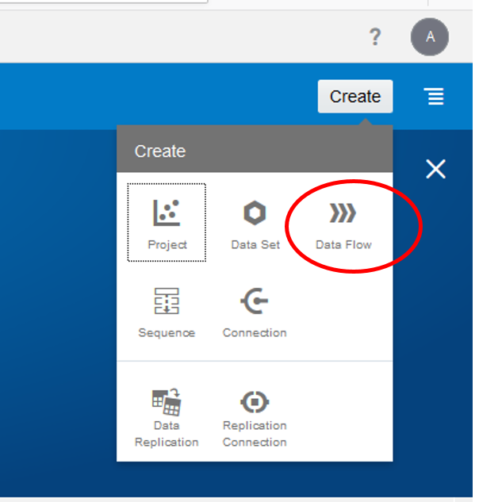

17. Select this new data set **Attrition Predict**.
    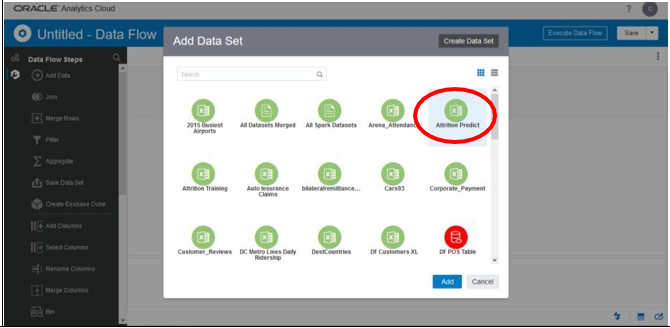

18. Click on **plus icon** to add a new node to the data flow.
    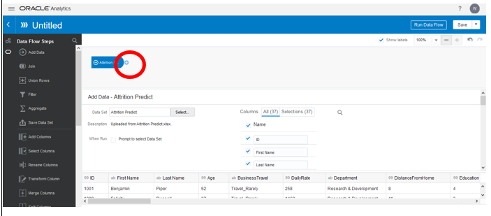

19. Select the **Apply Model** Node.
    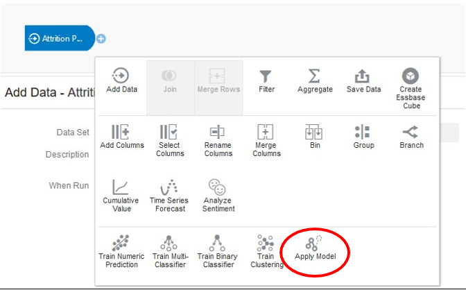

20. Select our Machine Learning Model **'attrition predict'**(from before)  and click OK.
    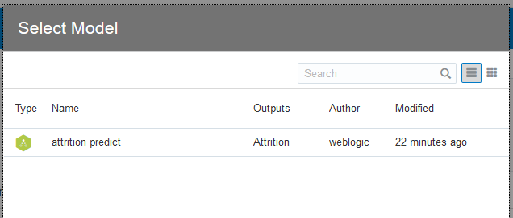

21. Our apply model node will have 3 sections.  

    - **Outputs** - this is a list of columns returned by the model in addition to the input columns.
    - **Parameters** - optional parameters that users can pass to apply the model.
    - **Inputs** - these are the input columns for the apply model.  

    The apply model will try to automatically map the input dataset column names to the column names in the model.
    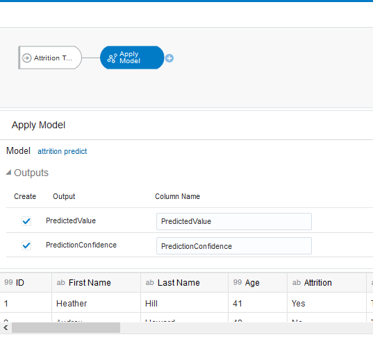

22.  Click on  the **plus icon (+)** and select the **Save Data** node.
    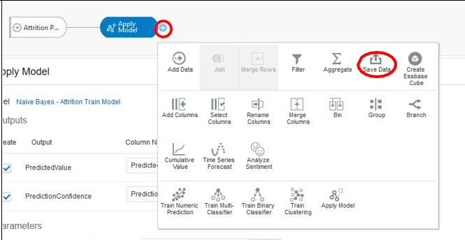

23. Give it the name **attrition Predicted Dat**.

    **Note:** we can run this data flow to an existing database if we like. For now, keep if as the default data set storage.
    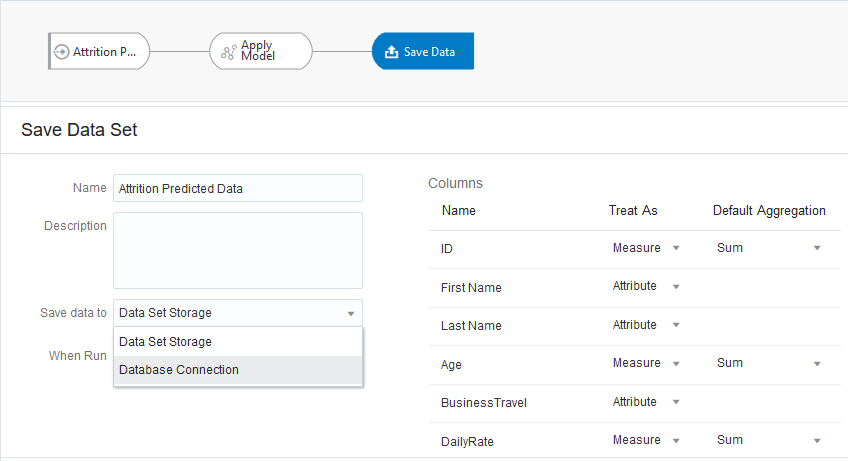

24. Save the data flow under the name **attrition Prediction**.
    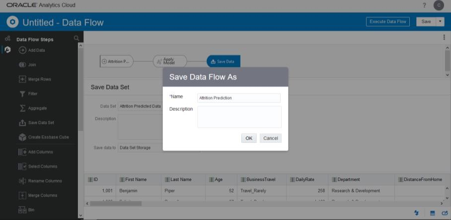

25. Once the data flow is saved **Run** the data flow.

    This will produce a new data set which appends the predicted values to our existing Attrition Apply data set.
    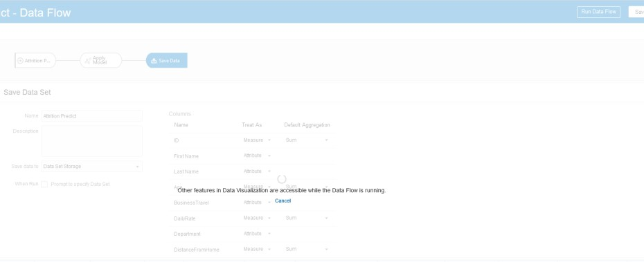

26. Go to the **Data** tab and select the new data set **Attrition Predicted Data**.
    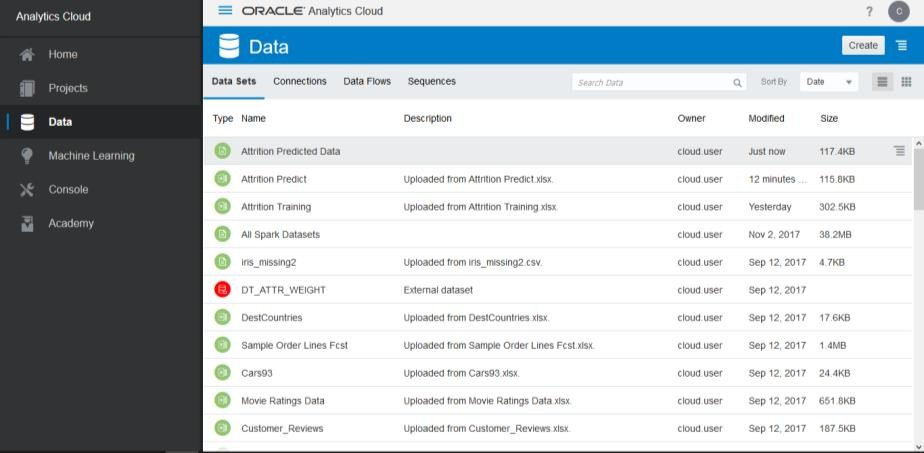

27. Some of the measures may be stored as attributes.

    As we did in previous exercises, ensure that the following columns are stored as **measures**:  

    * **PredictionConfidence**  
    * **EmployeeCount**
    * and that **Employee Number** is an **Attribute**.
    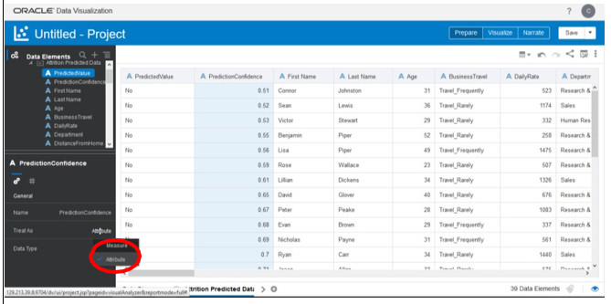

    If you made modifications, click on **Apply Script**.

28.  Create some visualizations like the example here.  

    * **Performance Tile for EmployeeCount**
    * **Pie chart of EmployeeCount by JobRole and Department**  
    * **Pivot Table of EmployeeNumber, First Name, Last Name, PredictionConfidence, PredictedValue**

    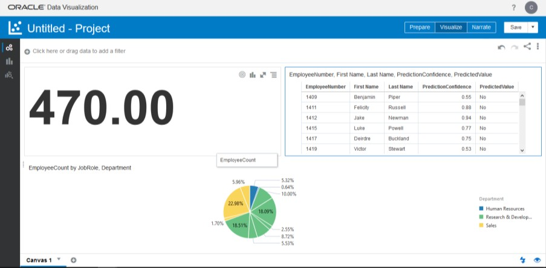

29.  Save the project as **Attrition Prediction**.
    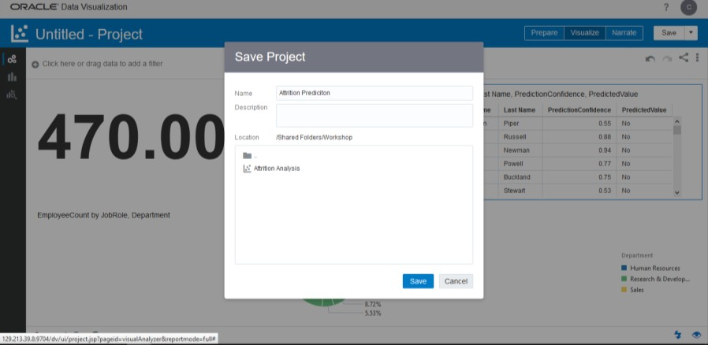

30. Now that we have a project exploring the likelihood of whether an employee is likely to leave or not it might be useful to create a link to the existing Employee Analysis project from before.

    Click on the **hamburger** at the top right select **Data Actions**.
    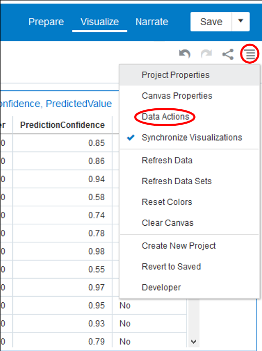

31. Select the **+** to create a new **Data Action**

     Give it the name **Existing Employees Analysis**.

     And select type as **Analytics Link**.
    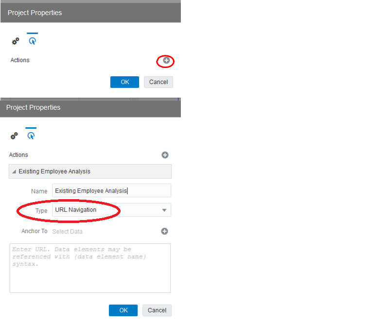

32. On the Target option, select **Select from Catalog**.
    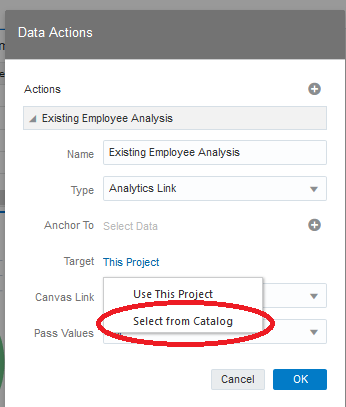

33. Select the **Employee Analysis** project then select OK
    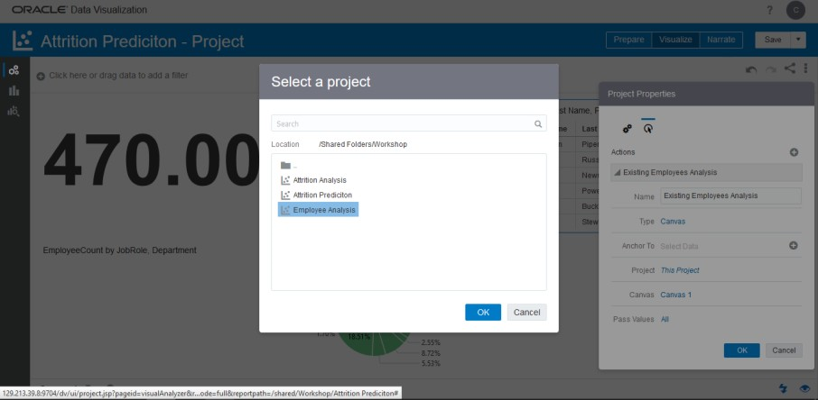

34. Now we can use the data action to navigate between projects.

    Select a person from the pivot table, right click and select the new action for **Existing Employees Analysis**.
    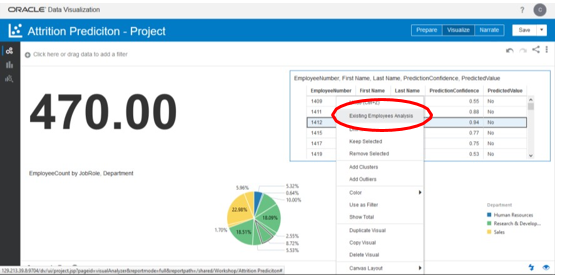

35. This will take you to the project for existing employees filtered for the employee you highlighted.
    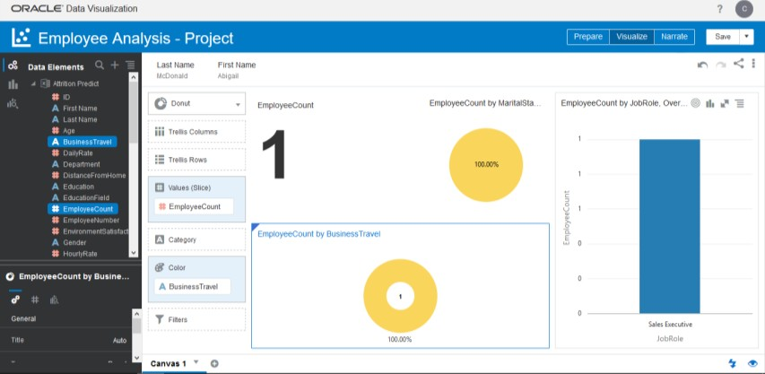

## Want to learn more
* [Oracle Analytics Server Documentation](https://docs.oracle.com/en/middleware/bi/analytics-server/index.html)
* [https://www.oracle.com/business-analytics/analytics-server.html](https://www.oracle.com/business-analytics/analytics-server.html)
* [https://www.oracle.com/business-analytics](https://www.oracle.com/business-analytics)

## Acknowledgements
* **Authors** - Diane Grace, Manager, Analytics Platform Specialist Team, NA Technology
* **Contributors** - John Miller, Jyotsana Rawat, Venkata Anumayam
* **Last Updated By/Date** - Rene Fontcha, LiveLabs Platform Lead, NA Technology, September 2021
