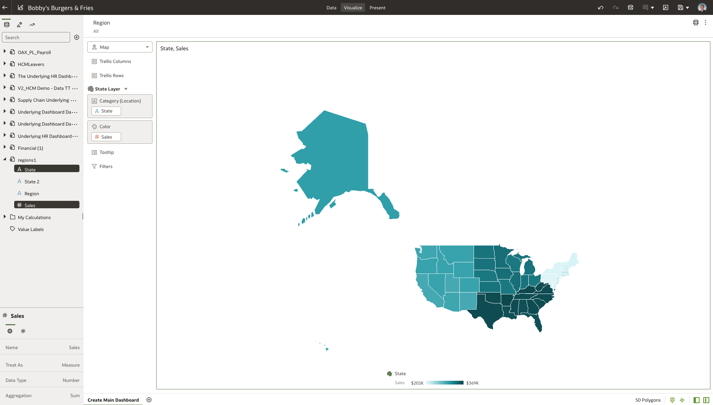

# Create the main dashboard

## Introduction

This exercise will introduce you to the key features of data visualization within Oracle Analytics Server and will help to tell a story on what is happening at **Bobby's Burgers & Fries**, a fictional quick serve restaurant with chains in multiple geographies.

Estimated Time: 20 minutes

### About Oracle Analytics Server

Oracle Analytics Server features powerful, intuitive data visualization capabilities that enable analysts to create self-service data visualizations on an accurate and consistent data set.

### Objectives

In this lab, you will explore best practice key performance indicators (KPIs) to drive actionable insights into Bobby's Burgers & Fries.

QSR chains are facing issues with customers and their changing preferences, managing multi-channel sales, operations and retaining top line staff while driving sales growth. Having the ability to do cross pillar data analysis with non-oracle data provides the ability to perform a deeper dive to identify root causes.

In this scenario we will monitor business performance through the creation of dashboards and canvases to quickly find insights:
* **Net Sales and On Time Delivery Percentage**
    - Net Sales in Northeast region performing lower than other geographies.
    - On Time Delivery performance lagging in Distribution Centers.
* Deeper insights through the analysis of dashboards with the ability to analyze:
    - **Sales Analysis**  – “Being out of fries could be hurting sales”
    - **OTD Analysis** – “The Pennsylvania Distribution Center appears to be driving the shortage of fries, hampering sales in the Northeast region.”
    - **Headcount Analysis** – “Long Wait Times is an indicator that there might be turnover that is affecting payroll costs and customer satisfaction.”
* Connected insights enables collaboration across functions enables you to share data insights.

### Prerequisites
This lab assumes you have:
* An Oracle account
* All previous labs successfully completed

  > **Note:** If you have a **Free Trial** account, when your Free Trial expires your account will be converted to an **Always Free** account. You will not be able to conduct Free Tier workshops unless the Always Free environment is available. **[Click here for the Free Tier FAQ page.](https://www.oracle.com/cloud/free/faq.html)**

The following files <if type="external">referenced in [Lab: Initialize Environment](?lab=initialize-environment) should already be downloaded and staged as instructed, as they</if> <if type="desktop"> staged under *`/opt/oracle/stage`*</if> are required to complete this lab.

Navigate to the documents directory on the left side of the dialogue box and open **Retail Live Labs Content** directory to find the files needed for the lab. The first file, **Bobby's Burgers & Fries.dva** will be used in the next step and the **bobbysburgerdataset.csv** and **bobbyscustomerdataset.csv** files will be referenced later in lab 7.

## Task 1: Data exploration
1. From the browser session you started in the  Initialize environment lab, **click** on the **Page Menu** icon located in the upper right-hand corner.
    

2. **Click** on **Import Workbook/Flow...** to upload the file we will be using.

3. **Choose** the **Select File** option and pick the .dva file you downloaded earlier.

4. **Click** Import. The dva will be imported to your OAS home page.

5. **Select** the **Bobby's Burgers & Fries** icon from under the **Workbooks** section.  

6. You will be presented with an empty canvas. Let’s start visualizing! First, **click** on the **Data Tab** at the top of the screen. Here is where we can see all of the data that Bobby's Burgers & Fries will be working with.
    
Oracle Analytics Server includes its own light weight data preparation capabilities. When you import the spreadsheet, you will navigate to the preparation tab before adding the data to the workbook.  Here you can make some modifications to the data elements or make modifications to your data based upon any recommendations Oracle Analytics knowledge service suggests.  Additionally, you can define a relationship between the subject areas in order to join the data sources for further analysis.

7. **Select** the **Data Diagram** tab from the bottom of the screen to visualize the relationship between the data sets. You can view all the relationships as well as navigate through the different data sets to get an understanding of what we will be working with.
    
8. Once satisfied with the above step, proceed back to the **Visualize** tab at the top of the screen. **Click** Visualize.


## Task 2: Discover insights
The data visualization capabilities in Oracle Analytics Server are extensive, include things like mapping and custom calculations. In this exercise we will use both capabilities: we will create custom calculations based on two available metrics, and we will then display the results on a map.

1. In this first exercise we will create our first visual. Let's view sales by location. Using the visualizations menu on the left side of the pane:
    - **Control select** and choose **'State'** and **'Sales'** in the **"region1"** dataset.
    - **Right click**, select **'Pick Visualization'**.

    

2. **Select** the **'Map'** option.

    

3. Observe the map on the canvas. You can see the sales by region across the US.

    

    Right away we can see that the north east region sales is severely behind the rest of the country. We will dig deeper and find out why that is in the next lab. For now let's continue to build out our main dashboard.

4. Next we want to create individual 'cards' for the different KPIs we are going to be measuring. **Click** and **drag** the **'Sales'** measure from the **"regions1"** dataset above the map visual you just created. A dark blue line appears.  It identifies the location of your visualization. You may drop the visualization to the left, right, top or bottom. In our case we will **drop the visual on top** of the one we just created.

    
    

5. Now we are going to format our value using the properties box (in the bottom left of the screen). **Select** the **'Values'(#)** tab and we are going to change from **auto** to **currency** as well as **turn on abbreviate** by selecting it.

  
  

6. Now we are going to create our second card. **Open** the **Supply Chain Underlying Dashboard Data** and
    - **Control select** and choose **'On Time Delivery'** and **'Channel'**.
    - **Right click**, select **'Pick Visualization'**

    

7. **Select** the **'Stacked Bar'** visual.

    

    Here we are gaining an understanding of our on time delivery percentage by channel. Notice our Direct Channel is more than 10% worse than our Supplier and Distributor's on time delivery percentage.

8. **Click** and **drag** the **'Channel'** attribute from the **"Supply Chain Underlying Dashboard Data"** dataset into our filter.

    

9. **Select** the **Direct Channel**, **Distributor**, and **Supplier** columns so your filer matches the one image below. **Click into** the On Time Delivery by Channel visualization to save and close the filter box.

    

10. To create our 'card', **click** and drag the **'On Time Delivery'** measure from the **"Supply Chain Underlying Dashboard Data"** dataset so that the blue bar appears **above** the new visual.


    
    

      >**Note:** Sometimes the tool can be touchy. I find dragging and dropping the visual into a different location first, and then dragging into smaller areas, lets you move things more freely.

      Select **'Save'** in the top right of the screen to save and update your workbook.

11. In this exercise we will create custom calculations and two more custom visuals to create our HR analysis cards in order analyze salary and the relationship to company headcount.

12. **Right Click** on the **"My Calculations"** dataset.  **Select** 'Add Calculation'.

    

13. Now we will **create a new metric** called **"Previous Year - Salary & Wage"**. Notice there are a wide range of functions available for creating custom calculations using the expression builder. **We are going to use the code snippet below**, click the copy button and paste it into the calculation box on OAS. Feel free explore the expression builder and create more calculations.

    ```
    <copy>
    (FILTER(XSA('biworkshopuser'.'Financial (1)')."Columns"."Previous Year - Operating Expenses" USING XSA('biworkshopuser'.'Financial (1)')."Columns"."Account Group"='Salary & Wage'))
    </copy>

    ```

    
    >**Note:** The arguments in our calculation appear as full path names but are shortened when added into the calculation box of OAS. If confused use the picture below to make sure your custom calculation matches.

14. **Click** **Validate** and click **Save**.

    

    You have successfully created your own custom calculation that can be used like any other metric.

15. Let’s utilize our custom calculation in a couple of visualizations. Locate the **"My Calculations"** folder and the **"OAX PL Payroll'** dataset on the left side of the workbook.
    - **Control select** the calculation **'Previous Year - Salary & Wage'** from "My Calculation" and **'Quarter'** from the "OAX PL Payroll" dataset
    - **Right click**, select **"Create Best Visualization"**

    

16. Next, **Click** and **drag** the **'Previous Year - Salary & Wage'** calculation **above** new visual.

    

17. Within the properties box (in the bottom left of the screen)  **Select** the **'Values'(#)** tab and we are going to change from **auto** to **currency** as well as **turn on abbreviate** by selecting it.

    
    

18. For our last card we are going to analyze Headcount by Quarter to compare with our Salary & Wage by Quarter analysis.
    - **Control select** the **'Date'** and **'Headcount'** measures from the **"Underlying HR Dashboard copy"** dataset
    - **Right click**, select **'Pick Visual'** and select **'Line'**

    
    

19. Now we want to filter by **'Date'** on the "Underlying HR Dashboard copy" dataset. We want to analyze the same quarter we used in the Salary & Wage by Quarter card. **Drag** and **drop** **'Date'** into the filter. **Select** **2019Q1, 2019Q2, 2019Q4, and 2020Q1**. Notice the drop in the number of employees between 2019Q4 and 2020Q1. We will dig into this in the proceeding labs.
    
    Notice the drop in the number of employees between 2019Q4 and 2020Q1. We will dig into this in the proceeding labs.

20. Now, **Drag** and **drop** the visual we just created **next to the 'Previous Year - Salary & Wage by Quarter'** visual.

    

21. To finish the 'Headcount by Date' card. **Drag** and **drop** the **'Headcount'** measure  from the **"Underlying HR Dashboard copy"** dataset **above the visual** we just created. Select **'Save'** to save and update your workbook.

    
    

You have now finished the Main Dashboard creation. Next we will take a closer look at our sales. You may now **proceed to the next Lab.**

## Learn More
* [Oracle Analytics Server Documentation](https://docs.oracle.com/en/middleware/bi/analytics-server/index.html)
* [https://www.oracle.com/business-analytics/analytics-server.html](https://www.oracle.com/business-analytics/analytics-server.html)
* [https://www.oracle.com/business-analytics](https://www.oracle.com/business-analytics)

## Acknowledgements
* **Authors** - Killian Lynch, Nagwang Gyamtso, Luke Wheless, Akash Dharamshi, Solution Engineer Specialist Hub Team, NA Technology
* **Contributors** - Killian Lynch, Solution Engineer Specialist Hub Team, NA Technology
* **Last Updated By/Date** - Killian Lynch, February 2022
