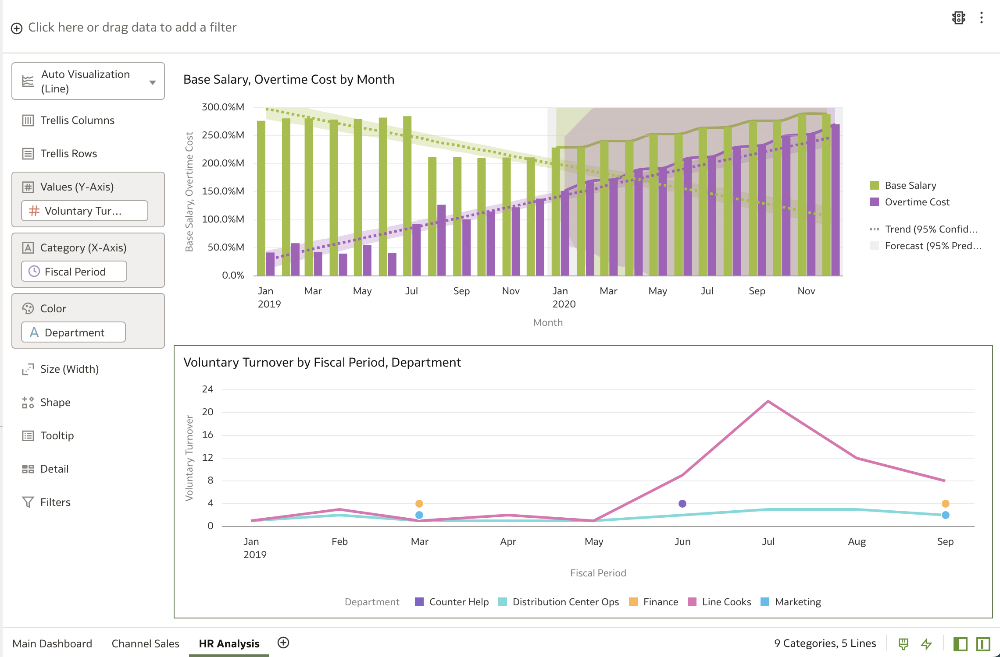

# HR payroll and attrition analysis

## Introduction

In this lab, we will analyze payroll and attrition to help us understand why there's a decrease in headcount while payroll costs us increasing. We will use Oracle Analytic Server's built in advanced analytic capabilities to create trend lines and forecasts into payroll costs and attrition to help our retail executives make informed decisions. We will also explore employee surveys to help us understand reasons for turnover.

Estimated Time: 20 minutes

### Objectives

In this lab, you will:
* Explore Oracle Analytics Server's advanced analytic capabilities and create a forecast of base salary vs. overtime
* Analyze turnover by department and create trend lines
* Create a word cloud to understand reasons for attrition
* Create a scatter plot to understand the distribution of employees by age, salary, and department

### Prerequisites

This lab assumes you have:
* All previous labs successfully completed

## Task 1: Create Payroll Forecast

<!-- Images -->
In this exercise, we are going to create a 12 month forecast using OAS's built in ML capabilities to help us predict where our payroll trends are heading.

1. **Create** a new canvas like we did at the start of last lab and **rename** it "HR Analysis"

    
    

2. From the **"OAX PL Payroll"** dataset, **Control select** and choose **'Base Salary'** and **'Overtime Cost'**.

   **Right click** and select **'Pick Visualization'** and **select the Bar chart.**

    

3. From the grammar pane, **drag** the **'Overtime Cost'** attribute and place it in the Values box under **'Base Salary'.**

    
    

4. Now lets **select**  the **'Month'** attribute and **drag** it in the **Category** section.

    

5. You have now just created a bar chart that compares Base Salary and Overtime Costs by Month. Let's apply quick and easy advanced analytics to this visual to help us understand the trend and forecast of this cost comparison.

6. **Right click** the visual and **select** the **'Add Statistics'** attribute and then **select** the **'Trendline'** option.
  

7.  **Right click** the visual and **select** the **'Add Statistics'** option and then **select** the **'Forecast'** option. This will create a forecast into the next 3 periods (months) by default.

  

8. We are more interested in seeing the forecast for the next 12 months so lets **click** the analytics tab in the Data Pane and **change** the **'Periods'** to **'12'**.

  

  Immediately you're presented with an updated visualization and results show that over a period of 12 months if this trend continues, payroll costs will continue to increase exponentially and will put major pressure on margins.

## Task 2: Compare Voluntary Turnover by Department

1. Lets now create a line graph of Voluntary Turnover by Fiscal Period and Department to help us understand the changes in turnover. **Control select** and choose **'Voluntary Turnover'**, **'Department'**, and **'Fiscal Period'** from the **"HCMLeavers"** data set and **drag** it into the canvas under the bar graph we just created.
    
    Your canvas should now look like this:
    

2. **Right click** and add a **trend line** like we did earlier.

  
  

  The resulting trend line shows us that Voluntary Turnover is steadily increasing overall but there was a spike in July for Line Cooks just as there was a spike in Overtime Cost in July.

## Task 3: Create a Tag Cloud to Understand Reasons for Turnover

1. Let's now use customer survey responses for Voluntary Turnover and build a Tag Cloud to help us understand reasons for why employees are leaving. **Control select** and choose **'Reason'** and **'Voluntary Turnover'** from **"HCMLeavers"**.

  **Right click** and select **'Pick Visualization'** and **select** the **Tag Cloud**.

  

2. Now **select** the **'Voluntary Turnover'** attribute from **"HCMLeavers"** and **drag** it into the **Color** section.
  

3. Let's shift our visualizations around for a better layout. **Hover** over the title of the **Tag Cloud** until you see the four corner arrows.

  Then, **click and drag** the **Tag Cloud** to the right of the Salary vs. Overtime cost bar chart.

  
  

  The result should look like this:

  

  Based on the Tag Cloud, we see that the top three reasons for voluntary attrition was because our employees want higher pay rates, better opportunities, and a better work-life balance.

## Task 4: Create a Scatter Plot to Understand Age and Salary Distribution

1. Now let's create the final visualization which is a scatter plot to help us understand the relationship between the age and salaries of our employees by department.

  **Control select** the **'Department'**, **'Employee ID'**, **'Age'** and **'Salary'** from **"HCMLeavers"**.

  Then, **drag and drop** the selected columns to the right of the Tag Cloud we just created.

  
  The result should look like this:

  

2. In the grammar pane, **switch** the **'Department'** and **'Employee ID'** so that **'Department'** is in the **Color** section and **'Employee ID'** is in the **Category** section.

  

3. **Navigate** to the **Data Pane** on the bottom left of your screen and **click** on the **Axis** tab. **Find** the **'Start'** option and **change** it to **'Min Data'**.

  

4. **Move** the legend to the right for better positioning by **clicking** on the **General tab** and **changing** the **'Legend'** option to **'Right'**.

  
  Your canvas should now look like this:

  

5. Let's improve the position of the visualizations so that our charts are easier to read. **Drag** the **Tag Cloud** on top of the **Scatter Plot** and **drop** it once a solid blue line appears above the Tag Cloud.
  

6. **Save** your analysis. Our final canvas should now look like this:
  

  Based on our analysis and prediction of Base Salary vs. Overtime Cost we learned that if this trend continues, it will put pressures on our margins. We also learned that a spike in turnover within our line cooks resulted in the spike in overtime costs in July. From the tag cloud, we discovered the top 3 reasons for why our employees are voluntarily leaving and finally we were able to understand the relationship between the age and salary of our employees within each department.

  Our executives now need to put together a strategy to retain existing employees and fill the open positions as soon as possible. By doing so, payroll costs will be normalized, headcount will be restored, and her customers won't experience long wait times anymore.

You have now finished the HR Analysis dashboard creation. Next we will take a closer look at our On Time Delivery. You may now **proceed to the next Lab.**

## Learn More

* [Oracle Analytics Server Documentation](https://docs.oracle.com/en/middleware/bi/analytics-server/index.html)
* [Become a Business Analytics Expert Certification](https://mylearn.oracle.com/learning-path/become-a-business-analytics-expert/35644/91371)

## Acknowledgements
* **Authors** - Killian Lynch, Nagwang Gyamtso, Luke Wheless, Akash Dharamshi, Solution Engineer Specialist Hub Team, NA Technology
* **Contributors** -  Nagwang Gyamtso, Solution Engineer Specialist Hub Team, Na Technology
* **Last Updated By/Date** - Nagwang Gyamtso, March 2022
