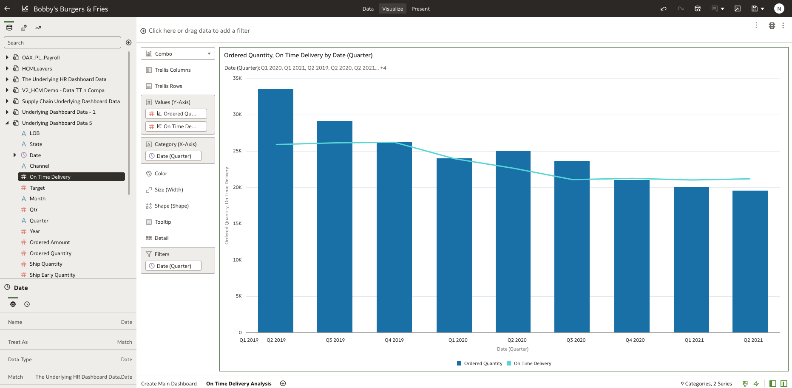
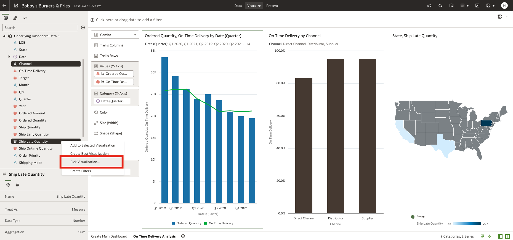
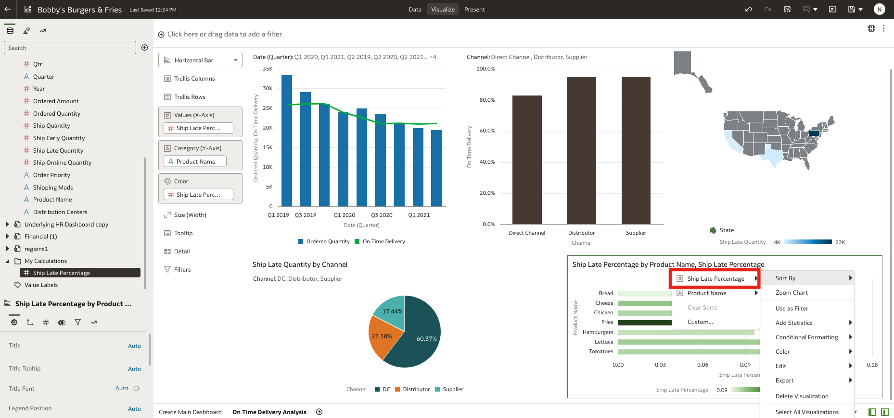
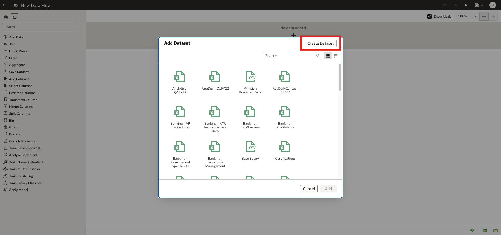
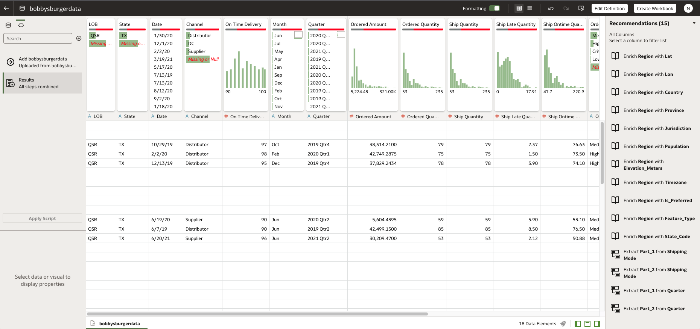

#Predict On Time Delivery

## Introduction

This lab walks you through the steps to understand on-time delivery analysis through visualizations that blend data from distribution centers, logistics and shipping.

Estimated Time: 1 hour

### Objectives

In this lab, we will be taking a deeper look into On-Time Delivery by channel to understand why some channels have lower on-time delivery rates than the other.

We will be utilizing Oracle Analytics Server's ability to pull cross-functional data together from different lines business and report on it in a single place.

This lab will also utilize Oracle Analytic Server's machine learning capabilities to predict future delivery rates.

In this lab, you will:

* View Dashboard and Analyze On-Time Delivery KPIs
* Utilize One-Click Explain to view Computer Generated Insights
* Create a Combination Bar and Line Chart
* Create a Bar Chart to view On Time Delivery by Channel
* Create a Visual Map Layer to view States with the highest Ship Late Quantities
* Create Pie Chart to view Late Shipment Distributions by Channel
* Create a Horizontal Bar chart to view Ship Late Percentage by Product Name
* Create a Pivot Table to view Ship Late Percentage by Channel Product Name
* Build a Machine Learning Model to Predict On-Time Delivery

### Prerequisites

This lab assumes you have:

* An Oracle account
* All previous labs successfully completed
* Access to a data visualization instance

## Task 1: Utilizing One-Click Explain

Let’s drill into on-time delivery performance from the various nodes across our distribution network, perhaps we can uncover some insight on why some of our distribution channels are low.

  1. **Navigate back to the main dashboard** and locate the KPI card that displays **'On-Time Delivery by Channel.'**

  

  We can see that Direct Channel is the lowest, and is performing below the other distribution channels on Time Delivery. Let's create a self-service visualization canvas to look deeper into on-time delivery to understand why this may be occuring.

  In this task, we will be demonstrating how to utilize **Oracle One Click Explain**. With One-Click Explain, data analysts can quickly leverage ML scripts to profile selected data elements and illustrate basic key insights and relationships.

  2. **Select** the plus symbol to open an empty canvas so we can build out our visualizations.

  

  3. **Rename** the canvas by tapping the arrow, and hitting 'rename.' Rename the canvas to **'On Time Delivery Analysis.'**

  

  Now that we have an empty canvas, we can begin to get a better understanding of On-time delivery statistics. Now is a great time to activate One-Click explain to get a snapshot of On-Time Delivery.

  4. **Navigate** to the visualizations menu and select **"Supply Chain Underlying Dashboard Data"**

  

  5. **Right Click** the variable **'On Time Delivery'** and select **'Explain On Time Delivery.'**

  

  6. Oracle Machine Learning will now traverse all of the relevant relationships and display **Basic Facts**, **Anomalies**, and not pictured here, **Segments**, and **Key Drivers**.

  

  

  These insights are machine generated in real time. Here we can see which states, dates, months, shipping modes, and product names often result in on-time (or late) deliveries and can begin investigating.

  You can also select the visualization, then click 'add selected' and immediately begin to use Data Visualizations workbook editor to customize to drill further.

  

  Now that we've taken a high level view of On-Time delivery as a starting point, let's start creating some of our own visuals to get a deeper look at what is affecting on-time delivery.

## Task 2: Create a Combination Bar and Line Chart
Now we can start building our self-service visualization canvas that breaks down on-time delivery statistics.

  1. View the empty canvas named **'On Time Delivery Analysis.'** Let's begin creating our first visual.

  

  2. **Navigate** to the visualizations menu on the left side of the screen and expand the files named **"Supply Chain Underlying Dashboard Data"** and **"Underlying Dashboard Data 5."**

  

  3. Under **"Supply Chain Underlying Dashboard Data"** click and drag **Ordered Quantity** to the canvas.  

  

  4. **Click to View Visualization Types** and select **'combo.'**

  

  5. Now expand 'date' under **"Supply Chain Underlying Dashboard Data."** **Click and drag** the variable **'Quarter'** to the **X-Axis.**

  

  6. Now **Click and drag** the variable **'Quarter'** to the **Filters** tab. Filter to display all quarters except for '<NULL>', 'Q1 2019', and '2021 Q3.' This will remove the quarters that are not as important to us.

  

  7. **Navigate** to the file named **"Underlying Dashboard Data 5"** and click and drag **'On-Time Delivery'** into the **Y-Axis.**

  

  8. **Format** the visual by right clicking on **'Ordered Quantity'** and selecting **bar** and right clicking on **'On Time Delivery'** and selecting **Line**

  

  You should now have a combination bar and line chart that represents order quantities compared to on-time delivery rate.

  

  9. Now, let's change the color assignments for this visual. **Right click** on the visual on canvas, and hover over **'color'** and select **'manage assignments.'**

  

  10. **Scroll down** to find **'On Time Delivery'** variable.

  

  11. **Change the color** assignment of 'On Time Delivery' to **green**.

  

  You have now successfully created a combination bar and line graph to compare order quantity and on time delivery quantity by quarter.

  

  Here we see the green on-time delivery by quarter line has been trending downwards.

## Task 3: Create a Bar Chart to view On-Time Delivery by Channel

  Now, let's create a bar chart to view On time delivery quantity by channel.

  1. **Navigate** to **"Supply Chain Underlying Dashboard Data"**. Hold control (for Windows users) or command (for Mac users) and select **'On Time Delivery'** and **'Channel'**. Then right click the highlighted variables and select **'Pick Visualization.'**

  

  2. **Select** the option **'Bar Chart'** from the visualization types.

  

  

  3. **Navigate** to **"Supply Chain Underlying Dashboard Data"** and drag **'Channel'** into **'Filters'** on the bottom of the visualization tool pane.

  

  4. Select **'DC'**, **'Distributor'**, and **'Supplier'** as the only channels to display on this bar chart. (DC stands for 'Direct Channel')

  

  You have now successfully created a bar chart to visualize On-Time Delivery by Channel.

  

## Task 4: Create a Visual Map Layer to View Late Shipment Areas

  Now, let's create a Visual Map Layer to view Ship Late Quantity by State.

  1. **Navigate** to **"Supply Chain Underlying Dashboard Data."** Hold control (for Windows users) or command (for Mac users) and select **'State'** and **'Ship Late Quantity.'** Then right click the highlighted variables and select **'Pick Visualization.'**

  

  2. **Select 'Map'** from the visualization types.

  

  

  3. **Click and drag** the visualization to the **right** of the On-Time Delivery Bar Chart.

  

  

  We can see the PENNSYLVANIA Distribution Center has the highest late delivery percentage—accounting for 70% of all the late deliveries.

  You have now successfully created a map layer to visualize ship late quantities by state.

## Task 5: Create a Pie Chart to View Late Shipment Distributions

  Now, let's create a Pie Chart to view late shipment distributions by delivery channel.

  1. **Navigate** to **"Underlying Dashboard Data 5."** Hold control (for Windows users) or command (for Mac users) and select **'Channel'** and **'Ship Late Quantity.'** Then right click the highlighted variables and select **'Pick Visualization.'**

  

  2. **Select 'Pie'** from the visualization types.

  

  

  3. Now let's filter out our unwanted values. **Click and drag** the **'Channel'** variable to the **filter** section. Select all the channels except for NULL.

  

  

  You have now successfully created a pie chart to visualize ship late quantities by channel.

## Task 6: Create a Horizontal Bar Chart to View Ship Late Percentage

  Now, let's create a Horizontal Bar Chart to look at which products have the greatest Ship Late Percentage.

  Let's first create a custom calculation to represent 'Ship Late Percentage'

  1. **Scroll Down** to the bottom of the visualizations menu and locate the **'My Calculations'** folder. **Right Click** that folder and select **'Add Calculation'**

  

  2. **Rename** the calculation to **'Ship Late Percentage'**

  

  3. In the large text field below the name, begin typing **'Ship Late Quantity'** and select the variable that is located in **"Supply Chain Underlying Dashboard Data."**

  

  4. Now, add the division opperand '/'. In the field, begin typing **'Ordered Quantity'** and select the variable that is located in **"Supply Chain Underlying Dashboard Data".** Here we are Dividing Ship Late Quantity by Order Quantity.

  

  5. **Click 'Validate'** to run the script and check for errors. Then **Press Save** to exit.

  

  6. **Navigate** to **'My Calculations.'** Hold control (for Windows users) or command (for Mac users) and select **'Ship Late Percentage'** and **'Product Name'** from **"Underlying Dashboard Data 5."** Then right click the highlighted variables and select **'Pick Visualization.'**

  

  7. **Select 'Horizontal Bar'** from the visualization types.

  

  

  8. Now, **drag 'Ship Late Percentage'** into the **'color' pane** to adjust the color based on Ship Late Percentage.

  

  9. Now, let's sort the graph based on highest ship late Percentage. **Right Click** the horizontal bar graph, hover over **'Sort by,'** and then hover over **'Ship Late Percentage'**.

  

  10. Then click from **'High to Low'** to complete the sort.

  

  

  We can clearly see from the horizontal bar graph that Fries have the largest ship late percentage.

  You have now successfully created a horizontal bar chart to visualize ship late percentage by product.

## Task 7: Create a Pivot Table to View Ship Late Percentage by Channel & Product Name

  Now, let's create a Pivot Table to view ship late percentage by delivery channel as well as product.

  1. **Navigate** to **'My Calculations.'** Hold control (for Windows users) or command (for Mac users) and select **'Ship Late Percentage'** and **'Product Name'** + **'Channel'** from **"Underlying Dashboard Data 5."** Then right click the highlighted variables and select **'Pick Visualization.'**

  

  2. **Select 'Pivot'** from the visualization types.

  

  

  3. **Drag 'product name'** to the **'rows'** section in the grammar panel so we can view ship late percentage by product for each distribution center.

  

  4. **Drag 'Ship Late Percentage'** to **'color'** section to view ship late percentage by color.

  

  5. Now **tap the down arrow** on the **'Ship Late Percentage'** column to **sort from highest to lowest** ship late percentage.

  

  

  You have now successfully created a pivot table to visualize ship late quantities by product and channel.

  We can see fries have the highest rate of late shipments; this is not a good sign given that we know potato french fries are one of the most popular items on the menu. We need to meet with Pennsylvania, the direct channel seeing the most late shipments, to work out an improvement strategy regarding fry shipments. Let’s navigate back to the main dashboard to continue our analysis.”

## Task 8: Build a Machine Learning Model to Predict On-Time Delivery

  Now that we have completed our drill downs, let's build a machine learning model to better predict on time delivery percentage.

  Oracle Analytics built in predictive models use several embedded machine learning algorithms to mine your datasets, predict a target value, or identify classes of records. Use the data flow editor to create, train, and apply predictive models to your data. You can also register and use Oracle machine learning models from Oracle Database or Oracle Autonomous Data Warehouse to score data in Oracle Analytics.

  Data flows enable you to organize and integrate your data to produce curated datasets that your users can visualize. To build a data flow, you add steps. Each step performs a specific function, for example, add data, join tables, merge columns, transform data, apply model, save your data.

  Let's use the data flow editor to configure a predictive machine learning model.

  1. Download the dataset **"bobbysburgerdataset.csv"** - This dataset contains the historical data that OAS can use to create a machine learning model with.

  2. **Navigate** to the Oracle Analytics Server home page.

  

  3. **Tap the menu** item in the top right corner, then press **Create Data Flow**

  

  4. **Upload the dataset** named **"bobbysburgerdataset.csv"** into the Data Flow Editor.

  

  

  

  

  5. Return to the previous screen and select the dataset named **"bobbysburgerdataset.csv."**

  

  6. **Unselect** variables **'Date'** and **'Year.'**

  

  

  7. **Click the plus icon** and select the option **'Train Numeric Prediction'**

  

  8. Select **'Linear Regression for model training'** then press 'okay'

  

  9. Choose the **Target column** to be **'On Time Delivery'**

  

  

  10. Save the model as **'Bobbys Burgers LRM ML Model'** and press the **play button** in the top right corner. Name the DataFlow **'Bobbys Burgers LRM ML Model DF'**

  

  

  

  11. Navigate back to the Oracle Analytics Server home page. Tap the menu in the top left corner, and tap **'Machine Learning.'**

  

  12. Hover over the model named **'Bobbys Burgers LRM ML Model'** right click and tap **inspect.**

  

  

  13. Here we can view the **quality, details, and outputs** of our machine learning model. Navigate and **click on quality.** We see that the Coefficient of Determination or R^2 is 66% showing us this model has a good fit.

  

  

  Now, let's apply the model we just built.

  14. Download the dataset **"bobbyscustomerdataset.csv"**

  15. **Navigate** to the Oracle Analytics Server home page.

  

  16. **Tap the menu** item in the top right corner, then press **Create Data Flow**

  

  17. Upload the dataset **"bobbyscustomerdataset.csv"** into the DataFlow

  

  

  

  

  18. Return to the previous screen and select the dataset named **"bobbyscustomerdataset.csv."**

  

  19. Tap the **Plus Icon** and select **'Apply Model'**

  

  

  20. Select the model **'Bobbys Burgers LRM ML Model'**

  

  21. Rename the PredictedValue to **'Predicted On Time Delivery'**. Scroll down and tap **'Select a column'** and then tap **'QTR'** to make the necessary mapping.

  

  

  22. Tap the **plus icon** and select **'Save Data'**

  

  23. Scroll down and change the default aggregation of 'Predicted On Time Delivery' to **Average.**

  

  24. Save the outputted dataset as **'bobbysburgersMLoutputdata'** and press **'play'** to run the Data Flow. Save the Data Flow as **'bobbysburgersMLoutputDF.'**

  

  25. **Navigate Back to Home** and select the menu icon in the top left, and Select **'data.'**

  

  26. Locate the saved dataset **'bobbysburgerMLoutputdata'** and right click select **'Create Workbook'.**

  

  

  27. Hold control (for Windows users) or command (for Mac users) and select **'Predicted On Time Delivery'**, **'Channel'**, **'Product Name'**, **'State'** and select the **'bar'** visualization. Add **'State'** to Trellis Rows, **'Predicted On Time Delivery'** to **Y Values**, **'Channel'** to **X Axis**, and **'Product Name'** to **color**. This will display the predictions for On Time Delivery from our model.

  

  

  

  28. Now let's filter out our unwanted values. **Click and drag** the **'Channel'** variable to the **filter** section. Select all the channels except for NULL.

  

  

  29. Now let's truncate some values so we can clearly see the differences by product. **Click** the visual and tap the **'Grid Line' icon** on the bottom left menu.

  

  30. Expand the **'Value Axis'** and scroll down to **'Start'**. Select **custom** and set this value to 30 then press enter. This only shows us values that are greater or equal to 30.

  

  31. Now let's sort our view. **Right Click** on 'Predicted On Time Delivery' and hover over 'Sort By'. Then select **Low to High** to view products with the lowest on time delivery percentages first.

  

  

  

  Here we can see a distribution of the distribution centers, states, and products and which are predicted to have the lowest ontime delivery percentages. This is useful if management wants to catch products that have lower on-time ship quantities resulting in more late shipments.

  We have now successfully created a machine learning model and applied it's results to our workbook.

  **This concludes the lab**

## Learn More

* [Read More About Oracle Analytics Predictive Models and Oracle Machine Learning Models](https://docs.oracle.com/en/middleware/bi/analytics-server/user-oas/use-oracle-analytics-predictive-models-and-oracle-machine-learning-models.html)

## Acknowledgements
* **Authors** - Killian Lynch, Nagwang Gyamtso, Luke Wheless, Akash Dharamshi, Solution Engineer Specialist Hub Team, NA Technology
* **Contributors** -  Akash Dharamshi, Solution Engineer Specialist Hub Team, NA Technology
* **Last Updated By/Date** - Akash Dharamshi, March 2022
