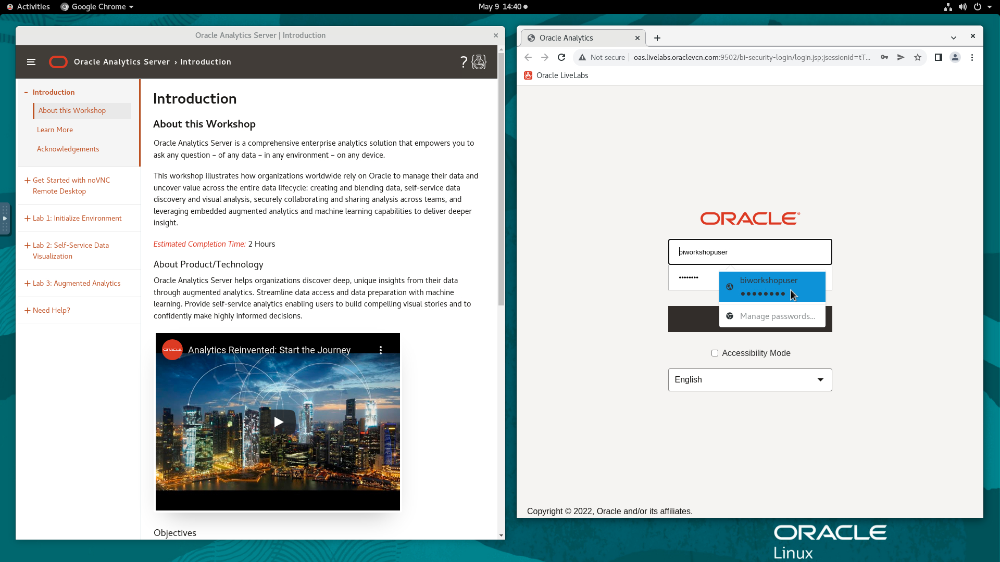
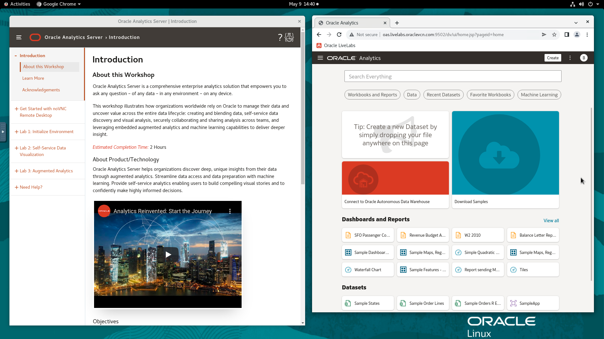

# Initialize Environment

## Introduction
This lab provides detailed instructions of connecting to Oracle Analytics Server (OAS). This compute instance comes with OAS installed and configured with Oracle database, both managed using Unix/Linux *systemd* services to automatically start and shutdown as required.

*Estimated Completion time:* 10 Minutes

### Objectives
- Validate that the environment has been initialized and is ready
<if type="external">- Download and stage workshop artifacts (*Only needed if not using the remote desktop*)</if>

### Prerequisites
This lab assumes you have:
- A Free Tier, Paid or LiveLabs Oracle Cloud account
- You have completed:
    - Lab: Prepare Setup (*Free-tier* and *Paid Tenants* only)
    - Lab: Environment Setup

## Task 1: Login to Oracle Analytics Server UI
This lab has been designed to be executed end-to-end with any modern browser on your laptop or workstation. Proceed as detailed below to login.

1. Now with access to your remote desktop session, proceed as indicated below to validate your environment before you start executing the subsequent labs. The following Processes should be up and running:

    - Database Listener
        - LISTENER
    - Database Server instance
        - PDB1
    - Oracle Analytics Server (OAS)

2. On the *Web Browser* window on the right preloaded with *OAS Web Console*, click on the *Username* field and select the saved credentials to login. These credentials have been saved within *Web Browser* and are provided below for reference

    - Username

    ```
    <copy>biworkshopuser</copy>
    ```

    - Password

    ```
    <copy>Admin123</copy>
    ```

    

3. Confirm successful login. Please note that it takes about 5 minutes after instance provisioning for all processes to fully start.

    

    If successful, the page above is displayed and as a result your environment is now ready.  

    <if type="external">
    **Notes:** If for any reasons you prefer to bypass the remote desktop and access the OAS UI directly from your local computer/workstation, launch your browser to the following URL

    ```
    URL: <copy>http://[your instance public-ip address]:9502/dv/ui</copy>
    e.g: http://xxx.xxx.xxx.xxx:9502/dv/ui
    ```
    </if>

4. If you are still unable to login or the login page is not functioning after reloading the application URL, open a terminal session and proceed as indicated below to validate the services.

    - Database and Listener

    ```
    <copy>
    sudo systemctl status oracle-database
    </copy>
    ```

    

    - Oracle Analytics Server (OAS)

    ```
    <copy>
    /opt/oracle/product/Middleware/Oracle_Home/user_projects/domains/bi/bitools/bin/status.sh
    </copy>
    ```

    

5. If you see questionable output(s), failure or down component(s), restart the corresponding service(s) accordingly

    - Database and Listener

    ```
    <copy>
    sudo sudo systemctl restart oracle-database
    </copy>
    ```

    - Oracle Analytics Server (OAS)

    ```
    <copy>
    sudo sudo systemctl restart oas
    </copy>
    ```
<if type="external">

## Task 2: Download and Stage Workshop Artifacts (*not needed if using the remote desktop*)
In order to run this workshop, you will need a set of files that have been conveniently packaged and stage on the instance for you. If you are bypassing the remote desktop and  connecting directly to OAS UI from your local computer/workstation, proceed as indicated below.

1. Download and save to a staging area on your laptop or workstation.
    - [`OAS_LiveLabs_Content.zip`](https://objectstorage.us-ashburn-1.oraclecloud.com/p/xbVJyW3I6DNh8WpyM26FgFTxytc-cFCwL2BomFq6TBTM9Xu8s81G8vGOdESuA-jt/n/natdsecurity/b/labs-files/o/OAS_LiveLabs_Content.zip)

2. Uncompress the ZIP archive
</if>

## Appendix 1: Managing Startup Services
Your workshop instance is configured to automatically start all processes needed for the labs. Should you need to stop/start these processes, proceed as shown below from your remote desktop session

1. Database Service (Database and Listener).

    - Start

    ```
    <copy>sudo systemctl start oracle-database</copy>
    ```

    - Stop

    ```
    <copy>sudo systemctl stop oracle-database</copy>
    ```

    - Status

    ```
    <copy>sudo systemctl status oracle-database</copy>
    ```

    - Restart

    ```
    <copy>sudo systemctl restart oracle-database</copy>
    ```

2. Oracle Analytics Server (OAS)

    - Start

    ```
    <copy>sudo systemctl start oas</copy>
    ```

    - Stop

    ```
    <copy>sudo systemctl stop oas</copy>
    ```

    - Status

    ```
    <copy>sudo systemctl status oas</copy>
    ```

    - Restart

    ```
    <copy>sudo systemctl restart oas</copy>
    ```

## Learn more
* [Oracle Analytics Server Documentation](https://docs.oracle.com/en/middleware/bi/analytics-server/index.html)
* [https://www.oracle.com/business-analytics/analytics-server.html](https://www.oracle.com/business-analytics/analytics-server.html)
* [https://www.oracle.com/business-analytics](https://www.oracle.com/business-analytics)

## Acknowledgements
* **Authors** - Rene Fontcha, LiveLabs Platform Lead, NA Technology, January 2021
* **Contributors** - Diane Grace
* **Last Updated By/Date** - Rene Fontcha, LiveLabs Platform Lead, NA Technology, May 2022
