# Self-Service Data Preparation, Data Enrichment & Data Modeling

## Introduction
Analysts and Database Administrators spend a great deal of time assembling, and preparing data to perform analysis, therefore, the ability to quickly access, leverage, and make sense of the volumes and variety of data available today is critical to maintaining a competitive advantage in today's marketplace.  

Oracle Analytics Server provides powerful visual data management capabilities enabling users to create new datasets dynamically and quickly.  
This lab will introduce you to the key features of self-service data management within Oracle Analytics Server.  

*Estimated Completion Time:* 45 minutes

### About Oracle Analytics Server
Oracle Analytics Server features powerful, intuitive self-service capabilities that enable analysts to identify and illustrate insights leveraging modern and innovative data discovery and data visualization techniques on an accurate and consistent data set.

### Objectives

In this lab, you will explore the following features and capabilities:

* Create, prepare and enrich a Data Set
* Self-Service Data Modeling

### Prerequisites
This lab assumes you have:
- A Free Tier, Paid, or LiveLabs Oracle Cloud account
- You have completed:
    - Lab: Prepare Setup (*Free-tier* and *Paid Tenants* only)
    - Lab: Environment Setup
    - Lab: Initialize Environment

## Task 1: Create and Enrich a Dataset

Analysts spend a great deal of time assembling, preparing, and enhancing data to perform analysis.  In this task, we will start with the basics of uploading a spreadsheet into Oracle Analytics Server.  Once successful, we will review data elements and explore some of the data transformation and enrichment capabilities that make for a smooth and seamless data preparation process.   

1. From the browser session you started in [Lab: Initialize Environment](?lab=init-start-oas), Click on *"Create"* in the upper right-hand corner.

    

2. **Click** on Dataset from the menu.

    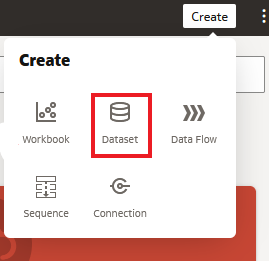

3. **Upload** the "employee termination.xlsx from the Documents / Live Labs Content directory as previously directed.  

    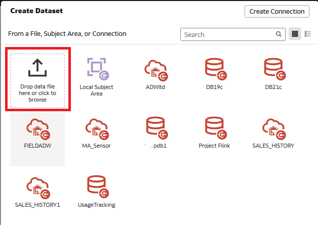

	Once uploaded, click the add button in the top right-hand corner.

    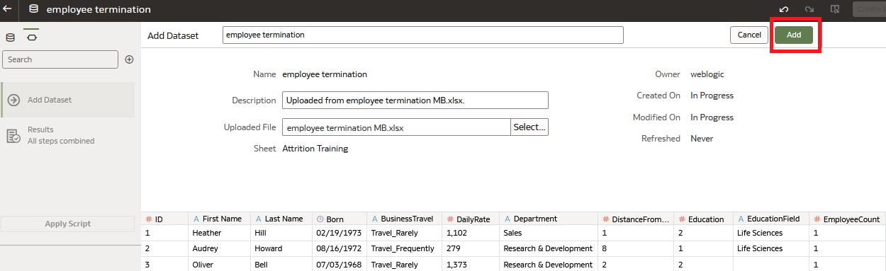

    After creating a dataset, the dataset undergoes column-level profiling to produce a set of semantic recommendations to repair or enrich
    your data. These recommendations are based on the system automatically detecting a specific semantic type during the profile step.
    After profiling the data, you can make modifications to the data and implement enrichment recommendations provided on the far-right hand  side of the palette. Keep in mind, that the date-specific elements and their semantic types will dictate the variety and number of recommendations you receive to include within your dataset.

    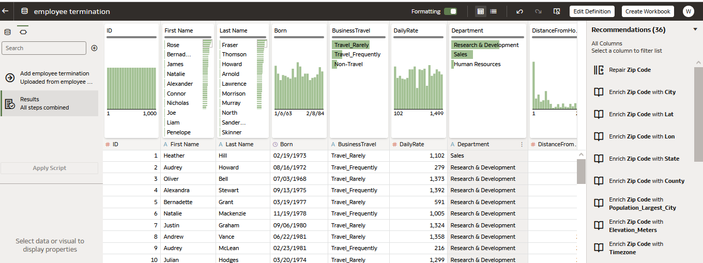

4.  Use the scroll bar located at the bottom of the screen and review the data elements.  
    Each element has been labeled with an identifier.  
    - A = Attribute
    - '#' = Measure
    - Clock = Time

    Make sure your data elements have been labeled correctly as the assignment will control the properties, and analysis options available
    to you during analysis.

    Use the scroll bar to locate ID and Employee Number within the data source.  Notice each element has been marked with a # which indicates that Oracle Analytics Server identified the element as a measure or numeric.  Employee Numbers and Identifiers are generally not measures to be aggregated or summarized.  They are attributes used for identification purposes.  

    Modify data element identifier for ID and Employee data elements.

    **Click** on the ID column.  Notice the ID properties box in the lower-left corner.  Let’s modify the identifier.  Under the property 'Treat As' **Click**  on 'measure' and select attribute.

    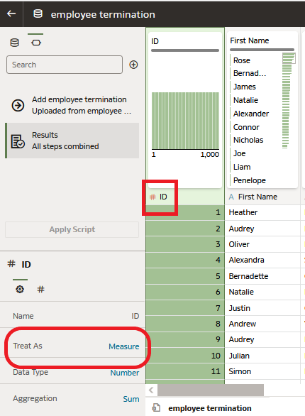

    Continue and locate Employee Number, and make the same modification.

    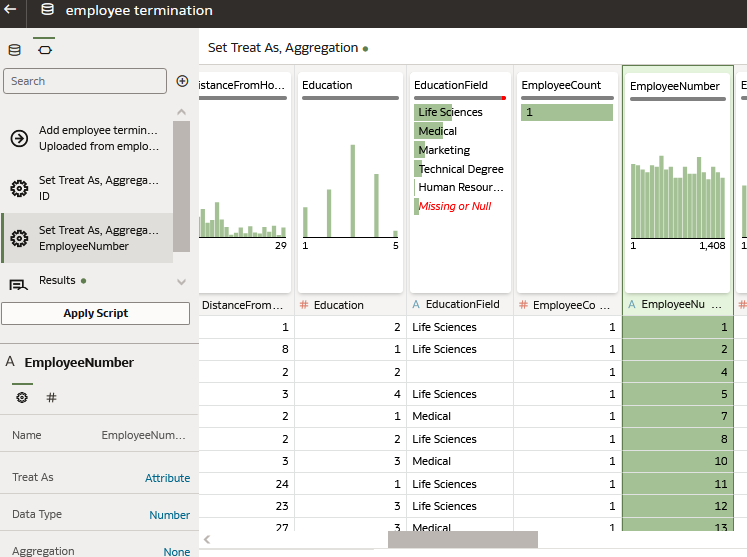

    As you review the remaining columns, you may find additional data elements to modify.  

5.  Continue to scroll to the right, until you reach the end. Note, that the dataset includes social security number. **Click** on the
    column labeled SSN. Social security number is a sensitive piece of data and Oracle Analytics Server recognized it and delivered 6 recommendations. You can choose to obfuscate, delete, or extract a portion of it all with one click of your mouse.

    **Select** 'Obfuscate First 5 digits of SSN'

    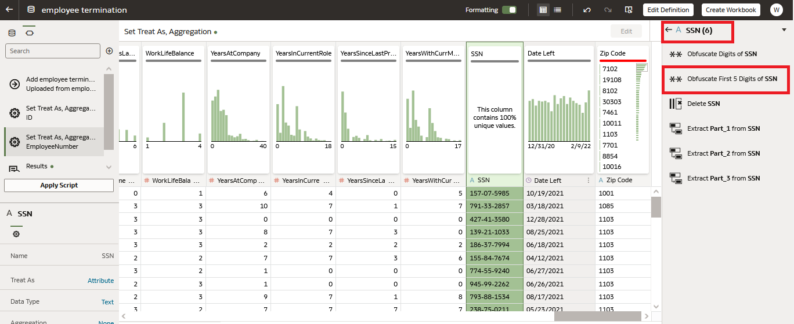

6.  Even further right, beyond social security number, locate the 'zip code' column.  

    Zip code has been identified as an attribute, however, some of the zip code records look incomplete.

    Notice, above the column heading, that each data element has an associated data quality insight card.

    The data quality insight card provides a visualization illustrating information about the data element as well as information regarding record distribution.  Additionally, it provides insight into the cleanliness of the records within each column.  

    Note the red bar at the top of the data quality insights card. Hover over the red bar.  Oracle Analytics Server detected invalid values based upon deep semantic knowledge provided by System Knowledge.  System Knowledge provides a vast set of geographic and demographic reference data used during the profiling process.  

    **Click** on the zip code column and review the recommendations provided by Oracle Analytics Server.  

     Let’s repair the zip code values by selecting the "Repair Zip Code' recommendation.

    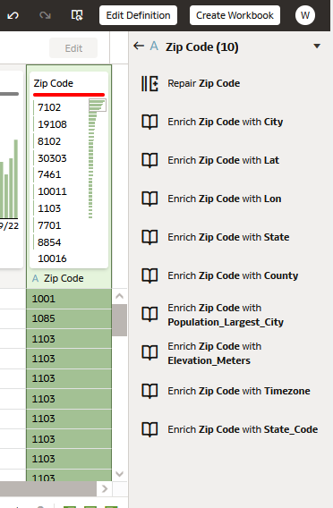

    Oracle Analytics Server has corrected each zip code record within the column. Note the horizontal bar has changed from red to grey.

    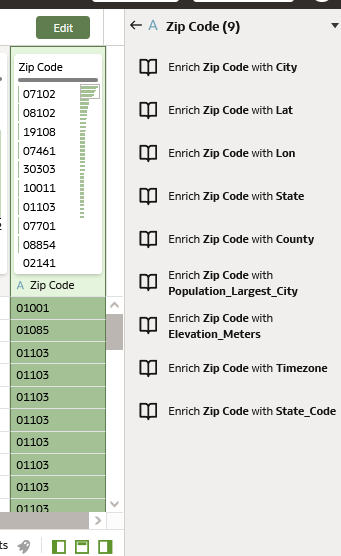

7.  Additionally I see that Oracle Analytics Server recommended enriching my dataset providing many geo-name options, including City and State.

    Let’s enhance the dataset by utilizing both the State and City recommendations for our analysis.

    From the recommendations panel, **Click** 'Enrich Zip Code with State, then 'Enrich Zip Code with City'.

    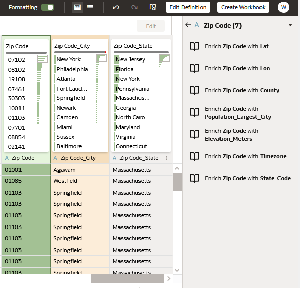

    We've added two additional columns to our dataset.

    Next, we will rename each column label.  

    Double **Click** Zip Code_City column label.

    **Click** ‘rename’ – type ‘City’

    Perform the same steps to rename the Zip Code_State column label to State.

    **Right Click** over the State Column label, Notice there are a wide variety of transformation options!

    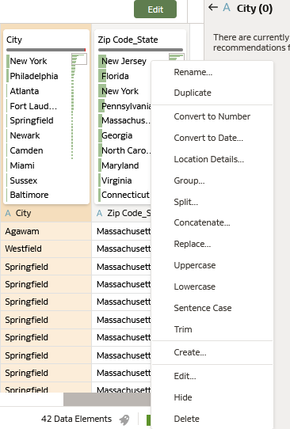

8.  Scroll back to the left of the dataset.  Locate the 'EducationField' column.

     

     Review the information provided in the data quality insights card.

     Oracle Analytics Server has identified there are some missing or null values.  

     The data quality bar indicates that 5% of the records are null values.

     You can replace null or missing values by double-clicking on 'Missing or Null' and typing in the replacement value.

     Double **Click** 'Missing or Null' and type 'Other'

     

9.  Let's make one last modification to our dataset.  Scroll back to the beginning of the dataset, all the way to the left.  

    I would like to combine the columns "First Name" and "Last Name" into one column titled 'Employee Name'.  

    We will concatenate the columns to merge them.

    Right **Click** on 'First Name' and select 'concatenate'

    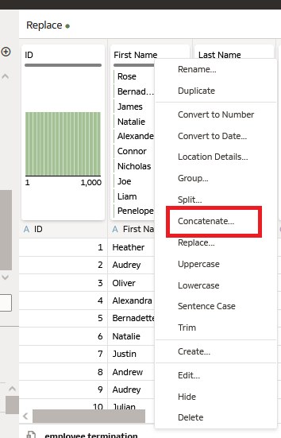

    In the concatenate column dialogue box, enter the following:

    - Give the new column a name – Employee Name
    - Leave Merge Column entry as First Name
    - Modify ‘With’ to Last Name
    - Leave Delimiter as Space ( )
    - Once complete, click “Add Step” in the upper right-hand corner

    

    Right **Click** on First Name and Last Name Columns and select ‘Hide’

10. Next to ‘Employee Name’, there is a column labeled ‘Born’.

    Let’s change the column label to ‘Birthdate’.  Follow the steps listed above to ‘rename’ your column.  

    Next, I’d like to add a column that calculates ‘Age’.  

    From the upper left, notice a  “ + “ icon in the script navigation panel.    

    Review the items listed in the Script Navigation Panel.  The Script Navigation Panel has recorded each modification we have made to the dataset.  The modifications reside with the dataset and will be applied when the data source has been refreshed or appended.

    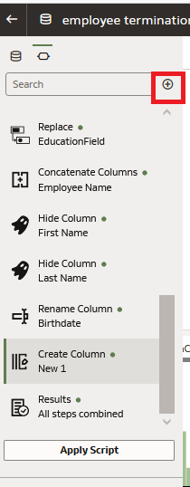

    **Click** on the + icon.  The Create Column dialog box appears.  

    - Give the new column a name – Age

     Enter your calculation simply by typing into the box or by utilizing the functions listed in the table on the right.  

     I would like to calculate age by utilizing today's date (current date) and the birthday column.  I need to utilize the year function to create my calculation.

     In the box, begin typing 'year". As you type, notice that Oracle Analytics Server provides choices matching the data entry.  **Select** "Year" when it is provided as an option.  

     Notice that (dimension) appears beside Year. Let's utilize the current date function to specify "year".  

     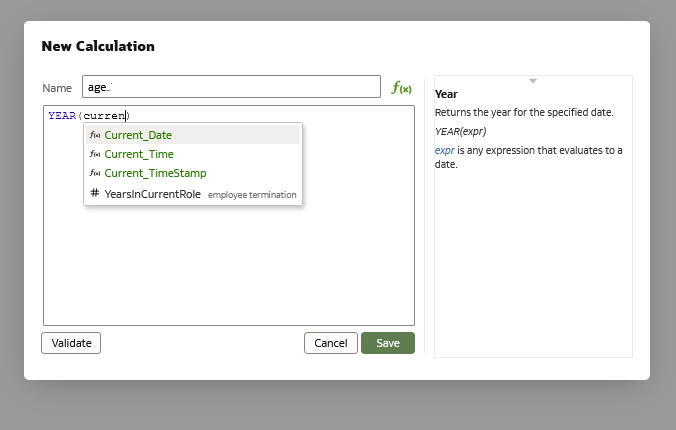

     Begin typing current. As you type, you should see options matching "current".  **Select** 'current_date' when it is provided as an option.  

     Make sure you move your cursor outside of the parenthesis.

    - Enter an ‘ – ‘ to denote subtraction.

     To complete our calculation, we will utilize the year specified within BIRTHDATE.    

    - Repeat the steps above to create Year(Birthdate)

     Your entry should look like this.

     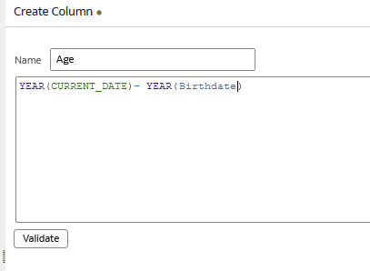

     Once complete, **Click** Validate.  If the calculation has been entered successfully, then **Click** ‘Add Step’.

11.	I’m very happy with my dataset.  I’ve made several modifications and cleaned up my data.  It is ready for analysis.  

    To save my enrichments and modifications, I need to “apply this script” to the data source.  

    Now we are ready to analyze our data.  **Click** Create - Workbook.

    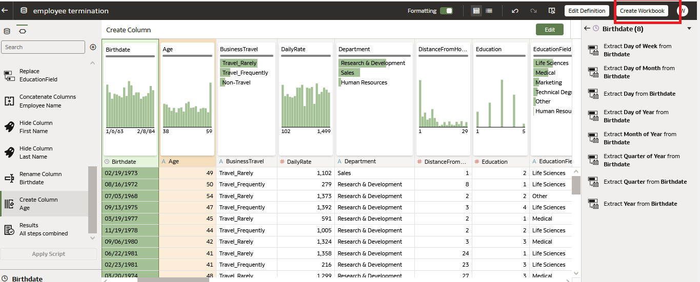

    You may begin your analysis by selecting the appropriate data elements.

    Take a look at the "Birthdate" and "Date Left" data elements listed in the data panel.  

    Click on “Birthdate. Notice that Oracle Analytics has created a time dimension automatically for analysis.  

    You may slice your data by a variety of time dimensions without having to write code, or transform your date-specific elements.

     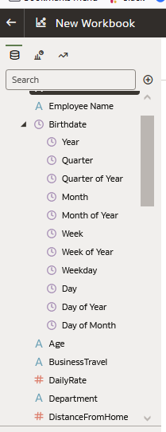

## Task 2: Self-service Data Modeling

Oracle Analytics Server provides the ability to create new datasets quickly and easily adding tables from one or more connections
to a data set for analysis. This exercise will explain how to bring data entities together from one or more sources, select different tables, modify columns and join them together and preview the dataset.

Datasets can be blended with other datasets, saved, and shared with others throughout the organization for analysis purposes.  

1.   Create - Dataset

     

     We are prompted to 'Select A Data Source'.  

     For this exercise, we will be utilizing an Oracle Database to select a variety of tables I need for analysis.  

     **Click** the database 'PDB1'.  The database has a variety of schemas available.  We are going to use BICS_SAMPLEAPP.  

     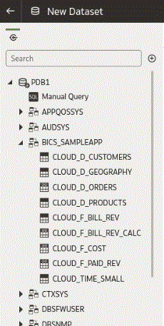

2.   We would like to analyze customer orders, products, revenue, and billing information.  I'm going to bring together the tables I need
     to complete my analysis.

     Let's start by selecting the "*CLOUD_D_CUSTOMERS*" table.  You can double-click it or drag it over to the palette.

     Once selected, you will see the table represented in a diagram on the upper portion of the palette.  Below, you will see the data elements that reside in the table.

     

     Next we are going to select the remaining tables we need.  **CTRL Click** the following tables:

     - *CLOUD_D_PRODUCTS*
     - *CLOUD_F_BILL_REV*
     - *CLOUD_TIME_SMALL*
     - *CLOUD_D_ORDERS*

     Once selected, **Right Click** - select 'Add to dataset'

     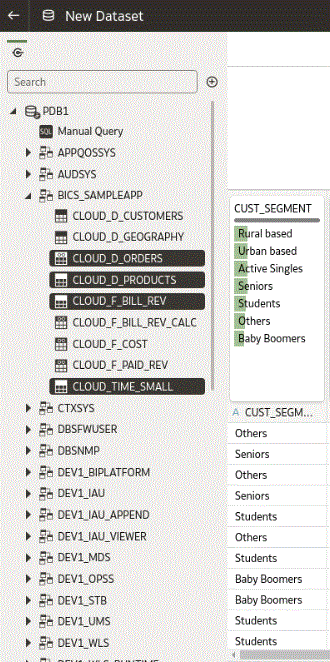

     Notice that a couple of joins have been defined within the data source, as a result, the joins have happened automatically.

     

     **Click** or **Hover** over the connection point.

     *CLOUD_F_BILL_REV* and *CLOUD_D_ORDERS* are joined on *Order_Status*

     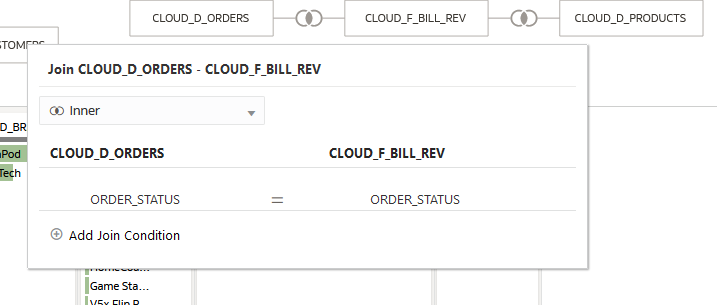

     *CLOUD_F_BILL_REV* and *CLOUD_D_PRODUCTS* are joined on *PROD_ITEM_KEY*

3.   We need to manually add joins for both *CLOUD_D_CUSTOMERS* and *CLOUD_TIME_SMALL* tables.

     **Click** on *CLOUD_F_BILL_REV*.  *CUST_NUMBER* resides within the table.  Notice it is identified as a measure. To join *CLOUD_F_BILL_REV*
     to *CLOUD_D_CUSTOMERS* we need to modify the identifier.

     **Click** on the *# CUST_NUMBER* column name and modify the identifier

     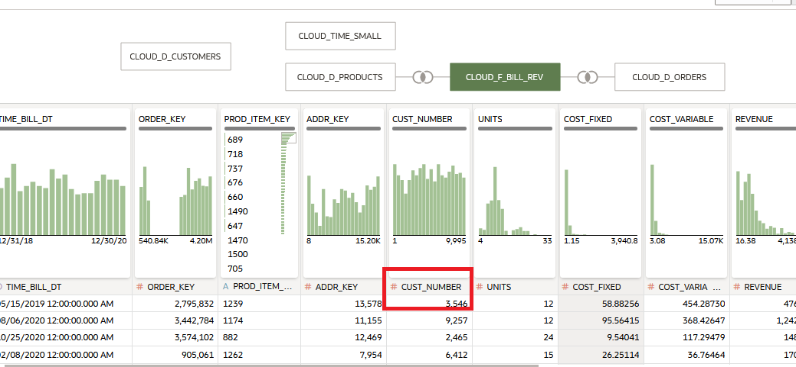

     **Right Mouse Click** on *CLOUD_D_CUSTOMERS* and select Join To *CLOUD_F_BILL_REV*

     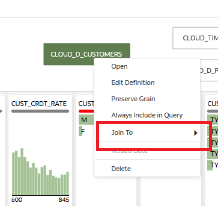

     Notice the join has been suggested for you.

     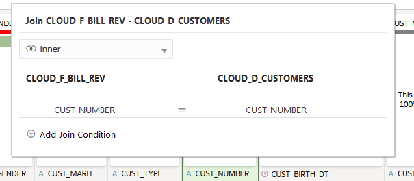

     **Right Mouse Click** on *CLOUD_TIME_SMALL*.  Select Join To *CLOUD_F_BILL_REV*. A clear date element match has not been identified.
     Select *CLOUD_F_BILL_REV* - *TIME_BILL_DT* and *CLOUD_TIME_SMALL* - *DAY_TS*

     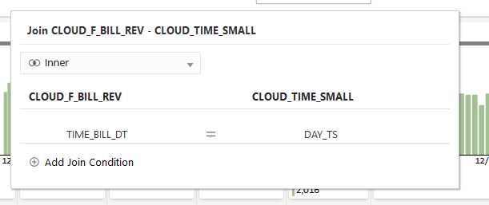

     Let's save our dataset so we can complete our analysis.  **Click** on the disk icon in the upper right-hand corner.  
     Name your dataset - my new dataset

4.   Before we navigate to 'Create Workbook', take a look at the bottom of the palette, there tabs representing all of the tables you selected.  

     **Click**  on the tab labeled *CLOUD_D_CUSTOMERS*.

     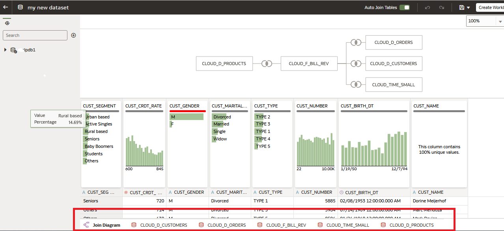

     Notice the recommendations panel on the right.  You may apply any of the recommendations the knowledge engine has provided.  

     Additionally, you may ' Edit Definition '

     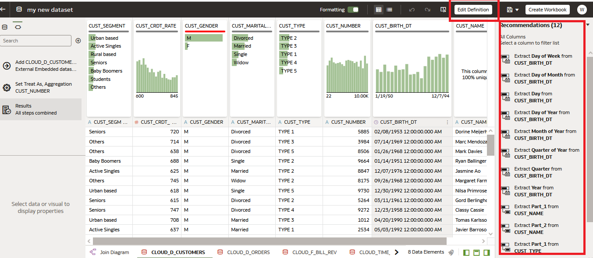

     Notice the following:

     - You may add or remove columns from the data table.
     - You may modify the data indicator as needed.
     - You may modify the data access setting.

     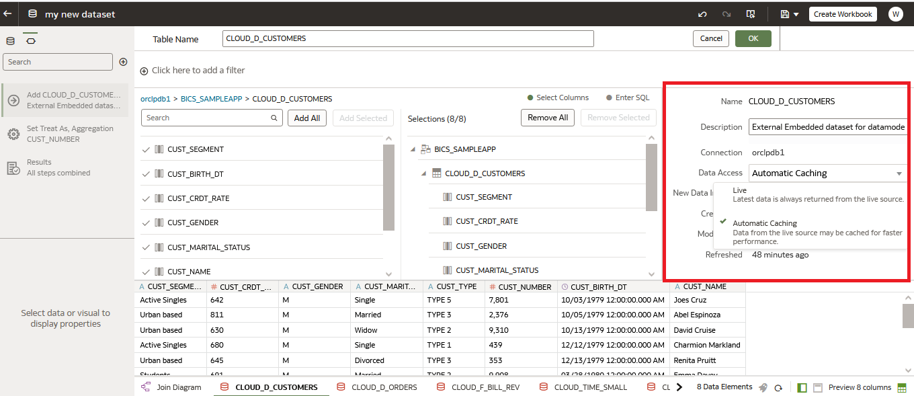

     **Click**  Ok and then Create Workbook.  If prompted, save the changes you've made to the dataset.

5.   Look at the data elements panel to the left.  Each table is represented by a folder icon.

     You are ready to begin your analysis.  

     Note you can add other data sources to your analysis.  **Click** on the + to the right of the Search box.

     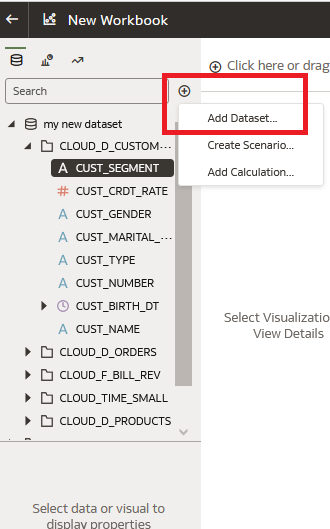

     At this point you can:
     -  add a dataset
     -  leverage a subject area
     -  create a new dataset, selecting data from your local desktop or another data source.

     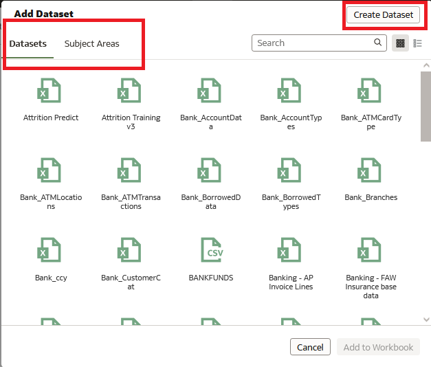

     Oracle Analytics Server provides flexible and agile data management capabilities enabling users to access and bring together a wide variety of data sources.

## Learn More
* [Oracle Analytics Server Documentation](https://docs.oracle.com/en/middleware/bi/analytics-server/index.html)
* [https://www.oracle.com/business-analytics/analytics-server.html](https://www.oracle.com/business-analytics/analytics-server.html)
* [https://www.oracle.com/business-analytics](https://www.oracle.com/business-analytics)

## Acknowledgements
* **Authors**
    - Linda Dest Analytics Platform Specialist, NA Technology
    - Malia German Solution Engineer, NA Technology
    - Bronze Martin Solution Engineer, NA Technology
    - Mike Keefe Analytics Platform Specialist, NA Technology
* **Contributors** -  Rene Fontcha
* **Last Updated By/Date** - Linda Dest NA Technology, April 2022
