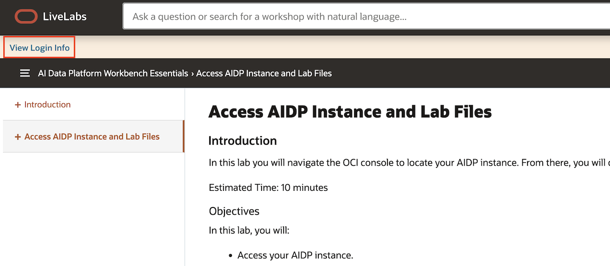
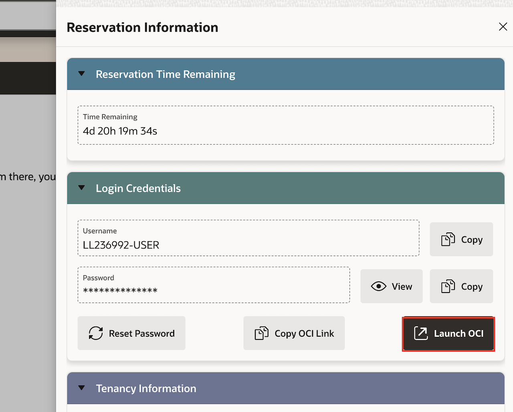
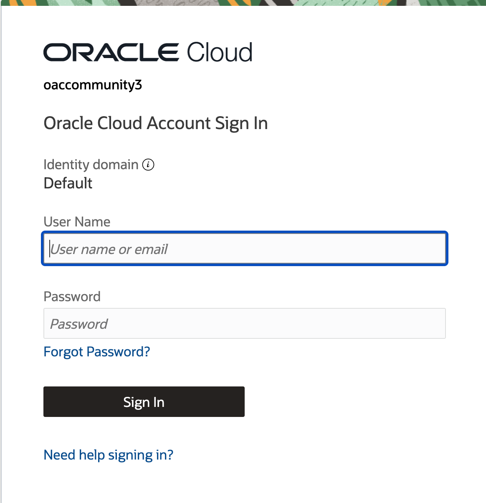
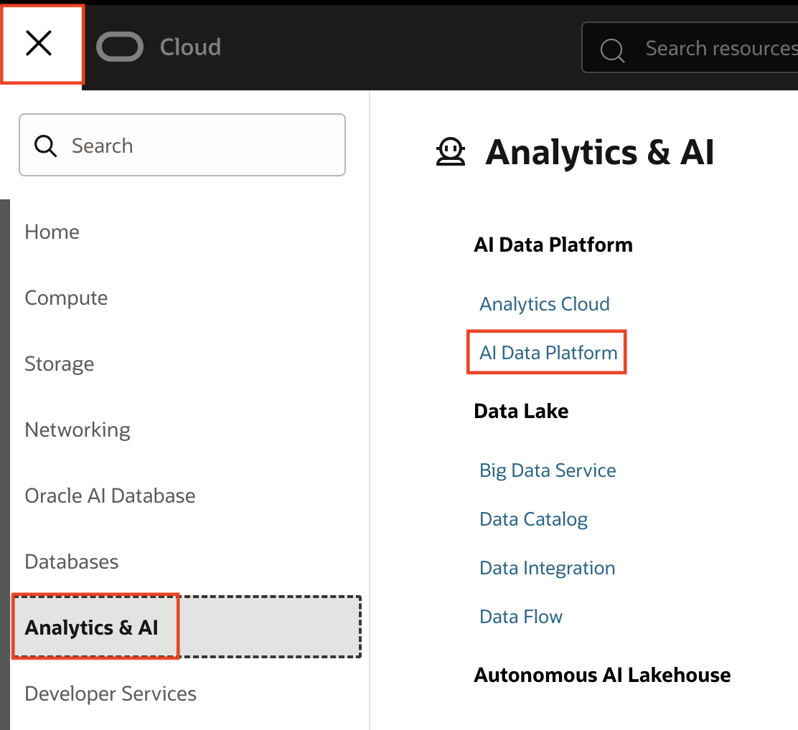
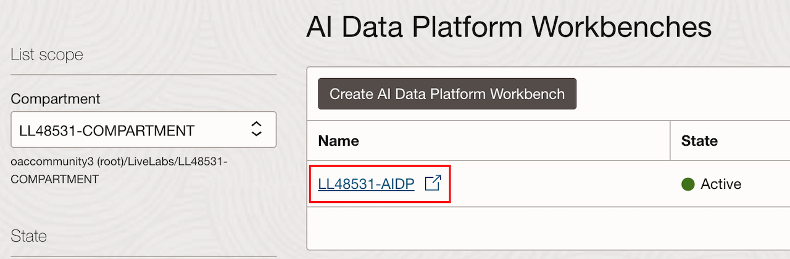
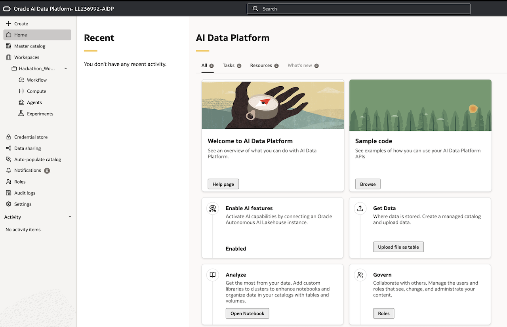

# Access AIDP Instance

## Introduction

This area provides instructions on how to access your own AIDP instance for the event. For Hackathon attendees, you are also directed to access the Zoom meeting for the event, where lab files and other information will be distributed. If you are a hands-on lab or bootcamp attendee, your instructor will distribute lab files to you.

Estimated Time: 10 minutes

### Objectives

You will:

- Access the Zoom meeting if attending the Hackathon.
- Access your AIDP instance.

### Prerequisites

This event assumes you have:

- An Oracle Cloud account.

Click expand all tasks to continue.

## Task 1: Access Zoom Meeting (Only for Hackathon attendees)

1. You can access the Zoom meeting by [clicking this hyperlink](https://oracle.zoom.us/webinar/register/WN_XnmKUqR1R82xnG_HX93MWQ). Lab files and other information will be distributed from this zoom meeting.

## Task 2: Login to OCI and Access your AIDP Instance

1. Click **View Login Info** at the top left of this page in the yellow bar. This will launch your **Reservation Information** on the right side of the screen.

    

2. Click the **Launch OCI** button. This will launch OCI in a new tab.

    

3. Using the username and password supplied, login to the OCI console. Note that you will be prompted to reset the password. Do not forget your password as you will likely need to login again later after a period of inactivity.

    

4. From the OCI Console homepage, select the Navigation Menu at the top left corner, Navigate to **Analytics and AI**, and select **AI Data Platform**.

    

5. Use the compartment dropdown on the left and expand the root compartment **oaccomunity3**, the **Livelabs** compartment, and then select your compartment based on your username as shown in your Login Info. 

    

6. You should see a single AIDP Instance appear on the page. Select its name to access the AIDP homepage, which will open in a new tab and should look like the image below. Please keep the current LiveLabs tab open for reference if you get logged out of the AIDP environment. 

    

7. You have successfully accessed your instance! Hackathon attendees continue from this point using the lab files distributed via Zoom. Hands-on lab and bootcamp attendees continue with the lab documents supplied by your instructor.

## Learn More

- [Oracle AI Data Platform Community Site](https://community.oracle.com/products/oracleaidp/)
- [Oracle AI Data Platform Documentation](https://docs.oracle.com/en/cloud/paas/ai-data-platform/)
- [Oracle Analytics Training Form](https://community.oracle.com/products/oracleanalytics/discussion/27343/oracle-ai-data-platform-webinar-series)
- [AIDP Workbench Creation Documentation](https://docs.oracle.com/en/cloud/paas/ai-data-platform/aidug/get-started-oracle-ai-data-platform.html#GUID-487671D1-7ACB-4A56-B3CB-272B723E573C)
- [AIDP Workbench Master Catalog Documentation](https://docs.oracle.com/en/cloud/paas/ai-data-platform/aidug/manage-master-catalog.html)
- [Permissions for AIDP Workbench Creation](https://docs.oracle.com/en/cloud/paas/ai-data-platform/aidug/iam-policies-oracle-ai-data-platform.html#GUID-C534FDF6-B678-4025-B65A-7217D9D9B3DA)

## Acknowledgements
* **Author** - Miles Novotny, Senior Product Manager, Oracle Analytics Service Excellence
* **Last Updated By/Date** - Miles Novotny, October 2026
