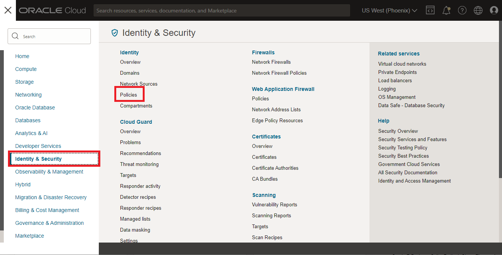
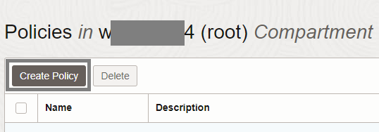
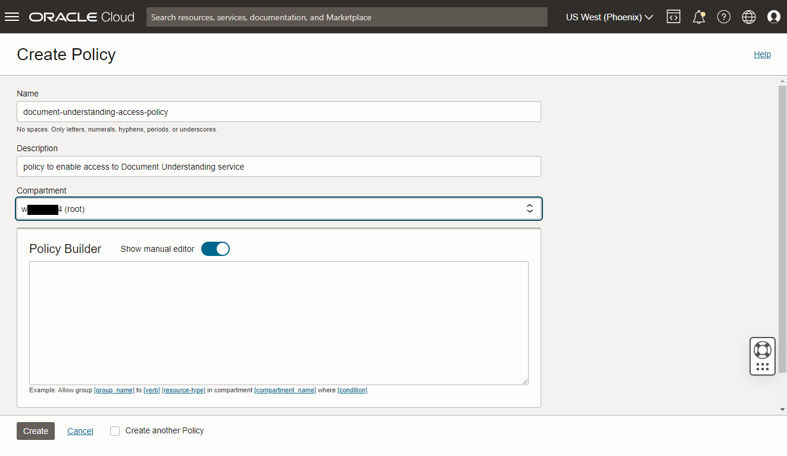
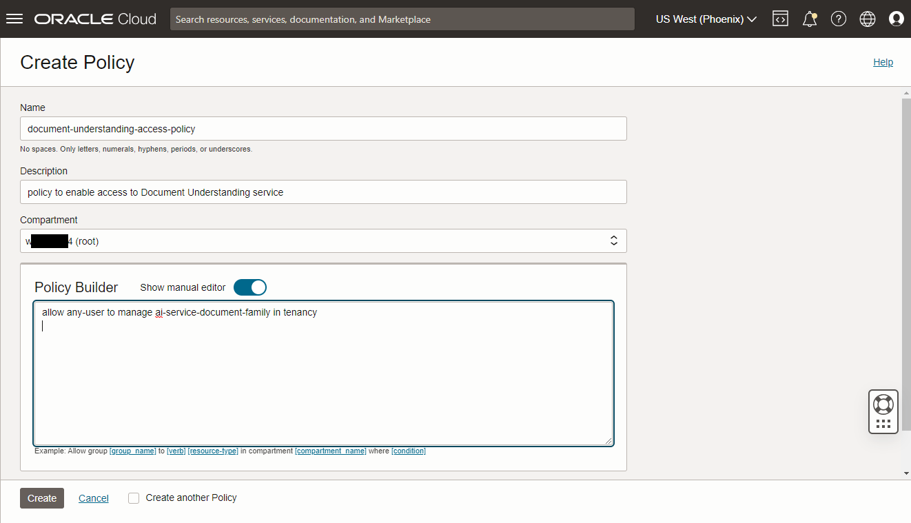

# Lab 1: Configure Document Understanding policies

## Introduction

In this lab, you will use the OCI Console to set up the policies for OCI Document Understanding.

Estimated Time: 10 minutes


### Objectives

In this workshop, you will:

* Get familiar with the OCI Console and be able to configure your policies for OCI Document Understanding

## Task 1: Policy Setup
Before you start using OCI Document Understanding, OCI policies must be setup to allow users to access OCI Document Understanding service. Follow these steps to configure required policies.

1. Navigate to Policies

    1. Log into OCI Cloud Console 
    1. Using the Burger Menu on the top left corner, navigate to **Identity & Security** and click it
    1. Then, under *Identity*, select **Policies**
    

1. Click Create Policy
    
    

1. On the *Create Policy* page, set the following values:

    1. Name: *document-understanding-access-policy*
    1. Description: *policy to enable access to Document Understanding service*
    1. Set *Compartment* to your root compartment and toggle on the manual editor. The root compartment will be called *name of tenancy (root)*, and it will be the top compartment in the compartment list.       
    

    1. Add the below statement in the *Policy Builder* field to allow all the users in your tenancy to use Document Understanding. This is a required policy.
        ```
        <copy>allow any-user to manage ai-service-document-family in tenancy</copy>
        ```

        

        Alternative - If you want to limit access to a specific user group, create a policy with the below statement and insert the name of the user group at *\<group-name\>*. 
        ```
        <copy>allow group <group-name> to use ai-service-document-family in tenancy</copy>
        ```

    1. Add the below policy statement in the *Policy Builder* field to grant object storage access permissions to users. This enables processing of documents stored in an object storage bucket. 
        ```
        <copy>allow any-user to use object-family in tenancy</copy>
        ```
        Alternative - If you want to limit access to a specific group of users, use this version of the policy instead:
        ```
        <copy>allow group <group_in_tenancy> to use object-family in tenancy</copy>
        ```
            
        Alternative - If you want to further restrict access to object storage in a specific compartment, you can use the following policy instead. If you haven't created an compartment yet, you'll have an opportunity to create one with the name *docu-lab* in the next lab. 
        ```
        <copy>allow group <group_in_tenancy> to use object-family in compartment <compartment_containing_object_storage_output_bucket></copy>
        ```

    1. Document Understanding service stores results in an object storage bucket in your tenancy. Add the following policy to grant object storage access permissions to any user:
        ```
        <copy>allow any-user to manage object-family in tenancy</copy>
        ```
        
        Alternative - If you want to restrict access to a specific user group (such as who requested the analysis of documents) and restrict access to object storage in a specific compartment, use this policy instead:
        ```
        <copy>allow group <group_in_tenancy> to manage object-family in compartment <compartment_containing_object_storage_output_bucket></copy>
        ```
    1. Click the **Create** button to create the policy containing 3 statements.
        

## Summary
In this lab you learned how to set up your OCI Document Understanding policies.

You may now **proceed to next lab**.


## Acknowledgements
* **Authors**
    * Kate D'Orazio - Product Manager


* **Last Updated By/Date**
    * Wes Prichard, Product Manager, July 2023
