# Lab 2: Use OCI Document Understanding in the Console

## Introduction
In this lab, we will learn how to use OCI Document Understanding in the OCI Console in order to test various features on demo documents as well as your own documents.

*Estimated Time*: 20 minutes

## Task 1: Prepare to save configuration settings

1. Open a text editor and copy & paste this text into a text file and save it on your local computer. You will store settings there from your OCI tenancy that will be used during the lab.
    ```text TODO
    <copy>
    lab compartment: 
      ex. docu-lab

    lab compartment ocid: 
      ex. ocid1.compartment.oc1..aaaaaaaabcdefghijk0123456789lmnopqrstuvwxyz9876543210abcdefg

    object storage bucket name: 
      ex. docu-bucket

    root compartment ocid: 
      ex. ocid1.tenancy.oc1..aaaaaaaabcdefghijk0123456789lmnopqrstuvwxyz9876543210abcdefg
      
    private key file location: 
      ex. C:\Users\MYNAME\Downloads\mykeyfile.pem

    object storage namespace: 
      ex. axabc9efgh5x

    job ID: 
      ex. ocid1.aidocumentprocessorjob.oc1.phx.aaaaaaaabcdefghijk0123456789lmnopqrstuvwxyz9876543210abcdefg
    </copy>
    ```


## Task 2: Create a compartment
You will create a compartment for the object storage bucket you will use in this workshop. 

You can use an existing compartment to run the lab but we recommend you create a new one in case you want to delete the components later

1. Login to your OCI account/tenancy

1. Go the burger menu of the console and select **Identity & Security**

1. Then, under *Identity*, select **Compartments**
    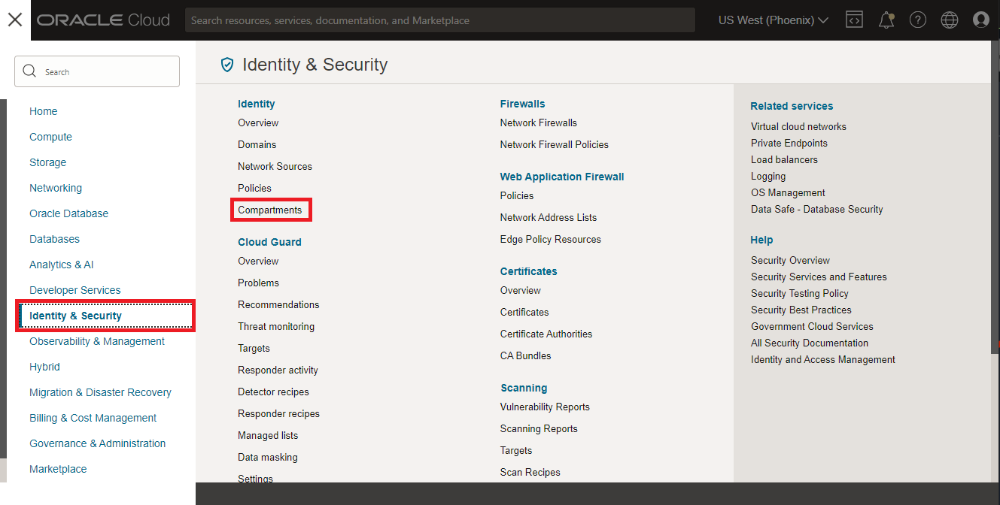

1. Click **Create Compartment**

1. In the *Create Compartment* dialog, 
    1. Enter a name: **docu-lab** (recommended) (If you created a policy for a specific compartment in Lab 1, enter the same name here.)
    1. Enter a description
    1. Ensure *Parent Compartment* is set to the root compartment
    1. Click **Create Compartment**
    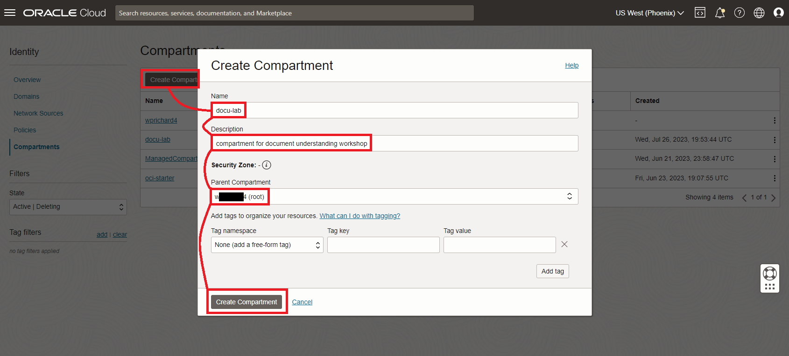

1. Save the name of your new compartment in the text file you created in the previous task

1. The *Compartments* page is displayed and lists all of the compartments.  Click the name of the lab compartment you just created (i.e. docu-lab).
	    
1. On the *Compartment details* page, click **Copy** next to the compartment *OCID*.
	    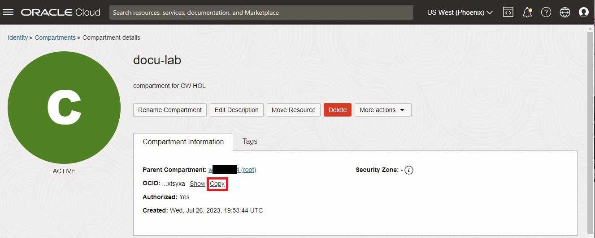
    
1. Save the compartment OCID to your text file as the *lab compartment ocid*


## Task 3: Download sample files
Some sample files have been provided that you can use when testing OCI Document Understanding on the cloud console.

1. Download the zip file at this [link](https://objectstorage.us-ashburn-1.oraclecloud.com/p/Ei1_2QRw4M8tQpk59Qhao2JCvEivSAX8MGB9R6PfHZlqNkpkAcnVg4V3-GyTs1_t/n/c4u04/b/livelabsfiles/o/oci-library/sample_images.zip) and save it to your local computer.

1. Unzip the file to a folder on your local computer. You will use these files in the next task.

## Task 4: Upload sample files to Object Storage
You will upload the sample files to object storage for this lab and later labs. You'll create an Object Storage bucket in your lab compartment then upload sample files to it.

1. From the OCI console burger menu, click **Storage** then **Buckets**.
    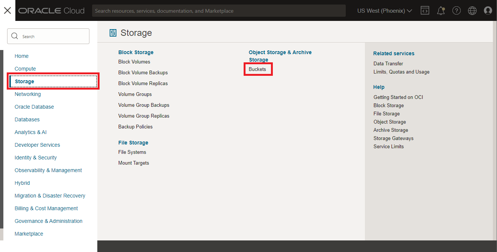

1. In the *Compartment* dropdown, select the lab compartment (*docu-lab*). (If you created a policy for a specific compartment in Lab 1, select the same name here.)
    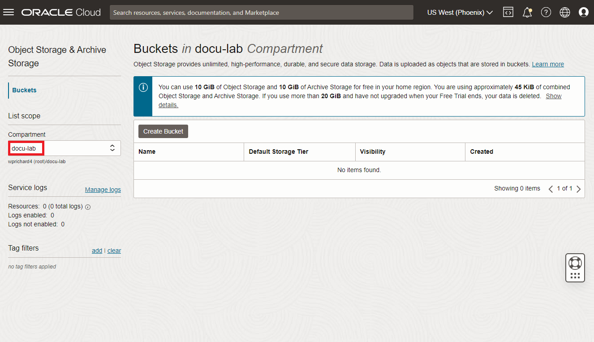

1. Next, click **Create Bucket**
    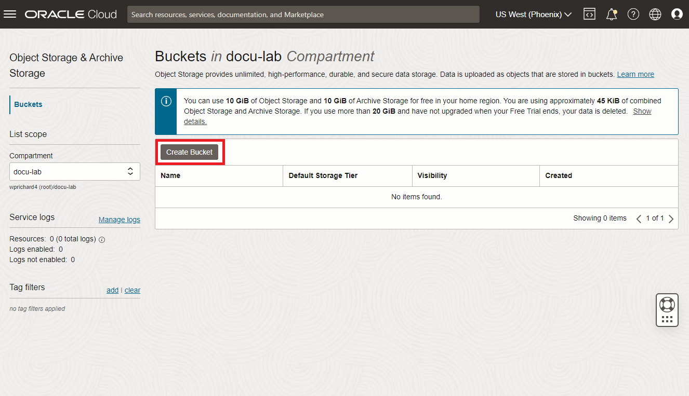

1. Next, fill out the *Create Bucket* dialog box:
    - Bucket Name: **docu-bucket** (recommended)
    - Storage Tier: Standard
    - Click **Create**
    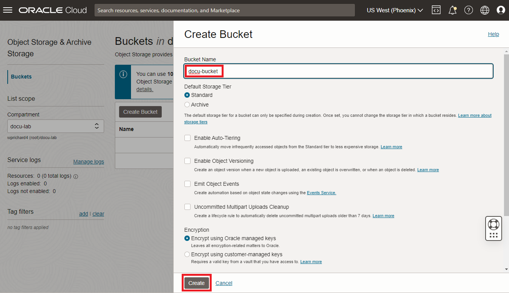

1. Save the name of the bucket to the text file you created in Task 1

1. Click on the name of the bucket that you just created, i.e. **docu-bucket**, to open the *Bucket details* window 

1. Click **Upload** 
    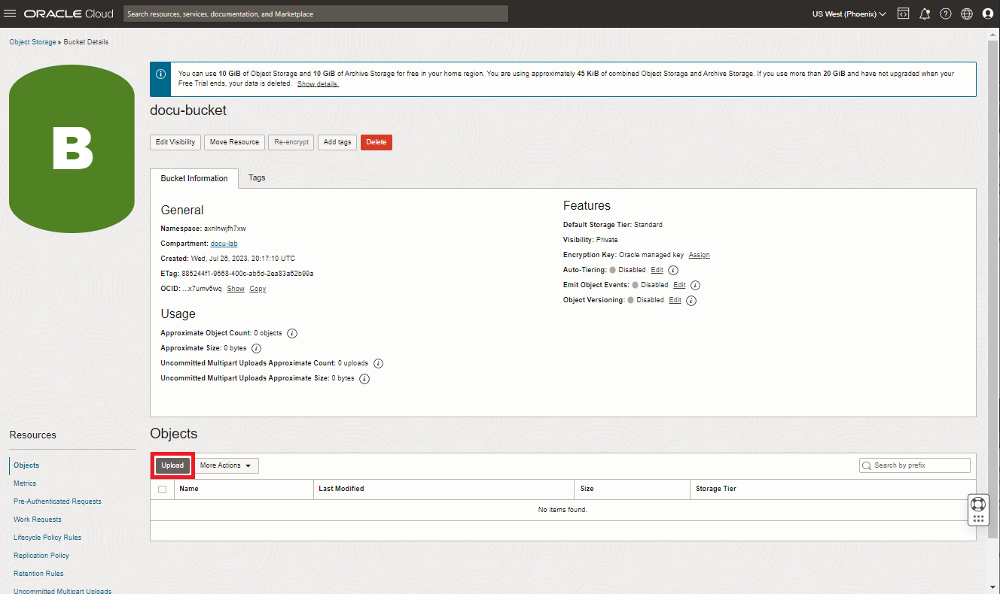

1. In the *Upload Objects* dialog, click *select files*, browse to the folder where you unzipped the sample files, and select images to upload. Upload all the files that were in the .zip file you downloaded.
    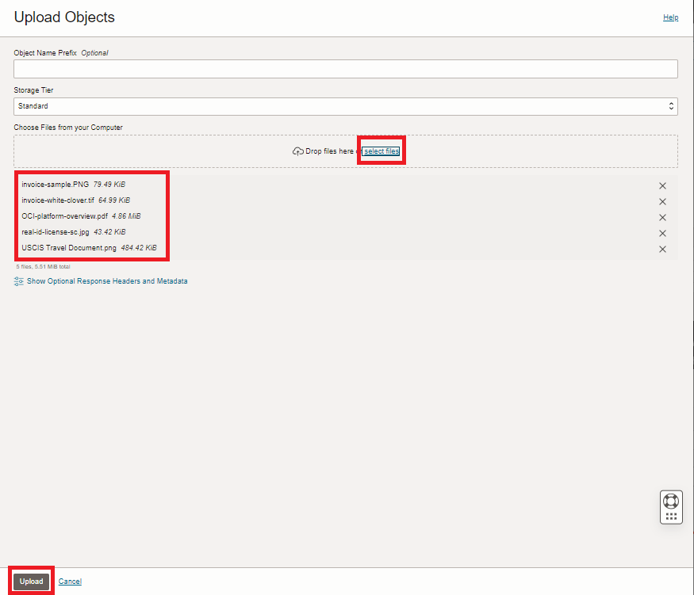

1. Click **Upload** and wait a few seconds until all the files show *Finished*

1. Click **Close** to close the *Upload Objects* dialog

## Task 5: Analyze Document Data
Use features of Document Understanding to analyze document files.

  1. Using the burger menu on the top left corner of the OCI console, select **Analytics and AI**, then select **Document Understanding** under *AI Services*
      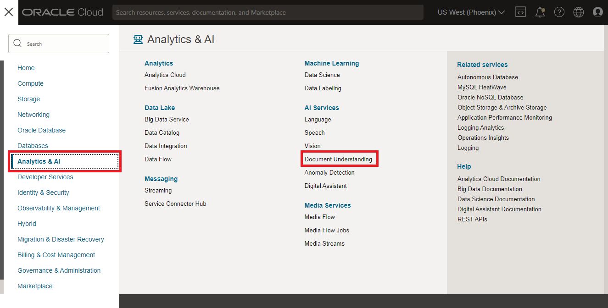

  2. On the Document Understanding page, select the first feature in the left list, **Text extraction** 
  
  1. A demo file is automatically processed by default. After a few seconds, view the extraction results on the right hand *Results* panel. Note that you can view the results by line or by word.
      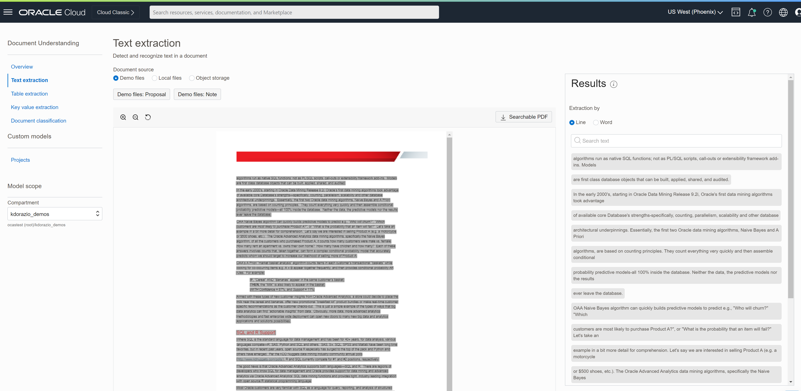

  1. If you're curious about the raw JSON response, scroll down on the results panel... 
      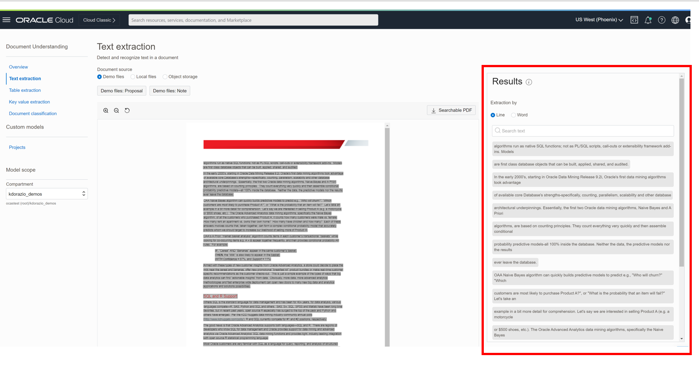
  
  1. ...then expand *Request* and/or *Response*  
      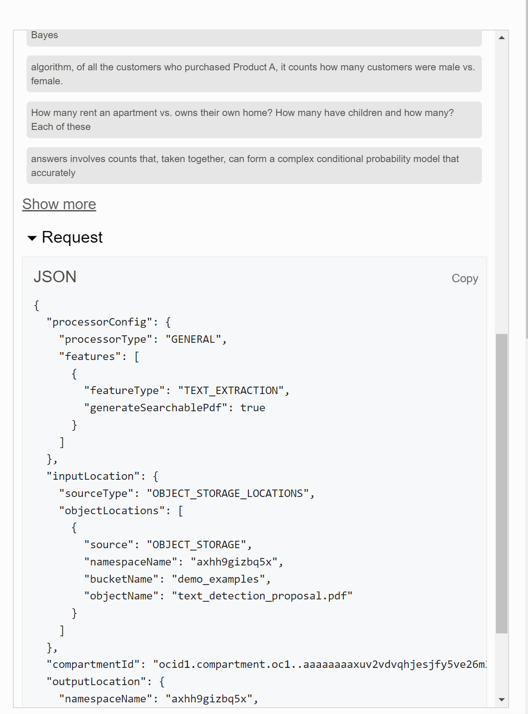

  1. Select the **second demo file** and view its results
      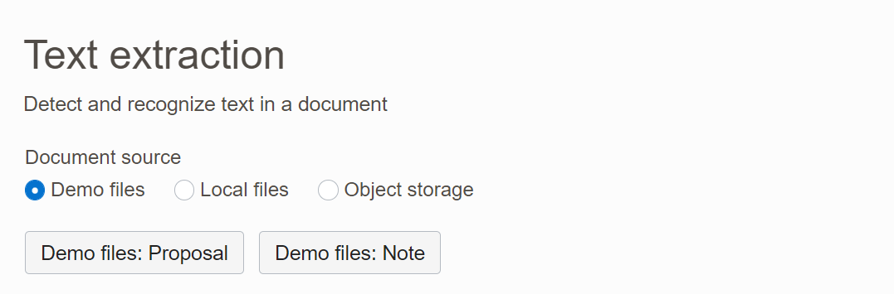

  1. Change *Document source* from *Demo files* to **Local files**
    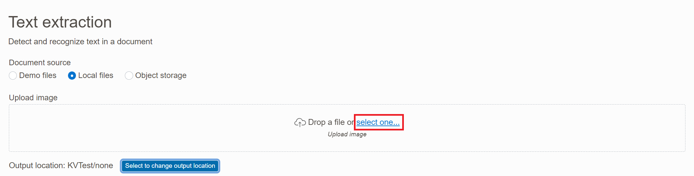

  1. You will be prompted to enter details for an output object storage bucket. JSON output from the document processing will be written to this location. Enter the following values in the *Output location* dialog:
    
      - Compartment: **docu-lab**
      - Output object storage location: **docu-bucket**
      - Prefix: **console-output**
      - Click **Submit**
    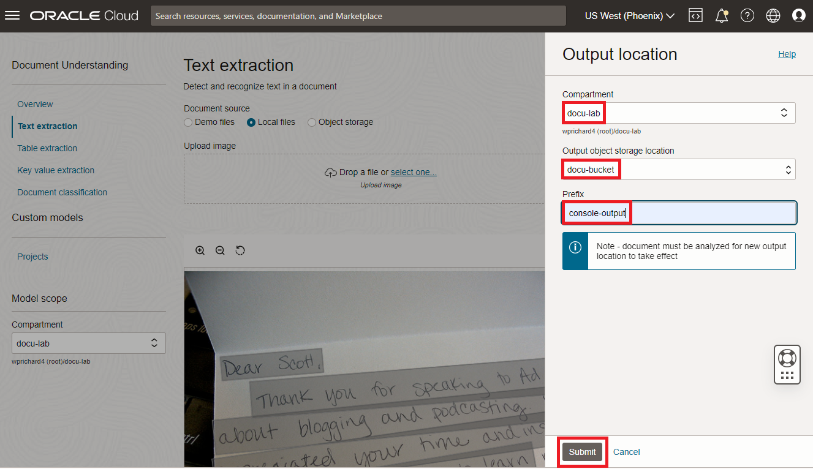 

  1. On the *Text extraction* page, under *Upload image*, click **select one...**, browse to one of the downloaded sample images, and select it. It will be analyzed and you can review the results.
  

  1. Repeat the previous step for other sample files.
  
## Task 6 - Try other Document Understanding features
There are more features you can try in the console.

  1. You can repeat the steps in the previous task to test other features like *Table extraction*, *Key value extraction*, and *Document classification* in the console. Some sample documents are not applicable to some features. For example some documents don't have tables to extract. (You won't need to set the output location again though.)
      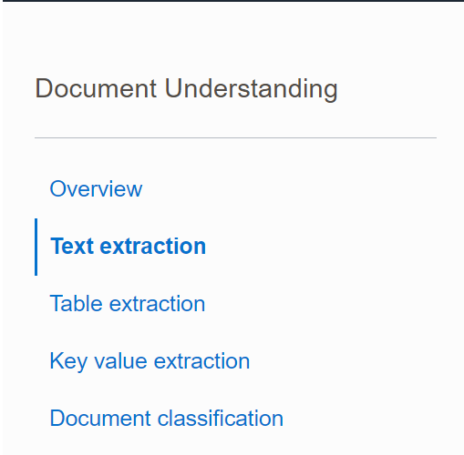


## Summary
In this lab you learned how use OCI Document Understanding in the OCI console with the demo files and additional sample files. You can apply this knowledge to your own files.

You may now **proceed to next lab**.

## Acknowledgements
* **Authors**
    * Kate D'Orazio - Product Manager


* **Last Updated By/Date**
    * Wes Prichard, Product Manager, July 2023
