# Lab 3: Use OCI Document Understanding via REST APIs

## Introduction

In this lab session, we will show you how to try out the OCI Document Understanding REST API using the POSTMAN application.
Postman is a GUI-based REST API tool that is very popular among developers.

*Estimated Lab Time*: 15 minutes

### Objectives:
* Learn how to access and use Document Understanding service through REST APIs.

## Task 1: Export the Document Understanding API Collection to your local computer
We have put together a Postman Collection to help you get started with calling the Document Understanding REST APIs. You'll import that collection into your local POSTMAN instance.

1. Install Postman to your local computer (if you don't already have it) using this link: [https://www.postman.com/downloads/](https://www.postman.com/downloads/). Once installed, run it. 

2. Use this [link](https://www.postman.com/oracledevs/workspace/oracle-cloud-infrastructure-rest-apis/overview) to download the **Document Understanding API Collection**. The link opens Postman on the web. Select **Collections** on the left side of the screen. Hover over *Document Understanding Service API* and click the 3 dots icon and click it to open the popup menu. Select **Export** to export the collection file and save it to your local computer. You will need to create an account, if you don't already have one, to download the API collection.
  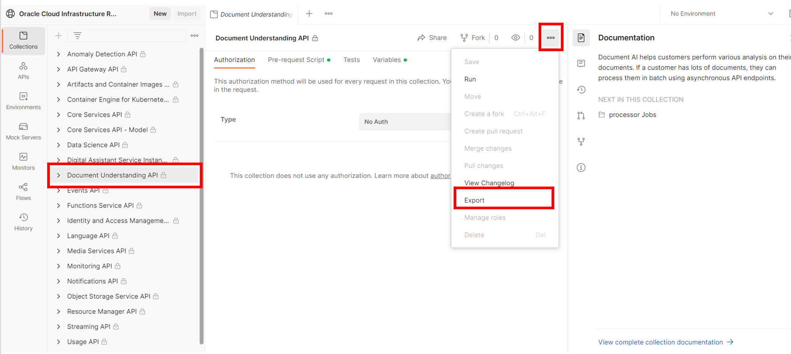

3. Use this [link](https://www.postman.com/oracledevs/workspace/oracle-cloud-infrastructure-rest-apis/environment/29850-eab82db8-e9a1-4200-9f39-de10b4a0f371) to download the **OCI Credentials Environment**. The link opens Postman on the web. Select **Environmments** on the left side of the screen then select **OCI Credentials**. On the right side of the screen find the 3 dots icon and click it to open a popup menu. On the menu, click **Export** to export the credentials file and save it to your local computer. You'll upload the file to your local Postman in the next task.
  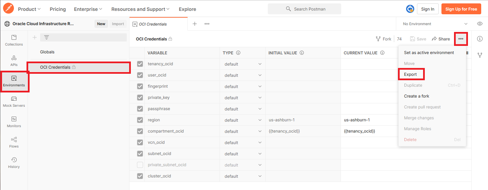

## Task 2: Set up your OCI credentials

1. Ensure Postman is running on your local computer.

1. Import the OCI Credentials file into Postman running on your local computer by using the **Import** button at the top left under *My workspace*. The file is named **OCI Credentials.postman_environment.json**
  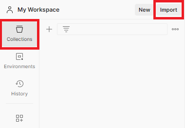 TODO

2. In the *Import* dialog, click the **Upload Files** button and select the json file you exported in the previous step. (**OCI Credentials.postman_environment.json**) 

3. Set OCI Credentials as the active environment by **clicking the check** next to *OCI Credentials*
  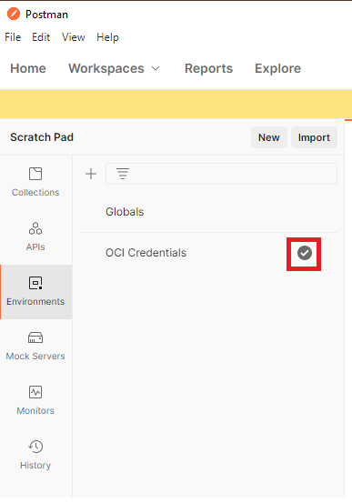

4. Now we will set the variables in the OCI Credentials in your local POSTMAN and you'll obtain the needed values from your OCI tenancy. <br>
Open the newly imported environment in POSTMAN: OCI Credentials. You'll see it contains multiple variables with empty values. We need to set 6 of those variables.
    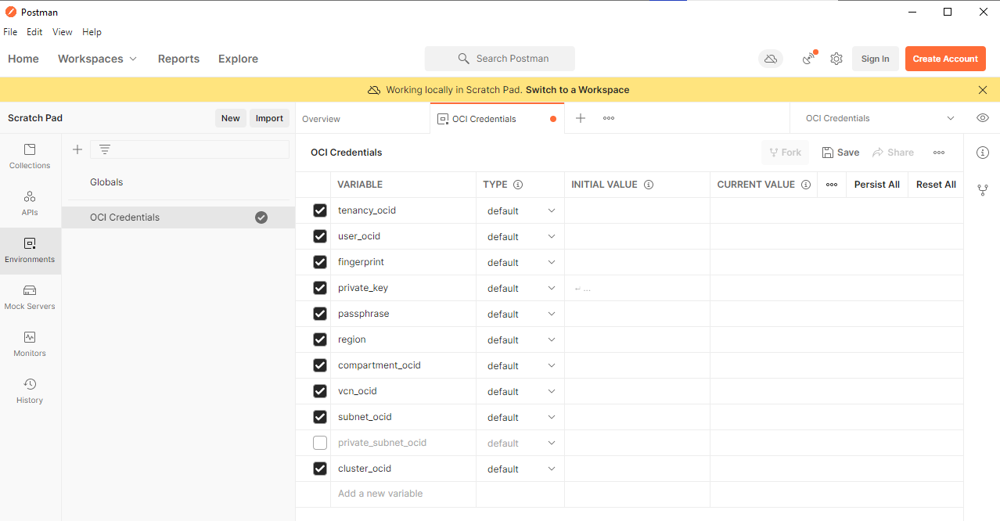

1. tenancy_ocid 

    1. To get the **tenancy_ocid**, open the OCI Console, click the **Profile** icon in the upper right corner, then select **Tenancy: *name***
    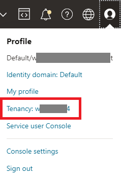

    2. Copy the **OCID** on this page and add it to your Postman OCI Credentials in the **tenancy_ocid CURRENT VALUE** field.
    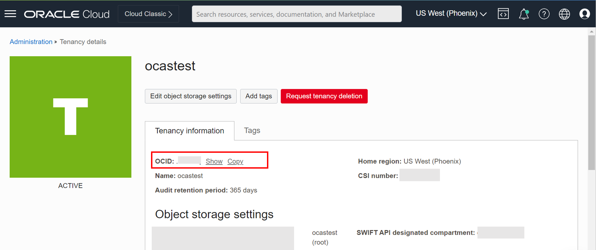
    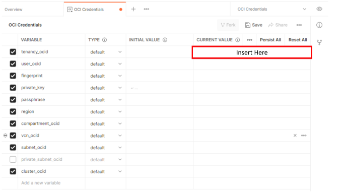

1. user_ocid
    1. To get the **user_ocid**, go back to the OCI Console, click the **Profile** icon, then select **your user name**
    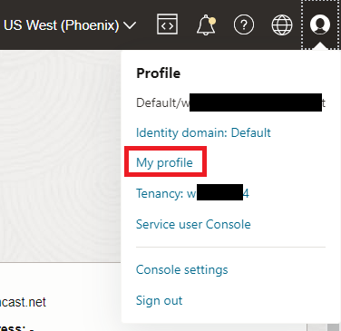

    2. The *User Details* page opens. Copy the **OCID** on this page and add it to your Postman OCI Credentials in the **user_ocid CURRENT VALUE** field.
    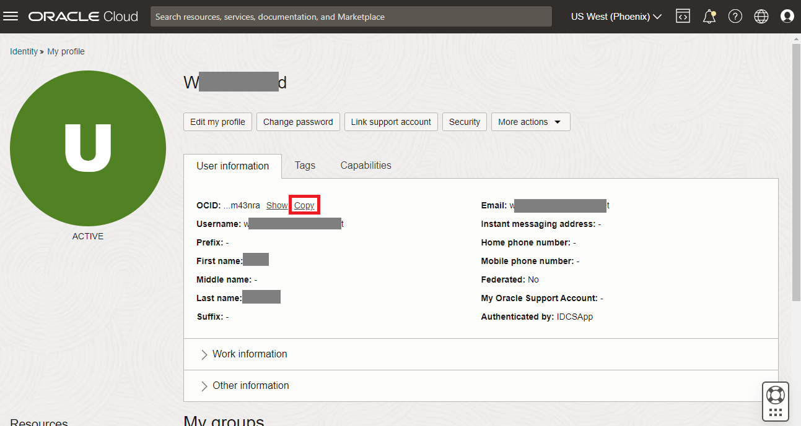
    

1. fingerprint & private_key

    1. Open the OCI Console, click the **Profile** icon, then select **My profile** (or in older tenancies, it will be your user name).
     TODO

    2. The User Details page opens. Under Resources, on the lower left side of the page, select **API Keys**
    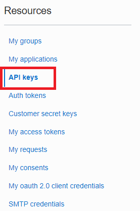 TODO

    3. Click the **Add API Key** button
    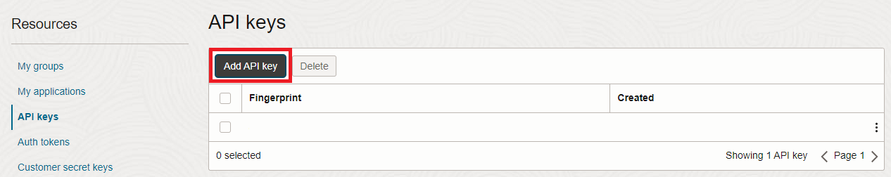

    4. The Add API Key dialog box opens. Select option: **Generate API Key Pair**
    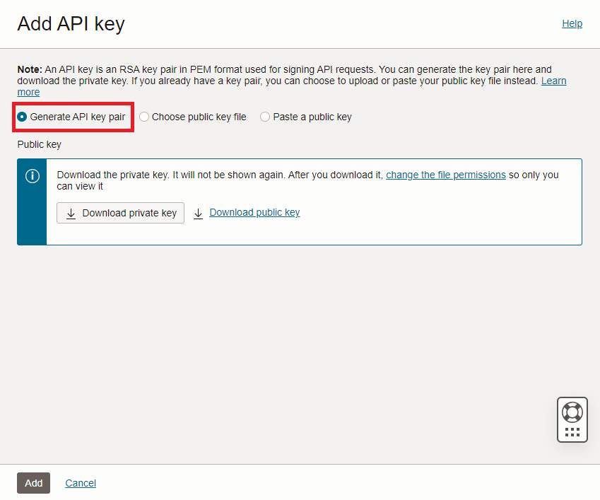

    5. Click the **Download Private Key** button and save the file to you local computer. Save the location of the private key file (*username-date*.pem) to your text file to be used in the next lab.
    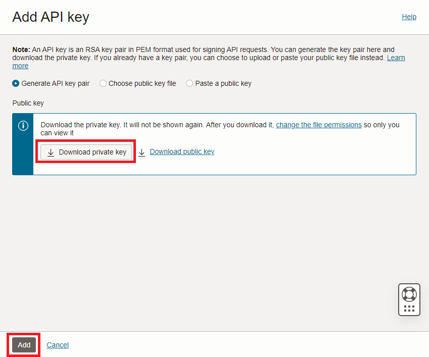

    6. Click the **Add** button in the *Add API Key* dialog. The *Configuration File Preview* dialog opens.

    7. Click **Close** on the *Configuration File Preview* dialog

    8. Copy the **fingerprint** for the API Key that you just created and add it to the **fingerprint CURRENT VALUE** field of the Postman Environment.
    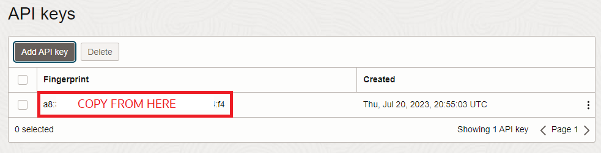
    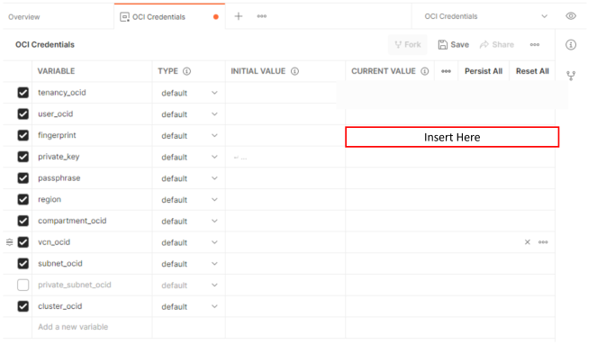

    9. On your local computer, navigate to the **private key file (\<username-date>.pem)** that you downloaded when getting the fingerprint. Open it in a text editor, copy it's contents, and paste them into the **private_key CURRENT VALUE** field of the Postman Environment.
    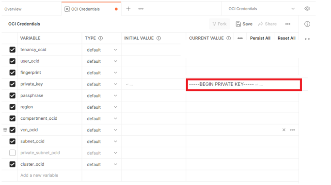

1. region

    1. In the OCI Console, note the **home region** displayed near the upper right corner of the page (e.g. US East (Ashburn)). Find the corresponding **Region Identifier** displayed in the table below (e.g. us-ashburn-1) and copy and paste it into the **region CURRENT VALUE** field of the Postman Environment. Overwrite the default value if your region is different.
    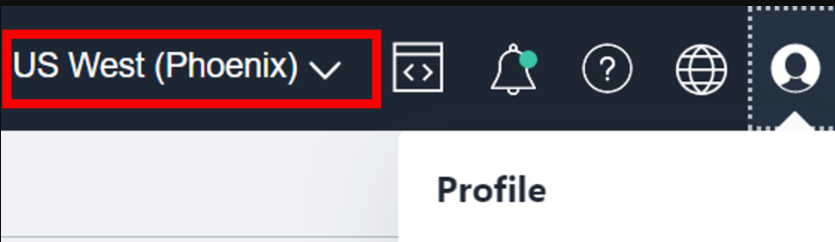


        | Region Name |	Region Identifier |	Region Location |
        |-------------|-------------------|-----------------|
        |Australia East (Sydney) |	ap-sydney-1 |	Sydney, Australia |
        |Australia Southeast (Melbourne) |	ap-melbourne-1 |	Melbourne, Australia |
        |Brazil East (Sao Paulo) |	sa-saopaulo-1 |	Sao Paulo, Brazil |
        |Brazil Southeast (Vinhedo) |	sa-vinhedo-1 |	Vinhedo, Brazil |
        |Canada Southeast (Montreal) |	ca-montreal-1 |	Montreal, Canada |
        |Canada Southeast (Toronto) |	ca-toronto-1 |	Toronto, Canada |
        |Chile (Santiago) |	sa-santiago-1 |	Santiago, Chile |
        |France South (Marseille) |	eu-marseille-1 |	Marseille, France |
        |Germany Central (Frankfurt) |	eu-frankfurt-1 |	Frankfurt, Germany |
        |India South (Hyderabad) |	ap-hyderabad-1 |	Hyderabad, India |
        |India West (Mumbai) |	ap-mumbai-1 |	Mumbai, India |
        |Israel Central (Jerusalem) |	il-jerusalem-1 |	Jerusalem, Israel |
        |Italy Northwest (Milan) |	eu-milan-1 |	Milan, Italy |
        |Japan Central (Osaka) |	ap-osaka-1 |	Osaka, Japan |
        |Japan East (Tokyo) |	ap-tokyo-1 |	Tokyo, Japan |
        |Netherlands Northwest (Amsterdam) |	eu-amsterdam-1 |	Amsterdam, Netherlands |
        |Saudi Arabia West (Jeddah) |	me-jeddah-1 |	Jeddah, Saudi Arabia |
        |Singapore (Singapore) |	ap-singapore-1 |	Singapore,Singapore |
        |South Africa Central (Johannesburg) |	af-johannesburg-1 |	Johannesburg, South Africa |
        |South Korea Central (Seoul) |	ap-seoul-1 |	Seoul, South Korea |
        |South Korea North (Chuncheon) |	ap-chuncheon-1 |	Chuncheon, South Korea |
        |Sweden Central (Stockholm) |	eu-stockholm-1 |	Stockholm, Sweden |
        |Switzerland North (Zurich) |	eu-zurich-1 |	Zurich, Switzerland |
        |UAE Central (Abu Dhabi) |	me-abudhabi-1 |	Abu Dhabi, UAE |
        |UAE East (Dubai) |	me-dubai-1 |	Dubai, UAE |
        |UK South (London) |	uk-london-1 |	London, United Kingdom |
        |UK West (Newport) |	uk-cardiff-1 |	Newport, United Kingdom |
        |US East (Ashburn) |	us-ashburn-1 |	Ashburn, VA |
        |US West (Phoenix) |	us-phoenix-1 |	Phoenix, AZ |
        |US West (San Jose) |	us-sanjose-1 |	San Jose, CA |

        >If you don't see your region, look here: https://docs.oracle.com/en-us/iaas/Content/General/Concepts/regions.htm        
        
        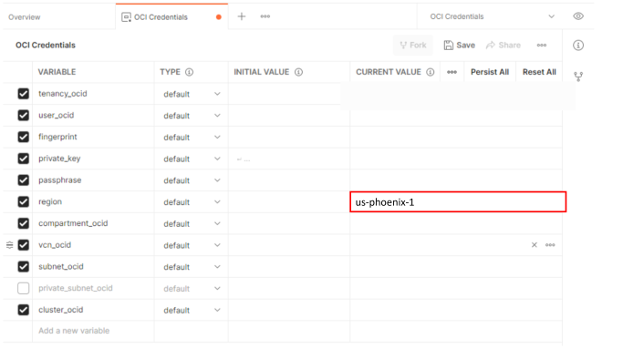


1. compartment_ocid

    1. Go to the OCI Console and use the hamburger menu to select **Identity & Security**, then, under *Identity*, select **Compartments**.
    

    2. The *Compartments* page is displayed and lists all of the compartments. If you are using a new trial tenancy, you will have a root compartment and *ManagedCompartmentForPaaS*. **Click the name of the root compartment** you configured in Lab 2 to access the OCI Document Understanding service.

    3. On the *Compartment details* page, click **Copy** next to the compartment OCID.
    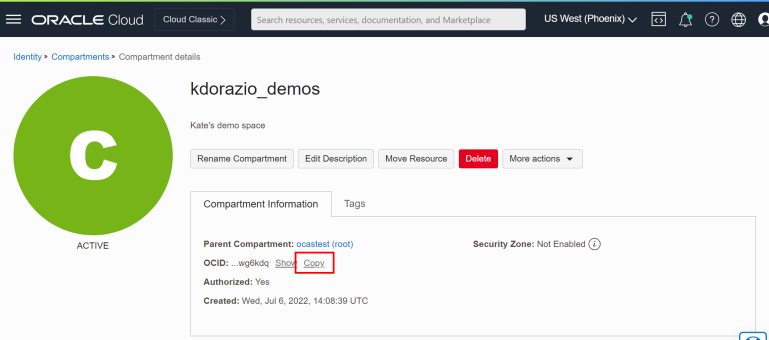

    4. Paste the OCID into the **compartment_ocid CURRENT VALUE** field of the Postman Environment.
    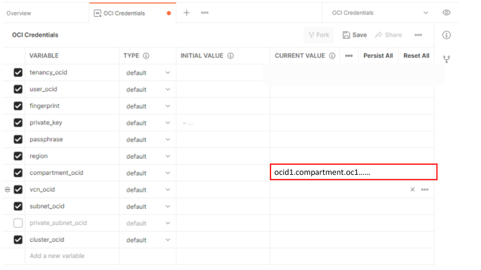

    1. Also save the compartment OCID to your text file for reference later.

1. In POSTMAN, click the **Persist All** button to save the Current Value to the Initial Value.

    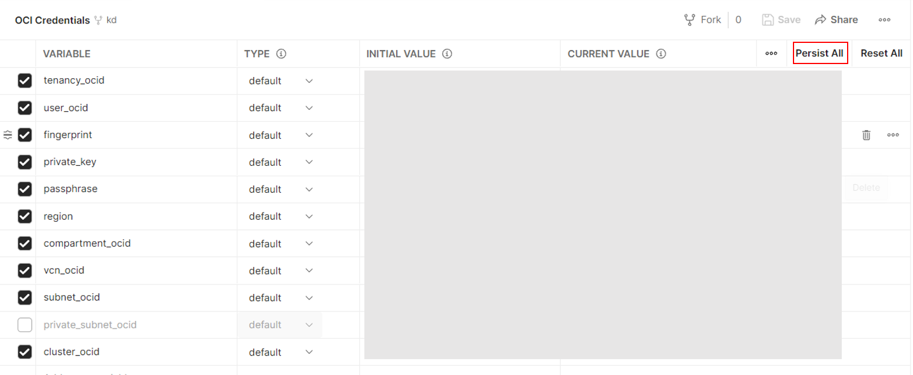

1. In POSTMAN, click the **Save** button to save all of the OCI Credentials that you just entered.
    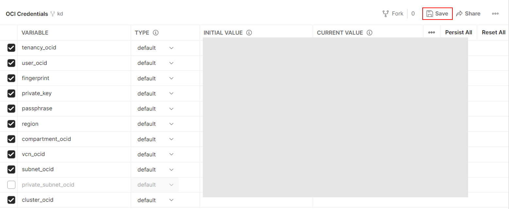

## Task 3: Import the Document Understanding API collection

1. Import the Document Understanding API Collection file (**DocumentUnderstanding API.postman_collection.json**) into Postman running on your local machine by selecting **Collections** on the left side of the  screen then clicking the **Import** button at the top.
  

2. In the *Import* dialog, click the **Upload Files** button and select the json file you exported in Task 1 (**DocumentUnderstanding API.postman_collection.json**).

## Task 4: Invoke the Processor Job REST API

In this task you'll call the Processor Job REST API.

1. In POSTMAN, select **Collections**, then expand *Document Understanding API* then *actions* then click **processor Jobs**. Then select the **Body** tab under *POST*.
  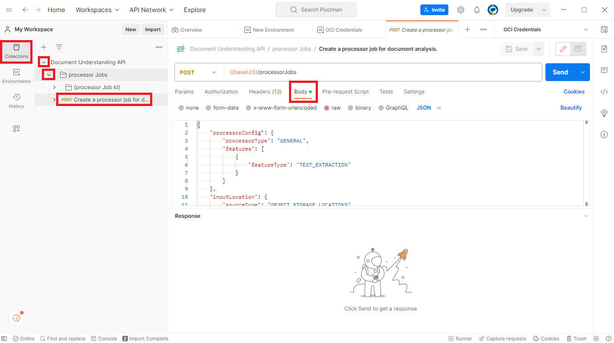

2. Replace the contents of the **Body** with the following:

    ```http
    <copy>
    {
      "processorConfig": {
        "processorType": "GENERAL",
        "features": [
          {
            "featureType": "TEXT_EXTRACTION",
            "generateSearchablePdf": true
          }
        ]
      },
      "inputLocation": {
        "sourceType": "OBJECT_STORAGE_LOCATIONS",
        "objectLocations": [
          {
            "source": "OBJECT_STORAGE",
            "namespaceName": ##todo
            "bucketName": ##todo
            "objectName": ##todo
          }
        ]
      },
      "compartmentId": "{{compartmentId}}"
      "outputLocation": {
        "namespaceName": ##todo
        "bucketName": ##todo
        "prefix": ##todo
      }
    }
    </copy>
    ```
    In the next steps, you will insert the object storage details for the document you want to analyze
    
1. To get the namespace name, open the OCI Console, click the **Profile** icon and select **Tenancy: *name***
      

1. Copy the **Object Storage Namespace** value and paste it into the Body in POSTMAN as the value for *namespaceName*
      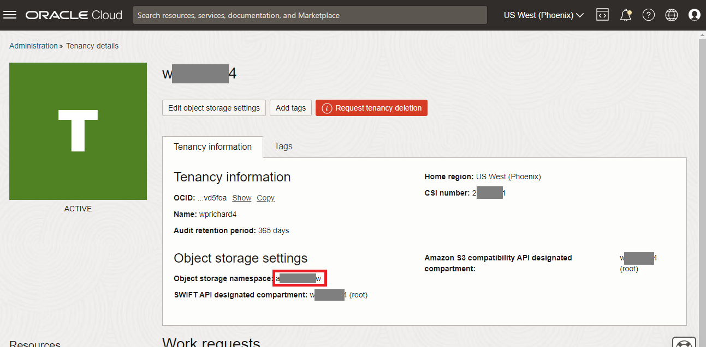

1. Save **Object Storage Namespace** to your text file for later reference.

1. *bucketName* should be the name of the bucket where you uploaded the sample image for this lab, i.e **docu-bucket**. Refer to your text file for the name.

1. *objectName* should be **"invoice-sample.png"** (This is one of the files you uploaded in Lab 2.)

1. Now, you will insert your location details for where you want your results to be stored. For this lab, we're using Text Extraction, which will return a JSON object to the object storage location of your choosing. Below is what you need to define:

    - *Object Storage Namespace*: use the namespace from the previous step

    - *bucketName*: should be the name of the bucket where you want your results stored - you can use the same bucket, i.e. **docu-bucket**

    - *prefix*: use **results-postman**


1. In POSTMAN, click the **Send** button. The response should return in a few seconds with a job ID. Note the job ID for the next task.


## Task 5: Get Job Details
In this task, you'll call the Document AI synchronous REST API, using POSTMAN, to get the status of the job you just initiated.

1. In the *Document Understanding collection*, under *Processor Jobs*, click **Get Details of a processor Job**.

2. Add the JobId response from the previous task to the end of the URL and click **Send**
  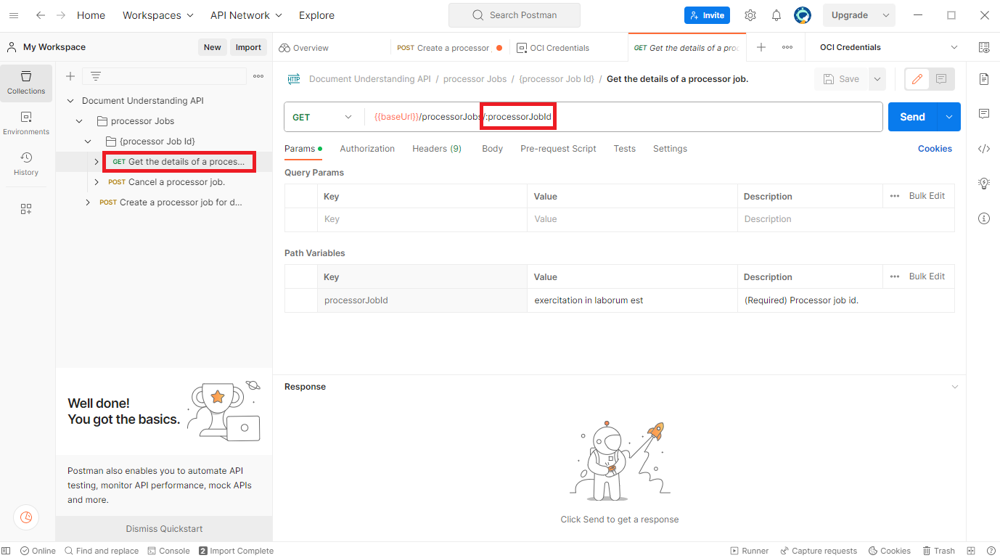

1. Review the response and notice the structure of the data including *lifecycleDetails* and *percentComplete*
TODO
    ```http
    {
      "compartmentId": "ocid1.compartment.oc1..aaaaaaaabcdefghijk0123456789lmnopqrstuvwxyz9876543210abcdefg",
      "features": [
        {
          "featureType": "TEXT_EXTRACTION"
        }
      ],
      "id": "pariat",
      "lifecycleState": "IN_PROGRESS",
      "outputLocation": {
        "bucketName": "docu-bucket",
        "namespaceName": "axabc9efgh5x",
        "prefix": "results"
      },
      "timeAccepted": "1967-10-23T03:20:17.411Z",
      "displayName": "amet est qui",
      "documentType": "OTHERS",
      "inputLocation": {
        "sourceType": "OBJECT_LIST_INLINE_INPUT_LOCATION"
      },
      "isZipOutputEnabled": false,
      "language": "ENG",
      "lifecycleDetails": "SUCCEEDED",
      "percentComplete": 71.68026659053332,
      "timeFinished": "1944-01-15T08:55:51.710Z",
      "timeStarted": "1987-12-05T05:34:39.081Z"
    }
    ```
1. In the cloud console, use the burger menu to navigate to **Storage**, then Select **Buckets**

1. Ensure your *Compartment* is set to **docu-lab**, then click on the name of the bucket you created for the lab, i.e. **docu-bucket**

1. On the *Bucket details* page, scroll down to *Objects* and click on the **results-postman** folder

1. In the objects listed in the folder, you'll find another folder with the name of the job ID. Click the job ID folder to open it. 

1. Keep expanding the subfolders until you find *sample-invoice.PNG.json*. That JSON file includes all the text extracted from the original document. Use the 3-dot menu on the right end of the row to download it and view it.
  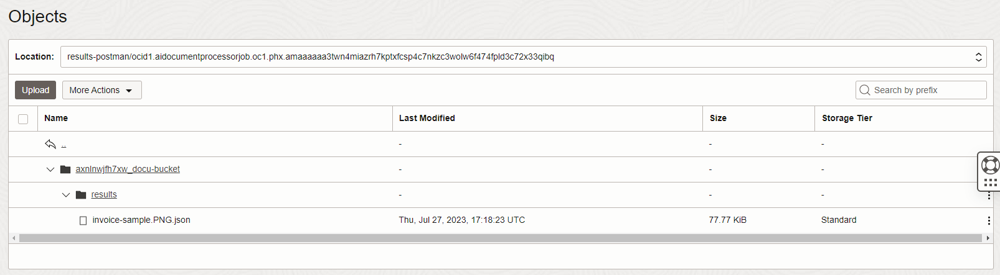 TODO

## Summary
You configured Postman to connect to your OCI tenancy and you initiated a text extraction job using the REST API then obtained the results of the job. You can use this same approach to test other REST API requests. The REST API reference can be found [here](https://docs.oracle.com/en-us/iaas/api/) under *Document Understanding API*. <br>
You may now **[proceed to next lab](#next)**.

## Acknowledgements
* **Authors**
    * Kate D'Orazio - Product Manager


* **Last Updated By/Date**
    * Wes Prichard, Product Manager, July 2023
