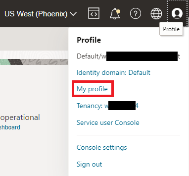
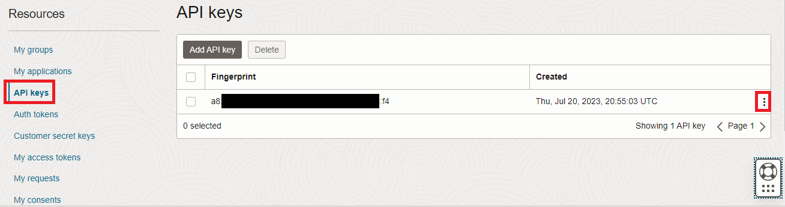
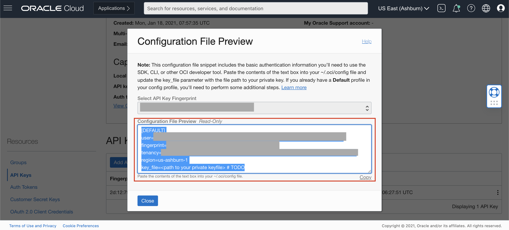
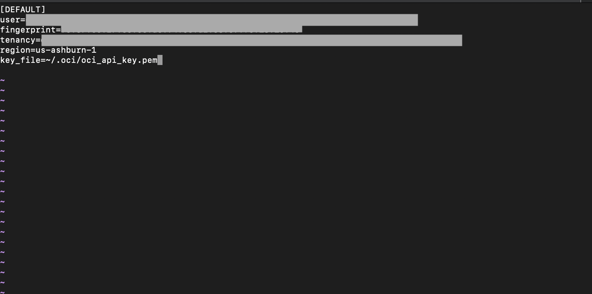

# Lab 4: Access OCI Document Understanding with the OCI Python SDK

## Introduction

In this lab you will use the OCI Python SDK to extract information from documents.

The Python SDK can be found [here](https://docs.oracle.com/en-us/iaas/Content/API/SDKDocs/pythonsdk.htm#SDK_for_Python).

*Estimated Time*: 30 minutes

### Objectives:
* Learn how to use the OCI Python SDK to communicate with the Document Understanding service.

### Prerequisites:
* You will use the text file of tenancy configuration you created and updated in previous labs
* You will need to use the API key you created in Lab 3

## Task 1: Setup API Signing Key and Config File
If this is your first time using the OCI SDK, you'll need to create a config file for authentication. (If, prior to this workshop, you've done this for the tenancy you're using, you can skip to the next task.)

1. To create the .oci folder, open an admin command prompt or Terminal and run the following command.

    Windows:
    ```
    <copy>mkdir %HOMEDRIVE%%HOMEPATH%\.oci</copy>
    ```

    Mac OS / Linux:
    ```
    <copy>mkdir ~/.oci</copy>
    ```

1. In the cloud console, open the **Profile** menu and click **My profile** (or in older tenancies, your user name).

    

1. Under *Resources*, select **API keys**. The fingerprint for your previously-generated key is listed under *API keys*.

    > **Note**: When you completed Lab 3, you created an API Key. We'll use that same API key here.
    
    

1. Use the 3 dot icon on the row where the key is listed and select **View Configuration file**. Click **Copy** to copy the values shown on the *Configuration File Preview*. You will paste them into a file in the next step.

          

1. Create a file on your local computer with the name *config* (with no extension) in the .oci folder and paste the values copied in the previous step. 

1. Locate the *\*.pem* keyfile that you downloaded in Lab 3 and copy it to the *.oci* folder. The path where you downloaded it should be in your text file.

1. Replace <**path to your private keyfile**> with the path of your generated private key file. You can use this syntax: *key_file=~/.oci/mykeyfile.pem*. Save your config file changes.

      


    > To know more, visit [Generating API KEY](https://docs.oracle.com/en-us/iaas/Content/API/Concepts/apisigningkey.htm) and [SDK and CLI Configuration File](https://docs.oracle.com/en-us/iaas/Content/API/Concepts/sdkconfig.htm#SDK_and_CLI_Configuration_File)

## Task 2: Run Python Code Sample

1. Create a new file on your local machine called *invoicekv.py* in the 'C:\Users\\*user*\AppData\Local\Programs\Python\\*Python version*\Scripts' folder on Windows, or add it to your Desktop if you are using a Mac.

2. Copy the python code from below and paste it into *invoicekv.py*. <br>
The following sample code involves essentially three steps. First, it calls *CreateProcessorJob* to process your sample invoice. Second, it calls *GetProcessorJob* to get the status of the job. Third, it calls *GetObject* to get the response from Object Storage.
        
    ```python
    <copy>
    # Import Packages

    import oci
    import uuid
    import base64

    # Setup basic variables
    # Auth Config
    CONFIG_PROFILE = "DEFAULT"
    config = oci.config.from_file('~/.oci/config', CONFIG_PROFILE)

    # Compartment where processor job will be created (required)
    COMPARTMENT_ID = "enter-your-compartment-ocid-here"  # e.g. "ocid1.compartment.oc1..aaaaaaaae5j73axsja5fnahbn23ilop3ynjkcg77mcvgryddz4pkh2t5ppaq";

    def create_processor_job_callback(times_called, response):
        print("Waiting for processor lifecycle state to go into succeeded state:", response.data)

    # Setup input location where document being processed is stored.
    object_location = oci.ai_document.models.ObjectLocation()
    object_location.namespace_name = "<enter-your-objectstorage-namespace-here>"  # e.g. "axabc9efgh5x"
    object_location.bucket_name = "docu-bucket"  # e.g "docu-bucket"
    object_location.object_name = "enter-your-object-name-here"  # e.g "invoice-white-clover.tif"

    aiservicedocument_client = oci.ai_document.AIServiceDocumentClientCompositeOperations(oci.ai_document.AIServiceDocumentClient(config=config))

    # Document Key-Value extraction Feature
    key_value_extraction_feature = oci.ai_document.models.DocumentKeyValueExtractionFeature()

    # Setup the output location where processor job results will be created
    output_location = oci.ai_document.models.OutputLocation()
    output_location.namespace_name = "enter-your-objectstorage-namespace-here"  # e.g. "axabc9efgh5x"
    output_location.bucket_name = "docu-bucket"
    output_location.prefix = "results-python"

    # Create a processor_job for invoice key_value_extraction feature. 
    # Note: If you want to use another key value extraction feature, set document_type to "RECIEPT" "PASSPORT" or "DRIVER_ID". If you have a mix of document types, you can remove document_type
    create_processor_job_details_key_value_extraction = oci.ai_document.models.CreateProcessorJobDetails(
                                                        display_name=str(uuid.uuid4()),
                                                        compartment_id=COMPARTMENT_ID,
                                                        input_location=oci.ai_document.models.ObjectStorageLocations(object_locations=[object_location]),
                                                        output_location=output_location,
                                                        processor_config=oci.ai_document.models.GeneralProcessorConfig(features=[key_value_extraction_feature],
                                                                                                                    document_type="INVOICE"))

    print("Calling create_processor with create_processor_job_details_key_value_extraction:", create_processor_job_details_key_value_extraction)
    create_processor_response = aiservicedocument_client.create_processor_job_and_wait_for_state(
        create_processor_job_details=create_processor_job_details_key_value_extraction,
        wait_for_states=[oci.ai_document.models.ProcessorJob.LIFECYCLE_STATE_SUCCEEDED],
        waiter_kwargs={"wait_callback": create_processor_job_callback})

    print("processor call succeeded with status: {} and request_id: {}.".format(create_processor_response.status, create_processor_response.request_id))
    processor_job: oci.ai_document.models.ProcessorJob = create_processor_response.data
    print("create_processor_job_details_key_value_extraction response: ", create_processor_response.data)

    print("Getting defaultObject.json from the output_location")
    object_storage_client = oci.object_storage.ObjectStorageClient(config=config)
    get_object_response = object_storage_client.get_object(namespace_name=output_location.namespace_name,
                                                        bucket_name=output_location.bucket_name,
                                                        object_name="{}/{}/{}_{}/results/{}.json".format(
                                                            output_location.prefix, processor_job.id,
                                                            object_location.namespace_name,
                                                            object_location.bucket_name,
                                                            object_location.object_name))
    print(str(get_object_response.data.content.decode()))
    </copy>
    ```

3. Edit *invoicekv.py* and update/confirm all of the below variables using values you previously saved to your text file. Then save *invoicekv.py*.
    
    - COMPARTMENT_ID = "\<enter-your-compartment-ocid-here\>"
        - use your lab compartment OCID
    - object_location.namespace_name = "\<enter-your-objectstorage-namespace-here\>"  
        - e.g. "axabc9efgh5x"
    - object_location.bucket_name = "docu-bucket"
    - object_location.object_name = "invoice-white-clover.tif"  
    - output_location.namespace_name = "\<enter-your-objectstorage-namespsace-here>"  
        - e.g. "axabc9efgh5x"
    - output_location.bucket_name = "docu-bucket"
    - output_location.prefix = "results-python"
    
1. Open a command line on your local computer and navigate to your Python installation folder: (C:\Users\<user>\AppData\Local\Programs\Python\*Python version* on Windows) 

1. Execute the following command to verify you are running python 3.6, 3.7, 3.8, or 3.9

    ```
    <copy>python --version</copy>
    ```

4. Execute *invoicekv.py* by running the following command. (You might need to modify the command if you put *invoicekv.py* in a different location.)
    
    Windows:
    ```
    <copy>python Scripts\invoicekv.py</copy>
    ```
        
    Mac OS / Linux:
    ```
    <copy>python3 scripts/invoicekv.py</copy>
    ```

5. You will see the following results (edited for brevity):
    ```json
        Calling create_processor with create_processor_job_details_key_value_extraction: {
        "compartment_id": "ocid1.tenancy.oc1..aaaaaaaatadts4ja4ibgh7zjroqrogf7m7rqjse5myolrxkbjgyznmvd5foa",
        "display_name": "ba4b98e0-89a1-4bd4-b61d-c6fc654eab1f",
        "input_location": {
            "object_locations": [
            {
                "bucket_name": "docu_bucket",
                "namespace_name": "axnlnwjfh7xw",
                "object_name": "invoice-white-clover.tif"
            }
            ],
            "source_type": "OBJECT_STORAGE_LOCATIONS"
        },
        "output_location": {
            "bucket_name": "docu_bucket",
            "namespace_name": "axnlnwjfh7xw",
            "prefix": "results-python"
        },
        "processor_config": {
            "document_type": "INVOICE",
            "features": [
            {
                "feature_type": "KEY_VALUE_EXTRACTION",
                "model_id": null,
                "tenancy_id": null
            }
            ],
            "is_zip_output_enabled": null,
            "language": null,
            "processor_type": "GENERAL"
        }
        }
        processor call succeeded with status: 200 and request_id: 81810E0AD8684EA6B6727BD0C64BF4C8/A0D666AA8310E2A0DBD2D5F26AF576AB/60A1B97C0E4B6FB717248B20742348F7.
        create_processor_job_details_key_value_extraction response:  {
        "compartment_id": "ocid1.tenancy.oc1..aaaaaaaatadts4ja4ibgh7zjroqrogf7m7rqjse5myolrxkbjgyznmvd5foa",
        "display_name": "ba4b98e0-89a1-4bd4-b61d-c6fc654eab1f",
        "id": "ocid1.aidocumentprocessorjob.oc1.phx.amaaaaaa3twn4miahmcgwnzmol67sqz4k7wngwfflg4pliv23zziv3xpv6xq",
        "input_location": {
            "object_locations": [
            {
                "bucket_name": "docu_bucket",
                "namespace_name": "axnlnwjfh7xw",
                "object_name": "invoice-white-clover.tif"
            }
            ],
            "source_type": "OBJECT_STORAGE_LOCATIONS"
        },
        "lifecycle_details": null,
        "lifecycle_state": "SUCCEEDED",
        "output_location": {
            "bucket_name": "docu_bucket",
            "namespace_name": "axnlnwjfh7xw",
            "prefix": "results-python"
        },
        "percent_complete": 100.0,
        "processor_config": {
            "document_type": "INVOICE",
            "features": [
            {
                "feature_type": "KEY_VALUE_EXTRACTION",
                "model_id": null,
                "tenancy_id": null
            }
            ],
            "is_zip_output_enabled": false,
            "language": null,
            "processor_type": "GENERAL"
        },
        "time_accepted": "2023-07-25T19:17:02.014000+00:00",
        "time_finished": "2023-07-25T19:17:02.014000+00:00",
        "time_started": "2023-07-25T19:17:02.014000+00:00"
        }
        Getting defaultObject.json from the output_location
        {
        "documentMetadata" : {
            "pageCount" : 1,
            "mimeType" : "image/tiff"
        },
        "pages" : [ {
            "pageNumber" : 1,
            "dimensions" : {
            "width" : 2550.0,
            "height" : 3300.0,
            "unit" : "PIXEL"
            },
            "detectedDocumentTypes" : null,
            "detectedLanguages" : null,
            "words" : [ {
            "text" : "INVOICE",
            "confidence" : 0.9389687,
            "boundingPolygon" : {
                "normalizedVertices" : [ {
                "x" : 0.6224614162071078,
                "y" : 0.05068707090435606
                }, {
                "x" : 0.8349716605392157,
                "y" : 0.05061941435842803
                }, {
                "x" : 0.835078125,
                "y" : 0.07926487778172349
                }, {
                "x" : 0.6225678806678921,
                "y" : 0.07933253432765151
                } ]
            }
            },
        ...
            "lines" : [ {
            "text" : "INVOICE",
            "confidence" : 0.9389687,
            "boundingPolygon" : {
                "normalizedVertices" : [ {
                "x" : 0.6224614162071078,
                "y" : 0.05068707090435606
                }, {
                "x" : 0.8349716605392157,
                "y" : 0.05061941435842803
                }, {
                "x" : 0.835078125,
                "y" : 0.07926487778172349
                }, {
                "x" : 0.6225678806678921,
                "y" : 0.07933253432765151
                } ]
            },
            "wordIndexes" : [ 0 ]
            },
        ...
            "tables" : null,
            "documentFields" : [ {
            "fieldType" : "KEY_VALUE",
            "fieldLabel" : {
                "name" : "VendorNameLogo",
                "confidence" : 0.9648226
            },
            "fieldName" : null,
            "fieldValue" : {
                "valueType" : "STRING",
                "text" : "White Clover Markets",
                "confidence" : null,
                "boundingPolygon" : {
                "normalizedVertices" : [ {
                    "x" : 0.20825050612017762,
                    "y" : 0.10135752361263778
                }, {
                    "x" : 0.5072710343903186,
                    "y" : 0.1013130049272017
                }, {
                    "x" : 0.5072756647974082,
                    "y" : 0.11988379274922302
                }, {
                    "x" : 0.20825513652726715,
                    "y" : 0.1199283114346591
                } ]
                },
                "wordIndexes" : [ 1, 2, 3 ],
                "value" : "White Clover Markets"
            }
            },
        ...
        "detectedDocumentTypes" : null,
        "detectedLanguages" : null,
        "documentClassificationModelVersion" : null,
        "languageClassificationModelVersion" : null,
        "textExtractionModelVersion" : "1.13.39",
        "keyValueExtractionModelVersion" : "1.20.54",
        "tableExtractionModelVersion" : null,
        "errors" : null,
        "searchablePdf" : null
        }
    ```

1. Confirm the results by looking at the source image on your local computer.

1. You can also take a look at the JSON output in your Object Storage bucket under the prefix you specified in the python file (i.e. *results-python*).

Congratulations on completing this workshop!

## Learn More
* To try other features, you can refer to the full collection of sample python code on Github [here](https://github.com/oracle-samples/oci-data-science-ai-samples/tree/master/ai_services/document_understanding/python)

## Cleanup
If you want to remove the items added to your tenancy in this lab, you can use the following procedures to delete the object storage bucket, compartment, and policy.

1. From the OCI console burger menu, click **Storage** then **Buckets**.

1. In the *Compartment* dropdown, select the lab compartment (*docu-lab*). 

1. Click on the name of the bucket created in this workshop (*docu-bucket*)

1. On the *Bucket details* page, click **Delete**. Confirm that you want to delete the bucket when prompted

1. From the OCI console burger menu, select **Identity & Security** then  **Compartments**

1. Click on the name of the compartment created in this workshop (*docu-lab*)

1. On the *Compartment details* page, click **Delete**. Confirm that you want to delete the compartment when prompted.

1. From the OCI console burger Menu, select to **Identity & Security** then **Policies**

1. Click **Policies** if needed to see the list of policies. Also ensure the root compartment is selected.

1. Click on the name of the policy created in this workshop (*document-understanding-access-policy*)

1. On the *Policy details* page, click **Delete**. Confirm that you want to delete the policy when prompted.


## Acknowledgements
* **Authors** - Kate D'Orazio - Product Manager

* **Last Updated By/Date** - Wes Prichard, Product Manager, July 2023
