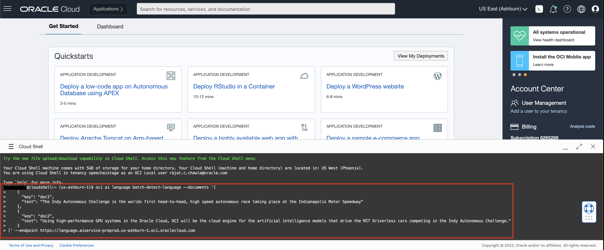
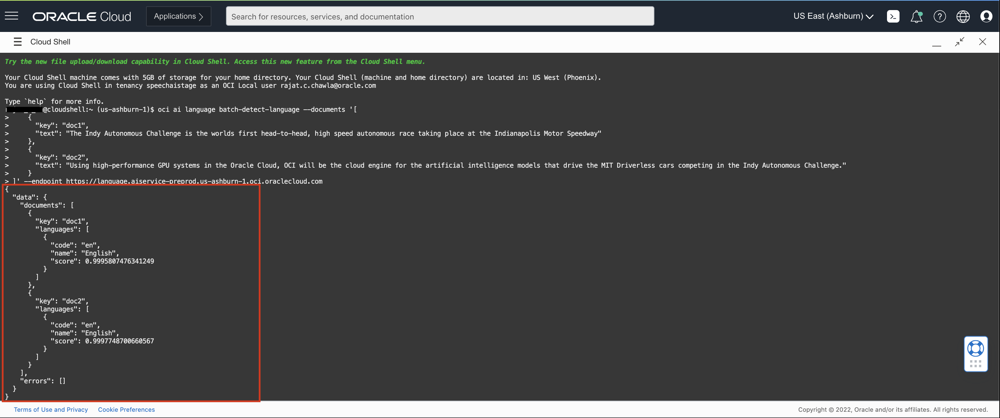

# Lab 2: Access OCI Language with OCI CLI

## Introduction

OCI Language can be called from the OCI Command Line Interface (CLI).

In this lab session, we will show several code snippets to access our service with CLI.

You do not need to execute these codes, but review them to understand what information and steps are needed to implement your own integration.

*Estimated Lab Time*: 10 minutes

### Objectives:

* Learn how to use CLI to communicate with our language service endpoints.

### Prerequisites:
* Familiar with Python programming is required
* Have a Python environment ready in local
* Familiar with local editing tools, vi and nano
* Installed with Python libraries: `oci` and `requests`
* If you don't have the permission to access the cloud shell, ask your administrator to add the below policy
    ```
    <copy>allow any-user to use cloud-shell in tenancy</copy>
    ```

## CLI Setup

The CLI is a small-footprint tool that you can use on its own or with the Console to complete Oracle Cloud Infrastructure tasks. The CLI provides the same core functionality as the Console, plus additional commands. Some of these, such as the ability to run scripts, extend Console functionality.


## **TASK 1:** Navigate to the Cloud Shell

### 1: Navigate to Cloud Shell

Log into OCI Cloud Console. Navigate to Cloud Shell Icon on the top right and click it.
    

### 2: Enter Language CLI Command

Enter any one of the Language Pre-Deployed CLI commands you want to execute.
    


### 3: View Result

The Language service displays the results as shown below:
    


<!-- ## **TASK 3:**To Install CLI in your Local
To install and use the CLI, follow [CLI](https://docs.oracle.com/en-us/iaas/Content/API/Concepts/cliconcepts.htm)


For information about using the CLI, see [Command Line Interface (CLI)](https://docs.oracle.com/iaas/Content/API/Concepts/cliconcepts.htm#Command_Line_Interface_CLI).
For a complete list of flags and options available for CLI commands, see the [Command Line Reference](https://docs.oracle.com/iaas/tools/oci-cli/latest/oci_cli_docs/). -->


## **TASK 2:** Try issuing some of the OCI Language commands

### 1. Language Detection
Run this command : oci ai language batch-detect-language --documents, -? | -h | --help
    ```
    <copy>oci ai language batch-detect-language --documents '[
    {                
      "key": "doc1",
      "text": "The Indy Autonomous Challenge is the worlds first head-to-head, high speed autonomous race taking place at the Indianapolis Motor Speedway"
    },
    {
      "key": "doc2",
      "text": "Using high-performance GPU systems in the Oracle Cloud, OCI will be the cloud engine for the artificial intelligence models that drive the MIT Driverless cars competing in the Indy Autonomous Challenge."
    }
]'</copy>
    ```

### 2. Named Entity Recognition
Run this command : oci ai language batch-detect-entities --documents, -? | -h | --help, --is-pii
    ```
    <copy>oci ai language batch-detect-entities --documents '[
    {                
      "key": "doc1",
      "text": "The Indy Autonomous Challenge is the worlds first head-to-head, high speed autonomous race taking place at the Indianapolis Motor Speedway"
    },
    {
      "key": "doc2",
      "text": "Using high-performance GPU systems in the Oracle Cloud, OCI will be the cloud engine for the artificial intelligence models that drive the MIT Driverless cars competing in the Indy Autonomous Challenge."
    }
]'
</copy>
    ```

### 3. Key Phrase Extraction
Run this command : oci ai language batch-detect-key-phrases --documents, -? | -h | --help
    ```
    <copy>oci ai language batch-detect-key-phrases --documents '[
    {                
      "key": "doc1",
      "text": "The Indy Autonomous Challenge is the worlds first head-to-head, high speed autonomous race taking place at the Indianapolis Motor Speedway"
    },
    {
      "key": "doc2",
      "text": "Using high-performance GPU systems in the Oracle Cloud, OCI will be the cloud engine for the artificial intelligence models that drive the MIT Driverless cars competing in the Indy Autonomous Challenge."
    }
]'</copy>
    ```

### 4. Sentiment Analysis
Run this command : oci ai language batch-detect-sentiments --documents, -? | -h | --help
    ```
    <copy>oci ai language batch-detect-sentiments --documents '[
    {                
      "key": "doc1",
      "text": "The Indy Autonomous Challenge is the worlds first head-to-head, high speed autonomous race taking place at the Indianapolis Motor Speedway"
    },
    {
      "key": "doc2",
      "text": "Using high-performance GPU systems in the Oracle Cloud, OCI will be the cloud engine for the artificial intelligence models that drive the MIT Driverless cars competing in the Indy Autonomous Challenge."
    }
]'</copy>
    ```

### 5. Text Classification
Run this command : oci ai language batch-detect-text-classification --text, -? | -h | --help
    ```
    <copy>oci ai language batch-detect-text-classification --documents '[
    {                
      "key": "doc1",
      "text": "The Indy Autonomous Challenge is the worlds first head-to-head, high speed autonomous race taking place at the Indianapolis Motor Speedway"
    },
    {
      "key": "doc2",
      "text": "Using high-performance GPU systems in the Oracle Cloud, OCI will be the cloud engine for the artificial intelligence models that drive the MIT Driverless cars competing in the Indy Autonomous Challenge."
    }
]'</copy>
    ```


To know more about CLI, follow [CLI](https://docs.oracle.com/en-us/iaas/Content/API/Concepts/cliconcepts.htm)

Congratulations on completing this lab!

[Proceed to the next section](#next).

## Acknowledgements
* **Authors**
    * Rajat Chawla  - Oracle AI Services
    * Ankit Tyagi -  Oracle AI Services
* **Last Updated By/Date**
    * Rajat Chawla  - Oracle AI Services, February 2021
