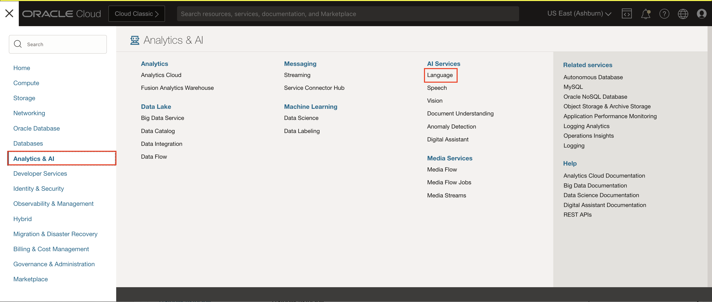
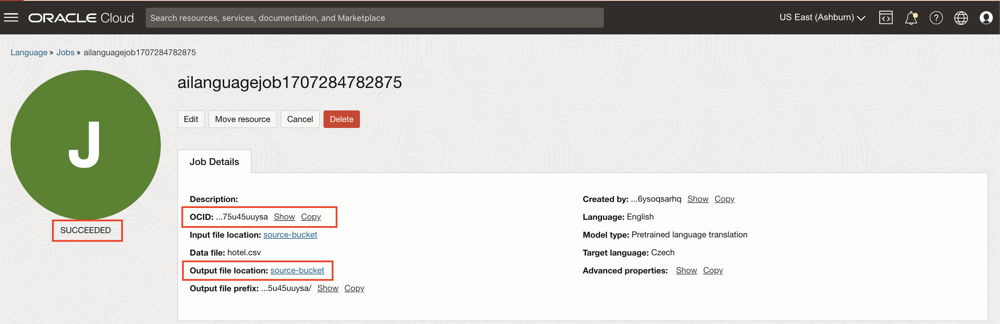

# Lab 4: Create async jobs and document translation

## Introduction

In this session, you will learn how to create async jobs for analysing text and document translation.

> ***Estimated Lab Time***: 45 minutes

### Objectives

In this lab, you will:

- Learn how to create an async jobs for analysing text and document translation.

### Prerequisites

- A Free tier or paid tenancy account in OCI (Oracle Cloud Infrastructure)
- Completed [Lab 2](?lab=custom-model#Task2:CreateCustomNERModel) to create a custom Named Entity Recognition model.
- Familiar with OCI object storage to upload data.

## **Policy Setup**

Follow these steps to configure required policies.

### 1. Setup policies required in [Lab 1](?lab=pre-trained#PolicySetup) for using Language Service API

### 2. Setup policies to allow async jobs to access OCI Object Storage

- #### 1. Navigate to Dynamic Groups

    Log into OCI Cloud Console. Using the Burger Menu on the top left corner, navigate to Identity & Security and click it, and then select Dynamic Groups item under Identity.

    

- #### 2. Create Dynamic Group

    Click Create Dynamic Group

    

    ```
    <copy>all {resource.type='ailanguagejob'}</copy>
    ```

- #### 3. Navigate to Policies

    Log into OCI Cloud Console. Using the Burger Menu on the top left corner, navigate to Identity & Security and click it, and then select Policies item under Identity.
    

- #### 4. Create Policy

    Click Create Policy
        

- #### 5. Create a new policy with the following statements

    To allow dynamic group created above to access object storage in your tenancy, create a new policy with the below statement:

    ```
    <copy>Allow dynamic-group language-service-dynamic-group-for-async-jobs to manage objects in tenancy</copy>
    ```

    

    For more details on policies required for Language Service, please refer [Language Service documentation](https://docs.oracle.com/en-us/iaas/language/using/overview.htm#policies)

## Task 1: Create an async job for analysing text using pre-trained model

Follow below steps to create a job.

1. **Upload the training data to Object Storage**:
    1. Download and extract the hotel dataset from this [link](https://c4u04.objectstorage.us-ashburn-1.oci.customer-oci.com/p/EcTjWk2IuZPZeNnD_fYMcgUhdNDIDA6rt9gaFj_WZMiL7VvxPBNMY60837hu5hga/n/c4u04/b/livelabsfiles/o/oci-library/hotel.zip).

    2. Upload training data to object storage:
        - Log into OCI Console. Using the Burger Menu on the top left corner, navigate to Storage and click it, and then select Buckets item under Object Storage and Archive Storage.
                
        - Create bucket and upload the extracted data.
                

        For more details on uploading data to Object Storage, refer [Putting Data into Object Storage](https://oracle-livelabs.github.io/oci-core/object-storage/workshops/freetier/index.html?lab=object-storage)

2. Log into OCI Cloud Console. Using the Burger Menu on the top left corner, navigate to Analytics and AI menu and click it, and then select Language Service item under AI services.

    

3. Select jobs on the left hand side of the console.

    

4. The Create Job button navigates user to a form where they can specify the details to create an async job.

    

5. **Specify job properties**: Specify job name, compartment details and job description.

6. **Specify model type to run the job**: Select Pretrained sentiment analysis as feature type and choose a source language and configuration.

    

7. **Specify job input data to run the job**: Choose the data type and bucket name in which the hotel.csv uploaded in step 1.

    

8. **Specify job output data to run the job**: Select the option to store the job result and click Next.

    

9. **Create job**: Click "Create Job" and this will kick off the process. Wait until the job execution is successful and job is in *SUCCEEDED* state.

    

10. **Access the job output** : Output files created by the job can be accessed once it has been successfully completed by navigating to the Output file location. Click on Output file location link to navigate to output folder, then navigate to the folder named same as  job ocid to access the output files.

    


## Task 2: Create an async job for analysing text using  custom model

1. **Upload the training data to Object Storage**:
    1. Download Custom NER offerletter dataset from this [link](https://objectstorage.us-ashburn-1.oraclecloud.com/p/EwriB0Oq1hUYAPvkceXZMLTsxcywHAimwkYVc-l03mxWzVWGX79a8QO1lap5wMXz/n/c4u04/b/livelabsfiles/o/ai-ml-library/CNER.zip).
        - Extract the zip file contents into a directory.
    2. Upload the training dataset files to object storage:
        - Log into OCI Cloud Console. Using the Burger Menu on the top left corner, navigate to Storage and click it, and then select Buckets item under Object Storage and Archive Storage.
                
        - Create bucket and upload Custom NER offerletter data extracted above.
                

        For more details on uploading data to Object Storage, refer [Putting Data into Object Storage](https://oracle-livelabs.github.io/oci-core/object-storage/workshops/freetier/index.html?lab=object-storage)

2. Log into OCI Cloud Console. Using the Burger Menu on the top left corner, navigate to Analytics and AI menu and click it, and then select Language Service item under AI services.

    

3. Select jobs on the left hand side of the console.

    

4. The Create Job button navigates user to a form where they can specify the details to create an async job.

    

5. **Specify job properties**: Specify job name, compartment details and job description.

6. **Specify model type to run the job**: Select the custom Named Entity Recognition model you created in [Lab 2](?lab=custom-model#Task2:CreateCustomNERModel).

    

7. **Specify custom model details**: Select the model created in **Step 3**. You can also specify a existing model endpoint optionally and click Next.

    

8. **Specify job input data to run the job**: Select the data type and choose the bucket created in previous step from which the job will take input.

    

9. **Specify job output data to run the job**: Select the option to store job result and click Next.

    

10. **Create job**: Click on Create Job button to create an async job. Wait until the job execution is successful and job is in *SUCCEEDED* state.

    

11. **Access the job output** : Output files created by the job can be accessed once it has been successfully completed by navigating to the Output file location. Click on Output file location link to navigate to output folder, then navigate to the folder named same as  job ocid to access the output files.

    


## Task 3: Create an async job for translating documents

1. **Upload the training data to Object Storage**:
    1. Download the translation dataset from this [link](https://c4u04.objectstorage.us-ashburn-1.oci.customer-oci.com/p/EcTjWk2IuZPZeNnD_fYMcgUhdNDIDA6rt9gaFj_WZMiL7VvxPBNMY60837hu5hga/n/c4u04/b/livelabsfiles/o/oci-library/sample-documents-for-translation.zip).
        - Extract the zip file contents into a directory.
    2. Upload the files to object storage:
        - Log into OCI Cloud Console. Using the Burger Menu on the top left corner, navigate to Storage and click it, and then select Buckets item under Object Storage and Archive Storage.
                
        - Create bucket and upload extracted files OCW AI Presentation.pptx and Oracle Cloud Infrastructure Overview.docx to object storage.
                

        For more details on uploading data to Object Storage, refer [Putting Data into Object Storage](https://oracle-livelabs.github.io/oci-core/object-storage/workshops/freetier/index.html?lab=object-storage)

2. Log into OCI Cloud Console. Using the Burger Menu on the top left corner, navigate to Analytics and AI menu and click it, and then select Language Service item under AI services.

    

3. Select jobs on the left hand side of the console.

    

4. The Create Job button navigates user to a form where they can specify the details to create an async job.

    

5. **Specify job properties**: Specify job name, compartment details and job description.

6. **Specify model type to run the job**: Select Pretrained language translation as the feature type and specify the source and target languages.

    

7. **Specify job input data to run the job**: Select the bucket created in previous step and file that was uploaded.

    

8. **Specify job output data to run the job**: Select the option to store job result and click Next.

    

9. **Create job**: Click "Create Job" and this will kick off the process. Wait until the job execution is successful and job is in *SUCCEEDED* state.

    

10. **Access the job output** : Output files created by the job can be accessed once it has been successfully completed by navigating to the Output file location. Click on Output file location link to navigate to output folder, then navigate to the folder named same as  job ocid to access the output files.

    


## Task 4: Using Python SDK to create async job and document translation

#### **Python code to create async job**

```Python
<copy>
import oci

ai_client = oci.ai_language.AIServiceLanguageClient(oci.config.from_file())

compartment_id = <COMPARTMENT_ID> #TODO Specify your compartmentId here
job_id = <JOB_ID> #TODO Specify your jobId here
namespace_name = <NAMESPACE_NAME> #TODO Specify the namespace here
bucket_name = <BUCKET_NAME> #TODO Specify name of your training data bucket here

# Create async job for Pretrained Language Detection with TXT input data type

input_location_txt = oci.ai_language.models.ObjectStoragePrefixLocation(namespace_name=namespace_name,bucket_name=bucket_name,prefix="test/");
input_configuration_txt = oci.ai_language.models.InputConfiguration(document_types=['TXT'])
output_location = oci.ai_language.models.ObjectPrefixOutputLocation(namespace_name=namespace_name,bucket_name=bucket_name,prefix="output/")

model_metadata_details_languageDetection = oci.ai_language.models.ModelMetadataDetails(model_type="PRE_TRAINED_LANGUAGE_DETECTION", language_code='en')

create_job_details_language_detection = oci.ai_language.models.CreateJobDetails(description="Description",compartment_id=compartment_id,input_location=input_location_txt,input_configuration=input_configuration_txt,model_metadata_details=[model_metadata_details_languageDetection],output_location=output_location);

create_job_output_ld = ai_client.create_job(create_job_details=create_job_details_language_detection)
print("create_job_output ", create_job_output_ld.data)

# Create async job for Pretrained Language Detection with CSV input data type

input_config_csv = {"CSV": {
    "config": {"inputColumn": "Country", "rowId": "Country", "copyColumnsToOutput": "Region", "delimiter": ","}}};
input_configuration_csv = oci.ai_language.models.InputConfiguration(configuration=input_config_csv,document_types=['CSV']);
input_location_csv = oci.ai_language.models.ObjectStorageFileNameLocation(namespace_name=namespace_name,location_type='OBJECT_STORAGE_FILE_LIST',bucket_name=bucket_name,object_names=["Records.csv"]);
model_metadata_details_languageDetection = oci.ai_language.models.ModelMetadataDetails(model_type="PRE_TRAINED_LANGUAGE_DETECTION", language_code='en');

create_job_details_language_detection_ld_csv = oci.ai_language.models.CreateJobDetails(description="Description",compartment_id=compartment_id,input_location=input_location_csv,input_configuration=input_configuration_csv,model_metadata_details=[model_metadata_details_languageDetection],output_location=output_location);

create_job_output_csv = ai_client.create_job(create_job_details=create_job_details_language_detection_ld_csv);
print("create_job_output ", create_job_output_csv.data);


# Create async job for Pretrained sentiment analysis

configuration = {"sentimentAnalysisConfiguration": {"configurationMap": {"basis": "ASPECT"}}};
model_metadata_details_sentiment = oci.ai_language.models.ModelMetadataDetails(model_type="PRE_TRAINED_SENTIMENT_ANALYSIS", language_code='en', configuration=configuration)

create_job_details_sentiment_analysis = oci.ai_language.models.CreateJobDetails(description="Description",compartment_id=compartment_id,input_location=input_location_txt,input_configuration=input_configuration_txt,model_metadata_details=[model_metadata_details_sentiment],output_location=output_location);

create_job_output_sa = ai_client.create_job(create_job_details=create_job_details_sentiment_analysis)
print("create_job_output ", create_job_output_sa.data)

# Create async job for Pretrained language pii entities

configuration_pii = {"ALL": {"configurationMap": {"mode": "MASK", "maskingCharacter": "*", "isUnmaskedFromEnd": "true","leaveCharactersUnmasked": 4}}};
model_metadata_details_pii = oci.ai_language.models.ModelMetadataDetails(model_type="PRE_TRAINED_PII",language_code='en',configuration=configuration_pii)

create_job_details_pii = oci.ai_language.models.CreateJobDetails(description="pii detection",compartment_id=compartment_id,input_location=input_location_txt,input_configuration=input_configuration_txt,model_metadata_details=[model_metadata_details_pii],output_location=output_location);

create_job_output_pii = ai_client.create_job(create_job_details=create_job_details_pii)
print("create_job_output ", create_job_output_pii.data)

#  Create async job for custom Text classification
endpoint_id = <ENDPOINT_ID> #TODO Specify your endpointId here
model_id = <MODEL_ID> #TODO Specify your modelId here
model_metadata_details_custom_txtc = oci.ai_language.models.ModelMetadataDetails(model_type="TEXT_CLASSIFICATION",language_code='en',endpoint_id=endpoint_id,model_id=model_id)

create_job_details_custom_txtc = oci.ai_language.models.CreateJobDetails(description="Job description",compartment_id=compartment_id,input_location=input_location_txt,input_configuration=input_configuration_txt,model_metadata_details=[model_metadata_details_custom_txtc],output_location=output_location);

create_job_output_custom_txtc = ai_client.create_job(create_job_details=create_job_details_custom_txtc)
print("create_job_output ", create_job_output_custom_txtc.data)

# Create async job for custom Named entity recognition

endpoint_id = <ENDPOINT_ID> #TODO Specify your endpointId here
model_id = <MODEL_ID> #TODO Specify your modelId here

model_metadata_details_custom_ner = oci.ai_language.models.ModelMetadataDetails(model_type="NAMED_ENTITY_RECOGNITION",language_code='en',endpoint_id=endpoint_id,model_id=model_id)

create_job_details_custom_ner = oci.ai_language.models.CreateJobDetails(description="Description",compartment_id=compartment_id,input_location=input_location_txt,input_configuration=input_configuration_txt,model_metadata_details=[model_metadata_details_custom_ner],output_location=output_location);

create_job_output_custom_ner = ai_client.create_job(create_job_details=create_job_details_custom_ner)
print("create_job_output ", create_job_output_custom_ner.data)

# List Jobs
list_job_output = ai_client.list_jobs(compartment_id=compartment_id)
print("list job ", list_job_output.data)

# Get Job
get_job_output = ai_client.get_job(job_id=job_id)
print("get job ", get_job_output.data)

# Update Job
update_job_details = oci.ai_language.models.UpdateJobDetails(
    description="updated description")
updateJobOutput = ai_client.update_job(job_id=job_id, update_job_details=update_job_details)
print("updateJobOutput ", updateJobOutput.data)

# Cancel Job
cancel_job = ai_client.cancel_job(job_id=job_id)
print("cancelJob ", cancel_job.data)

# Delete Job

delete_job = ai_client.delete_job(job_id=job_id);
print("deleteJob ", delete_job.data)
</copy>
```

Download [code](./files/async_job_python_sdk.py) file and save it your directory.

#### 2. **Python code to create document translation job**

```Python
<copy>
import oci

ai_client = oci.ai_language.AIServiceLanguageClient(oci.config.from_file())

compartment_id = <COMPARTMENT_ID> #TODO Specify your compartmentId here
job_id = <JOB_ID> #TODO Specify your jobId here
namespace_name = <NAMESPACE_NAME> #TODO Specify the namespace here
bucket_name = <BUCKET_NAME> #TODO Specify name of your training data bucket here

# Create async job for document translation

input_location_txt = oci.ai_language.models.ObjectStorageFileNameLocation(namespace_name=namespace_name, bucket_name=bucket_name);
output_location = oci.ai_language.models.ObjectPrefixOutputLocation(namespace_name=namespace_name, bucket_name=bucket_name, prefix="output/")
translation_config = {"translation" : {"csv": {"columnsToTranslate": [6], "csvDntHeaderRowCount": "true"}}}
properties = {"configurationMap" : {"advancedProperties": translation_config}}
target_language_codes = {"configurationMap": {"languageCodes": "ar,pt-BR"}}
configuration = {"targetLanguageCodes": target_language_codes, "properties": properties}

configuration_details = oci.ai_language.models.ConfigurationDetails(configuration_map= {"advancedProperties" : translation_config})
model_metadata_details = oci.ai_language.models.ModelMetadataDetails(model_type="PRE_TRAINED_TRANSLATION", language_code='en', configuration = configuration);

create_job_details = oci.ai_language.models.CreateJobDetails(description=None,compartment_id=compartment_id,input_location=input_location_txt,model_metadata_details=[model_metadata_details],output_location=output_location)

createJobOutput = ai_client.create_job(create_job_details=create_job_details)
print(f"created a job {createJobOutput.data.display_name}")

</copy>
```

Download [code](./files/document_translation.py) file and save it your directory.

### Learn More

To know more about the Python SDK visit [Python OCI-Language](https://docs.oracle.com/en-us/iaas/tools/python/2.43.1/api/ai_language/client/oci.ai_language.AIServiceLanguageClient.html)

## **Summary**

Congratulations! </br>
In this lab you have learnt how to create async jobs for analysing text and document translation using OCI Console and Python SDK.

## Acknowledgements

**Authors**

- Raja Pratap Kondamari - Product Manager, OCI Language Service
- Nitish Kumar Rai - Oracle AI OCI Language Services

**Last Updated By/Date**
- Nitish Kumar Rai - Oracle AI OCI Language Services, March 2024
