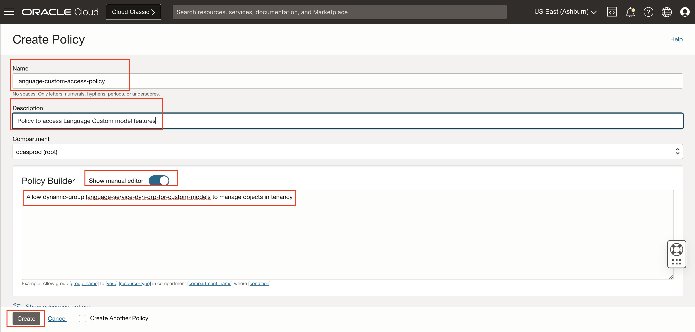
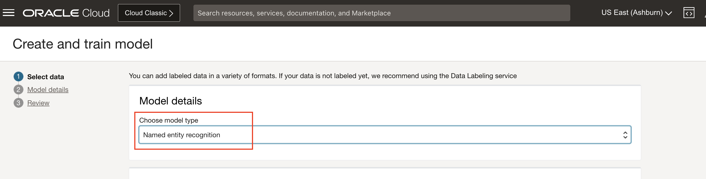

# Creating and Training a Custom Language Model

## Introduction
In this session, we will show you how to create a language project, select your training data, train a custom model, create an endpoint and analyze text through endpoint.

*Estimated Time*: 15 minutes

### Objectives

In this lab, you will:
- Learn how to create language project.
- Understand the schema for training data.
- Learn how to train a custom NER and custom Text Classification model

### Prerequisites
- A Free tier or paid tenancy account in OCI (Oracle Cloud Infrastructure)
- Familiar with OCI object storage to upload data.

## **Policy Setup**

Before you start using OCI Language, OCI policies should be setup for allowing you to access OCI Language Services. Follow these steps to configure required policies.

### 1. Policies required in [Lab 1](?lab=analyze-text#PolicySetup) are required

### 2. Policies required for allowing access to Object Storage:

-   #### 1. Navigate to Dynamic Groups

    Log into OCI Cloud Console. Using the Burger Menu on the top left corner, navigate to Identity & Security and click it, and then select Dynamic Groups item under Identity.
    
    

-   #### 2. Create Dynamic Group

    Click Create Dynamic Group

    
    ```
    <copy>all {resource.type='ailanguagemodel'}</copy>
    ```


-   #### 3. Navigate to Policies

    Log into OCI Cloud Console. Using the Burger Menu on the top left corner, navigate to Identity & Security and click it, and then select Policies item under Identity.
    


-   #### 4. Create Policy

    Click Create Policy
        


-   #### 5. Create a new policy with the following statements:


    To allow dynamic group created above to access object storage in your tenancy, create a new policy with the below statement:
    ```
    <copy>Allow dynamic-group language-service-dyn-grp-for-custom-models to manage objects in tenancy</copy>
    ```

    


    [About Language Policies](https://docs.oracle.com/en-us/iaas/language/using/overview.htm#policies)


## **Task 1:** Create a Project

A Project is a way to organize multiple models in the same workspace. It is the first step to start.

1. Log into OCI Cloud Console. Using the Burger Menu on the top left corner, navigate to Analytics and AI menu and click it, and then select Language Service item under AI services.

    

2. Select Projects under "Custom models" header on the left hand side of the console.

    

3. The Create Project button navigates User to a form where they can specify the compartment in which to create a Language Project.

    

4. Once the details are entered click the Create Button. If the project is successfully created it will show up in projects pane.  

## **Task 2:** Train and Analyze on Custom NER Model

- ### 1. **Create and Train Custom NER Model**

    1. **Navigate to Models**: Under models, click on create and train model.

    2. **Choose model type**: Choose  Named entity recognition for model type.

        

    3. **Select training data**: 
        - 1. Download Custom NER offerletter dataset from this [link](https://oradocs.oracle.com/documents/link/LF47C825FFF2D18E51185EF47A27A81AC346CA04ECE4/folder/FF88E8262D137CD41F66D4DD5E97C8665B175150E2AF/_CNER_Offerletter). 
        
        - 2. Upload downloaded data to object storage:
            - Log into OCI Cloud Console. Using the Burger Menu on the top left corner, navigate to Storage and click it, and then select Buckets item under Object Storage and Archive Storage.
                 
            - Create bucket with default selections and upload Custom NER offerletter data.
                 

        - 3. Choose existing labeled dataset and Object Storage under training data section. Choose the bucket created in previous step and choose CNER\_offer\_trainset\_01\_labels.jsonl as training data set.

            

    4. **Review and Submit**: In the "review" step, you can verify that all of your information is correct and go back if you want to make adjustments. When you want to start training, click "Create and train" and this will kick of the process. You can then check on the status of your model in the project where you created it.

        

- ### 2. **Create an Endpoint and Analyze through endpoint**

    1. Under Model endpoints, click on create model endpoint
    2. Specify the name of the endpoint
    
        

    3. Once endpoint is active, Under Resources, click on Analyze link.
    4. Enter text, and click on Analyze to see the result

        

## **Task 3:** Train and Analyze on Custom TXTC Model

 - ### 1. **Create and Train Custom TXTC Model**

    1. **Navigate to Models**: Under models, click on create and train model.

    2. **Choose model type**: Choose Text classification for model type. Select Single label or multi label as classification model type depending on your labeled data.

        

    3. **Select training data**: 
        - 1. Download Custom TXTC ticket dataset from this [link](https://oradocs.oracle.com/documents/link/LFF3EB38D072D0CF92D7CB6889D9183A8A623137D96F/folder/FA8283A1191E637C61C447A5EA6B982C6232A5855278/_CTXTC_TicketData). 
        
        - 2. Upload downloaded data to object storage:
            - Log into OCI Cloud Console. Using the Burger Menu on the top left corner, navigate to Storage and click it, and then select Buckets item under Object Storage and Archive Storage.
                 
            - Create bucket with default selections and upload Custom NER offerletter data.
                 

        - 3. Select bucket created in preview step and choose TicketData\_train.csv in date file drop down.
                 

    4. **Review and Submit**: In the "review" step, you can verify that all of your information is correct and go back if you want to make adjustments. When you want to start training, click "Create and train" and this will kick of the process. You can then check on the status of your model in the project where you created it.

        

 - ### 2. **Create an Endpoint and Analyze through endpoint**

    1. Under Model endpoints, click on create model endpoint
    2. Specify the name of the endpoint
    
        

    3. Once endpoint is active, Under Resources, click on Analyze link.
    4. Enter text, and click on Analyze to see the result

        

## **Task 4:** Create Custom Models and analyzing through endpoint with Python SDK.

Pre-requisites: For using Python SDK, please follow steps described in [Lab 1](?lab=analyze-text#Task2AnalyzeTextwithPythonSDK)

Follow below steps to run Python SDK:

#### 1. Download Python Code.

#### Custom NER Python Code

```Python
<copy>
import time
import oci
print(f'OCI Client SDK version: {oci.__version__}')
config = oci.config.from_file()

compartment_id = "<COMPARTMENT_ID>" #TODO Specify your compartmentId here
bucket_name = "<BUCKET_NAME>" #TODO Specify name of your training data bucket here
namespace_name = "<NAMESPACE_NAME>" #TODO Specify the namespace here
object_names = ["<OBJECT_FILE_NAME>"] #TODO Specify name of your training data file

project_name = None #"custom-NER-project"
model_name = None #"custom-NER-model"
endpoint_name = None #"custom_NER_endpoint"

#assuming ashburn endpoint.
# For other regions, use below end points
#Ashburn: https://language.aiservice.us-ashburn-1.oci.oraclecloud.com
#Phoenix: https://language.aiservice.us-phoenix-1.oci.oraclecloud.com
#Frankfurt: https://language.aiservice.eu-frankfurt-1.oci.oraclecloud.com
#London: https://language.aiservice.uk-london-1.oci.oraclecloud.com
#Mumbai: https://language.aiservice.ap-mumbai-1.oci.oraclecloud.com

ai_client = oci.ai_language.AIServiceLanguageClient(config)

#create ailanguageproject
project_details = oci.ai_language.models.CreateProjectDetails(compartment_id=compartment_id,display_name=project_name)
print(f"Creating project with details:{project_details}")
project = ai_client.create_project(project_details)
print(f"create_project returned: {project.data}")

#wait till project state becomes ACTIVE
project_id = project.data.id
project_status = project.data.lifecycle_state
while (project.data.lifecycle_state == "CREATING"):
    print('Waiting for project creation to complete...')
    time.sleep(1*60) #sleep for 1 minute
    project = ai_client.get_project(project_id)

project = ai_client.get_project(project_id)
project_status = project.data.lifecycle_state
print(f"Project status changed from CREATING to {project_status}")

#creating ailanguagemodel
location_details = oci.ai_language.models.ObjectListDataset(
    location_type="OBJECT_LIST", 
    namespace_name="idngwwc5ajp5",  #TODO specify the namespace here
    bucket_name="canary-bucket", #TODO specify the name your training data bucket here
    object_names=["small_portableJosnl.jsonl"]  #TODO specify the name your train label file
)

model_details = oci.ai_language.models.CreateModelDetails(
    project_id = project.data.id,
    model_details = oci.ai_language.models.ModelDetails(model_type="NAMED_ENTITY_RECOGNITION", language_code="en"),
    display_name = model_name,
    compartment_id = compartment_id,
    training_dataset = oci.ai_language.models.ObjectStorageDataset(dataset_type="OBJECT_STORAGE", location_details=location_details)
)

print(f"creating model with details:{model_details}")
model_response = ai_client.create_model(model_details)
print(f"create_model returned: {model_response.data}")

model_details = ai_client.get_model(model_response.data.id)

#wait till model state becomes ACTIVE
while (model_details.data.lifecycle_state == "CREATING"):
    print('Waiting for model creation and training to complete...')
    time.sleep(1*60) #sleep for 1 minute
    model_details = ai_client.get_model(model_response.data.id)

print(f"Model status changed from CREATING to {model_details.data.lifecycle_state}")

print("Printing model evaluation results")
print(model_details.data.evaluation_results)

print("Creating an end point")
endpoint_details = oci.ai_language.models.CreateEndpointDetails(
    compartment_id = compartment_id,
    model_id = model_details.data.id,
    inference_units = 1,
    display_name = endpoint_name
)

endpoint_response = ai_client.create_endpoint(endpoint_details)
print(f"create_endpoint call returned{endpoint_response.data}")
end_point_details = ai_client.get_endpoint(endpoint_response.data.id)

#wait till endpoint state becomes ACTIVE
while (end_point_details.data.lifecycle_state == "CREATING"):
    print('Waiting for endpoint creation to complete...')
    time.sleep(1*60) #sleep for 5 minutes
    end_point_details = ai_client.get_endpoint(end_point_details.data.id)

print(f"End point status changed from CREATING to {end_point_details.data.lifecycle_state}")

text_to_analyze = "\n\nDear Bryan Hernandez,\n \nGilmore  Kennedy and Lloyd is delighted to offer you the position of Chief Strategy Officer with an anticipated start date of 06/16/17, contingent upon background check, drug screening and work permit verification. \n \nYou will report directly to Jeffrey Zamora at Unit 6709 Box 6713,DPO AP 11187. Working hours are decided based on your assigned business unit. \n \nThe starting salary for this position is $216053 per annum. Payment is on a monthly basis by direct deposit done on the last working day of the moth. \n \nGilmore  Kennedy and Lloyd offers a comprehensive benefits program, which includes medical insurance, 401(k), paid time off and gym facilities at work location. \n \nYour employment with Gilmore  Kennedy and Lloyd will be on an at-will basis, which means you and the company are free to terminate employment at any time, with or without cause or advance notice. This letter is not a contract indicating employment terms or duration.\n \nPlease confirm your acceptance of this offer by signing and returning this letter before 7 days from 06/16/17. \n \nSincerely,\n \nCarlos Banks\n(Country Leader, Human Resources)"

print(f"Analyzing the text: {text_to_analyze}")
ner_text_for_testing = oci.ai_language.models.BatchDetectLanguageEntitiesDetails(endpoint_id = end_point_details.data.id, documents = [oci.ai_language.models.TextDocument(key = "1", text = text_to_analyze)])
ner_inference_result = ai_client.batch_detect_language_entities(ner_text_for_testing)
print("inference result for custom NER:")
print(ner_inference_result.data)

</copy>
```

Download [code](./files/customNERPythonSDK.py) file and save it your directory.


#### Custom TXTC Python Code

```Python
<copy>
import time
import oci
print(f'OCI Client SDK version: {oci.__version__}')
config = oci.config.from_file()

compartment_id = "" #TODO Specify your compartmentId here
bucket_name = "" #TODO Specify name of your training data bucket here
namespace_name = "" #TODO Specify the namespace here
object_names = [""] #TODO Specify name of your training data file

project_name = None #"custom-TXTC-project"
model_name = None #"custom-TXTC-model"
endpoint_name = None #"custom_TXTC_endpoint"

#assuming ashburn endpoint.
# For other regions, use below end points
#Ashburn: https://language.aiservice.us-ashburn-1.oci.oraclecloud.com
#Phoenix: https://language.aiservice.us-phoenix-1.oci.oraclecloud.com
#Frankfurt: https://language.aiservice.eu-frankfurt-1.oci.oraclecloud.com
#London: https://language.aiservice.uk-london-1.oci.oraclecloud.com
#Mumbai: https://language.aiservice.ap-mumbai-1.oci.oraclecloud.com

ai_client = oci.ai_language.AIServiceLanguageClient(config)

#create ailanguageproject
project_details = oci.ai_language.models.CreateProjectDetails(compartment_id=compartment_id,display_name=project_name)
print(f"Creating project with details:{project_details}")
project = ai_client.create_project(project_details)
print(f"create_project returned: {project.data}")

#wait till project state becomes ACTIVE
project_id = project.data.id
project_status = project.data.lifecycle_state
while (project.data.lifecycle_state == "CREATING"):
    print('Waiting for project creation to complete...')
    time.sleep(1*60) #sleep for 1 minute
    project = ai_client.get_project(project_id)

project = ai_client.get_project(project_id)
project_status = project.data.lifecycle_state
print(f"Project status changed from CREATING to {project_status}")

#creating ailanguagemodel
location_details = oci.ai_language.models.ObjectListDataset(location_type="OBJECT_LIST", namespace_name=namespace_name, bucket_name=bucket_name, object_names=object_names)
# For Text classification, multi-class and multi-labe classification types are supported
classification_mode = oci.ai_language.models.ClassificationType(classification_mode="MULTI_CLASS")
model_details = oci.ai_language.models.CreateModelDetails(
    project_id = project.data.id,
    model_details = oci.ai_language.models.TextClassificationModelDetails(classification_mode=classification_mode,model_type="TEXT_CLASSIFICATION", language_code="en"),
    display_name = model_name,
    compartment_id = compartment_id,
    training_dataset = oci.ai_language.models.ObjectStorageDataset(dataset_type="OBJECT_STORAGE", location_details=location_details)
)

print(f"creating model with details:{model_details}")
model_response = ai_client.create_model(model_details)
print(f"create_model returned: {model_response.data}")

model_details = ai_client.get_model(model_response.data.id)

#wait till model state becomes ACTIVE
while (model_details.data.lifecycle_state == "CREATING"):
    print('Waiting for model creation and training to complete...')
    time.sleep(1*60) #sleep for 1 minute
    model_details = ai_client.get_model(model_response.data.id)

print(f"Model status changed from CREATING to {model_details.data.lifecycle_state}")

print("Printing model evaluation results")
print(model_details.data.evaluation_results)

print("Creating an end point")
endpoint_details = oci.ai_language.models.CreateEndpointDetails(
    compartment_id = compartment_id,
    model_id = model_details.data.id,
    inference_units = 1,
    display_name = endpoint_name
)

endpoint_response = ai_client.create_endpoint(endpoint_details)
print(f"create_endpoint call returned{endpoint_response.data}")
end_point_details = ai_client.get_endpoint(endpoint_response.data.id)

#wait till endpoint state becomes ACTIVE
while (end_point_details.data.lifecycle_state == "CREATING"):
    print('Waiting for endpoint creation to complete...')
    time.sleep(1*60) #sleep for 5 minutes
    end_point_details = ai_client.get_endpoint(end_point_details.data.id)

print(f"End point status changed from CREATING to {end_point_details.data.lifecycle_state}")

text_to_analyze = "I like Physics over chemistry"

print(f"Analyzing the text: {text_to_analyze}")
txtc_text_for_testing = oci.ai_language.models.BatchDetectLanguageEntitiesDetails(endpoint_id = end_point_details.data.id, documents = [oci.ai_language.models.TextDocument(key = "1", text = text_to_analyze)])
txtc_inference_result = ai_client.batch_detect_language_entities(txtc_text_for_testing)
print("inference result for custom TXTC:")
print(txtc_inference_result.data)
</copy>
```

Download [code](./files/customTXTCPythonSDK.py) file and save it your directory.

### Learn More
To know more about the Python SDK visit [Python OCI-Language](https://docs.oracle.com/en-us/iaas/tools/python/2.43.1/api/ai_language/client/oci.ai_language.AIServiceLanguageClient.html)

## **Summary**

Congratulations! </br>
In this lab you have learnt how to create and train custom NER and TXTC models and analyze text on trained models through language endpoing using OCI Console and Python SDK.

[Proceed to the next section](#next).

## Acknowledgements

**Authors**
  * Raja Pratap Kondamari - Product Manager, OCI Language Service
  * Rajat Chawla  - Oracle AI OCI Language Services
  * Ankit Tyagi -  Oracle AI OCI Language Services
  * Sahil Kalra - Oracle AI OCI Language Services

**Last Updated By/Date**
* Raja Pratap Kondamari - Product Manager, OCI Language Service, October 2022