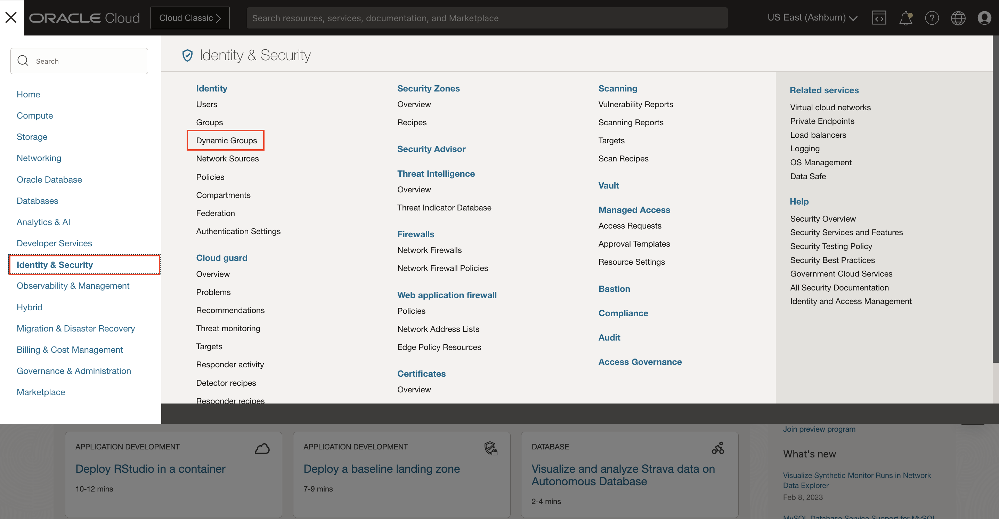
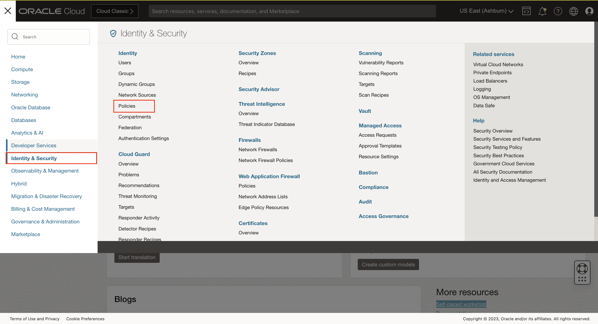
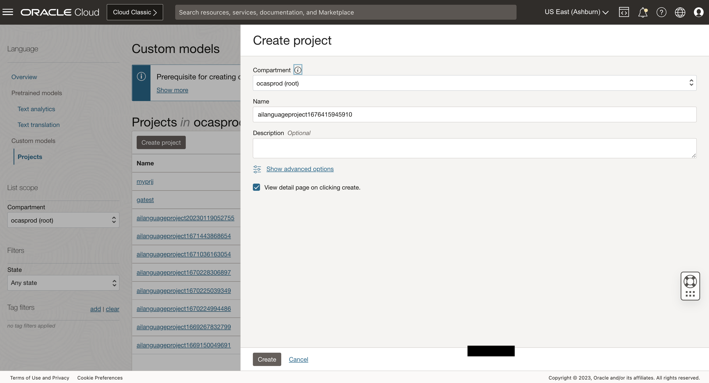
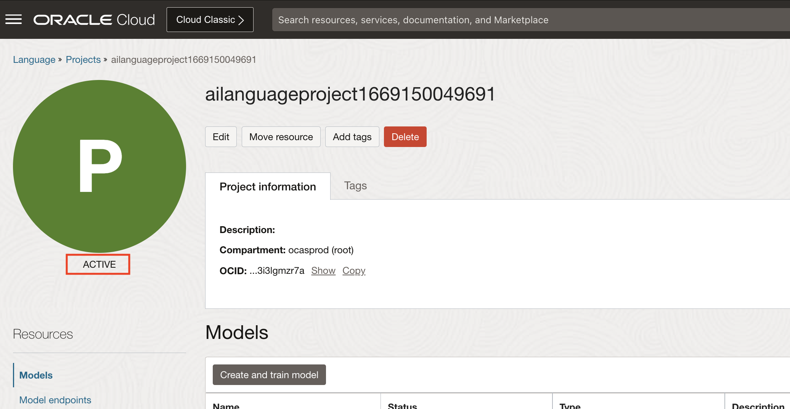
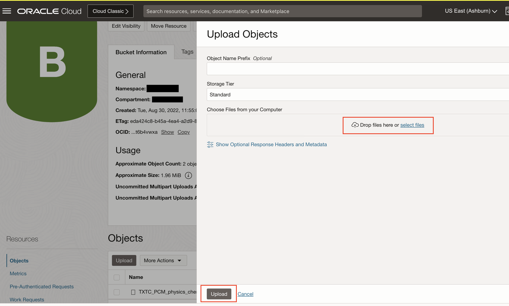
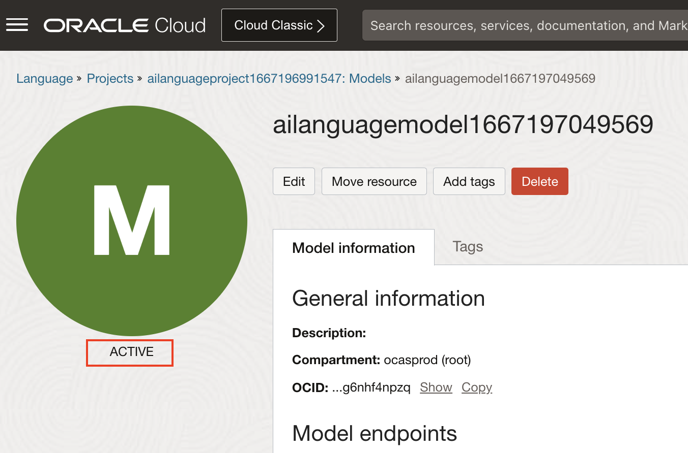
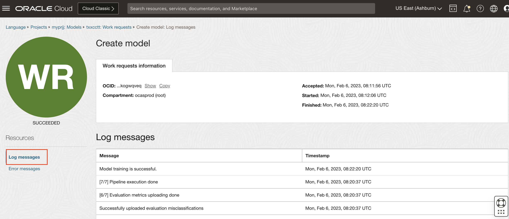
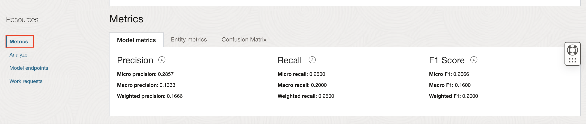

# Lab 2: Create and train custom models

## Introduction
In this session, you will learn how to create projects, train a custom model and analyze text through endpoints.

> ***Estimated Lab Time***: 45 minutes

### Objectives

In this lab, you will:
- Learn how to create project.
- Learn how to train a custom NER and custom Text Classification model.
- Learn how to create endpoint and analyze text using OCI console and Python SDK

### Prerequisites
- A Free tier or paid tenancy account in OCI (Oracle Cloud Infrastructure)
- Familiar with OCI object storage to upload data.

## **Policy Setup**

Follow these steps to configure required policies.

### 1. Setup policies required in [Lab 1](?lab=pre-trained#PolicySetup) for using Language Service API

### 2. Setup policies to allow model training jobs to access OCI Object Storage:

-   #### 1. Navigate to Dynamic Groups

    Log into OCI Cloud Console. Using the Burger Menu on the top left corner, navigate to Identity & Security and click it, and then select Dynamic Groups item under Identity.
    
    

-   #### 2. Create Dynamic Group

    Click Create Dynamic Group

    
    ```
    <copy>all {resource.type='ailanguagemodel'}</copy>
    ```


-   #### 3. Navigate to Policies

    Log into OCI Cloud Console. Using the Burger Menu on the top left corner, navigate to Identity & Security and click it, and then select Policies item under Identity.
    


-   #### 4. Create Policy

    Click Create Policy
        


-   #### 5. Create a new policy with the following statements:


    To allow dynamic group created above to access object storage in your tenancy, create a new policy with the below statement:
    ```
    <copy>Allow dynamic-group language-service-dyn-grp-for-custom-models to manage objects in tenancy</copy>
    ```

    

    For more details on policies required for Language Service, please refer [Language Service documentation](https://docs.oracle.com/en-us/iaas/language/using/overview.htm#policies)


## Task 1: Create a Project

A Project is a way to organize multiple models in the same workspace. Follow below steps to create a project.

1. Log into OCI Cloud Console. Using the Burger Menu on the top left corner, navigate to Analytics and AI menu and click it, and then select Language Service item under AI services.

    

2. Select Projects under "Custom models" header on the left hand side of the console.

    

3. The Create Project button navigates User to a form where they can specify the compartment in which to create a Language Project.

    

4. Once the details are entered click the Create Button. Wait until project is in ACTIVE state. If the project is successfully created it will show up in projects pane.  
    


## Task 2: Create Custom NER Model

1. **Create and Train Custom NER Model**

    1. Upload the training data to Object Storage:
        - Download Custom NER offerletter dataset from this [link](https://c4u04.objectstorage.us-ashburn-1.oci.customer-oci.com/p/EcTjWk2IuZPZeNnD_fYMcgUhdNDIDA6rt9gaFj_WZMiL7VvxPBNMY60837hu5hga/n/c4u04/b/livelabsfiles/o/ai-ml-library/CNER.zip).
        - Extract the zip file contents into a directory
        - Upload the training dataset files to object storage:
            - Log into OCI Cloud Console. Using the Burger Menu on the top left corner, navigate to Storage and click it, and then select Buckets item under Object Storage and Archive Storage.
                 
            - Create bucket and upload Custom NER offerletter data extracted above.
                 

            For more details on uploading data to Object Storage, refer [Putting Data into Object Storage](https://oracle-livelabs.github.io/oci-core/object-storage/workshops/freetier/index.html?lab=object-storage)

    2. **Navigate to Project**: Navigate to the project you created in Task 1.
    3. **Navigate to Models**: Under models, click on create and train model.
    4. **Choose model type**: Choose  Named entity recognition for model type.

        
    5. **Specify training dataset details**: *Choose existing labeled dataset* and *Object Storage* under training data section. Choose the bucket created in previous step and choose CNER\_offer\_trainset\_01\_labels.jsonl as training data set. Skip Validation data and Test data to default values, so that the system chooses random samples from train set.

        

    6. **Specifiy model properties**: Specify model name, compartment details and click Next
    7. **Create Model**: Click "Create and train" and this will kick of the process. Wait until training is complete and Model is in *ACTIVE* state. Time taken to complete model training is dependent on the data set size. For this dataset, it takes approximately 15 minutes.

        
    8. **Check Work request Logs**: Optionally, you can check the model training progress. Navigate to Work requests under Resources on left navigation menu and click on Create model Work request and and navigate to Log messages. 
        
        
    9.  **Review Model Metrics**: Navigate to Metrics under Resources in left navigation menu to review model metrics.
         

2. **Create an Endpoint**

    1. Ensure the model status is *ACTIVE*
 
    2. Under Model endpoints, click on create model endpoint
    3. Specify the name of the endpoint and click on Create
        

    4. Wait till the endpoint status changes to *ACTIVE*
    5. Under Resources, click on *Analyze* link.
    6. Enter text, and click on Analyze to see the result

        

## Task 3: Create Custom Classification Model

1. **Create and Train Custom Classification Model**

    1. **Upload the training data to Object Storage**:
        1. Download and extract the ticket dataset from this [link](https://c4u04.objectstorage.us-ashburn-1.oci.customer-oci.com/p/EcTjWk2IuZPZeNnD_fYMcgUhdNDIDA6rt9gaFj_WZMiL7VvxPBNMY60837hu5hga/n/c4u04/b/livelabsfiles/o/ai-ml-library/TicketData_train.csv.zip).

        2. Upload training data to object storage:
            - Log into OCI Console. Using the Burger Menu on the top left corner, navigate to Storage and click it, and then select Buckets item under Object Storage and Archive Storage.
                 
            - Create bucket and upload the extracted data.
                 

            For more details on uploading data to Object Storage, refer [Putting Data into Object Storage](https://oracle-livelabs.github.io/oci-core/object-storage/workshops/freetier/index.html?lab=object-storage)

    2. **Navigate to Project**: Navigate to the project you created in Task 1.
    3. **Navigate to Models**: Under models, click on *Create and train model*.
    4. **Choose model type**: Choose *Text classification* for model type. Select *Single label* as classification model type

        

    5. **Specify training dataset details**: Select bucket created in preview step and choose TicketData_train.csv in date file drop down. Skip Validation data and Test data to default values, so that the system chooses random samples from train set.
                 

    6. **Specify Model properties**: specify the model name and the compartment for creation and click on Next
    7. **Create Model**: Click *Create and train* and this will kick of the model training process. Wait until training is complete and Model is in *ACTIVE* state. Time taken to complete model training is dependent on the data set size. For this dataset, it takes approximately 30 minutes.

        
    8. **Check Work request Logs**: Optionally, you can check the model training progress. Navigate to Work requests under Resources on left navigation menu and click on Create model Work request and navigate to Log messages. 
        
        
    9. **Review Model Metrics**: Navigate to Metrics under Resources in left navigation menu to review model metrics.
         

2. **Create Endpoint and Analyze text**

    1. Wait till the model training completes and status is changed to *ACTIVE*
   
    2. Under Model endpoints, click on *Create model endpoint*.
    3. Select the model to associate and click *Create model endpoint*.
        

    4. Under Resources, click on *Analyze* link.
    5. Enter text, and click on *Analyze* to see the result

        

## Task 4: Using Python SDK to Create Custom Models
All the above tasks performed to create custom models and analyzing text can be done through Python code.
**Pre-requisites**:
<br/>
For using Python SDK, please follow setup steps described in [Lab 1: Task 2](?lab=pre-trained#Task2:AnalyzeTextwithPythonSDK)

#### **Python code to create custom NER model and analyze text**

```Python
<copy>
import time
import oci
print(f'OCI Client SDK version: {oci.__version__}')
config = oci.config.from_file()

compartment_id = <COMPARTMENT_ID> #TODO Specify your compartmentId here
bucket_name = <BUCKET_NAME> #TODO Specify name of your training data bucket here
namespace_name = <NAMESPACE_NAME> #TODO Specify the namespace here
object_names = ["CNER_offer_trainset_01_labels.jsonl"]

project_name = <PROJECT_NAME> #TODO specify project name here
model_name = <MODEL_NAME> #TODO specify the model name here
endpoint_name = <ENDPOINT_NAME> #TODO specify endpoint name

ai_client = oci.ai_language.AIServiceLanguageClient(config)

#create project
project_details = oci.ai_language.models.CreateProjectDetails(compartment_id=compartment_id,display_name=project_name)
print(f"Creating project with details:{project_details}")
project = ai_client.create_project(project_details)
print(f"create_project returned: {project.data}")

#wait till project state becomes ACTIVE
project_id = project.data.id
project_status = project.data.lifecycle_state
while (project.data.lifecycle_state == "CREATING"):
    print('Waiting for project creation to complete...')
    time.sleep(1*60) #sleep for 1 minute
    project = ai_client.get_project(project_id)

project = ai_client.get_project(project_id)
project_status = project.data.lifecycle_state
print(f"Project status changed from CREATING to {project_status}")

#creating model
location_details = oci.ai_language.models.ObjectListDataset(
    location_type="OBJECT_LIST",
    namespace_name=namespace_name,
    bucket_name=bucket_name,
    object_names=object_names
)

model_details = oci.ai_language.models.CreateModelDetails(
    project_id = project.data.id,
    model_details = oci.ai_language.models.ModelDetails(model_type="NAMED_ENTITY_RECOGNITION"),
    display_name = model_name,
    compartment_id = compartment_id,
    training_dataset = oci.ai_language.models.ObjectStorageDataset(dataset_type="OBJECT_STORAGE", location_details=location_details)
)

print(f"creating model with details:{model_details}")
model_response = ai_client.create_model(model_details)
print(f"create_model returned: {model_response.data}")

model_details = ai_client.get_model(model_response.data.id)

#wait till model state becomes ACTIVE
while (model_details.data.lifecycle_state == "CREATING"):
    print('Waiting for model creation and training to complete...')
    time.sleep(1*60) #sleep for 1 minute
    model_details = ai_client.get_model(model_response.data.id)

print(f"Model status changed from CREATING to {model_details.data.lifecycle_state}")

print("Printing model evaluation results")
print(model_details.data.evaluation_results)

print("Creating an end point")
endpoint_details = oci.ai_language.models.CreateEndpointDetails(
    compartment_id = compartment_id,
    model_id = model_details.data.id,
    inference_units = 1,
    display_name = endpoint_name
)

endpoint_response = ai_client.create_endpoint(endpoint_details)
print(f"create_endpoint call returned{endpoint_response.data}")
end_point_details = ai_client.get_endpoint(endpoint_response.data.id)

#wait till endpoint state becomes ACTIVE
while (end_point_details.data.lifecycle_state == "CREATING"):
    print('Waiting for endpoint creation to complete...')
    time.sleep(1*60) #sleep for 5 minutes
    end_point_details = ai_client.get_endpoint(end_point_details.data.id)

print(f"End point status changed from CREATING to {end_point_details.data.lifecycle_state}")

text_to_analyze = "\n\nDear Bryan Hernandez,\n \nGilmore  Kennedy and Lloyd is delighted to offer you the position of Chief Strategy Officer with an anticipated start date of 06/16/17, contingent upon background check, drug screening and work permit verification. \n \nYou will report directly to Jeffrey Zamora at Unit 6709 Box 6713,DPO AP 11187. Working hours are decided based on your assigned business unit. \n \nThe starting salary for this position is $216053 per annum. Payment is on a monthly basis by direct deposit done on the last working day of the moth. \n \nGilmore  Kennedy and Lloyd offers a comprehensive benefits program, which includes medical insurance, 401(k), paid time off and gym facilities at work location. \n \nYour employment with Gilmore  Kennedy and Lloyd will be on an at-will basis, which means you and the company are free to terminate employment at any time, with or without cause or advance notice. This letter is not a contract indicating employment terms or duration.\n \nPlease confirm your acceptance of this offer by signing and returning this letter before 7 days from 06/16/17. \n \nSincerely,\n \nCarlos Banks\n(Country Leader, Human Resources)"

print(f"Analyzing the text: {text_to_analyze}")
ner_text_for_testing = oci.ai_language.models.BatchDetectLanguageEntitiesDetails(endpoint_id = end_point_details.data.id, documents = [oci.ai_language.models.TextDocument(key = "1", text = text_to_analyze)])
ner_inference_result = ai_client.batch_detect_language_entities(ner_text_for_testing)
print("inference result for custom NER:")
print(ner_inference_result.data)

</copy>
```

Download [code](./files/custom_ner_python_sdk.py) file and save it your directory.


#### 2. **Python code to create custom Classification model and analyze text**

```Python
<copy>
import time
import oci
print(f'OCI Client SDK version: {oci.__version__}')
config = oci.config.from_file()

compartment_id = <COMPARTMENT_ID> #TODO Specify your compartmentId here
bucket_name = <BUCKET_NAME> #TODO Specify name of your training data bucket here
namespace_name = <NAMESPACE_NAME> #TODO Specify the namespace here
object_names = ["TicketData_train.csv"]

project_name = <PROJECT_NAME> #"custom-TXTC-project"
model_name = <MODEL_NAME> #"custom-TXTC-model"
endpoint_name = <ENDPOINT_NAME> #"custom_TXTC_endpoint"

ai_client = oci.ai_language.AIServiceLanguageClient(config)

#create project
project_details = oci.ai_language.models.CreateProjectDetails(compartment_id=compartment_id,display_name=project_name)
print(f"Creating project with details:{project_details}")
project = ai_client.create_project(project_details)
print(f"create_project returned: {project.data}")

#wait till project state becomes ACTIVE
project_id = project.data.id
project_status = project.data.lifecycle_state
while (project.data.lifecycle_state == "CREATING"):
    print('Waiting for project creation to complete...')
    time.sleep(1*60) #sleep for 1 minute
    project = ai_client.get_project(project_id)

project = ai_client.get_project(project_id)
project_status = project.data.lifecycle_state
print(f"Project status changed from CREATING to {project_status}")

#creating model
location_details = oci.ai_language.models.ObjectListDataset(location_type="OBJECT_LIST", namespace_name=namespace_name, bucket_name=bucket_name, object_names=object_names)
# For Text classification, multi-class and multi-labe classification types are supported
classification_mode = oci.ai_language.models.ClassificationType(classification_mode="MULTI_CLASS")
model_details = oci.ai_language.models.CreateModelDetails(
    project_id = project.data.id,
    model_details = oci.ai_language.models.TextClassificationModelDetails(classification_mode=classification_mode,model_type="TEXT_CLASSIFICATION", language_code="en"),
    display_name = model_name,
    compartment_id = compartment_id,
    training_dataset = oci.ai_language.models.ObjectStorageDataset(dataset_type="OBJECT_STORAGE", location_details=location_details)
)

print(f"creating model with details:{model_details}")
model_response = ai_client.create_model(model_details)
print(f"create_model returned: {model_response.data}")

model_details = ai_client.get_model(model_response.data.id)

#wait till model state becomes ACTIVE
while (model_details.data.lifecycle_state == "CREATING"):
    print('Waiting for model creation and training to complete...')
    time.sleep(1*60) #sleep for 1 minute
    model_details = ai_client.get_model(model_response.data.id)

print(f"Model status changed from CREATING to {model_details.data.lifecycle_state}")

print("Printing model evaluation results")
print(model_details.data.evaluation_results)

print("Creating an end point")
endpoint_details = oci.ai_language.models.CreateEndpointDetails(
    compartment_id = compartment_id,
    model_id = model_details.data.id,
    inference_units = 1,
    display_name = endpoint_name
)

endpoint_response = ai_client.create_endpoint(endpoint_details)
print(f"create_endpoint call returned{endpoint_response.data}")
end_point_details = ai_client.get_endpoint(endpoint_response.data.id)

#wait till endpoint state becomes ACTIVE
while (end_point_details.data.lifecycle_state == "CREATING"):
    print('Waiting for endpoint creation to complete...')
    time.sleep(1*60) #sleep for 5 minutes
    end_point_details = ai_client.get_endpoint(end_point_details.data.id)

print(f"End point status changed from CREATING to {end_point_details.data.lifecycle_state}")

text_to_analyze = "I am unable to use printer, seeing printer error."

print(f"Analyzing the text: {text_to_analyze}")
txtc_text_for_testing = oci.ai_language.models.BatchDetectLanguageTextClassificationDetails(endpoint_id = end_point_details.data.id, documents = [oci.ai_language.models.TextDocument(key = "1", text = text_to_analyze)])
txtc_inference_result = ai_client.batch_detect_language_text_classification(txtc_text_for_testing)
print("inference result for custom TXTC:")
print(txtc_inference_result.data)
</copy>
```

Download [code](./files/custom_classification_python_sdk.py) file and save it your directory.

### Learn More
To know more about the Python SDK visit [Python OCI-Language](https://docs.oracle.com/en-us/iaas/tools/python/2.43.1/api/ai_language/client/oci.ai_language.AIServiceLanguageClient.html)

## **Summary**

Congratulations! </br>
In this lab you have learnt how to create custom NER and Classification models and analyze text using OCI Console and Python SDK.

You may now **proceed to the next lab**.

## Acknowledgements

**Authors**
  * Raja Pratap Kondamari - Product Manager, OCI Language Service
  * Sahil Kalra - Oracle AI OCI Language Services

**Last Updated By/Date**
* Sahil Kalra - Oracle AI OCI Language Services, March 2023
