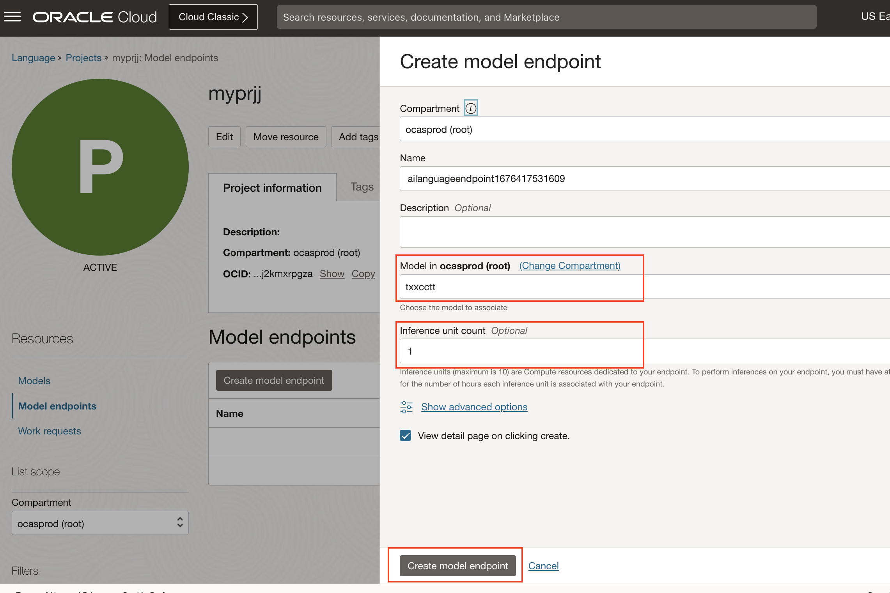

# Create a custom model through the console

## Introduction
In this session, we will show you how to create a language project, select your training data, train a custom model, create an endpoint and analyze text through endpoint.

*Estimated Time*: 15 minutes

### Objectives

In this lab, you will:
- Learn how to create language project.
- Understand the schema for training data.
- Learn how to train a named entity recognition model or text classification model through the OCI console.

### Prerequisites
- A Free tier or paid tenancy account in OCI (Oracle Cloud Infrastructure)
- Familiar with OCI object storage to upload data.

## **Policy Setup**

Before you start using OCI Language, OCI policies should be setup for allowing you to access OCI Language Services. Follow these steps to configure required policies.

### 1. Navigate to Policies

Log into OCI Cloud Console. Using the Burger Menu on the top left corner, navigate to Identity & Security and click it, and then select Policies item under Identity.
    


### 2. Create Policy

Click Create Policy
    


### 3. Create a new policy with the following statements:

If you want to allow all the users in your tenancy to use language service, create a new policy with the below statement:
    ```

    <copy>allow any-user to use ai-service-language-family in tenancy</copy>
    ```

    


If you want to limit access to a user group, create a new policy with the below statement:
    ```

    <copy>allow group <group-name> to use ai-service-language-family in tenancy</copy>
    ```
    

## **Task 1:** Create a Project

A Project is a way to organize multiple models in the same workspace. It is the first step to start.

1. Log into OCI Cloud Console. Using the Burger Menu on the top left corner, navigate to Analytics and AI menu and click it, and then select Language Service item under AI services. Clicking the Language Service Option will navigate one to the Language Service Console. Once here, select Projects under "Custom models" header on the left hand side of the console.

    

2. The Create Project button navigates User to a form where they can specify the compartment in which to create a Vision Project. The project we create here is named "vision_demo".

    

3. Once the details are entered click the Create Button. If the project is successfully created it will show up in projects pane.  

## **Task 2:** Create and Train Model

1. Under models, click on create and train model.

2. **Choose model type**: Language supports training of custom model for Text classification and Named entity recognition. For Text classification, single-label and multi-label classification model types are supported.

    

3. Choose existing labeled data from Object Storate or Data Labeling service or you can choose create new dataset by clicking Data science labeling link, which will drive you to OCI Data Labeling service, where you can easily add labels.

     

AI Vision Service supports training of an on-demand custom model for Object Detection, Image Classification, and Document Image Classification features. You can select one of these three options in the drop down.

4. **Model details** : In the "Model details" step, you will name your model, add a description of it and optionally add tags.

    

5. **Review and Submit: In the "review" step, you can verify that all of your information is correct and go back if you want to make adjustments. When you want to start training, click "Create and train" and this will kick of the process. You can then check on the status of your model in the project where you created it.

## **Task 3:** Create an Endpoint

1. Under Model endpoints, click on create model endpoint
2. Specify the name of the endpoint (e.g., IT_Ticket_text_classification_endpoint1)



## **Task 4:** Analyze through endpoint

1. Under Resources, click on Analyze link.
2. Enter text, and click on Analyze to see the result


Congratulations on completing this lab!

[Proceed to the next section](#next).