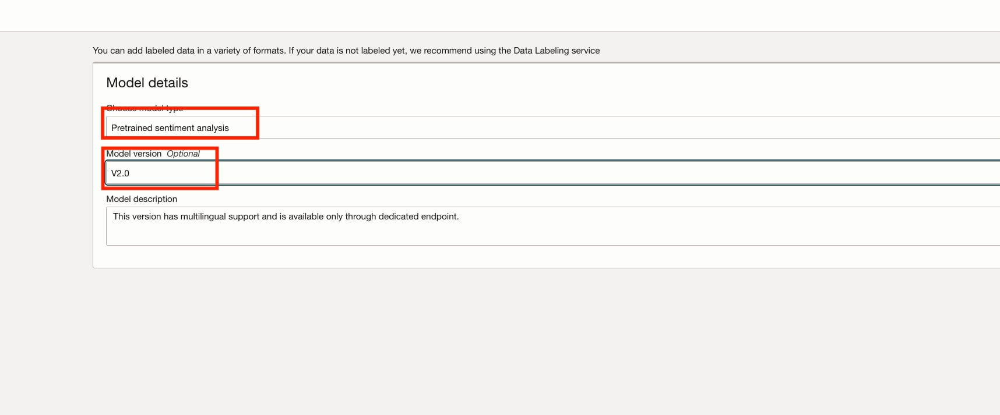

# Lab 5: Analyze text with healthcare and multilingual models

## Introduction

In this session, you will learn how to create healthcare and multilingual model for analysing text.

> ***Estimated Lab Time***: 20 minutes

### Objectives

In this lab, you will:

- Learn how to create healthcare and multilingual model for analysing text.

### Prerequisites

- A Free tier or paid tenancy account in OCI (Oracle Cloud Infrastructure)
- Familiar with OCI object storage to upload data.
- Completed [Lab 2](?lab=custom-model#Task1:CreateaProject) to create a project.


## Task 1: Create a healthcare model

1. **Create a healthcare Model**

    1. **Navigate to Project**: Navigate to the project you created in [Lab 2](?lab=custom-model#Task1:CreateaProject)

    2. **Navigate to Models**: Under models, click on create and train model.

    3. **Choose model type**: Choose Pretrained health entity detection for model type.
        

    4. **Specifiy model properties**: Specify model name, compartment details and click Next.

    5. **Create Model**: Click "Create and train" and this will kick of the process. Wait until model is in ACTIVE state.
 
2. **Create an Endpoint**

    1. Ensure the model status is *ACTIVE*
 
    2. Under Model endpoints, click on create model endpoint
    3. Specify the name of the endpoint and click on Create. The endpoint may take up to 30 minutes to activate.
        

    4. Wait till the endpoint status changes to *ACTIVE*.
    5. Under Resources, click on *Analyze* link.
    6. Enter text, and click on Analyze to see the result

        


## Task 2: Create a multilingual model

1. **Create a multilingual Model**

    1. **Navigate to Project**: Navigate to the project you created in [Lab 2](?lab=custom-model#Task1:CreateaProject)

    2. **Navigate to Models**: Under models, click on create and train model.

    3. **Choose model type**: Choose Pretrained sentiment analysis for model type and model version as "V2.0".
      

    4. **Specifiy model properties**: Specify model name, compartment details and click Next.

    5. **Create Model**: Click "Create and train" and this will kick of the process. Wait until model is in ACTIVE state. Time taken to complete model training is dependent on the data set size. For this dataset, it takes approximately 15 minutes.

2. **Create an Endpoint**

    1. Ensure the model status is *ACTIVE*
 
    2. Under Model endpoints, click on create model endpoint
    3. Specify the name of the endpoint and click on Create.
        

    4. Wait till the endpoint status changes to *ACTIVE*
    5. Under Resources, click on *Analyze* link.
    6. Enter text, and click on Analyze to see the result

        


## Task 3: Using Python SDK to create healthcare and multilingual model

#### **Python code to create healthcare and multilingual model**

```Python
<copy>
import oci

ai_client = oci.ai_language.AIServiceLanguageClient(oci.config.from_file())

compartment_id = <COMPARTMENT_ID> #TODO Specify your compartmentId here
namespace_name = <NAMESPACE_NAME> #TODO Specify the namespace here
bucket_name = <BUCKET_NAME> #TODO Specify name of your training data bucket here

# Create Pretrained health entity detection model
model_name = "ailanguagemodel"
project_id = "ocid1.ailanguageproject.oc1.iad.amaaaaaac4idruiamm2qertvgslshe6onn47tqy6b4ebtswp44pcvaxlxc3a"
model_details = oci.ai_language.models.ModelDetails(model_type="PRE_TRAINED_HEALTH_NLU", language_code="en")
create_model_details = oci.ai_language.models.CreateModelDetails(compartment_id=compartment_id, display_name=model_name, project_id=project_id, model_details=model_details)

model = ai_client.create_model(create_model_details)
print(model.data)

# Analyse text using  Pretrained health entity detection model endpoint
endpoint = <ENDPOINT_ID> #TODO Specify your endpoint id here
linkOntologies = ["RXNORM", "SNOMEDCT", "ICD10CM"]
key = "doc1"
text1 = "for high blood pressure use lisinopril 10mg P0 BID number 30 Refils 3 substitutions permitted";
doc1 = oci.ai_language.models.TextDocument(key=key, text=text1, language_code="en")
documents = [doc1]

batch_detect_health_entity_details = oci.ai_language.models.BatchDetectHealthEntityDetails(
    endpoint_id=endpoint,
    documents=documents,
    link_ontologies=linkOntologies,
    is_detect_assertions=True,
    is_detect_relationships=True);

output = ai_client.batch_detect_health_entity(batch_detect_health_entity_details)
print(output.data)

# Create multilingual model
model_details = oci.ai_language.models.PreTrainedSentimentAnalysisModelDetails(model_type="PRE_TRAINED_SENTIMENT_ANALYSIS", language_code="en", version="V2.0")
create_model_details = oci.ai_language.models.CreateModelDetails(compartment_id=compartment_id, project_id=project_id, model_details=model_details)
model = ai_client.create_model(create_model_details)
print(model.data)

# Analyse text using multilingual model
sentiment_endpoint_id = <ENDPOINT_ID> #TODO Specify your endpoint id here
batch_detect_language_sentiment_details = oci.ai_language.models.BatchDetectLanguageSentimentsDetails(documents=documents, endpoint_id=sentiment_endpoint_id)
output = ai_client.batch_detect_language_sentiments(batch_detect_language_sentiment_details,  level=["ASPECT","SENTENCE"])
print(output.data)


# PHI Entities Recognition
key1 = "doc1"
piiText = "Hello Support Team, I am reaching out to seek help with my credit card number 1234 5678 9873 2345 expiring on 11/23. There was a suspicious transaction on 12-Aug-2022 which I reported by calling from my mobile number +1 (423) 111-9999 also I emailed from my email id sarah.jones1234@hotmail.com. Would you please let me know the refund status? Regards, Sarah"
doc1 = oci.ai_language.models.TextDocument(key=key1, text=piiText, language_code="en")
documents = [doc1]

piiEntityMasking = oci.ai_language.models.PiiEntityMask(mode="MASK", masking_character="*", leave_characters_unmasked=4,
is_unmasked_from_end=True)
masking = {"ALL": piiEntityMasking}

profile = oci.ai_language.models.Profile(domain="PHI")
batch_detect_language_pii_entities_details = oci.ai_language.models.BatchDetectLanguagePiiEntitiesDetails(
    documents=documents, compartment_id=compartment_id, masking=masking, profile=profile)

output = ai_client.batch_detect_language_pii_entities(batch_detect_language_pii_entities_details)
print(output.data)
</copy>
```

## **Summary**

Congratulations! </br>
In this lab you have learnt how to setup required policies for Language, using different ways such as OCI Console, SDK and REST APIs to to analyze text.

You may now **proceed to the next lab**.

## Acknowledgements

**Authors**
  * Raja Pratap Kondamari - Product Manager, OCI Language Service
  * Sahil Kalra - Oracle AI OCI Language Services
  * Rajat Chawla  - Oracle AI OCI Language Services
  * Ankit Tyagi -  Oracle AI OCI Language Services

**Last Updated By/Date**
* Nitish Kumar Rai - OCI Language Service, April 2024

