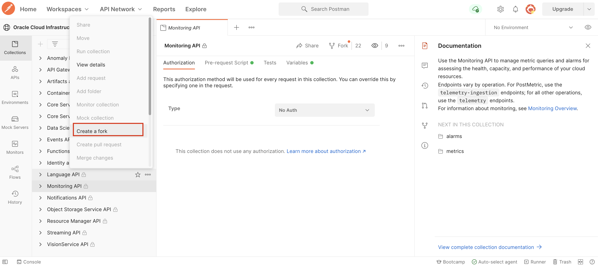

# Lab 4: Access OCI Language with REST APIs

## Introduction


In this lab session, we will show you how to access OCI Language using POSTMAN.

Postman is a GUI-based REST API invocation tool that is very popular among developers.

*Estimated Lab Time*: 10 minutes

### Objectives:
* Learn how to access Language Service through REST APIs.

### Prerequisites:
* Basic knowledge of REST API calls.
* Postman GUI in your local setup. If you don't have POSTMAN, please download it from [POSTMAN](https://www.postman.com/downloads/)

## **TASK 1:** Setting Up Postman for OCI REST APIs
We have provided steps below that can be used to allow invoking OCI REST APIs through Postman. Please follow the steps in the order described.

### 1. Visit the OCI Postman workspace

Visit the [OCI Postman workspace](https://www.postman.com/oracledevs/workspace/oracle-cloud-infrastructure-rest-apis/api/79bbefd7-4bba-4370-b741-3724bf3c9325) and login with your credentials.

### 2. Fork the Language APIs and OCI Credentials Environment.

Fork the Language API collection in your workspace by navigating to Language API collection and clicking the "Fork" option.


Enter name to indentify forked Language API collection, select the workspace you want to fork the collection to and click "Fork Collection".


Fork the OCI Credentials Environment in your workspace by navigating to Environments and clicking the "Fork" option.


Enter name to indentify forked OCI credentials environment, select the workspace you want to fork the collection to and click "Fork Collection".


### 3. Set the Variables
Navigate to your workspace and open newly forked environment (OCI Credentials), and set the variables tenancyId, authUserId, keyFingerprint and private Key. These are same that are found in the .oci file you created in the Lab 3 (Task 1 -> Step 4).

Make sure to set both Initial Value and Current Value of the variables(set both as the same value).

Click the Save button to commit your changes to the environment.
    


## **TASK 2:** Invoke Language OCI REST APIs

Invoke Language OCI REST APIs by clicking any one of the requests in the Language API COLLECTION. Enter the text you want to analyze in the body as shown below:
    ```
    <copy>{
  "documents": [
    {
      "key": "doc1",
      "text": "Hola, a mi me ha gustado la interacción con clientes por muchos años"
    }, 
 {
      "key": "doc2",
      "text": "Red Bull Racing Honda, the four-time Formula-1 World Champion team, has chosen Oracle Cloud Infrastructure (OCI) as their infrastructure partner."
    }
  ]
}<copy>
    ```
    
Below is the example shown to invoke Detect Language Service.
    

OCI Language service endpoints:

```
# Language Detection
https://language.aiservice.us-phoenix-1.oci.oraclecloud.com/20210101/actions/batchDetectDominantLanguage

# Key Phrase Extraction
https://language.aiservice.us-ashburn-1.oci.oraclecloud.com/20210101/actions/batchDetectLanguageKeyPhrases

# Named Entity Recognition
https://language.aiservice.us-ashburn-1.oci.oraclecloud.com/20210101/actions/batchDetectLanguageEntities

# Text Classification
https://language.aiservice.us-ashburn-1.oci.oraclecloud.com/20210101/actions/batchDetectLanguageTextClassification

# Sentiment Analysis
https://language.aiservice.us-ashburn-1.oci.oraclecloud.com/20210101/actions/batchDetectLanguageSentiments

```

[Proceed to the next section](#next).


## Acknowledgements
* **Authors**
    * Rajat Chawla  - Oracle AI Services
    * Ankit Tyagi -  Oracle AI Services
* **Last Updated By/Date**
    * Rajat Chawla  - Oracle AI Services, February 2021