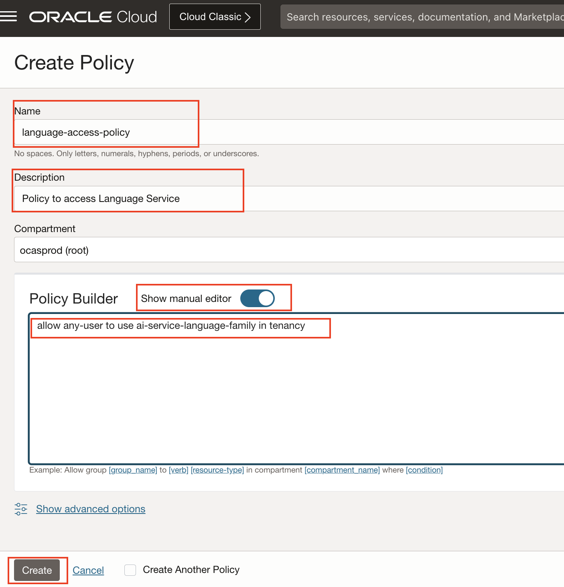
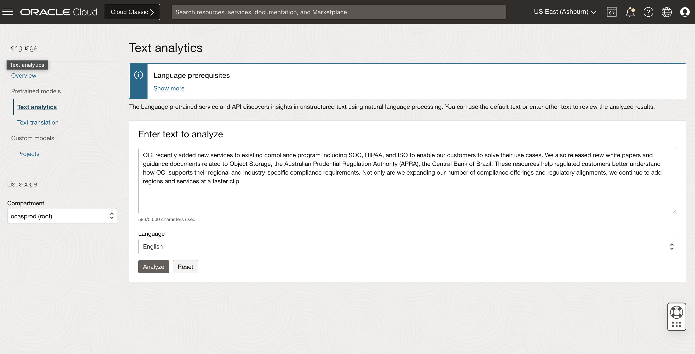
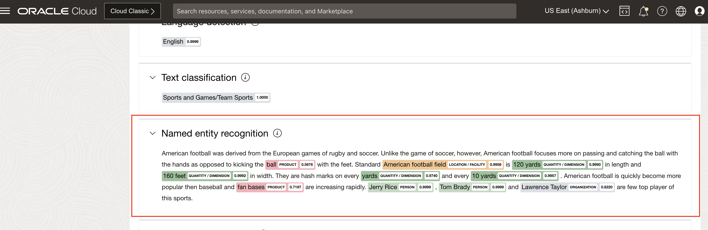
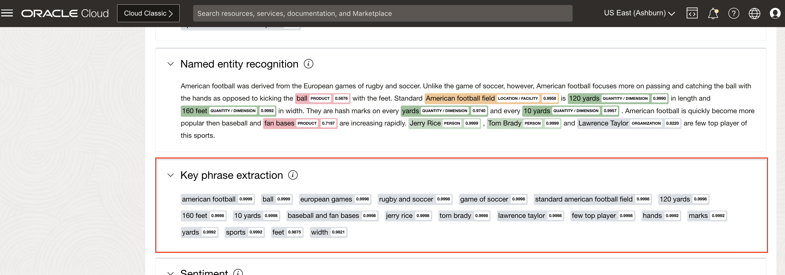
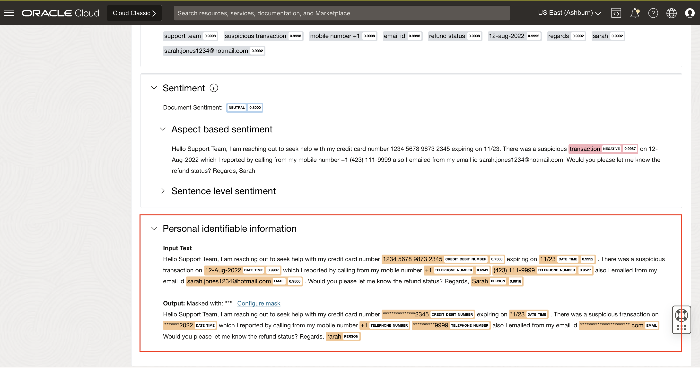
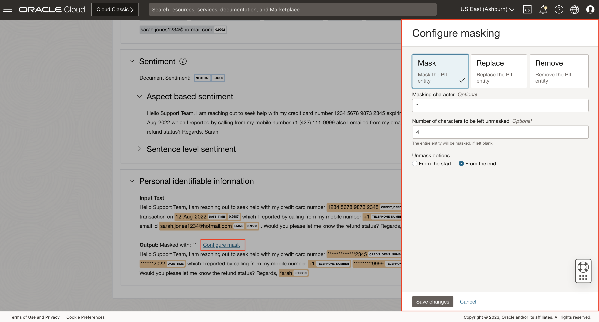
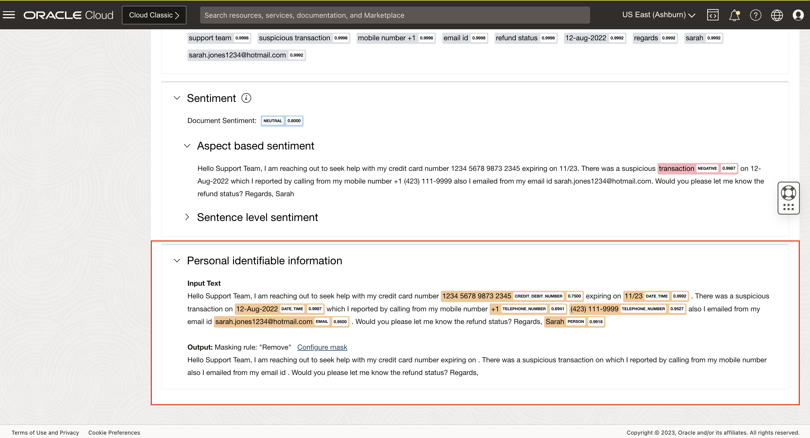
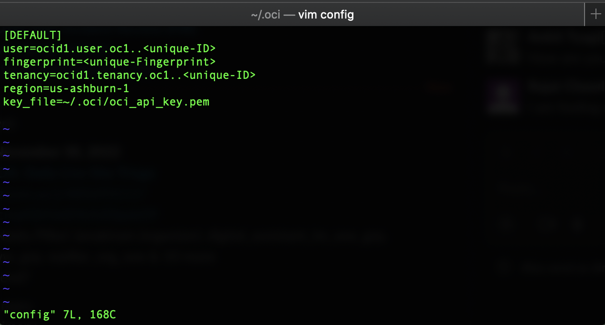

# Lab 1: Analyze text with pre-trained models

## Introduction

In this session will introduce you to OCI Language Pre-trained models and also help you to get familiar with various ways of consuming the services viz OCI Console, SDK and REST API.

> ***Estimated Lab Time***: 40 minutes

### Objectives

In this lab, you will:

- Understand a high level overview of the OCI Language.
- Show how to use OCI Console to analyze text.
- Introduce you to OCI Language service SDK and REST APIs.

### Prerequisites

- A Free tier or paid tenancy account in OCI (Oracle Cloud Infrastructure)

## **Policy Setup**

Before you start using OCI Language, OCI policies should be setup for allowing you to access OCI Language Services. Follow these steps to configure required policies.

1. Navigate to Policies

  Log into OCI Cloud Console. Using the Burger Menu on the top left corner, navigate to Identity & Security and click it, and then select Policies item under Identity.
    


2. Create Policy

  Click Create Policy
    


3. Create a new policy with the following statements:

  Leave the compartment to default value and add below statement to allow all the users in your tenancy to use language:
    ```
    <copy>allow any-user to use ai-service-language-family in tenancy</copy>
    ```

    


  If you want to limit access to a user group, create a new policy with the below statement:
    ```

    <copy>allow group <group-name> to use ai-service-language-family in tenancy</copy>
    ```
    


## TASK 1: Use the Console to analyze text

### 1. Navigate to OCI Language

  Log into OCI Cloud Console. Using the Burger Menu on the top left corner, navigate to Analytics and AI menu and click it, and then select Language item under AI services.
    

### 2. Enter Text

  Navigate to Text analytics under Pretrained models and enter your text into the dialog box to analyze.
    

  Below are some of the examples for the text:
    ```

    <copy>The European sovereign debt crisis was a period when several European countries experienced the collapse of financial institutions, high government debt, and rapidly rising bond yield spreads in government securities.</copy>
    ```
    ```

    <copy>The Seattle Sounders Football Club recently announced it was looking for a technology partner to provide a reliable, scalable, and secure solution that could ingest, process, and store game and player data. </copy>
    ```
    ```
    <copy>Hello Support Team, I am reaching out to seek help with my credit card number 1234 5678 9873 2345 expiring on 11/23. There was a suspicious transaction on 12-Aug-2022 which I reported by calling from my mobile number +1 (423) 111-9999 also I emailed from my email id sarah.jones1234@hotmail.com. Would you please let me know the refund status?Regards,Sarah</copy>
    ```


### 3. Click Analyze

  You can analyze text by clicking Analyze button.
    

### 4 Viewing Results

After you analyze your text, the Language service displays the results by category for the selected tools as follows:

#### 1. Sentiment Analysis

Renders the document level, aspect based and sentence level sentiment with score.
    

#### 2. Named Entity Recognition

Identifies the named entities that were found and their categories are indicated.
    

#### 3. Key Phrase Extraction

Lists the key phrases detected from the text.
    

#### 4. Language Detection

Lists, by confidence percentage, the languages detected.
    

#### 5. Text Classification

Lists the word, identified document category, and the confidence score.
    

#### 6. Personal Identifiable Information
Detects various entities of personal information.
    

- Click on Configure mask to mask, replace or remove identified PII entities.
    

- Select Replace and click on Save changes to replace identified entities with &lt;ENTITY_TYPE&gt;
    

- Select Remove and click Save changes to remove identified entities.
    


## Task 2: Analyze Text with Python SDK

### 1. **About OCI SDK**

Oracle Cloud Infrastructure provides a number of Software Development Kits (SDKs) to facilitate development of custom solutions. SDKs allow you to build and deploy apps that integrate with Oracle Cloud Infrastructure services. Each SDK also includes tools and artifacts you need to develop an app, such as code samples and documentation. In addition, if you want to contribute to the development of the SDKs, they are all open source and available on GitHub.

You can invoke OCI Language capabilities through the OCI SDKs. This section will show several code snippets to access OCI Language through the OCI SDKs. You do not need to execute the snippets, but review them to understand what information and steps are needed to implement your own integration. In addition, you can find OCI Language samples in different programming languages in this [github repository](https://github.com/oracle/oci-data-science-ai-samples/tree/master/ai_services/language)


#### 1. [SDK for Java](https://docs.oracle.com/en-us/iaas/Content/API/SDKDocs/javasdk.htm#SDK_for_Java)

#### 2. [SDK for Python](https://docs.oracle.com/en-us/iaas/Content/API/SDKDocs/pythonsdk.htm#SDK_for_Python)

#### 3. [SDK for TypeScript and JavaScript](https://docs.oracle.com/en-us/iaas/Content/API/SDKDocs/typescriptsdk.htm#SDK_for_TypeScript_and_JavaScript)

#### 4. [SDK for .NET](https://docs.oracle.com/en-us/iaas/Content/API/SDKDocs/dotnetsdk.htm#SDK_for_NET)

#### 5. [SDK for Go](https://docs.oracle.com/en-us/iaas/Content/API/SDKDocs/gosdk.htm#SDK_for_Go)

#### 6. [SDK for Ruby](https://docs.oracle.com/en-us/iaas/Content/API/SDKDocs/rubysdk.htm#SDK_for_Ruby)

### **2. Setup API Signing Key and Config File**


Mac OS / Linux:

```
<copy>mkdir ~/.oci</copy>
```
Windows:
```
<copy>mkdir %HOMEDRIVE%%HOMEPATH%\.oci</copy>
```

Generate an API signing key pair

#### 1. Open User Settings

Open the Profile menu (User menu icon) and click User Settings.
    

#### 2. Open API Key

Navigate to API Key and then Click Add API Key.
    

#### 3. Generate API Key

In the dialog, select Generate API Key Pair. Click Download Private Key and save the key to your .oci directory and then click Add.
    

#### 4. Generate Config File

Copy the values shown on the console.
    

Create a config file in the .oci folder and paste the values copied.
Replace the key_file value with the path of your generated API Key.
    


To Know more visit [Generating API KEY](https://docs.oracle.com/en-us/iaas/Content/API/Concepts/apisigningkey.htm) and [SDK and CLI Configuration File](https://docs.oracle.com/en-us/iaas/Content/API/Concepts/sdkconfig.htm#SDK_and_CLI_Configuration_File)

### **3. Installing OCI Python SDK**

#### 1. Check python version and pip version

Please follow the steps in the order described.
Before you go any further, make sure you have Python 3.x version and that it’s available from your command line. You can check this by simply running:
```
<copy>python --version</copy>
```
If you do not have Python, please install the latest 3.x version from [python.org ](https://www.python.org)

Additionally, you’ll need to make sure you have pip available. You can check this by running:
```
<copy>pip --version</copy>
```
If you installed Python from source, with an installer from python.org, or via Homebrew you should already have pip. If you’re on Linux and installed using your OS package manager, you may have to install pip separately.


#### 2. Create virtualenv

To create a virtual environment, run the venv module as a script as shown below
```
<copy>python3 -m venv <name of virtual environment></copy>
```
#### 3. Activate virtualenv

Once you’ve created a virtual environment, you may activate it.

Mac OS / Linux:
```
<copy>source <name of virtual environment>/bin/activate</copy>
```
Windows:
```
<copy><name of virtual environment>\Scripts\activate</copy>
```
#### 4. Install OCI

Now Install oci by running:
```
<copy>pip install oci</copy>
```

### **4. Download Python Sample**

#### Python Code

```Python
<copy>
import oci

ai_client = oci.ai_language.AIServiceLanguageClient(oci.config.from_file())

key1 = "doc1"
key2 = "doc2"
text1 = "Hello Support Team, I am reaching out to seek help with my credit card number 1234 5678 9873 2345 expiring on 11/23. There was a suspicious transaction on 12-Aug-2022 which I reported by calling from my mobile number +1 (423) 111-9999 also I emailed from my email id sarah.jones1234@hotmail.com. Would you please let me know the refund status? Regards, Sarah"
text2 = "Using high-performance GPU systems in the Oracle Cloud, OCI will be the cloud engine for the artificial intelligence models that drive the MIT Driverless cars competing in the Indy Autonomous Challenge."

compartment_id = "<COMPARTMENT_ID>" #TODO Specify your compartmentId here

#language Detection of Input Documents
doc1 = oci.ai_language.models.DominantLanguageDocument(key=key1, text=text1)
doc2 = oci.ai_language.models.DominantLanguageDocument(key=key2, text=text2)
documents = [doc1, doc2]
batch_detect_dominant_language_details = oci.ai_language.models.BatchDetectDominantLanguageDetails(documents=documents, compartment_id=compartment_id)
output = ai_client.batch_detect_dominant_language(batch_detect_dominant_language_details)
print(output.data)

doc1 = oci.ai_language.models.TextDocument(key=key1, text=text1, language_code="en")
doc2 = oci.ai_language.models.TextDocument(key=key2, text=text2, language_code="en")
documents = [doc1, doc2]

#Text Classification of Input Documents
batch_detect_language_text_classification_details = oci.ai_language.models.BatchDetectLanguageTextClassificationDetails(documents=documents, compartment_id=compartment_id)
output = ai_client.batch_detect_language_text_classification(batch_detect_language_text_classification_details)
print(output.data)

#Named Entity Recognition of Input Documents
batch_detect_language_entities_details = oci.ai_language.models.BatchDetectLanguageEntitiesDetails(documents=documents, compartment_id=compartment_id)
output = ai_client.batch_detect_language_entities(batch_detect_language_entities_details)
print(output.data)

#Key Phrase Detection of Input Documents
batch_detect_language_key_phrases_details = oci.ai_language.models.BatchDetectLanguageKeyPhrasesDetails(documents=documents, compartment_id=compartment_id)
output = ai_client.batch_detect_language_key_phrases(batch_detect_language_key_phrases_details)
print(output.data)

#Aspect based and Sentence level Sentiment Analysis of Input Documents
batch_detect_language_sentiment_details = oci.ai_language.models.BatchDetectLanguageSentimentsDetails(documents=documents, compartment_id=compartment_id)
output = ai_client.batch_detect_language_sentiments(batch_detect_language_sentiment_details,  level=["ASPECT","SENTENCE"])
print(output.data)

#Personal Identifiable Information Entities Recognition
piiEntityMasking = oci.ai_language.models.PiiEntityMask(mode="MASK", masking_character="*", leave_characters_unmasked=4,
                                                        is_unmasked_from_end=True)
masking = {"ALL": piiEntityMasking}

batch_detect_language_pii_entities_details = oci.ai_language.models.BatchDetectLanguagePiiEntitiesDetails(
    documents=documents, compartment_id=compartment_id, masking=masking)
output = ai_client.batch_detect_language_pii_entities(batch_detect_language_pii_entities_details)
print(output.data)
</copy>
```

Follow below steps to run Python SDK:

#### 1. Download Python Code.

Download [code](./files/language.py) file and save it your directory.

#### 2. Execute the Code.
Navigate to the directory where you saved the above file (by default, it should be in the 'Downloads' folder) using your terminal and execute the file by running:

```
<copy>python language.py</copy>
```

#### 3. Result
You will see the result as below
    


### Learn More
To know more about the Python SDK visit [Python OCI-Language](https://docs.oracle.com/en-us/iaas/tools/python/2.43.1/api/ai_language/client/oci.ai_language.AIServiceLanguageClient.html)

To know more about the Java SDK visit [Java OCI-Language](https://docs.oracle.com/en-us/iaas/tools/java/2.3.1/)

To know more about the Go SDK visit [Go OCI-Language](https://docs.oracle.com/en-us/iaas/tools/go/45.1.0/ailanguage/index.html)

To know more about the Ruby SDK visit [Ruby OCI-Language](https://docs.oracle.com/en-us/iaas/tools/ruby/2.14.0/OCI/AiLanguage.html)

To know more about the Java Script SDK visit [Java Script OCI-Language](https://docs.oracle.com/en-us/iaas/tools/typescript/2.0.1/modules/_ailanguage_index_.html)


To know more about the DOT NET SDK visit [DOT NET OCI-Language](https://docs.oracle.com/en-us/iaas/tools/dotnet/23.1.0/api/Oci.AilanguageService.html)


## TASK 3: Analyze text using OCI Data Science Notebook

### 1. **About OCI Data Science**

OCI Data Science Notebook is a web application that contains code, results and visualizations that makes testing and sharing ML pipelines simple.


### 2. **Setting up Data Science Prerequisites**

Before you can start using Data Science, your tenancy administrator should set up the following networking, dynamic group, and policies.

  1. Create VCN and Subnets

    Create a VCN and subnets using Virtual Cloud Networks > Start VCN Wizard > VCN with Internet Connectivity option.
    The Networking Quickstart option automatically creates the necessary private subnet with a NAT gateway.

  1. Create Dynamic Group

    Create a dynamic group with the following matching rule:</br>
    ALL { resource.type = 'datasciencenotebooksession' }

  1. Create Policies

    Create a policy in the root compartment with the following statements:

* Service Policies

    ```
    <copy>allow service datascience to use virtual-network-family in tenancy</copy>
    ```

* Non-Administrator User Policies

    ```
    <copy>
    allow group <data-scientists > to use virtual-network-family in tenancy
    </copy>
    ```
    ```
    <copy>
    allow group <data-scientists > to manage data-science-family in tenancy
    </copy>
    ```

    where `<data-scientists>` represents the name of your user group.

 * Dynamic Group Policies

    ```
    <copy>allow dynamic-group <dynamic-group> to manage data-science-family in tenancy</copy>
    ```

    where `<dynamic-group>` represents the name of your dynamic group.
</br></br>

### 3. **Navigate to the Data Science Notebook Session**

Follow the below steps to open Notebook in DataScience:

  1. Navigate to Data Science Service

    Log into OCI Cloud Console. Using the Burger Menu on the top left corner, navigate to Analytics and AI menu and click it, and then select Data Science item under Machine Learning.
    

  2. Select Compartment

    Select the Compartment in which want to create your project.
    

  3. Create Project

    Click Create Project to create a new project.
    

  4. Enter Project Details

    Enter name and click Create Button.
    

  5. Create Notebook Session

    Click Create Notebook Session to create a new Notebook session.
    

  6. Enter Notebook Details

    Select a name.
    We recommend you choose VM.Standard2.8 (not VM.Standard.E2.8) as the shape. This is a high performance shape, which will be useful for tasks such as AutoML.
    Set block storage to 50 GB.
    Select the subnet with Internet connectivity. (Select private subnet if you have use VCN Wizard to create VCN)
    

  7. Open the OCI Data Science notebook

    The Notebook Session VM will be created. This might take a few minutes. When created you will see a screen like the following.
    Open the notebook session that was provisioned.
    
</br></br>

### 4. **Invoke the Language Service**

  1. Download and Upload the Files

    Download this [Sentiment Analysis](./files/sentiment-batch.ipynb) and [Named Entitiy Recognition](./files/ner-batch.ipynb) files and upload it in the Notebook. 
    Download this [Dataset](./files/data.csv) and upload it in the Notebook.
    

  1. Setup API Signing Key and Config File

    Open the Terminal by clicking the Terminal icon in the Launcher Tab.

    In the terminal, create a .oci directory in the Data Science notebook session.
    ```
    <copy>mkdir ~/.oci</copy>
    ```

    Upload the Config file and the Private Key to the Notebook Session by clicking on the Upload Files Icon you just created in Task 2 (Step2: Setup API Signing Key and Config File)

    In the terminal, move those files to the .oci folder.
    ```
    <copy>mv <path of the config file> ~/.oci/</copy>
    ```
    ```
    <copy>mv <path of the private key> ~/.oci/</copy>
    ```

    To Know more about about how to create API Key and config file, Refer Lab-3 (Setup API Signing Key and Config File).
    

### 5. **Execute the Notebooks**

Open the Notebook that you've just uploaded

Now go through each of the cells and run them one by one. You can click Shift+Enter on each cell to run the code in the cell.

These notebooks demonstrates how you can be more productive by using the various Language services.


## TASK 4: Analyze Text using REST API

### 1. **Setting Up Postman tool to access OCI REST API**

  1. Installation

    Postman is a utility used to invoke REST APIs. If you do not have the utlity installed, please download and install from [POSTMAN](https://www.postman.com/downloads/).

    Once installed, please follow below to configure Postman.

  2. Fork OCI Postman workspace

   Visit the [OCI Postman workspace](https://www.postman.com/oracledevs/workspace/oracle-cloud-infrastructure-rest-apis/api/79bbefd7-4bba-4370-b741-3724bf3c9325) and login with your credentials

  3. Fork the Language APIs and OCI Credentials Environment

    Fork the Language API collection in your workspace by navigating to Language API collection and clicking the "Fork" option.
    

    Enter name to identify forked Language API collection, select the workspace you want to fork the collection to and click "Fork Collection".
    

    Fork the OCI Credentials Environment in your workspace by navigating to Environments and clicking the "Fork" option.
    

    Enter name to identify forked OCI credentials environment, select the workspace you want to fork the collection to and click "Fork Collection".
    


  4. Set up variables

* Navigate to your workspace and open newly forked environment (OCI Credentials), and set the variables tenancyId, authUserId, keyFingerprint and private Key. These are same that are found in the .oci file you created in the Task 2 (Step2: Setup API Signing Key and Config File).

* Make sure to set both Initial Value and Current Value of the variables(set both as the same value).

* Click the Save button to commit your changes to the environment.
    


### 2. **Invoke Language OCI REST API**

Invoke Language OCI REST APIs by clicking any one of the requests in the Language API COLLECTION. Enter the text you want to analyze in the body as shown below:

```
    <copy>{
  "documents": [
    {
      "key": "doc1",
      "text": "Hola, a mi me ha gustado la interacción con clientes por muchos años"
    },
 {
      "key": "doc2",
      "text": "Red Bull Racing Honda, the four-time Formula-1 World Champion team, has chosen Oracle Cloud Infrastructure (OCI) as their infrastructure partner."
    }
  ]
}<copy>
    ```


Below is the example shown to invoke Detect Language Service.
    

OCI Language service endpoints:

```<copy>
# Language Detection
https://language.aiservice.us-ashburn-1.oci.oraclecloud.com/20221001/actions/batchDetectDominantLanguage
    
# Key Phrase Extraction
https://language.aiservice.us-ashburn-1.oci.oraclecloud.com/20221001/actions/batchDetectLanguageKeyPhrases
    
# Named Entity Recognition
https://language.aiservice.us-ashburn-1.oci.oraclecloud.com/20221001/actions/batchDetectLanguageEntities
    
# Text Classification
https://language.aiservice.us-ashburn-1.oci.oraclecloud.com/20221001/actions/batchDetectLanguageTextClassification
    
# Sentiment Analysis
https://language.aiservice.us-ashburn-1.oci.oraclecloud.com/20221001/actions/batchDetectLanguageSentiments

# Personal Identifiable Information
https://language.aiservice.us-ashburn-1.oci.oraclecloud.com/20221001/actions/batchDetectLanguagePiiEntities
</copy>```

## **Summary**

Congratulations! </br>
In this lab you have learnt how to setup required policies for Language, using different ways such as OCI Console, SDK and REST APIs to to analyze text.

You may now **proceed to the next lab**.

## Acknowledgements

**Authors**
  * Raja Pratap Kondamari - Product Manager, OCI Language Service
  * Sahil Kalra - Oracle AI OCI Language Services
  * Rajat Chawla  - Oracle AI OCI Language Services
  * Ankit Tyagi -  Oracle AI OCI Language Services

**Last Updated By/Date**
* Sahil Kalra - OCI Language Service, March 2022

