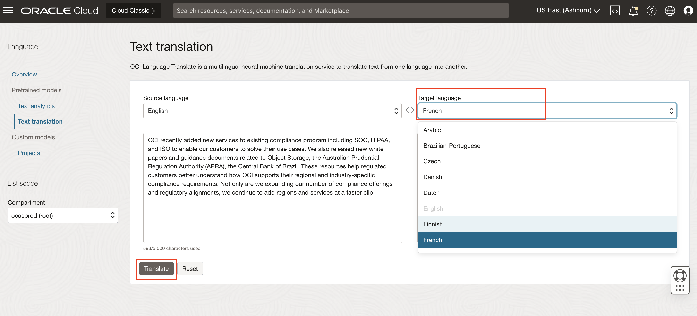

# Lab 3: Translate text using OCI Console and python SDK

## Introduction

OCI Language Translate is a multilingual neural machine translation service to translate text from one language into another.
In this session will introduce you to OCI Language Translation and also help you to get familiar with the translation console.

> ***Estimated Lab Time***: 10 minutes

### Objectives

In this lab, you will learn to:

- Use OCI Console to perform text translation.
- Use OCI Python SDK to translate text.

### Prerequisites

- A Free tier or paid tenancy account in OCI (Oracle Cloud Infrastructure)
- Language policies are configured as per [Lab 1](?lab=analyze-text#PolicySetup)


## **TASK 1:** Translate Text using OCI Console


1. **Navigate to OCI Language Translation**: 

    Log into OCI Cloud Console. Using the Burger Menu on the top left corner, navigate to Analytics and AI menu and click it, and then select Language item under AI services.

    

    Using the Navigation Menu on the top left corner, navigate to Text Translation menu under Pretrained models.

    

2. **Specify text details:** 

    Specify the text, source language and target language and click on *Translate*
    
    

    You may copy below text or specify your own text:
    ```

     <copy>The European sovereign debt crisis was a period when several European countries experienced the collapse of financial institutions, high government debt, and rapidly rising bond yield spreads in government securities. The debt crisis began in 2008 with the collapse of Iceland's banking system, then spread primarily to Portugal, Italy, Ireland, Greece, and Spain in 2009, leading to the popularisation of an offensive moniker (PIIGS). It has led to a loss of confidence in European businesses and economies. The crisis was eventually controlled by the financial guarantees of European countries, who feared the collapse of the euro and financial contagion, and by the International Monetary Fund (IMF).</copy>
    ```


    

3. **Viewing Results:** You can see the translated text under the target language

    After you translate your text, the Language service displays the translated text.

    


## **TASK 2:** Translate Text with Python SDK

Please refer to the sample code below and update required variables to translate text using Python SDK

Pre-requisites: For using Python SDK, please follow steps described in [Lab 1](?lab=analyze-text#Task2AnalyzeTextwithPythonSDK)


#### Python Code to translate text usign OCI SDK

```Python
<copy>
import oci

ai_client = oci.ai_language.AIServiceLanguageClient(oci.config.from_file())

key1 = "doc1"
key2 = "doc2"
text1 = "The Indy Autonomous Challenge is the worlds first head-to-head, high speed autonomous race taking place at the Indianapolis Motor Speedway"
text2 = "OCI will be the cloud engine for the artificial intelligence models that drive the MIT Driverless cars."
target_language = "de" #TODO specify the target language
compartment_id = <COMPARTMENT_ID> #TODO Provide your compartmentId here

doc1 = oci.ai_language.models.TextDocument(key=key1, text=text1, language_code="en")
doc2 = oci.ai_language.models.TextDocument(key=key2, text=text2, language_code="en")
documents = [doc1, doc2]


batch_language_translation_details = oci.ai_language.models.BatchLanguageTranslationDetails(documents=documents, compartment_id=compartment_id, target_language_code=target_language)
output = ai_client.batch_language_translation (batch_language_translation_details)
print(output.data)
</copy>
```

Download [code](./files/translationpythonsdk.py) file and save it your directory.

### Learn More
To know more about the Python SDK visit [Python OCI-Language](https://docs.oracle.com/en-us/iaas/tools/python/2.43.1/api/ai_language/client/oci.ai_language.AIServiceLanguageClient.html)


## **Summary**

Congratulations! </br>
In this lab you have learnt how to use Language Service to translate text with OCI Console and Python SDK.

[Proceed to the next section](#next)

## Acknowledgements

**Authors**
  * Raja Pratap Kondamari - Product Manager, OCI Language Service
  * Sahil Kalra - Oracle AI OCI Language Services
  * Rajat Chawla - Oracle AI OCI Language Services

**Last Updated By/Date**
* Raja Pratap Kondamari - Product Manager, OCI Language Service, October 2022

