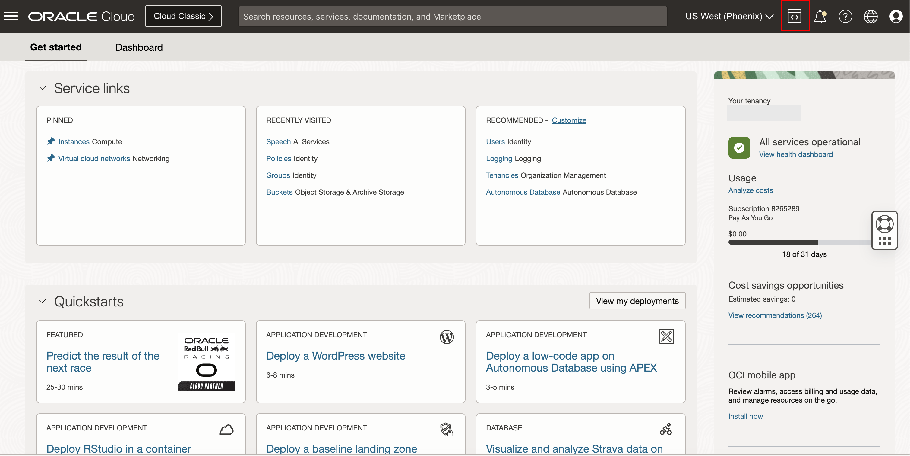
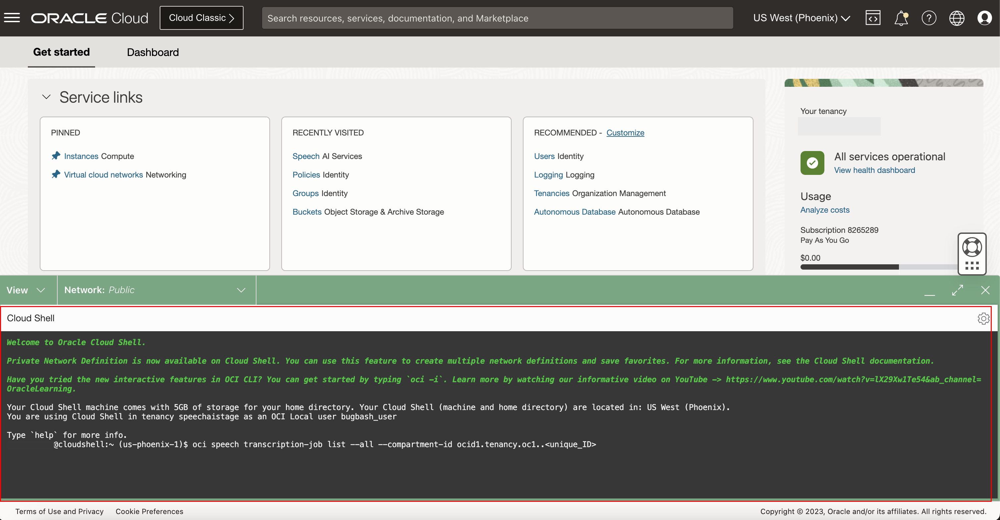
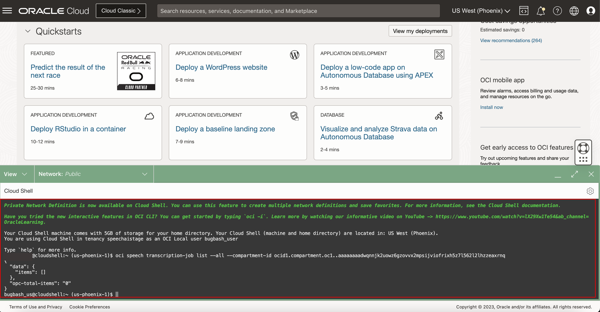

# Lab 3: Access OCI speech with OCI CLI

## Introduction

OCI Speech can be called from the OCI Command Line Interface (CLI).

In this lab session, we will show several code snippets to access our service with CLI.

You do not need to execute these codes, but review them to understand what information and steps are needed to implement your own integration.

*Estimated Lab Time*: 10 minutes

### Objectives:

* Learn how to use CLI to communicate with our speech service endpoints.

### Prerequisites:
* Have completed Lab #1 policy setup
* If you don't have the permission to access the cloud shell, ask your administrator to add the below policy
    ```
    <copy>allow any-user to use cloud-shell in tenancy</copy>
    ```

### CLI Info

The CLI is a small-footprint tool that you can use on its own or with the Console to complete Oracle Cloud Infrastructure tasks. The CLI provides the same core functionality as the Console, plus additional commands. Some of these, such as the ability to run scripts, extend Console functionality.


## Task 1: Run OCI CLI in Cloud Shell

1. Navigate to Cloud Shell

    Log into OCI cloud console. Navigate to cloud shell icon on the top right and click it.
        

2. Enter Speech CLI Command

    Enter any one of the speech pre-deployed CLI commands you want to execute.
        


3. View Result

    The speech service displays the results as shown below:
        


## Task 2: Install OCI CLI in your local environment

Follow Lab 2 Task 2 setup for python, then in your python virtual environment, run:
```
<copy>
pip install oci-cli
</copy>
```


## Task 3: Issue some of the OCI speech commands

1. Create Transcription Job
    Run this command : <strong>oci speech transcription-job create -c</strong>

    If your Location type is Inline input location
        ```
        <copy>
        oci speech transcription-job create -c ocid1.tenancy.oc1..<unique_ID> --input-location '{
        "compartmentId": "ocid1.compartment.oc1..<uniqueID>",
        "definedTags": null,
        "description": "<descriptionPlaceholder>",
        "displayName": "<displayNamePlaceholder>",
        "freeformTags": null,
        "inputLocation": {
            "locationType": "OBJECT_LIST_INLINE_INPUT_LOCATION",
            "objectLocations": [
                {
                    "bucketName": "<bucketNamePlaceholder>",
                    "namespaceName": "<namespacePlaceholder>",
                    "objectNames": [
                        "<filename1>",
                        "<filename2>",
                        "<filename3>"
                    ]
                }
            ]
        },
        "modelDetails": {
            "domain": "GENERIC",
            "languageCode": "en-US"
        },
        "normalization": {
            "filters": [{"type": "PROFANITY", "mode": "TAG"}],
            "isPunctuationEnabled": true
        },
        "outputLocation": {
            "bucketName": "<outputBucketPlaceholder>",
            "namespaceName": "<namespacePlaceholder>",
            "prefix": "<examplePrefix>/"
        }
    }' --defined-tags null --description "This is newly created Job from CLI" --display-name "cli_test_job" --freeform-tags null
        </copy>
        ```

     If your Location type is File input location
        ```
        <copy>
        oci speech transcription-job create -c ocid1.tenancy.oc1..<unique_ID> --input-location '{
        "compartmentId": "ocid1.compartment.oc1..<uniqueID>",
        "definedTags": null,
        "description": "<descriptionPlaceholder>",
        "displayName": "<displayNamePlaceholder>",
        "freeformTags": null,
        "inputLocation": {
            "locationType": "OBJECT_LIST_FILE_INPUT_LOCATION",
            "objectLocation": {
                    "bucketName": "<bucketNamePlaceholder>",
                    "namespaceName": "<namespacePlaceholder>",
                    "objectNames": [
                        "<filename1>.json",
                        "<filename2>.json",
                        "<filename3>.json"
                    ]
                }
        },
        "modelDetails": {
            "domain": "GENERIC",
            "languageCode": "en-US"
        },
        "normalization": {
            "filters": [{"type": "PROFANITY", "mode": "TAG"}],
            "isPunctuationEnabled": true
        },
        "outputLocation": {
            "bucketName": "<outputBucketPlaceholder>",
            "namespaceName": "<namespacePlaceholder>",
            "prefix": "<examplePrefix>/"
        }
    }' --defined-tags null --description "This is newly created Job from CLI" --display-name "cli_test_job" --freeform-tags null
        </copy>
        ```

        

2. Cancel transcription job
    Run this command : <strong>oci speech transcription-job cancel</strong>
        ```
        <copy>
        oci speech transcription-job cancel --transcription-job-id <job-ocid>
        </copy>
        ```

3. Get transcription job
    Run this command : <strong>oci speech transcription-job get</strong>
        ```
        <copy>
        oci speech transcription-job get --transcription-job-id ocid1.aispeechtranscriptionjob.oc1..<unique_ID>
        </copy>
        ```

4. Update transcription job
    Run this command: <strong>oci speech transcription-job update</strong>
        ```
        <copy>
        oci speech transcription-job update --transcription-job-id <job_OCID>
        </copy>
        ```

4. Gets all transcription jobs from a particular compartment
    Run this command : <strong>oci speech transcription-job list --all --compartment-id</strong>
        ```
        <copy> 
        oci speech transcription-job list --all --compartment-id ocid1.tenancy.oc1..<unique_ID>
        </copy>
        ```

5. Move transcription job 
    Run this command : <strong>oci speech transcription-job change-compartment</strong>
        ```
        <copy>
        oci speech transcription-job change-compartment --transcription-job-id <job_OCID> --compartment-id <compartment_OCID>
        </copy>
        ```

6. Gets transcription tasks under given transcription Job Id
    Run this command : <strong>oci speech transcription-task list --transcription-job-id</strong>
        ```
        <copy>
        oci speech transcription-task list --transcription-job-id ocid1.aispeechtranscriptionjob.oc1..<unique_ID> --all
        </copy>
        ```

7. Gets a transcription task with given transcription task id under transcription job id
    Run this command : <strong>oci speech transcription-task get --transcription-job-id <jobID> --transcription-task-id <taskID></strong>
        ```
        <copy>
        oci speech transcription-task get --transcription-job-id ocid1.aispeechtranscriptionjob.oc1..<unique_ID> --transcription-task-id ocid1.aispeechtranscriptiontask.oc1..<unique_ID>
        </copy>
        ```

8. Cancel transcription task
    Run this command : <strong>oci speech transcription-task cancel</strong>
        ```
        <copy>
        oci speech transcription-task cancel --transcription-job-id <job-ocid> --transcription-task-id <task-ocid>
        </copy>
        ```

Click [here](https://docs.oracle.com/en-us/iaas/Content/API/Concepts/cliconcepts.htm) to learn more about CLI, 

Congratulations on completing this lab!

You may now **proceed to the next lab**

## Acknowledgements
* **Authors**
    * Alex Ginella - Oracle AI Services
    * Rajat Chawla  - Oracle AI Services
    * Ankit Tyagi -  Oracle AI Services
    * Veluvarthi Narasimha Reddy - Oracle AI Services
