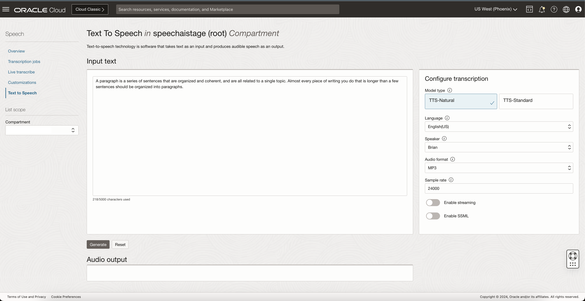
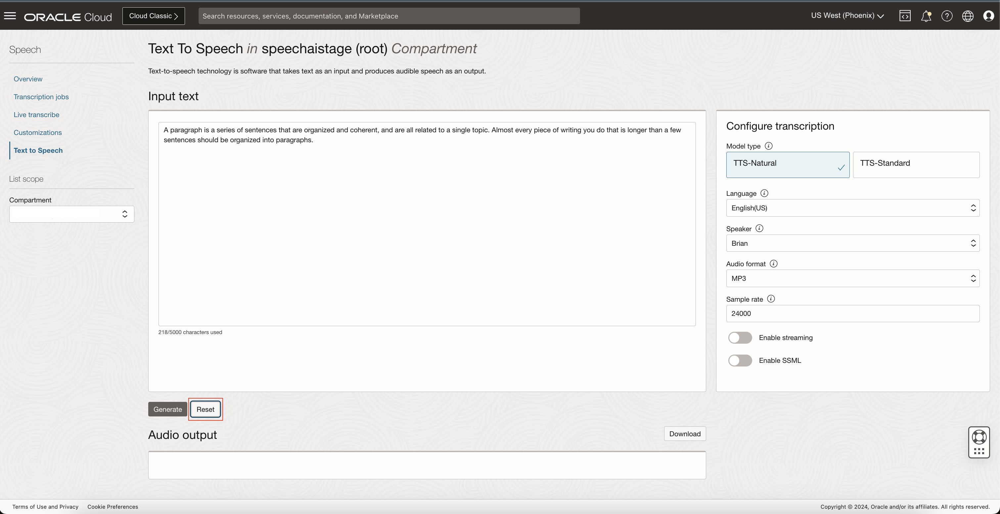
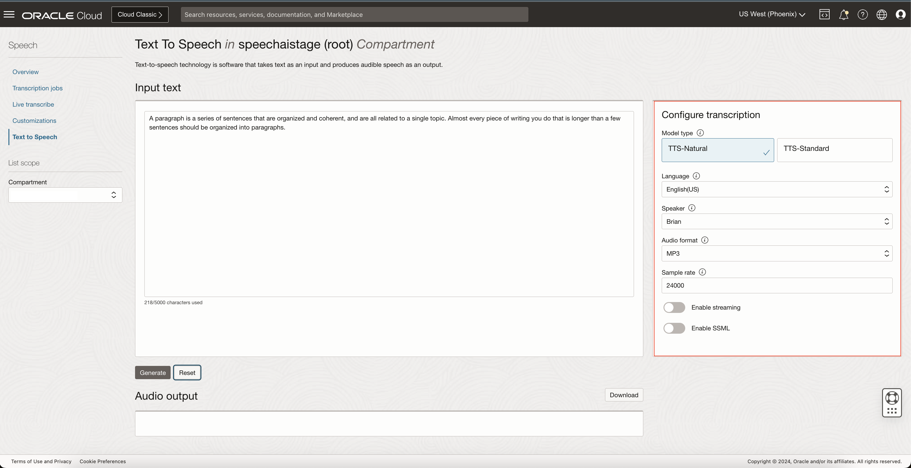
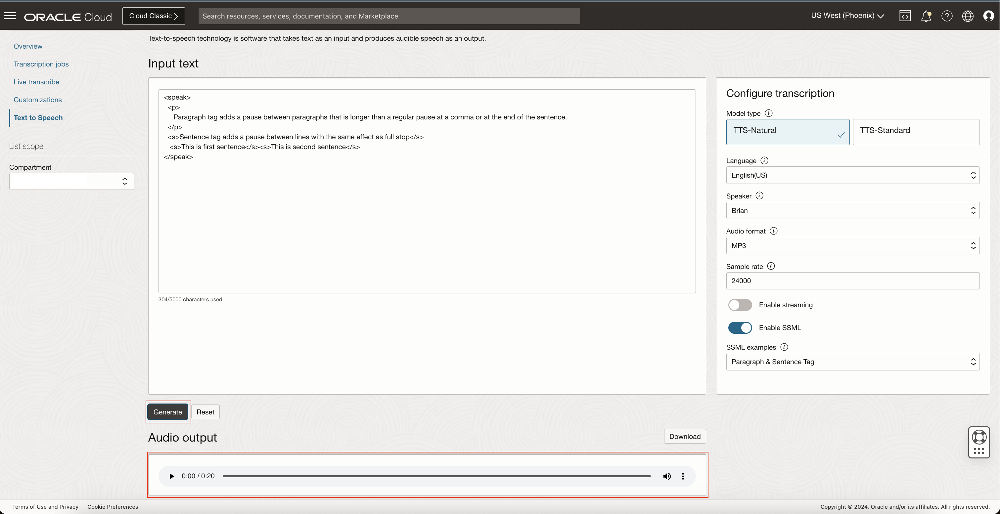

# Lab 7: Convert Text to Speech in OCI Console and SDK

## Introduction

In order to use the OCI (Oracle Cloud Infrastructure) speech service you must upload formatted audio files to an OCI
object storage bucket

***Estimated Lab Time***: 10 minutes

### Objectives

In this lab, you will:
- Understand how to convert input text to audible speech as output

### Prerequisites
- A Free tier or paid tenancy account in OCI
- Tenancy is whitelisted to be able to use OCI Speech TTS
- Have completed Lab #4 API signing key and config file setup and Prerequisites and setup for python
- Familiar with Python programming is required
- Install with Python libraries: `oci` and `requests`

## Task 1: Navigate to Overview Page
Log into OCI Cloud Console. Using the Burger Menu on the top left corner, navigate to Analytics and AI menu and click it, and then select Language item under AI services.
    

This will navigate you to the transcription jobs overview page.
On the left you can toggle between overview and transcription jobs listing page.
Under documentation you can find helpful links relevant to OCI speech service
    

## Task 2: Open Text to Speech and Generate Audio

1. Click "Text to Speech" in the side menu.
    

2. Now you should be seeing the TTS page with default values. The Input text box will be filled with default text which can be edited as per requirement.
        ```
        <copy>
        A paragraph is a series of sentences that are organized and coherent, and are all related to a single topic. Almost every piece of writing you do that is longer than a few sentences should be organized into paragraphs.
        </copy>
        ```
    

3. Click on *Generate* button to generate the audio file, Which you should be able to play with built-in audio player.

4. Click on the download button if you want to download the generated audio response to your local system.
    

5. Click on the *reset* button to reset all the configured input parameters to go back to default values and clear generated audio response.
    

## Task 3: Changing Transcription Paramerters

To change transcription parameters, look to the <strong>Configure transcription</strong> menu to the right

1. Configure transcription

    Here you can change parameters such as Model type, Language, Speaker, Audio format, Enable Streaming and Enable SSML
        

    <strong>Model type:</strong> Use this parameter to specify the model type required. Currently we offer two model types "TTS-Standard" and "TTS-Natural". Based on the model type selected, the options for speaker will change.

    <strong>Language:</strong> Use this parameter to specify the language for the input language and desired audio language. List of languages supported are *English US, English GB, Portuguese(Brazil), Spanish, French, Italian, Hindi, Japanese, Chinese(Mandarin)*

    <strong>Speaker:</strong> Use this parameter to select the desired speaker from the dropdown menu.

    <strong>Audio format:</strong> Use this parameter to select the desired audio Format from the dropdown menu.

    <strong>Enable Streaming:</strong> Use this parameter to enable streaming option to generate responses quicker for bigger input in a streaming manner for bigger input texts.

    <strong>Enable SSML:</strong> Use this parameter to get more custtomized audio responses. After toggling this button you should be able to see new dialog box *SSML examples* which has example inputs for different tags

## Task 4: Audio Format as JSON

When you choose audio format as JSON, you can also generate transcriptions with word and sentence timestamps along with the audio response.

1. Select audio format as JSON from the "Audio format" dropdown.

2. As we select the JSON audi format from the dropdown, It will open new dropdown in right-side menu "Speech Mark Types". Select from the mark types "Word" and "Sentence" as per requirement from the dropdown.

3. Click *Generate* button to generate the audio and the speech mark types json value.
    

4. Below the audio player you can see the speech mark types transcriptions by clicking the toggle button "Show JSON"
    

5. Hide the JSON response by clicking the button "Hide JSON". Also you can copy the JSON response to clipboard by clicking the toggle button.
    


## Task 5: Enabling SSML

Speech Synthesis Markup Language (SSML) is an XML-based markup language for speech synthesis applications. SSML allows the users to add more customization support for the users

1. Enable SSML by clicking the "Enable SSMl" toggle button.

2. This will open a new dropdown "SSML Examples"
    

3. Upon selecting an tag from the dropdown menu, he input text box will be filled with an example using that specific tag.
    

    <strong>Sub Tag:</strong> Allows you to specify a substitution for a word or phrase or abbreviation as per requirement.

    <strong>Paragraph and Sentence Tag:</strong> Wraps a single sentence or a paragraph, helping the speech synthesizer to determine the correct break between sentences and paragraphs.

    <strong>Say As Tag:</strong> Specifies how a text should be interpreted and pronounced, such as reading numbers as digits, dates, units, currencies, telephone numbers or abbreviations.

    <strong>Break Tag:</strong> Inserts a pause of a specified duration or strength between words or sentences, providing better control over the flow of speech.

    <strong>Phoneme Tag:</strong> Provides phonetic pronunciation for words or phrases, allowing you to specify how the text should be pronounced using a phonetic alphabet like IPA (International Phonetic Alphabet).

    <strong>Prosody Tag:</strong> Controls the pitch, rate, and volume of the spoken text to adjust how it is delivered.

    <strong>Voice Tag:</strong> Allows you to use multiple voices in a single SSML request.

4. Click *Generate* button to generate the audio response for the ssml input
    

*Note:* SSML support is currently supported only for few speakers in English US language. Support for other languages is to be added. List of speakers for whom SSML is supported are *Brian, Annabelle, Bob, Stacy, Phil, Cindy, Brad, Richard.*

## Task 6: generate audio with TTS using SDK

Please follow the steps in the order described.
Before you go any further, make sure you have API signing key and config setup done, To do the setup please follow instructions in Lab#4 Task 1. Also make sure you have Python 3.x installed and that it’s available from your command line. You can check this by simply running:
```
<copy>python --version</copy>
```
If you do not have Python, please install the latest 3.x version from [python.org ](https://www.python.org)

Additionally, you’ll need to make sure you have pip available. You can check this by running:
```
<copy>pip --version</copy>
```
If you installed Python from source, with an installer from python.org, or via Homebrew, you should already have pip. If you’re on Linux and installed using your OS package manager, you may have to install pip separately.

1. Create virtualenv

    To create a virtual environment, run the venv module as a script as shown below
    ```
    <copy>python3 -m venv <name of virtual environment></copy>
    ```

2. Activate virtualenv

    Once you’ve created a virtual environment, you may activate it.
    Mac OS / Linux:
    ```
    <copy>source <name of virtual environment>/bin/activate</copy>
    ```
    Windows:
    ```
    <copy><name of virtual environment>\Scripts\activate</copy>
    ```

3. Install OCI

    Now, install oci running:
    ```
    <copy> pip install oci</copy>
    ```

4. OCI Speech TTS example code

#### Python Code

```Python
<copy>
import oci
import json
from oci.ai_speech import AIServiceSpeechClient
from oci.ai_speech.models import *
from oci.config import from_file
from oci.signer import load_private_key_from_file
from oci.auth.signers import SecurityTokenSigner

   
"""
configure these constant variables as per your use case
configurable values begin
"""
  
endpoint = "https://speech.aiservice-preprod.us-phoenix-1.oci.oraclecloud.com"
  
# Replace compartment with your tenancy compartmentId
compartmentId = "<compartment_ID>"
   
# the text for which you want to generate speech
text = "A paragraph is a series of sentences that are organized and coherent, and are all related to a single topic. Almost every piece of writing you do that is longer than a few sentences should be organized into paragraphs."

# Supported language codes for TTS_1_Standard: en-US
# Supported language codes for TTS_2_Natural: en-US, en-GB, it-IT, pt-BR, hi-IN, fr-FR, es-ES, ja-JP, cmn-CN
languageCode = "en-US"
   
# Supported voices for ModelType TTS_2_Natural are: 
# en-US: Brian, Annabelle, Bob, Stacy, Phil, Cindy, Brad, Richard, Mary, Amanda, Grace, Laura, Megan,, Olivia, Rachel, Stephanie, Teresa, Victoria, Ashley, Adam, Ethan, Henry, Jack, Chris, Mark, Paul, Steve and Kevin
# en-GB: Charlotte, Emily, Sophie, Isla, Oliver, Harry, Theo and Arthur
# es-ES: Carmen, Mateo, Lucas
# pt-BR: Mariana, Felix, Miguel
# fr-FR: Claire
# it-IT: Giulia, Luca
# hi-IN: Asha, Priya, Arjun, Rahul
# ja-JP: Aiko, Hana, Sakura, Yuki, Satoshi
# cmn-CN: Jia, Ling, Mei, Xiu, Jun, Hao, Ming, Wang
#
# Supported voices for ModelType TTS_1_Standard are: 
# en-US: Bob, Stacy, Phil and Cindy
# the voiceId that you want to use for generated speech.
voiceId = "Annabelle"
   
# If you want to enable streaming, set this value to true.
# With streaming, response is sent back in chunks.
# This means that you don't have to wait for entire speech to be generated before you can start using it.
isStreamEnabled = False
 
# Supported output formats
# - TtsOracleSpeechSettings.OUTPUT_FORMAT_PCM
# - TtsOracleSpeechSettings.OUTPUT_FORMAT_MP3
# - TtsOracleSpeechSettings.OUTPUT_FORMAT_JSON
# - TtsOracleSpeechSettings.OUTPUT_FORMAT_OGG
outputFormat = TtsOracleSpeechSettings.OUTPUT_FORMAT_MP3
  
# Replace filename with the file name to save the response
filename = "tts.mp3"
   
# This is the sample rate of the generated speech.
sampleRateInHz = 24000
   
# Supported TEXT_TYPE: TEXT_TYPE_TEXT, TEXT_TYPE_SSML.
# Note: SSML is only supported for languageCode: en-US and voiceIds: Brian, Annabelle, Bob, Stacy, Phil, Cindy, Brad and Richard at the moment
textType = TtsOracleSpeechSettings.TEXT_TYPE_TEXT
   
# Specify speech mark types to obtain in case of Json output
# This field will be ignored if the output format is not Json
# The output json will contain all the speech mark types mentioned in the below list
speechMarkTypes = [TtsOracleSpeechSettings.SPEECH_MARK_TYPES_WORD, TtsOracleSpeechSettings.SPEECH_MARK_TYPES_SENTENCE]
   
"""
configurable values end
"""
   
def main():
    # get client for authentication and authorization
    client = get_client()
       
    # create payload object
    payload = get_payload()

    # voices = get_voices(client)

    # This will list voices available for model
    # print(f'List of voices available {json.dumps(voices)}')

    # print(json.dumps(payload))
    print(json.dumps(
            payload,
            default=lambda o: o.__dict__, 
            sort_keys=True,
            indent=4))
   
    # handle response
    response = client.synthesize_speech(payload)
    if (response.status != 200):
        print(f'Request failed with {response.status}')
    else:
        save_response(response.data)
          
def get_voices(client):
    return client.list_voices(compartment_id = compartmentId) # model_name

def getSigner(profile_name):
    config = oci.config.from_file(profile_name=profile_name)
    token_file = config['security_token_file']
    token = None
    with open(token_file, 'r') as f:
        token = f.read()
    private_key = oci.signer.load_private_key_from_file(config['key_file'])
    signer = oci.auth.signers.SecurityTokenSigner(token, private_key)
    return config, signer
 
def get_client():
    config, signer = getSigner("DEFAULT") # Change the profile name from DEFAULT, if you are using some other profile
    ai_client = oci.ai_speech.AIServiceSpeechClient(config, signer=signer, service_endpoint=endpoint)
    return ai_client

        
def get_payload():
    return SynthesizeSpeechDetails(
        text = text,
        is_stream_enabled=isStreamEnabled,
        compartment_id = compartmentId,
        configuration = TtsOracleConfiguration(
            model_details = TtsOracleTts2NaturalModelDetails (
                voice_id=voiceId,
                language_code = languageCode
            ),
            speech_settings = TtsOracleSpeechSettings(
                text_type = textType,
                sample_rate_in_hz = sampleRateInHz,
                output_format = outputFormat,
                speech_mark_types = speechMarkTypes
            )
        )
    )
   
def save_response(data):
    if (isStreamEnabled and outputFormat == TtsOracleSpeechSettings.OUTPUT_FORMAT_PCM):
        streaming_save_as_wav(data)
    else:
        with open(filename, 'wb') as f:
            for b in data.iter_content():
                f.write(b)
   
def streaming_save_as_wav(data: bytes, filename: str = filename, buffer_size: int = 2048):
    HEADER_SIZE = 94
    assert buffer_size > HEADER_SIZE
    buffer, bytes_written = b'', 0
   
    f1 = open(filename, 'wb')
    f2 = open(filename, 'wb')
  
    with open(filename, 'wb') as f1, open(filename, 'wb') as f2:
  
        def update_wav_header():
            nonlocal buffer, f1, f2, bytes_written
              
            if len(buffer) >= buffer_size:
  
                f1.write(buffer)
                bytes_written += len(buffer)
                buffer = b''
  
                f2.seek(4, 0)
                f2.write((bytes_written - 8).to_bytes(4, 'little'))
                f2.seek(40, 0)
                f2.write((bytes_written - HEADER_SIZE).to_bytes(4, 'little'))
  
                f1.flush()
                f2.flush()
   
        for b in data.iter_content():
            buffer += b
            update_wav_header()
        update_wav_header()
   
   
if __name__ == '__main__':
    main()
</copy>
```

Follow the steps below to run the Python SDK:

5. Download Python Code.

    Download [this](./files/tts-example.py) code file and save it your directory.

6. Execute the Code.

    Navigate to the directory where you saved the above file (by default, it should be in the 'Downloads' folder) using your terminal and execute the file by running:
    ```
    <copy>python tts-example.py</copy>
    ```
7. Running the above python example will save the audio in your local directory with default output format as *tts.mp3*.


Congratulations on completing this lab!

You may now **proceed to the next lab**

## Acknowledgements
* **Authors**
    * Veluvarthi Narasimha Reddy - Software Developer - Oracle AI Services
