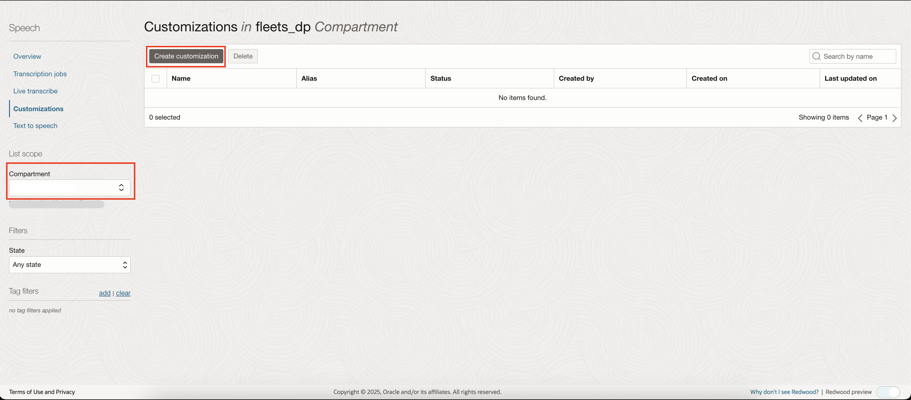
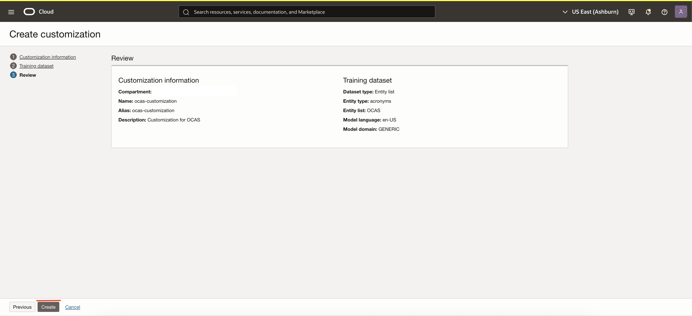
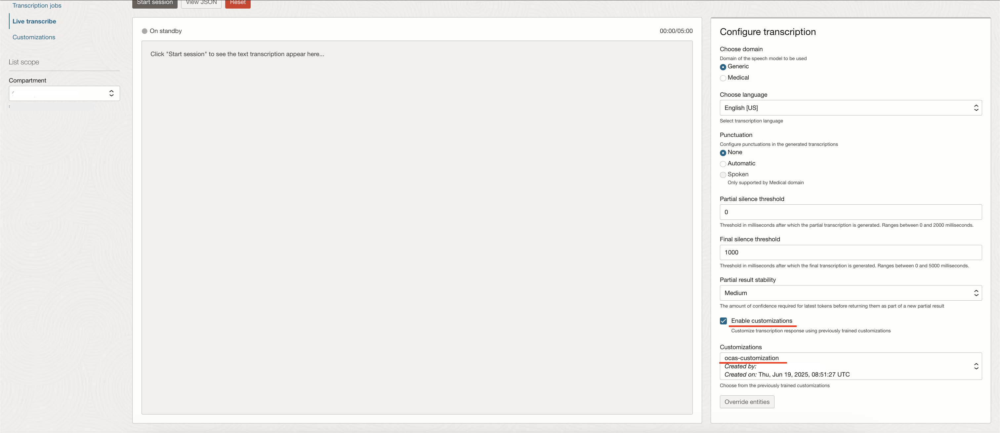
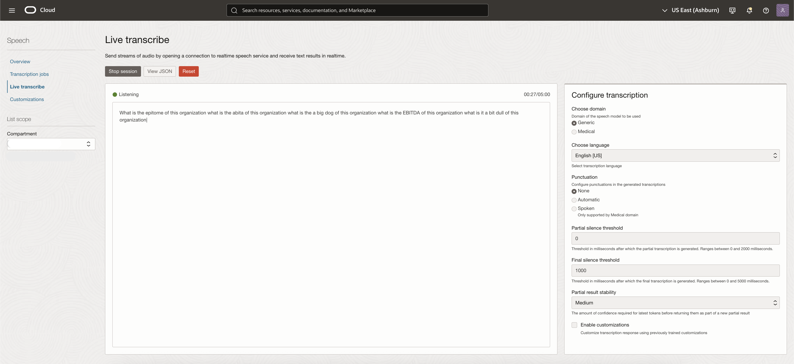
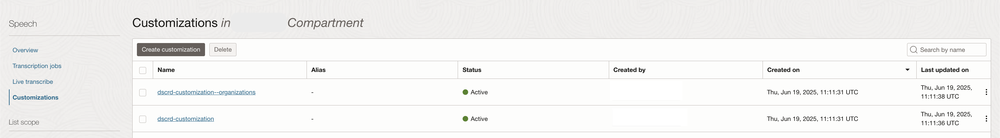
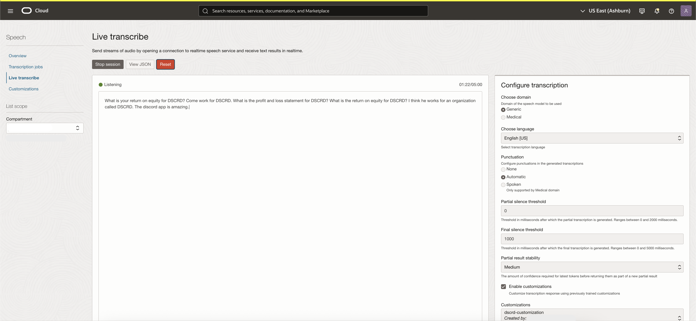
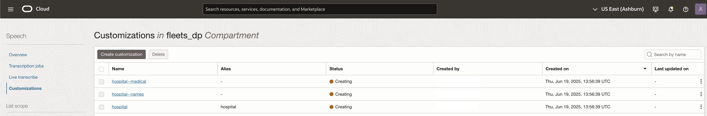
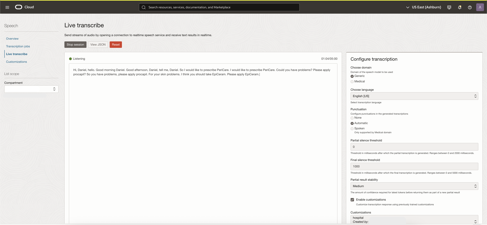
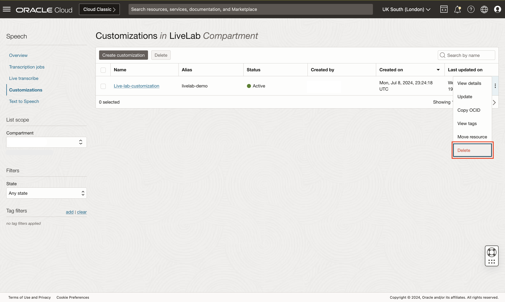

# Lab 3: Create, enable and manage customizations using OCI Console

## Introduction
When the Live Transcribe service is used as is, it may not provide perfect transcriptions for domain-specific words, acronyms and proper nouns. 
Speech Customizations can be enabled when using the Live Transcribe service to improve the transcription accuracy in such cases.
In this session, we will help users get familiar with customizations and how to create and manage them using the OCI Console. 

***Estimated Lab Time***: 30 minutes

### Objectives

In this lab, you will:
- Understand a high level overview of OCI Speech Customizations.
- Understand all the capabilities of OCI Speech Customizations.

### Prerequisites:
- A Free tier or paid tenancy account in OCI (Oracle Cloud Infrastructure)
- Tenancy is whitelisted to be able to use OCI Speech
- Make sure you have done the Speech Live Transcribe LiveLabs (Lab 2)

## Task 1: Navigate to Speech Overview Page

Log into OCI Cloud Console. Using the Burger Menu in the top left corner, navigate to Analytics and AI menu and click it, and then select Speech item under AI services.
    

This will navigate you to the Speech overview page.
On the left, you can access various features of the OCI Speech service i.e. Transcription Jobs, Live Transcribe, Customizations, and Text to Speech.
Under documentation, you can find helpful links relevant to OCI speech service.
    


## Task 2: Create and enable a simple customization

Let's say there is an organization abbreviated as "OCAS" and pronounced as "oh kas".
When you use the Live Transcribe service as is, from the console, and say "I belong to the organization called OCAS" here is the transcription you get:


Instead of "OCAS", the transcription says "ochs" or "oks". Let us create a simple customization from the console to solve this!

1. Create customization

    Select the compartment in which you want to create your customization, then
    click the "Create customization" button to begin customization creation process
            

3. Enter customization information on <strong>Customization information</strong> page

    Here you can choose a compartment and optionally enter a <strong>name, alias, or description</strong> for your customization. The alias must be unique across the tenancy and can be used as an alternative to OCID when referring to the customization. 
        

    Click "Next" to continue to the <strong>training dataset</strong> page


4. Training dataset page
    
    Select <strong>Entity list</strong> as we are directly providing the list in this case. You can provide any meaningful entity-type. In this case, you can use "acronyms" as the entity-type and provide a single entity, "OCAS" in the entity-list. You can, of course, add multiple entries here, separated by a newline. The model should be the same as the Live Transcribe model that will be used, i.e , en-US language and GENERIC domain
        

    Click next to move on to the <strong>review</strong> page

5. Review customization and create

    
    
    You will then be redirected to the customizations list page which will show the customization in Creating state. Within a few seconds, the customization should be in the Active state. When the customization is Active, you can use it in your Live Transcribe sessions.
    

6. To view your newly created customization, click on your customization's name from within the customizations list, or select <strong>view details</strong> from within the three dot menu on the right
        

    This opens the Customization Details Page, where you can view your customization's metadata, as well as update, move it to a different compartment, add tags or delete it
        

    Click "Customizations" in the upper left navigation menu to return to the customizations list page

7. To enable the customization, go to the Live Transcribe page. In the bottom right of the Live Transcribe page, check the Enable customizations box and select the customization from the drop-down list.
        

8. Here is the Live Transcrive output with the "ocas-customization" enabled.
        

## Task 3: Create and enable a customization with custom pronunciations
Let's take the acronym EBITDA. It is a popular financial term that can be used to assess an organization's profitability. Different people have different pronunciations for this acronym, such as "uh bit duh", "a bit duh",  "ebida" etc. For the utterance "What is the EBITDA of this organization" repeated multiple times with different pronunciations, we see different transcriptions from Live Transcribe as shown below.
 

We see that the live transcribe produces the right output only once. In order to fix this, you can create a customization that not only takes the word EBITDA but also its pronunciations. When you provide a pronunciation of an entity, you can either provide some strings that sound like the entity, or, you can provide an audio file where someone is uttering the entity with that pronunciation (the audio file should have only the pronunciation and nothing else). In this case, let's provide some "soundsLike" pronunciations.

1. Creating the dataset
   In order to provide pronunciations, you either provide:
   - an EntityListDataset using the OCI SDK or,
   - an ObjectStorageDataset via the SDK or the Console. When providing an ObjectStorageDataset, you simply provide the object storage location of a file containing all the information. Using ObjectStorageDataset is the OCI recommended way to create customizations!
   
      Let's create an ObjectStorageDataset from the console. For EBITDA, let's create a JSON file like so
       ```
        <copy>
       {
         "datasetType": "ENTITY_LIST",
         "entityList": [
           {
             "entityType": "acronyms",
             "entities": [
               {
                 "entityValue": "EBITDA",
                 "pronunciations": [
                   {
                     "soundsLike": "uh bit duh"
                   },
                   {
                     "soundsLike": "a bit duh"
                   },
                   {
                     "soundsLike": "ebida"
                   }
                 ]
               }
             ]
           }
         ]
       }
     </copy>
      ```
     
2. Upload this JSON file to an Object Storage bucket
    

    

3. Now, when creating the customization, in the Traning dataset page, select Object storage and provide the Object Storage location of the json file that you just uploaded.
    

4. After creating the customization, enable it in Live Transcribe. This time, the results are much better for EBITDA.
    

5. If you want to provide an audio file as the pronunciation, first upload the audio file to object storage. You can provide multiple audio files for the same entity. The JSON file can look like:
    ```
    <copy>
    {
        "datasetType": "ENTITY_LIST",
        "entityList": [
            {
                "entityType": "acronyms",
                "entities": [
                    {
                        "entityValue": "EBITDA",
                        "pronunciations": [
                            {
                                "soundsLike": "uh bit duh"
                            },
                            {
                                "soundsLike": "a bit duh"
                            },
                            {
                                "soundsLike": "ebida"
                            },
                            {
                                "audio": {
                                    "bucketName": "test_bucket",
                                    "locationType": "OBJECT_LIST",
                                    "namespaceName": "axaxaxaxaxax",
                                    "objectNames": [
                                        "ebitda-1.wav",
                                        "ebitda-2.wav"
                                    ]
                                }
                            }
                        ]
                    }
                ]
            }
        ]
    }
    </copy>
    ```


## Task 4: Create and enable a customization with custom pronunciations and reference examples
Sometimes, even when enabling a customization with custom pronunciations, Live Transcribe may still provide some mis-transcription. For example, let's say you have an organization that's abbreviated as "DSCRD" and is pronounced as "discord".  Even if you create and enable a customization for these entities, the transcription might still not have the right entity every time.
For example, let's say you created a customization for DSCRD using the below dataset:
```
<copy>
{
  "datasetType": "ENTITY_LIST",
  "entityList": [
    {
      "entityType": "organizations",
      "entities": [
        {
          "entityValue": "DSCRD",
          "pronunciations": [
            {
              "soundsLike": "discord"
            }
          ]
        }
      ]
    }
  ]
}
</copy>
```
When enabling this customization with the Live Transcribe service, there might still be instances where the transcription does not have DSCRD. For example, in the screenshot below the transcript says "What is the return on equity for discard".


Here is where Reference Examples come in.

1. Creating and uploading the dataset

    You can provide simple examples of sentences where you expect to see entities of a given type. For example, since DSCRD has an entity type of "organizations" here are some sample reference examples for the "organizations" entity type:

   * organization called `<organizations>`
   * return on equity for `<organizations>`
   * work for `<organizations>`
   * statement for `<organizations>`
    
    You can add these examples to the JSON file from before and upload the json file to object storage.
    ```
   <copy>
   {
        "datasetType": "ENTITY_LIST",
        "entityList": [
            {
                "entityType": "organizations",
                "entities": [
                    {
                        "entityValue": "DSCRD",
                        "pronunciations": [
                            {
                                "soundsLike": "discord"
                            }
                        ]
                    }
                ]
            }
        ],
        "referenceExamples": [
            "organization called <organizations>",
            "return on equity for <organizations>",
            "work for <organizations>",
            "statement for <organizations>"
        ]
   }
   </copy>
   ```
   
2. Use this dataset when creating the customization. The Customizations service will provide two customizations, one for the reference examples (we call this the Main Customization) and one for the entity list that you provide (we call this the Slot Customization). The Slot Customization i.e. the customization created for the entity list will have "--<entity-type>" in the display name.
    

    If you open the details of the Main Customization, which in this case has the display name "dsrcd-customization", you will see that it has an entities section that shows which Slot Customization it refers to, for the "organizations" entity type.
    
    
    If you open the details of the Slot Customization, which in this case has the display name "dsrcd-customization--organizations", you will see that it does not have an entities section.
    

3. It is important to enable the Main Customization when making the Live Transcribe call. Think of the main customization as encapsulating both the reference examples and the entity lists. Enabling the Slot Customization means that Live Transcribe will use just the entity list and not the reference examples. The Live Transcribe output with the main customization enabled looks like
   

    We see that "DSCRD" appears as expected for the first 5 sentences. The goal of reference examples is to add more context for the custom entities that you have defined.
    Note that the transcript may not have the custom entity for utterances that are NOT included in any of the reference examples. For example, in the above screenshot, the last line "The discord app is amazing" could very well have been "The DSCRD app is amazing". If you want to increase the chances of the model transcribing it as "The DSCRD app is amazing", you can add the reference example "`<organizations>` app" into the dataset.
   
## Task 5: Create and enable a customization with multiple entity lists, custom pronunciations and reference examples
One of the best use-cases for Live Transcribe is in the healthcare domain for doctor-patient conversations. Let's say you are a hospital using OCI Live Transcribe and you have the following requirements.

- You have 2 patients with the names - Daniel and Sorabh, and you want Live Transcribe to accurately transcribe both these names. As a bonus requirement, let's say that if the doctor utters "Dan" or "Danny", the Live Transcribe should still transcribe that as Daniel 
- You have some medical terms - pericare, procapil, EpiCeram which you want Live Transcribe to accurately transcribe 
- The conversation usually has some common sentences like "Hi Daniel", "Hi Sorabh", "Take procapil twice a day", "Take EpiCeram twice a day", "Apply procapil twice a day", "Apply Epiceram twice a day", "I prescribe Procapil" etc

When used as is, the Live Transcribe produces an output like so:


Let's use Speech Customizations to make this transcription better.
1. Creating a customization using the below dataset. This dataset has two entity lists - one for the "names" entity type and one for the "medical" entity type. 
    Reference examples have been added for both the entity types. Note that you can have multiple entity types in a single reference example.
    For example, you can have a reference example like "hi `<names>`, have you been taking `<medical>`".

   ```
   <copy>
    {
        "datasetType": "ENTITY_LIST",
        "entityList": [
            {
                "entityType": "names",
                "entities": [
                    {
                        "entityValue": "Daniel",
                        "pronunciations": [
                            {
                                "soundsLike": "Danny"
                            },
                            {
                                "soundsLike": "Dan"
                            }
                        ]
                    },
                    {
                        "entityValue": "Sorabh",
                        "pronunciations": [
                            {
                                "soundsLike": "Saurabh"
                            },
                            {
                                "soundsLike": "so rub"
                            },
                            {
                                "soundsLike": "so raab"
                            }
                        ]
                    }
                ]
            },
            {
                "entityType": "medical",
                "entities": [
                    {
                        "entityValue": "PeriCare",
                        "pronunciations": [
                            {
                                "soundsLike": "Perry care"
                            },
                            {
                                "soundsLike": "Paris care"
                            }
                        ]
                    },
                    {
                        "entityValue": "procapil",
                        "pronunciations": [
                            {
                                "soundsLike": "pro sepil"
                            },
                            {
                                "soundsLike": "pro capill"
                            }
                        ]
                    },
                    {
                        "entityValue": "EpiCeram",
                        "pronunciations": [
                            {
                                "soundsLike": "epic serum"
                            },
                            {
                                "soundsLike": "a PC rum"
                            }
                        ]
                    }
                ]
            }
        ],
        "referenceExamples": [
                "hi <names>",
                "hello <names>",
                "good morning <names>",
                "good afternoon <names>",
                "tell me <names>",
                "prescribe <medical>",
                "take <medical>",
                "apply <medical>"
        ]
    }
   </copy>
   ```
2. This dataset would create 3 customizations - one main customization and two slot customizations.
    

3. Enable the main customization when calling Live Transcribe
   We get a MUCH better output from the Live Transcribe service.
   

## Task 6: Updating / deleting customizations
1. Update Customization

    From either the customization details page or list customizations page, click <strong>update</strong> to open the update customization dialog
        

    This will open the update customization dialog, in which you can update the name, alias, description or tags
        

2. Delete Customization

    From either the customization details page or list customizations page, click <strong>delete</strong> to delete your customization
        


   
Congratulations on completing this lab!

You may now **proceed to the next lab**

## Acknowledgements
* **Authors**
    * Dhanwin Rao - Oracle AI Services
    * Alex Ginella  - Oracle AI Services
    * Rishabh Tewari - Oracle AI Services
