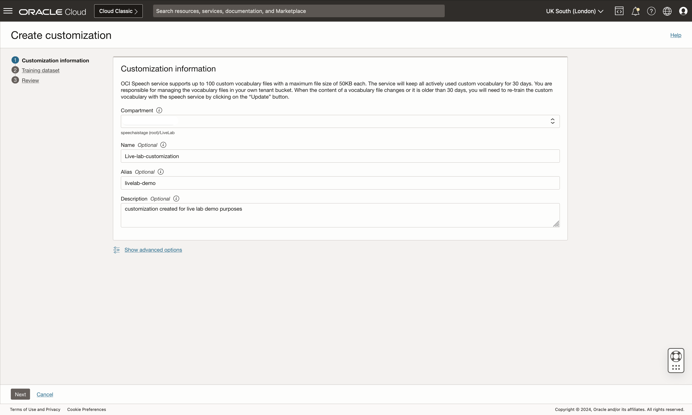
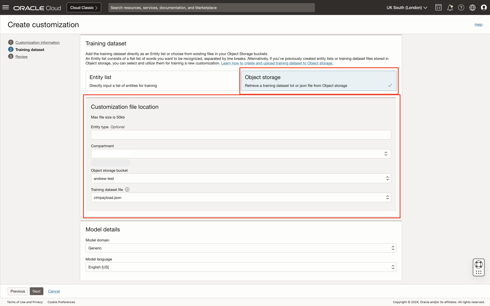
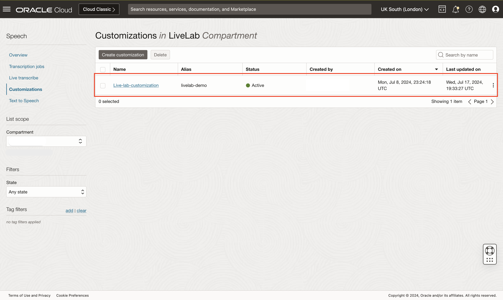
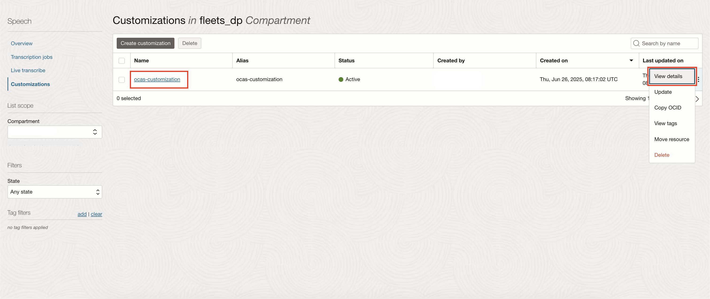
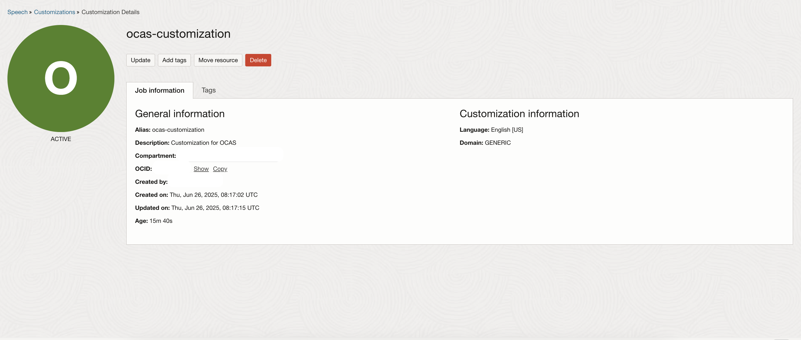
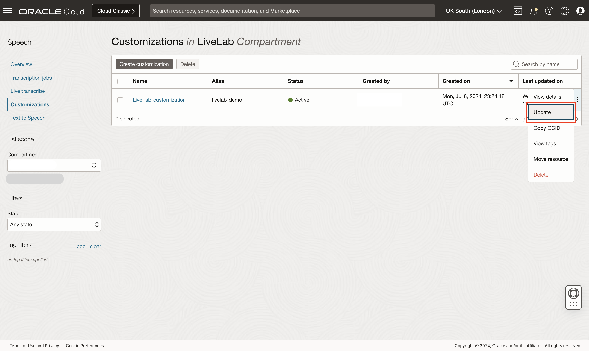

# Lab 3: Create and manage customizations using REST API and in OCI Console

## Introduction
In this session, we will help users get familiar with customizations and how to create and manage them using the OCI Console

***Estimated Lab Time***: 5 minutes

### Objectives

In this lab, you will:
- Understand a high level overview of OCI Speech Customizations.
- Understand all the capabilities of OCI Speech Customizations.

### Prerequisites:
- A Free tier or paid tenancy account in OCI (Oracle Cloud Infrastructure)
- Tenancy is whitelisted to be able to use OCI Speech

## Task 1: Navigate to Overview Page

Log into OCI Cloud Console. Using the Burger Menu on the top left corner, navigate to Analytics and AI menu and click it, and then select Language item under AI services.
    

This will navigate you to the transcription jobs overview page.
On the left you can toggle between overview and transcription jobs listing page.
Under documentation you can find helpful links relevant to OCI speech service
    


## Task 2: Create a customization

1. Access customizations page

    Click <strong>customizations</strong> in the left side menu to open the customizations page
        

2. Create customization

    Select the compartment in which you want to create your customization, then
    click the "Create customization" button to begin customization creation process
            

3. Enter customization information on <strong>Customization information</strong> page

    Here you can choose a compartment and optionally enter a <strong>name, alias, or description</strong> for your customization
        


    Click "Next" to continue to the <strong>training dataset</strong> page


4. Training dataset page

    Click <strong>Entity list</strong> to define training entities for your customization
    Provide the type of the entities and then list them in the box below
        

    Alternatively, click <strong>Object storage</strong> to select predefined training entities from object storage
        

    Configure model details
        

    Click next to move on to the <strong>review</strong> page

5. Review customization and create

    Look over your information and click <strong>create</strong> to finish creating your customizaiton
    
    Review page for customization created using entity list
        
    Review page for customization created using object storage training dataset
        

    After clicking create, you will be redirected to the customizations page where you will see your newly created customization
        

## Task 3: Viewing your customization

To view your newly created customization, click on your customization's name from within the customizations list, or select <strong>view details</strong> from within the three dot menu on the right

1. Navigating to the Customization Details Page

    On the job list page, click on the name of the job in the list or click "View details" under the three dots  menu on the far right
        

2. Customization Details Page

    On the customization details page you can view your customization's metadata, as well as update, move it to a different compartment, add tags or delete it
        

    Click "Customizations" in the upper navigation menu to return to the customizations list page

3. Update Customization

    From either the customization details page or list customizations page, click <strong>update</strong> to open the update customization dialog
        

    This will open the update customization dialog, in which you can update the name, alias, description or tags
        

4. Delete Customization

    From either the customization details page or list customizations page, click <strong>delete</strong> to delete your customization
        

## Task 4: Using the customizations API

The Postman REST Collection for Customizations setup can be downloaded from [OCI Customization REST Collection](./files/Customization_API_Collection.postman_collection.json). The POSTMAN instructions for the setups are [the same as Speech API](../ai-speech/oci-speech-rest/oci-speech-rest.md)

OCI Speech Service EndPoints for all the services:

*Note:* The list of region identifiers for each region can be found [here](https://docs.oracle.com/en-us/iaas/Content/General/Concepts/regions.htm), update the endpoints with appropriate region identifiers.

1. <u>Create Customization</u>


    Endpoint:
    ```
    <copy>
    POST https://speech.aiservice.<region-identifier>.oci.oraclecloud.com/20220101/customizations?
    </copy>
    ```
    Body:
    ```
    <copy>
    {
        "compartmentId": "<uniqueCompartmentID>>",
        "description": "<descriptionPlaceholder>",
        "displayName": "<displayNamePlaceholder>",
        "alias": "<aliasPlaceHolder>",
        "modelDetails": {
            "domain": "GENERIC",
            "languageCode": "en-US"
        },
        "trainingDataset": {
            "datasetType": "ENTITY_LIST",
            "referenceExamples": [
                "Private data is <private>",
                "Bird name is <bird>"
            ],
            "entityList": [{
                "entityType": "private",
                "entities": [{
                        "entityValue": "hello",
                        "pronunciations": [{
                                "soundsLike": "helloo"
                            }
                        ],
                        "weight": 1
                    }
                ]
            },{
                    "entityType": "bird",
                    "entities": [{
                            "entityValue": "Tweeteee3",
                            "pronunciations": [{
                                    "soundsLike": "tweetyy"
                                }
                            ],
                            "weight": 1
                        }
                    ]
                }
            ]
        }
    }
    </copy>
    ```
    *Note:*
    * Supported values for domain are GENERIC, and MEDICAL
    * Supported values for languageCode are en-US, en-AU, en-IN, en-GB, it-IT, pt-BR, hi-IN, fr-FR, de-DE, es-ES


2. <u>Get Customization</u>
    Endpoint:
    ```
    <copy> 
        GET https://speech.aiservice.<region-identifier>.oci.oraclecloud.com/customizations/<customizationID>
    </copy>
    ```
    `<customizationID>` should be replaced with the actual customization ID/Alias
     `<region-identifier>` should be replaced with a valid region like us-phoenix-1

3. <u>List Customizations</u>
    Endpoint:
    ```
    <copy> 
        GET https://speech.aiservice.<region-identifier>.oci.oraclecloud.com/20220101/customizations?compartmentId=<uniqueCompartmentID>>
    </copy>
    ```
    `<uniqueCompartmentID>` should be replaced with the compartment ID 
    `<region-identifier> should be replaced with a valid region like us-phoenix-1`
4. <u>Update Customization</u>

    With the updated Customization body. We can submit a PUT request to update the Customization
    
    Endpoint:
    ```
    <copy>
    PUT https://speech.aiservice.<region-identifier>.oci.oraclecloud.com/customizations/<customizationID>
    </copy>
    ```

    Body:
    ```
    <copy>
    {
    "compartmentId": "<uniqueCompartmentID>>",
    "description": "<descriptionPlaceholder>",
    "displayName": "<displayNamePlaceholder>",
    "alias": "<aliasPlaceHolderNew>",
    "modelDetails": {
        "domain": "GENERIC",
        "languageCode": "en-US"
    },
    "trainingDataset": {
        "datasetType": "ENTITY_LIST",
        "referenceExamples": [
            "Private data is <private>",
            "Bird name is <bird>"
        ],
        "entityList": [{
            "entityType": "private",
            "entities": [{
                    "entityValue": "hello",
                    "pronunciations": [{
                            "soundsLike": "helloo"
                        }
                    ],
                    "weight": 1
                }
            ]
        },{
                "entityType": "bird",
                "entities": [{
                        "entityValue": "Robin",
                        "pronunciations": [{
                                "soundsLike": "Robun"
                            }
                        ],
                        "weight": 1
                    }
                ]
            }
        ]
    }
}

    </copy>
    ```
4. <u>Delete Customization</u>
    Endpoint:
    ```
    <copy>
    DELETE https://speech.aiservice.<region-identifier>.oci.oraclecloud.com/customizations/<customizationID>
    </copy>
    ```

    


Congratulations on completing this lab!

You may now **proceed to the next lab**

## Acknowledgements
* **Authors**
    * Alex Ginella  - Oracle AI Services
    * Rishabh Tewari - Oracle AI Services