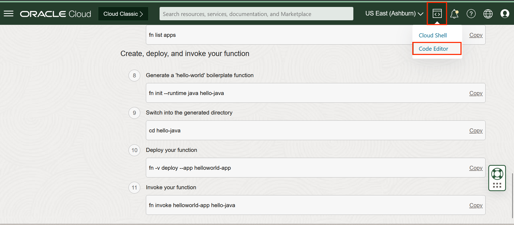

<<<<<<< HEAD
# Lab 10: Trigger functions for OCI speech transcription jobs (Optional)
=======
# Lab 9: Trigger functions for OCI speech transcription jobs (Optional)
>>>>>>> upstream/main

## Introduction

Oracle Cloud Infrastructure Functions is a fully managed, multi-tenant, highly scalable, on-demand, Functions-as-a-Service platform. 
In this lab session, We will cover how you can create a simple Java function and trigger the function using OCI Speech service.


*Estimated Lab Time*: 10 minutes

### Objectives:

* Learn how to use OCI functions service to get E-mail notifictaions after using speech service.

### Prerequisites:

* Completed Lab 1
* Prior basic knowledge about java


## Task 1: Create VCN

Before you start this Lab make sure that you completed Lab 1 and have the policies setup as instructed in Lab 1 Task 1.

We will create a virtual cloud network that will serve as the home for our serverless function and the API gateway we will create.

Create a VCN with Internet access.
1.	Open the navigation menu, click **Networking**, and then click **Virtual Cloud Networks**.

    

2.	Click the button **Start VCN Wizard**.

    

3.	Select **Create VCN with Internet Connectivity**

4.	Click **Start SVN Wizard**
    

5.	Enter a name for the VCN and click **Next**

    

6.	Click **Create**. Once the VCN is created you should be able to see the VCN setails page
    


## Task 2: Creating an Application

1. Open the navigation menu and click Developer Services. Under Functions, click Applications.
    

2. Click Create Application.
    

3. Enter:
    * helloworld-app as the name for the new application.
    * Select VCN and subnet in which to run the function. If there is no VCN present in the Compartment, refer [here](https://docs.oracle.com/en-us/iaas/Content/GSG/Tasks/creatingnetwork.htm) to create VCN.

4. Click Create.
    

5. Application will navigate to Getting Started page,
    

6.	Click **Cloud Shell Setup**
7.	Click the **Launch Cloud Shell** button.
 This will start a Linux virtual machine with all the configurations to set up functions.
8.	Follow steps **1** through **7** under the “Setup fn CLI on Cloud Shell” section
	* If you need more specific and detailed instructions, see this [Document](https://docs.oracle.com/en-us/iaas/Content/Functions/Tasks/functionscreatefncontext.htm)
	* You can select any term for OCIR-REPO, it is just a prefix that will be used as the name of the container registry to use to deploy the function.

9. To open the cloud shell, Click on the **console icon** on the top right, then click **Code Shell**  to open Code Shell.
    

10. In the console run the following command to generate a 'hello-world' boilerplate function
        ```
        <copy>
        fn init --runtime java hello-java
        </copy>
        ```


11. Click on the **console icon** on the top right, then click **Code Editor**  to open Code Editor.

    *NOTE:* We need to edit the hello-world function to print the function parameter so that we can access Event Json information in Logs.
    

12. Goto **options** and select, **File > Open...** Then open **HelloFunction.java** under **hello-java** folder.
    

13. Add following code snippet as shown below,
    
        <copy>System.out.println("Input parameter to the HelloWorld function: "+ input);</copy>
    

14. Save the file and continue function deployment

15. Open the **Cloud Shell** again. Run the following two commands to deploy your function
        ```
        <copy>
        cd hello-java
        </copy>
        ```
        ```
        <copy>
        fn -v deploy --app helloworld-app
        </copy>
        ```

16. On the **Application** details page, Under **Resources** click **Logs** and then click on the slider under **Enable Log**. This will be useful to check logs if hello-world function is called.
    


## Task 3: Create Event Rule With the Function

Once you have created a Function, we will create a Event rule with Action type **Functions**. Follow below steps to create Event Rule.

1. Open the navigation menu and click  **Observability & Management**. Under **Events Service**, click **Rules**.
    

2. Click **Create Rule**, Fill the following information
    * Rule Name
    * Rule Description
    * Rule Conditions: Condition as Event Type, Service Name as AI Service - Speech and Event Type on which you want to receive notification(ex: Speech - Completed Transcription Job)
    * Actions: Action Type as Functions, Function Compartment will be a compartment where you have created the Function in previous step and select application name which you created in previous step, finally select function name.

3. Click Create Rule.
    

## Task 4: Create Speech Transcription Job

1. Follow Lab 1 Task 2 to create a job which generates transcriptions using speech service. 

2. View Newly Created Job in Jobs List. On the job list page, Wait for the job to move to succeded state.  
    

3. Check Functions Logs to verify whether **hello-world** function is called or not on successful completion of transcription job.

4. Open the navigation menu and click **Developer Services**. Under **Functions**, click **Applications**.
    

5. Select the correct compartment, Click **helloworld-app** application from the list.

6. Navigate to **Logs** page and then select **helloworld_app_invoke** under **Log Name** column. This will open function logs.
    

7. Under **data.message** column, check for *Input parameter to the HelloWorld function: <json>*. Hover mouse pointer over the text to see complete json information.
    
        <copy>
        "Input parameter to the HelloWorld function:
        {
            "eventType":"com.oraclecloud.aiservicespeechpreprod.completedtranscriptionjob",
            "cloudEventsVersion":"0.1",
            "eventTypeVersion":"2.0",
            "source":"aiservicespeechpreprod",
            "eventTime":"2023-01-04T09:57:35Z",
            "contentType":"application/json",
            "data": {          
                "compartmentId":"<compartment-id>",
                "compartmentName":"<compartment-name>",
                "resourceName":"<job-name>",
                "resourceId":"<job-id>",
                "availabilityDomain":"AD3",
                "freeformTags":{},
                "definedTags":
                    {
                        "Oracle-Tags":
                            {
                                "CreatedBy":"<user-name>",
                                "CreatedOn":"2023-01-04T09:57:11.296Z"
                    }
                    }
                            },
                "eventID":"78647616-83b4-4dca-afce-b08b88429842",
                "extensions":
                    {
                        "compartmentId":"<compartment-id>"
                }
        }"
        </copy>

## Acknowledgements
* **Authors**
    * Ankit Tyagi -  Oracle AI Services
    * Veluvarthi Narasimha Reddy - Oracle AI Services