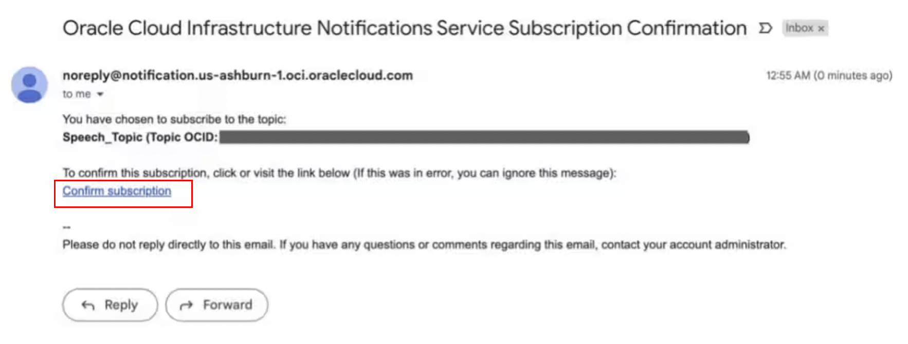
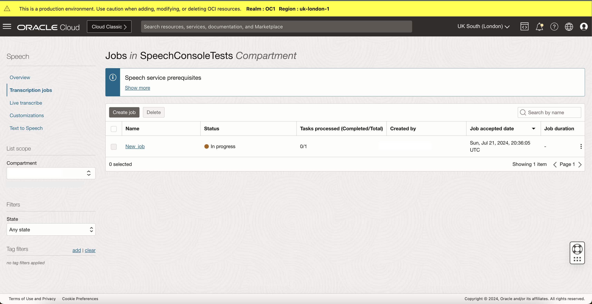

# Lab 9: Enable notifications for OCI speech transcription jobs

## Introduction

In this lab session, We will cover how you can be notified about a transcription job’s status using the OCI Events and Notification services.

Using this service you can generate email notifications based on transcription job status. 

This event-driven approach allows you to respond to state changes in OCI in real time, removing the need to poll the transcription job status on a predefined schedule.

*Estimated Lab Time*: 10 minutes

### Objectives:

* Learn how to use OCI notification service to get E-mail notifictaions after using speech service.

### Prerequisites:

* Completed Lab 1

## Task 1: Creating a OCI Notification Topic

Before you start this Lab make sure that you completed Lab 1 and have the policies setup as instructed in Lab 1 Task 1.

1. Navigate to Topics

    Log into OCI Cloud Console. Using the Burger Menu on the top left corner, navigate to Developer Services and click it, and under Application Integration, select Notifications.

    

2. Create a Topic

    The Topic overview page displays all the topics created. On the left you can toggle between topics and subscriptions page. To create a topic click on the create topic button. 

    

    Enter a name for the topic and optionally add a description and then click create.
    

## Task 2: Creating a OCI Notification Subscription

1. Navigate to topic details

    Click the topic that has been created.
    

2. Create a subscription

    Click on the Create Subscription and select the protocol as E-mail, then enter the E-mail you would like to receive notifications to and then click create.
    

    After you create the subscription, it goes into a pending state, awaiting confirmation. 
    
    
    To activate the notification subscription, check the email account you specified and open the verification email. Click the **Confirm subscription** verification link for this subscription.
    

    A browser tab opens, confirming that you have subscribed your email account to the topic with the topic name.
    

    Your verification of the email changes the subscription status from “Pending” to “Active.” Switch back to Oracle Cloud Console window and verify the subscription status changed to “Active.” You might need to refresh your browser.
    

## Task 3: Creating a OCI Notification Event
    
You’re now subscribed to a Notifications topic. Next, define an event with conditions that, when met, publishes messages to this Notifications topic. Let's define an event that triggers an email notification when the job status changes in OCI Speech.

1. Navigate to event

     From the main menu, Using the Burger Menu on the top left corner, navigate to Observability & Management and click it, and under Event Service, select Rules.    
    

2. Create Rule

    Click create rule
    

    Then fill the neme of the rule, optionally description. Then select the rule condition to Event Type, Service name as AI Services - Speech and select all the events you want to be notified in the event type.
    Under the Actions, select Notifications and choose the compartment in which you created the topic and select the topic

    click create
    

    You’ve successfully configured a notification and tied an event to it with a specific compartment. When a job status changes in OCI Speech, an email notification is sent to the email address specified.

## Task 4: Creating a Speech Transcription job

1. Follow Lab 1 Task 2 to create a job which generates transcriptions using speech service. 

2. View Newly Created Job in Jobs List

    Once the job is created you will be directed back to the jobs list page, where the newly created job will be at the top. Notice the status of the job will likely say "Accepted" or "In progress"

    Other possible job states are "Succeeded" "Failed" "Partially Succeeded" and "Canceled"

    You can use the state filter in the lower left to filter the jobs in the list based on these states
    

3. On the job list page, Wait for the job to move to succeded state.  
    

4. Check the email account you specified to verify that a notification email was sent. Go to the specified email account and verify that a notification of the job status has been sent.
    

You may now **proceed to the next lab**

## Acknowledgements
* **Authors**
    * Alex Ginella - Oracle AI Services
    * Rajat Chawla  - Oracle AI Services
    * Ankit Tyagi -  Oracle AI Services
    * Veluvarthi Narasimha Reddy - Oracle AI Services
