# Lab 1: Transcribe audio with the console

## Introduction
In this session, we will help users get familiar with OCI Speech and teach them how to use our services via the cloud console.

***Estimated Lab Time***: 10-15 minutes

### Objectives

In this lab, you will:
- Understand a high level overview of the OCI Speech.
- Understand all the capabilities of OCI Speech.
- Understand how to analyze text using OCI Speech via cloud console.

### Prerequisites:
- A Free tier or paid tenancy account in OCI (Oracle Cloud Infrastructure)
- Tenancy is whitelisted to be able to use OCI Speech

## **Task 1:** **Policy Setup**

Before you start using OCI Speech, your tenancy administrator should set up the following policies by following below steps:

1. Navigate to Policies

    Log into OCI Cloud Console. Using the Burger Menu on the top left corner, navigate to Identity & Security and click it, and then select Policies item under Identity.
        


2. Create Policy

    Click "Create Policy
        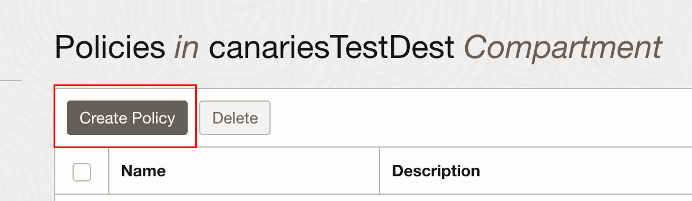


3. Create a new policy with the following statements:

    If you want to allow all the users in your tenancy to use speech service, create a new policy with the below statement:
        ```
        <copy>
        allow any-user to manage ai-service-speech-family in tenancy
        allow any-user to manage object-family in tenancy
        allow any-user to read tag-namespaces in tenancy
        allow any-user to use ons-family in tenancy
        allow any-user to manage cloudevents-rules in tenancy
        allow any-user to use virtual-network-family in tenancy
        allow any-user to manage function-family in tenancy
        </copy>
        ```
        


    If you want to limit access to a user group, first create a group

    Navigate to OCI groups:
        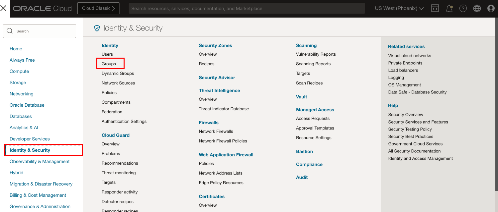

    Click "Create Group"
        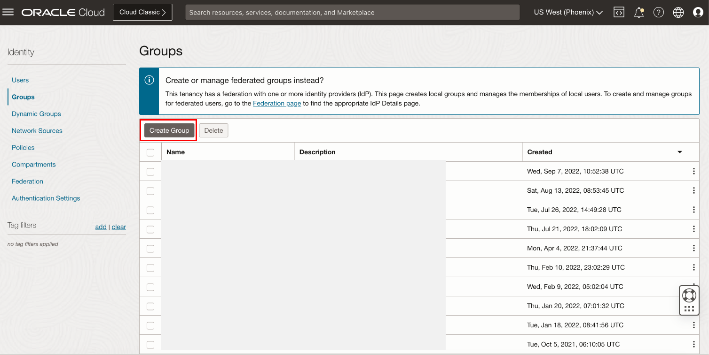

    Add group name and description, click create
        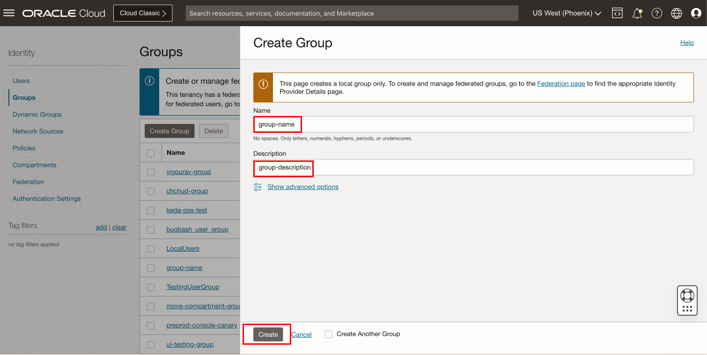

    To add users click "Add User to Group" and select user from dialog
        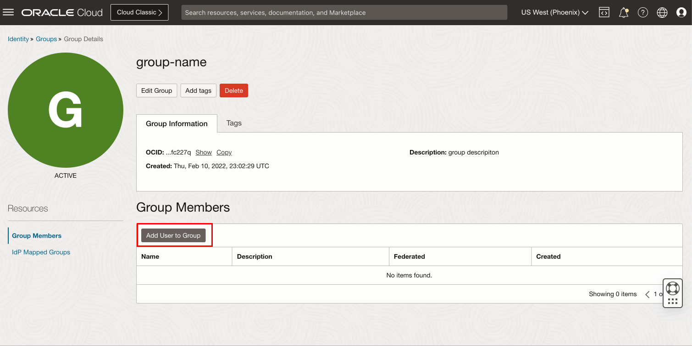


    Create a new policy with the below statement:
        ```
        <copy>
        allow group group-name to manage ai-service-speech-family in tenancy
        allow group group-name to manage object-family in tenancy
        allow group group-name to read tag-namespaces in tenancy
        allow group group-name to use ons-family in tenancy
        allow group group-name to manage cloudevents-rules in tenancy
        allow group group-name to use virtual-network-family in tenancy
        allow group group-name to manage function-family in tenancy
        </copy>
        ```
        

## **Task 2:** Navigate to Overview Page

Log into OCI Cloud Console. Using the Burger Menu on the top left corner, navigate to Analytics and AI menu and click it, and then select Language item under AI services.
    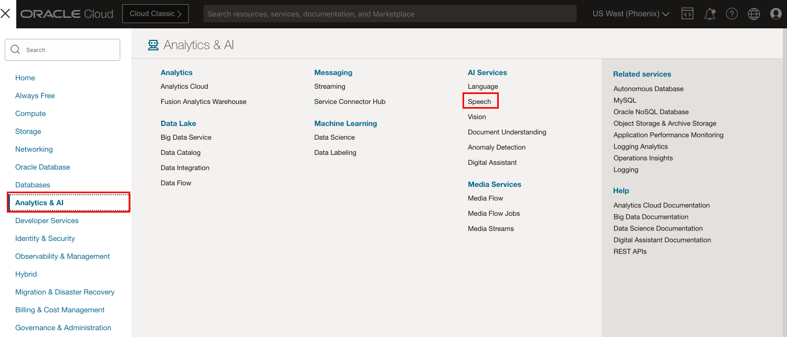

This will navigate you to the transcription jobs overview page.
On the left you can toggle between overview and transcription jobs listing page.
Under documentation you can find helpful links relevant to OCI speech service
    


## **Task 3:** Create and Manage Transcription Job

1. Navigate to OCI Speech

    Click "Jobs" to navigate to jobs list.
        

2. Create Job

    Select the compartment in which you want to create your job, then
    click the "Create job" button to begin job creation process
        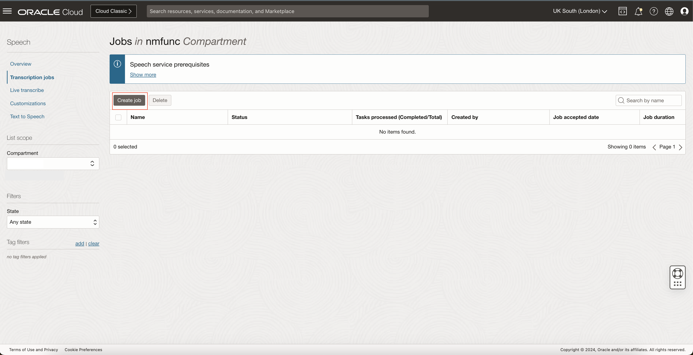    

3. Enter Job Information on Basic Information Page

    This page is split into three sections

    <strong>Job information:</strong> Optionally enter a name and description for your job, as well as choose the compartment you want your job to be in

    <strong>Data:</strong> Select the bucket in object storage containing the files you want to transcribe and optionally choose where you want the output files to be stored and/or give a prefix to their file names

    <strong>Configure transcription:</strong> Choose the language that the audio you want to transcribe is in and optionally add filters by clicking the "Add filter" button.
        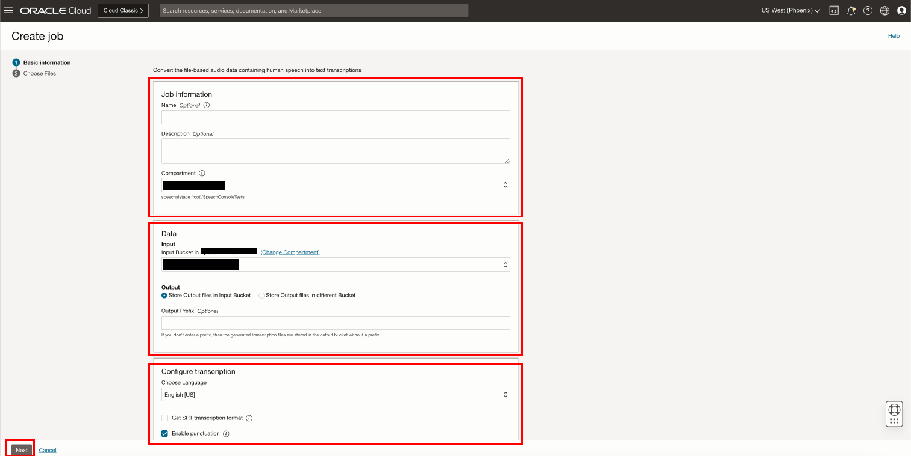

    Filters allow you to remove, tag or mask certain words from the transcription, such as profanity
        

    Click "Next" to continue to file selection


4. Select Which File(s) From Object Storage to Transcribe in this Job

    Use "Show media files" toggle to filter input bucket for supported audio files (WAV, MP3, OGG, OGA, WEBM, MKV, AC3, AAC, M4A, MP4, FLAC, AMR).
    Select one or more files to transcribe from the specified bucket in object storage then click "Submit"
        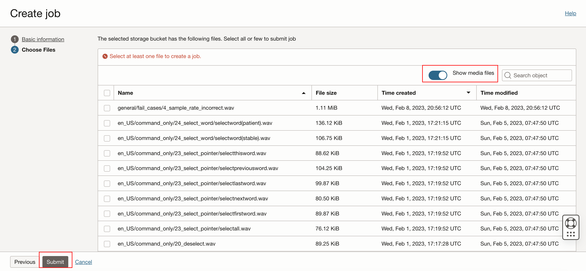

5. View Newly Created Job in Jobs List

    Once the job is created you will be directed back to the jobs list page, where the newly created job will be at the top. Notice the status of the job will likely say "Accepted" or "In progress"

    Other possible job states are "Succeeded" "Failed" "Partially Succeeded" and "Canceled"

    You can use the state filter in the lower left to filter the jobs in the list based on these states
        

6. Edit Job

    Select "Edit" from the three dots menu on the right to change job information from this page
        

    Enter new job information in the edit slider
        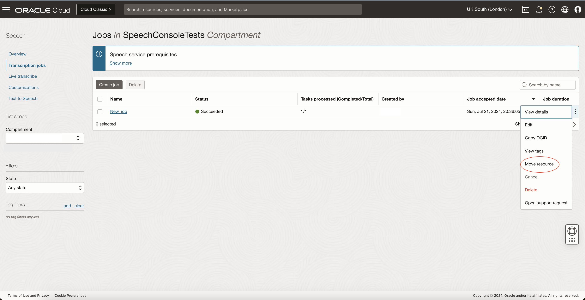

    To change the compartment of a job from this view select "Move Resource" from the right side three dots menu and choose the target compartment from the dialog
        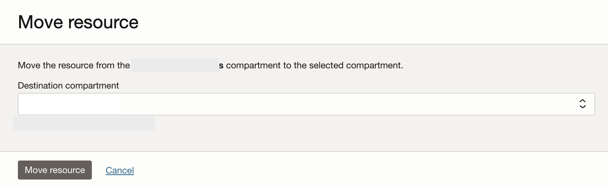

## **Task 4:** Viewing the Results

To view the result of the transcription we will navigate to each the job and task details pages

1. Navigating to the Job Details Page

    On the job list page, click on the name of the job in the list or click "View details" under the three dots  menu on the far right
        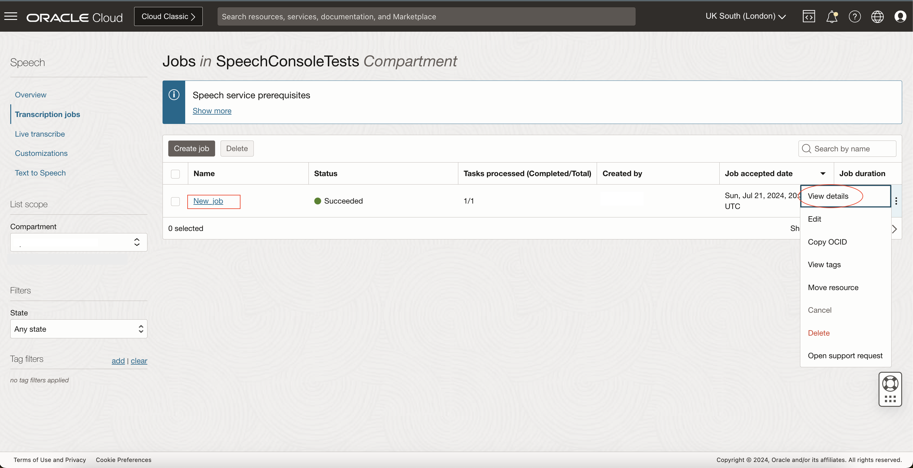

2. Job Details Page

    The job details page is split into two main sections, on top we can see various metadata relating to the job, such as description, the compartment the job is located in and the language of the transcribed audio

    The second section is the <i>job tasks list</i> which shows all the files (now called tasks) we had previously selected to transcribe
        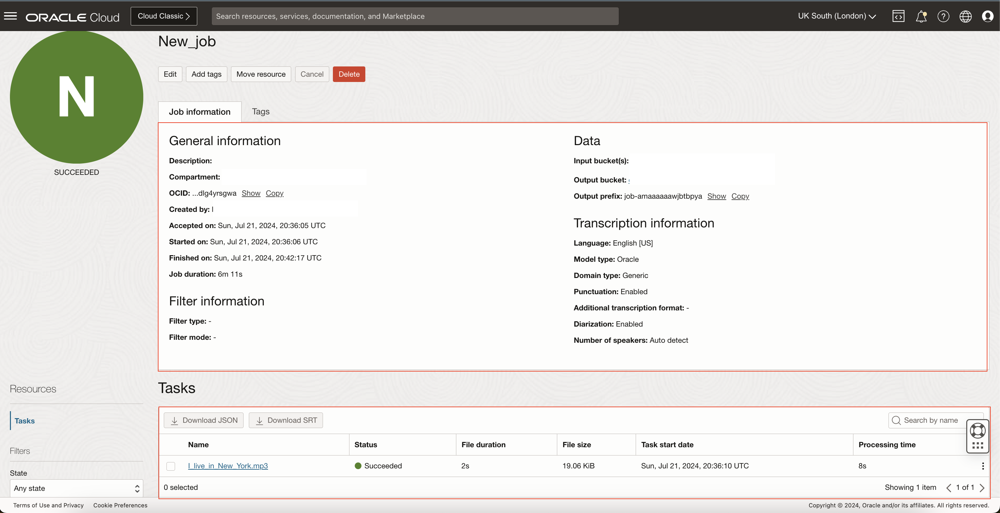

    Make Changes to Transcription Job:

    On the job details page click "Edit" to make changes to title, description and tags of the job. Click "Move Resource" to change the compartment that the job is located in
        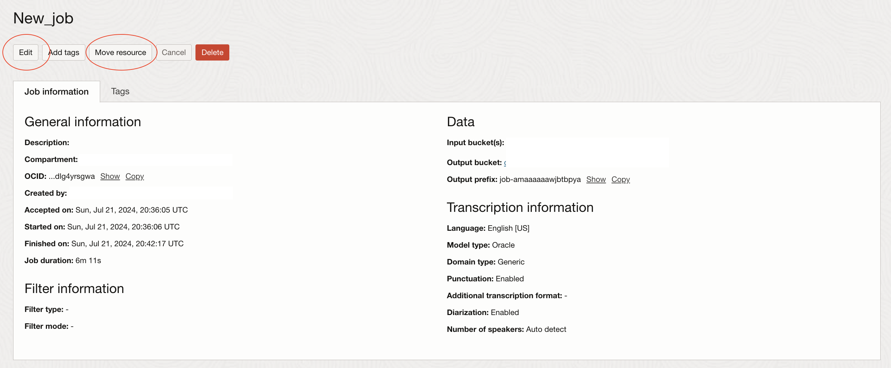

3. Navigate to Individual Task Details

    To view metadata and the actual transcription for each task (file) in this job either click the name of the particular task within the list or click "View details" from the three dots kebab menu on the far right
        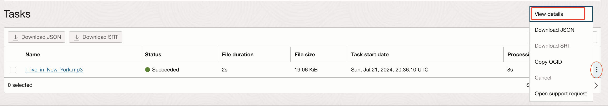

4. Task Details Page

    Similar to the job details page, on the task details page we can view specific metadata for the task in the above section, as well as the audio transcript itself in the lower section
        


## **Task 5:** Downloading and Viewing the Results in JSON

Click "Download transcript" in the top left to download the transcript in JSON format. Click the "Show JSON button" to view the transcription in JSON format.
    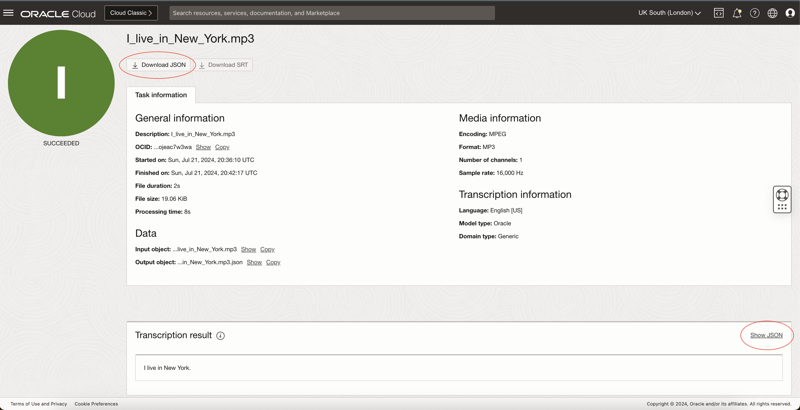

Click "Show Standard Results" button to leave the JSON view. 
    


Congratulations on completing this lab!

You may now **proceed to the next lab**

## Acknowledgements
* **Authors**
    * Alex Ginella  - Oracle AI Services
    * Rajat Chawla  - Oracle AI Services
    * Ankit Tyagi -  Oracle AI Services
    * Veluvarthi Narasimha Reddy - Oracle AI Services
