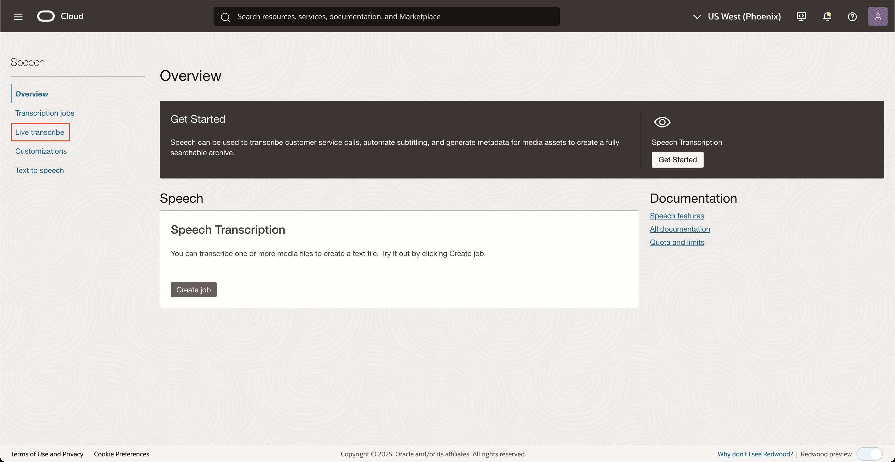

# Lab 2: Transcribe live audio with the console

## Introduction
In this session, we will help users get familiar with OCI Speech live transcribe and teach them how to use our services via the cloud console.

***Estimated Lab Time***: 5 minutes

### Objectives

In this lab, you will:
- Learn how to transcribe live audio to text from the OCI Console
- Invoke custom vocabulary (customizations) in the OCI Console

### Prerequisites:
- A Free tier or paid tenancy account in OCI (Oracle Cloud Infrastructure)
- Tenancy is whitelisted to be able to use OCI Speech

## Task 1: Navigate to Overview Page

Log into OCI Cloud Console. Using the Burger Menu on the top left corner, navigate to Analytics and AI menu and click it, and then select Language item under AI services.
    

This will navigate you to the transcription jobs overview page.
On the left you can toggle between overview and transcription jobs listing page.
Under documentation you can find helpful links relevant to OCI speech service
    

## Task 2: Open live transcribe and transcribe audio

1. Click "Live transcribe" in the side menu
        

2. Start session

    Click the "Start session" button to open a live transcription session and begin speaking.
            

3. View transcription results in real time

    You can view partial and complete transcription results in the results window below.
        

## Task 3: Changing transcription parameters

To change transcription parameters, look to the <strong>Configure transcription</strong> menu to the right

1. Configure transcription

    Here you can change parameters such as transcription model type, audio language, partial and final silence thresholds
    and enable customizations
        

    <strong>Choose specialization:</strong> Use this parameter to configure the transcription model for specialized audio, e.g. audio that features specific medial terminology
    
    <strong>Choose language:</strong> Use this parameter to configure the language of the speaker
    
    <strong>Partial silence threshold:</strong> Use this parameter to configure how quickly partial results should be 
    returned
    
    <strong>Final silence threshold:</strong> Use this parameter to configure how long to wait before a partial result is finalized 
    
    <strong>Enable customizations:</strong> Check this box to choose a customization to use during your transcription session

## Task 4: Enabling a customization

Select the <strong>Enable customizations</strong> box in the "Configure transcriptions" menu on the right to select a customization to include in your transcription session.
    

Specify a compartment and select a customization to include in your next transcription session

Congratulations on completing this lab!

You may now **proceed to the next lab**

## Acknowledgements
* **Authors**
    * Alex Ginella  - Oracle AI Services