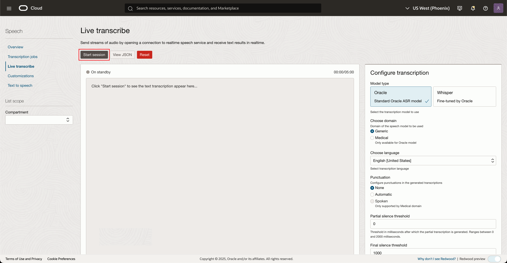
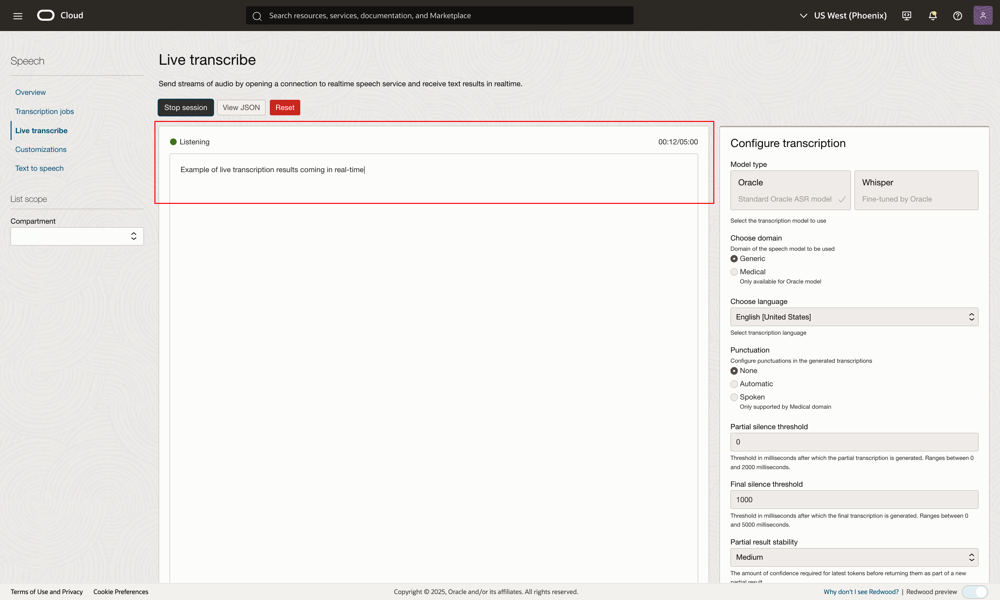

# Lab 2: Transcribe live audio with the console and SDK

## Introduction
In this session, we will help users get familiar with OCI Speech live transcribe and teach them how to use our services via the cloud console.

***Estimated Lab Time***: 30 minutes

### Objectives

In this lab, you will:
- Learn how to transcribe live audio to text from the OCI Console
- Invoke custom vocabulary (customizations) in the OCI Console
- Learn how to use OCI AI Speech Realtime Python SDK to create live transcription sessions

### Prerequisites:
- A Free tier or paid tenancy account in OCI (Oracle Cloud Infrastructure)
- Tenancy is whitelisted to be able to use OCI Speech

## Task 1: Navigate to Overview Page

Log into OCI Console. Using the Burger Menu on the top left corner, navigate to **Analytics and AI** menu, and then select **Speech** under **AI Services**.
    

This will navigate you to the Speech overview page.
From the left you can navigate to various OCI Speech offerings.

From the Documentation section you can find helpful links relevant to OCI Speech service
    


## Task 2: Open live transcribe and transcribe audio

1. Click "Live transcribe" in the side menu
        

2. Start session

    Click the "Start session" button to open a live transcription session and begin speaking.
            

3. View transcription results in real time

    You can view partial and complete transcription results in the results window below.
        


## Task 3: Changing transcription parameters

To change transcription parameters, look to the <strong>Configure transcription</strong> menu to the right

### Configure transcription

Here you can change parameters such as transcription model type, model domain, audio language, punctuation, partial and final silence thresholds, partial results stability and enable customizations
    

- <strong>Model type:</strong> Use this parameter to select a model to use for generating transcriptions. Currently supported model types are: `ORACLE` and `WHISPER`

    > Note: Partial results are only supported by `ORACLE` model
    
- <strong>Model domain:</strong> Use this parameter to configure the transcription model for specialized audio, e.g. audio that features specific media terminology. Currently supported model domains are: `GENERIC` and `MEDICAL`

    > Note: `MEDICAL` domain is only supported by `ORACLE` model
    
- <strong>Language:</strong> Use this parameter to configure the trancription language. `WHISPER` model supports automatic language detection.

- <strong>Punctuation:</strong> Use this parameter to configure the punctuation mode for the transcription model. Currently supported punctuation modes are: `NONE`, `AUTO` and `SPOKEN`

    > Note: Punctuation mode `SPOKEN` is only supported by `MEDICAL` domain

Following parameters are only supported by `ORACLE` model:

- <strong>Partial silence threshold:</strong> Use this parameter to configure how quickly partial results should be returned. Value ranges from `0` to `2000` milliseconds.
    
- <strong>Final silence threshold:</strong> Use this parameter to configure how long to wait before a partial result is finalized. Value ranges from `0` to `5000` milliseconds.

- <strong>Partial results stability:</strong> Use this parameter to configure the stability of partial results (amount of confidence required before returning a partial result). Allowed values are `NONE`, `LOW`, `MEDIUM` and `HIGH`.

- <strong>Enable customizations:</strong> Check this box to choose a customization to use during your transcription session.

## Task 4: Enabling a customization

First, either ensure there is an active customization in your compartment, or create one. Please refer to Lab 3 for guidance

Next, select the <strong>Enable customizations</strong> box in the "Configure transcriptions" menu on the right to select a customization to include in your transcription session.
    

Specify a compartment and select a customization to include in your next transcription session


## Task 5: Using OCI AI Speech live transcription SDK

First, refer to lab 4 (Access OCI speech with OCI SDKs (Optional)) for API signing key and config file setup

Click [here](https://docs.oracle.com/en-us/iaas/Content/API/Concepts/sdks.htm) for documentation regarding AI Speech SDK

Along with the OCI SDK, install the OCI AI Speech live transcription SDK:

```
pip install oci-ai-speech-realtime
```

To allow recording and streaming of audio install the PyAudio package:

```
pip install pyaudio>=0.2.14
```

Alternatively, both the required packages can be installed using the `requirements.txt` present [here](./files/requirements.txt):
```
pip install -r requirements.txt
```

### Python example:

OCI AI Speech live transcription uses websockets to relay audio data and receive text transcriptions in real time. This means your client must implement some key listener functions:

```
on_result(result)
    // This function will be called whenever a result is returned from the 
    // realtime speech transcription service

on_ack_message(ack_message)
    // This function will be called whenever an audio chunk is received 
    // to acknowledge that is has reached the realtime speech service 
    // (when the is_ack_enabled parameter is set to true)

on_connect()
    // This function will be called upon connecting to the realtime speech
    // transcription service

on_connect_message(connect_message)
    // This function is called upon authentication after having initially connected

on_network_event(message)
    // This function is called when a network event is sent by the realtime
    // speech transcription service

on_error(error)
    // This function is called when an error occurs in the realtime speech
    // transcription service. The error message and code will be passed in the error param

on_close(error_code, error_message) (optional)
    // This function is called when connection to the realtime speech transcription
    // service has been closed due to an error, along with the error code and message. 
    // Its implementation is not required
```

**Example implementation of listener functions:**
```
class MyRealtimeListener(RealtimeClientListener):
    result = []
    transcriptions = []
    ackmessage = None
    connectmessage = {}
    errormessage = {}
    test_name = ""
    client_parameters = None

    def on_result(self, result):
        if result["transcriptions"][0]["isFinal"]:
            logging.info(
                f"Received final results: {result['transcriptions'][0]['transcription']}"
            )
        else:
            logging.info(
                f"Received partial results: {result['transcriptions'][0]['transcription']}"
            )   

        self.result.append(result)
        self.transcriptions.append(result["transcriptions"][0]["transcription"])
        return self.result

    def on_ack_message(self, ackmessage):
        self.ackmessage = ackmessage
        # print(ackmessage)
        return ackmessage

    def on_connect(self):
        logging.info("Connected successfully, pending authentication")
        return "Connected successfully, pending authentication"

    def on_connect_message(self, connectmessage):
        logging.info(f"Authenticated successfully: {connectmessage}")
        self.connectmessage = connectmessage
        return connectmessage

    def on_network_event(self, ackmessage):
        print(f"Network event received: {ackmessage}")
        return ackmessage

    def on_error(self, errormessage):
        logging.error(f"Error: {errormessage}")
        self.errormessage = (errormessage.code, errormessage.reason)
        return errormessage

    def on_close(self, error_code, error_message):
        logging.error(f"Error: {error_message}")
        self.errormessage = (error_code, error_message)
        return self.errormessage
```

<strong>Realtime client parameters</strong> can be set and included in your realtime client to change the behavior of your transcription session.

### Sample values for model type `ORACLE`:

- `language_code` : <strong>"en-US"</strong>

- `model_type` : <strong>"ORACLE"</strong>

- `model_domain` : <strong>"GENERIC"</strong>

- `partial_silence_threshold_in_ms` : <strong>0</strong>

- `final_silence_threshold_in_ms` : <strong>2000</strong>

- `encoding` : <strong>"audio/raw;rate=16000"</strong>

- `punctuation` : <strong>AUTO</strong>

- `should_ignore_invalid_customizations` : <strong>True</strong>

- `stabilize_partial_results` : <strong>True</strong>

- `customizations` : <strong>[Customization1]</strong>

<strong>Sample implementation of setting realtime parameters for model type `ORACLE`:</strong>

```
realtime_speech_parameters: RealtimeParameters = RealtimeParameters()
realtime_speech_parameters.language_code = "en-US"
realtime_speech_parameters.model_type = "ORACLE"
realtime_speech_parameters.model_domain = (
    realtime_speech_parameters.MODEL_DOMAIN_GENERIC
)
realtime_speech_parameters.partial_silence_threshold_in_ms = 0
realtime_speech_parameters.final_silence_threshold_in_ms = 2000
realtime_speech_parameters.encoding="audio/raw;rate=16000"
realtime_speech_parameters.punctuation = (
    realtime_speech_parameters.PUNCTUATION_AUTO
)

realtime_speech_parameters.should_ignore_invalid_customizations = False
realtime_speech_parameters.stabilize_partial_results = (
    realtime_speech_parameters.STABILIZE_PARTIAL_RESULTS_NONE
)
realtime_speech_parameters.customizations = [
    {
        "compartmentId": "ocid1.compartment.....",
        "customizationId": "ocid1.aispeechcustomization....",
        "entities": [
            {
                "entityType": "entityType",
                "customizationAlias": "entityAlias",
                "customizationId": "ocid1.aispeechcustomization.....",
            },
            ...,
        ],
    }
]
```

Download a fully implemented python example [here.](./files/realtime_example_oracle.py)

### Sample values for model type `WHISPER`:

- `language_code` : <strong>"en"</strong>

- `model_type` : <strong>"WHISPER"</strong>

- `model_domain` : <strong>"GENERIC"</strong>

- `encoding` : <strong>"audio/raw;rate=16000"</strong>

- `punctuation` : <strong>AUTO</strong>

<strong>Sample implementation of setting realtime parameters for model type `WHISPER`:</strong>

```
realtime_speech_parameters: RealtimeParameters = RealtimeParameters()
realtime_speech_parameters.language_code = "en"
realtime_speech_parameters.model_type = "WHISPER"
realtime_speech_parameters.model_domain = (
    realtime_speech_parameters.MODEL_DOMAIN_GENERIC
)
realtime_speech_parameters.encoding="audio/raw;rate=16000"
realtime_speech_parameters.punctuation = (
    realtime_speech_parameters.PUNCTUATION_AUTO
)
```

Download a fully implemented python example [here.](./files/realtime_example_whisper.py)
## Acknowledgements
* **Authors**
    * Prabhutva Agrawal - Oracle AI Services
    * Alex Ginella  - Oracle AI Services