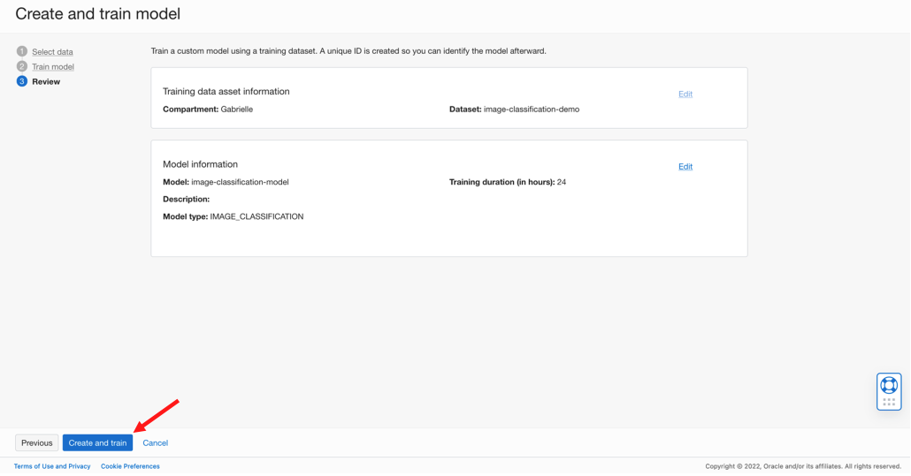

# Create a custom AI Vision Model

## Introduction
In this lab, you will use the labeled dataset created in Lab 1 to train a custom image classification model. The image classification model will classify the images as either cell, stripe, or debris within a certain confidence.

*Estimated Time*: 30 minutes

### Objectives

In this lab, you will:
- Create an AI Vision Project
- Create a custom image classification model using the OCI Vision AI Service

### Prerequisites

- A Free Tier or Paid Cloud Account
- End user must have full administrator privileges to complete these steps

## **Policy Setup**

Before you start using OCI Data Labeling Service, your tenancy administrator should set up the following policies by following below steps:

1. Add IAM resources necessary for AI Vision usage.

  a. Add policy (e.g. named AIVisionPolicy) with the following statements:

      ```
      <copy>Allow group ImageClassification_Group to manage ai-service-vision-family in tenancy</copy>
      ```
      ```
      <copy>Allow group ImageClassification_Group to manage object-family in tenancy</copy>
      ```


## **Task 1:** Create a Vision Project

1. From the OCI services menu, click 'Vision' under 'AI Services.'


2. Click on 'Projects' under 'Custom Models.'


3. Click 'Create Project' and enter details for your Project:

  a. Select desired compartment

  b. Name: Enter a name for your project that you can recognize, e.g. image-classification-demo

  c. Click 'Create project'
  

## **Task 2:** Create a Custom Image Classification Model

1. Select 'Create Model.'


2. Enter details for your model:

  a. Type: Image Classification

  b. Training Data: Choose existing dataset

  c. Data source: Data Labeling Services

  d. Choose the dataset that you created earlier

  e. Click 'Next'
  

## **Task 3:** Train Custom Model and Submit
1. Enter training details for the model.

  a. Give the model a display name that you will recognize, e.g. image-classification-model

  b. Training duration: Recommended training (May take up to 24 hours)

  c. Click 'Next'

  


2. Review that the model information is correct and click 'Create and train.'


**Note:** This step might vary in time. Wait for the model to appear as 'Active'.

## **Task 4:** Test the Model On New Images

1. Navigate to the Project Details page and click on the model just created.


2. Mac Users: Click this [link](https://objectstorage.us-ashburn-1.oraclecloud.com/p/N8RpDkD6PNFANaEUK5R44QvNAp72Ps1SIno1BAlnesTSQLIMi2GnOEIpVVVTaP3_/n/orasenatdpltintegration03/b/all-images-live-lab/o/biomedical-demo-test-images.zip) to download sample test images to your local machine.

   Windows Users: Click this [link](https://objectstorage.us-ashburn-1.oraclecloud.com/p/WdfDs88Gf4Os83tiITIh_4xQOX-_Cvwvv_TjSzjZ4YaDCkpRUXjcF9HN1NeCKGAF/n/orasenatdpltintegration03/b/all-images-live-lab/o/windows-biomedical-demo-test-images.zip) to download sample test images to your local machine.

3. Upload one image from the test dataset on your local machine to test the newly created model.

  a. Select 'Local file' under 'Image source'

  b. Select 'select one...' in the 'Upload image' section. Navigate to the folder containing the test images on your local machine and select an image to upload.
  
   c. Examine confidence measurements under the 'Results' pane
   


Congratulations on completing this lab!

[Proceed to the next section](#next).

## Acknowledgements
* **Authors**
    * Samuel Cacela - Staff Cloud Engineer
    * Gabrielle Prichard - Cloud Solution Engineer

* **Last Updated By/Date**
    * Gabrielle Prichard - Cloud Solution Engineer, April 2022
