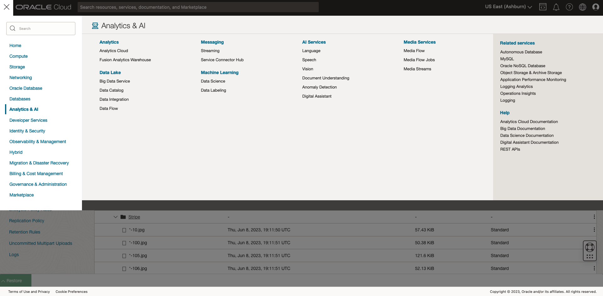
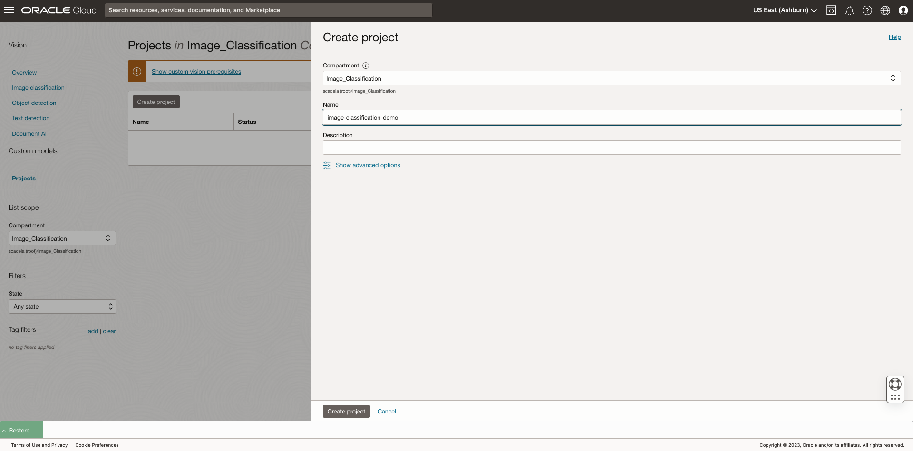
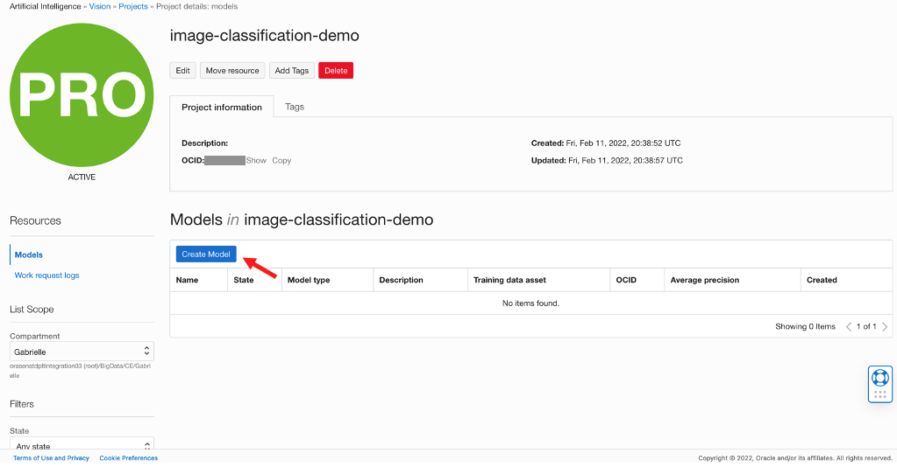
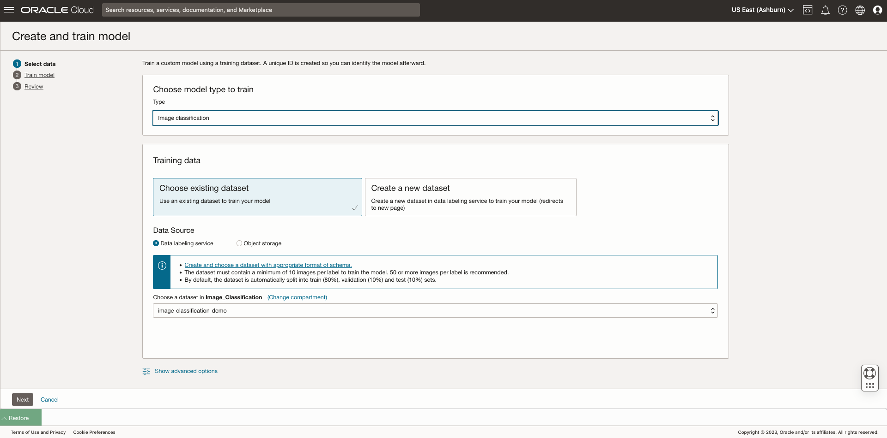
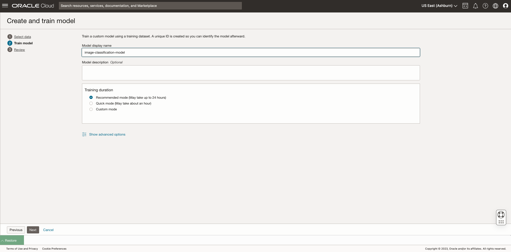
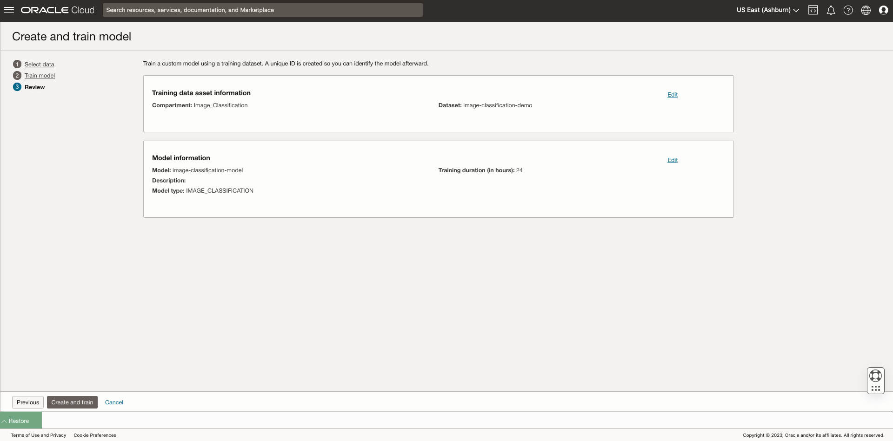
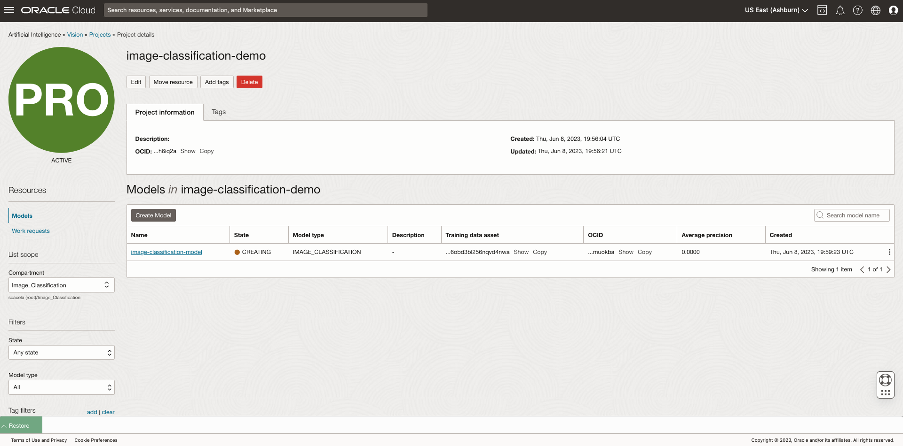
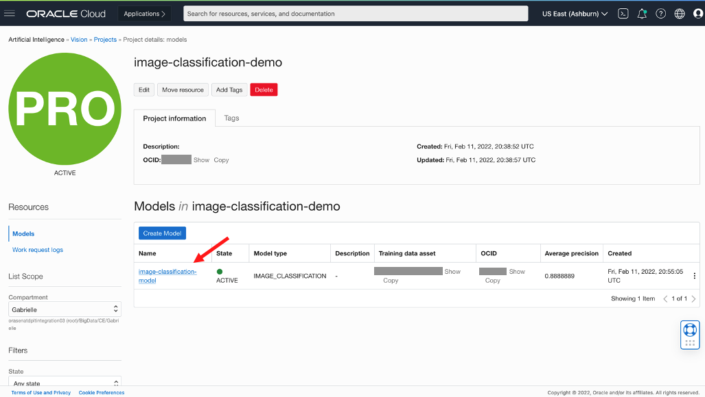
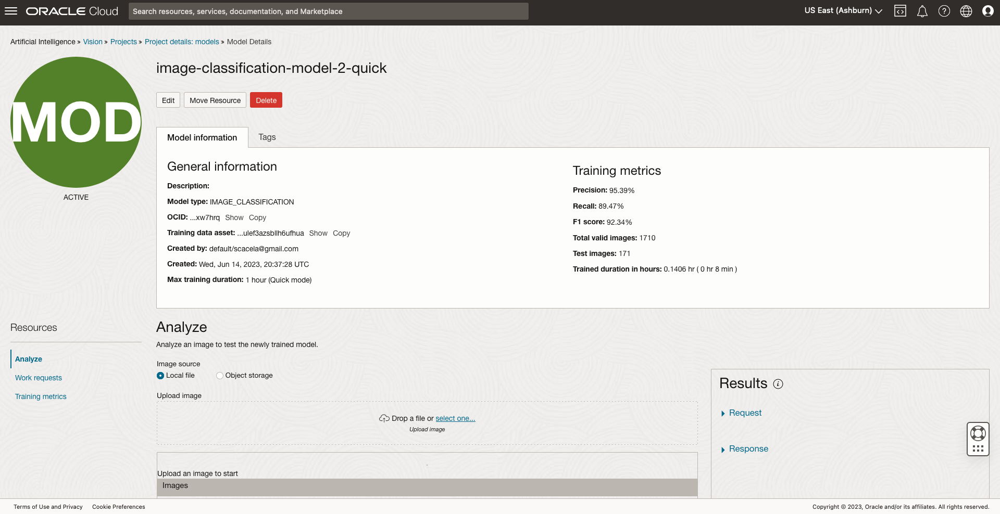
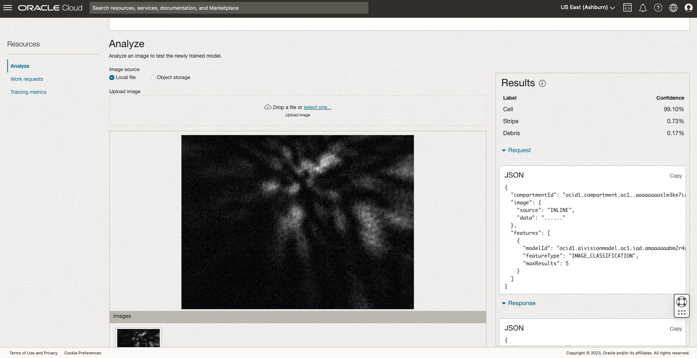

# Create a custom AI Vision Model

## Introduction
In this lab, you will use the labeled dataset created in [Lab 1](../dls-bulk-label/dls-bulk-label.md) to train a custom image classification model. The image classification model will classify the images as either cell, stripe, or debris within a certain confidence.

*Estimated Time*: 20-25 minutes

### Objectives

In this lab, you will:

* **Task 1**: Create a Vision Project, which is a logical container for your Vision models.
* **Task 2**: Custom-train a Vision model using the labeled records in the Data Labeling dataset.
* **Task 3**: Upload test data via the web console and see the model inference in action.

### Prerequisites

* An Oracle Free Tier, or Paid Cloud Account
* User is either a tenancy administrator, or has access to a tenancy administrator for the *Policy Setup* step.
    * Note: If you are not a tenancy administrator, begin with Task 1 after the tenancy administrator has assigned permissions in **Policy Setup**.
* Lab steps assume usage of home region.

## **Task 1:** Create a Vision Project.
*\[2-3 minutes\]*

1. From the OCI services menu, click *Vision* under *AI Services*.

2. Click on *Projects* under *Custom Models*.

4. Click *Create Project* and enter details for your Project:

  a. **Compartment**: Select your new compartment using the dropdown menu under **List Scope**.

  a. **Name**: Enter a name for your Project, e.g. *image-classification-demo*

  b. Click **Create project**
  

## **Task 2:** Create a Custom Image Classification Model
*\[15-20 minutes\]*

1. Select **Create Model**.

2. Enter details for your model:

  a. **Type**: *Image Classification*

  b. **Training Data**: Choose existing dataset

  c. **Data source**: *Data Labeling Services*

  d. Choose the dataset that you created in Lab 1.

  e. Click **Next**.
  

3. Enter training details for the model.

  a. **Model display name**: Enter a name for your Vision model, e.g. *image-classification-model*

  b. **Training duration**: *Quick mode*

  **Note**: The training process is expected to complete after about 8 minutes, despite the web console indicating about an hour.

  c. Click **Next**.

  

4. Review that the model information is correct and click **Create and train**.

**Note:** Wait for the model to appear as **Active**, as shown in the below image.

## **Task 3:** Test the Model On New Images
*\[5 minutes\]*

1. Navigate to the **Project details** page and click on your newly-trained Vision model

<!-- 2. **Mac Users**: Click this [link](https://objectstorage.us-ashburn-1.oraclecloud.com/p/N8RpDkD6PNFANaEUK5R44QvNAp72Ps1SIno1BAlnesTSQLIMi2GnOEIpVVVTaP3_/n/orasenatdpltintegration03/b/all-images-live-lab/o/biomedical-demo-test-images.zip) to download sample test images to your local machine.

   **Windows Users**: Click this [link](https://objectstorage.us-ashburn-1.oraclecloud.com/p/WdfDs88Gf4Os83tiITIh_4xQOX-_Cvwvv_TjSzjZ4YaDCkpRUXjcF9HN1NeCKGAF/n/orasenatdpltintegration03/b/all-images-live-lab/o/windows-biomedical-demo-test-images.zip) to download sample test images to your local machine. -->

2. Observe the performance metrics on the Model Details page, as well as the training duration.

  The model performance metrics, defined below, indicate to end-users how apt your new model is at classifying cells (labeled *Cell*) from non-cells (labeled either *Debris* or *Stripe*), based on analysis of the visual properties of the coherent diffraction images.

  * **Precision**: Fraction of images that were classified correctly with a label (e.g. *Cell*) / images that should not have been classified with the label, but were
  * **Recall**: Fraction of images that were classified correctly with a label / images that should have been classified with that label, but were not
  * **F1 Score**: Harmonic mean of precision and recall values.

  Zooming out from our biomedical use case, AI Vision can automate time-consuming, attention-demanding tasks across many industries, such as:

  - Scene monitoring
  - Visual anomaly or fraud detection
  - Quality inspection, scene monitoring
  - Categorize a document as a predefined type such as resume, invoice, receipt, or tax form
  - Information extraction
  - Digital asset management, media indexing, inventory analytics
  - Understanding handwritten, tilted, shaded, rotated text

2. [Click to download](https://objectstorage.us-ashburn-1.oraclecloud.com/p/hah9GOfzzUI67R2a1X93shi9j1C7OFUFSqbfYtLDBe1waj5d6HL70RR26mkDCWWS/n/orasenatdpltintegration03/b/all-images-live-lab-ocw23/o/Biomedical_Image_Classification_Test_Data.zip) sample test images to your local machine.

3. Upload one image from the test dataset on your local machine to test the newly created model.

  a. Select **Local file** under **Image source**.

  b. Select **select one...** in the **Upload image** section. Navigate to the folder containing the test images on your local machine and select an image to upload.
  
  
  c. Examine confidence measurements under the **Results** pane
  

  Note that batch processing of interence data is supported via OCI-CLI, REST API, and SDK.

Congratulations on completing this lab!

You have successfully achieved the following (new achievements in **bold**):

* Created Identity and Access Management (IAM) Compartment, Policy, Group, and Dynamic Group to enable necessary permissions for this LiveLab.
* Created an Object Storage Bucket.
* Downloaded biomedical training data using Cloud Shell, and bulk-upload the biomedical training data to the Object Storage bucket.
* Created a Data Labeling dataset, which imports the training images from Object Storage as records.
* Bulk-labeled the images that were loaded into Object Storage using a provided script that takes a labeling scheme as input. In this lab, the labeling scheme will be based on the names of the folders containing the training images (e.g. images in the *Cell* folder will be labeled with *Cell*, and so on)
* **Create a Vision Project, which is a logical container for your Vision models.**
* **Custom-train a Vision model using the labeled records in the Data Labeling dataset.**
* **Upload test data via the web console and see the model inference in action.**

## What's next?

* Read about [Children's National Medical Center (CNMC) uses Vision and Data Labeling to help cure children's cancer, improving efficiency 30-50%](https://blogs.oracle.com/cloud-infrastructure/post/cmri-uses-oracle-ai-to-help-cure-childrens-cancer-improves-efficiency-30-50-percent)
* Read about [Children's Medical Research Institute (CMRI) cuts costs by 25% on OCI](https://www.oracle.com/customers/cmri/)
* Read about [Vision](https://www.oracle.com/artificial-intelligence/vision/)
* Read about [Data Labeling](https://www.oracle.com/artificial-intelligence/data-labeling/)
* Read about [more AI Services](https://www.oracle.com/artificial-intelligence/ai-services/)

[Proceed to the next section](#next).

## Acknowledgements

* **Authors**
    * Samuel Cacela - Senior Cloud Engineer
    * Gabrielle Prichard - Product Manager, Analytics Platform
    * Xin-hua Hu - Professor, Dept. of Physics at East Carolina University
    * David Chen - Master Principal Cloud Architect

* **Last Updated By/Date**
    * Samuel Cacela - Senior Cloud Engineer, June 2023
