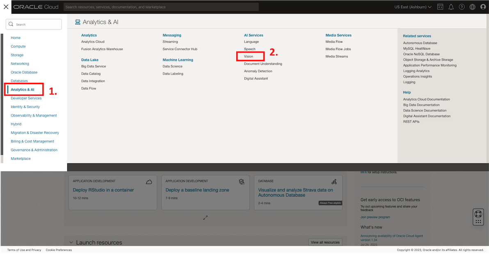
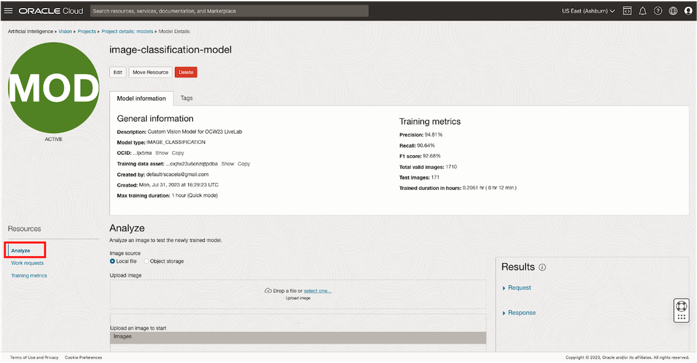
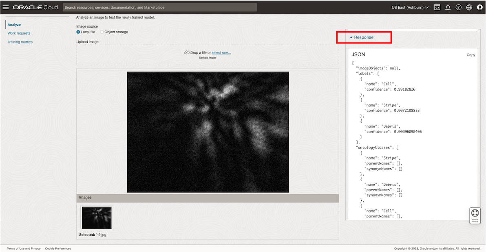
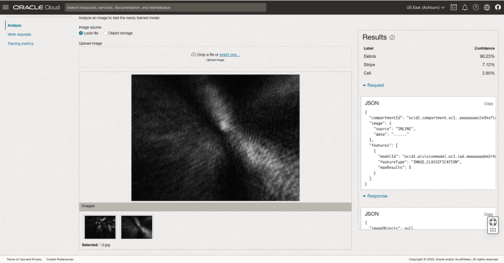
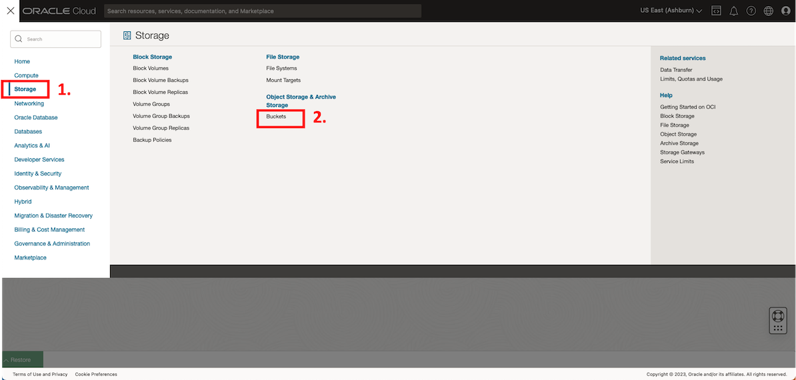

# Create a custom AI Vision Model
**Estimated Time**: *40 minutes*

## Introduction

In this Lab, you will use labeled dataset you created in Lab 1 to custom-train an OCI AI Vision model, producing your own cell classifier! After the training process, you will be able to see the determined accuracy of your model, reported as the F1 score. You will also be able to experience the model serving capability of your cell classifier on your own with an included set of test images!

The Tasks in this Lab are organized as follows:

* **Task 1**: Create an AI Vision Project, which is a logical container for your Vision models
* **Task 2**: Custom-train an AI Vision model using the labeled records in your Data Labeling Dataset
* **Task 3**: Upload test data via the OCI web console, and witness your model serve your input in real-time
* **Cleanup**: Deprovision the resources you provisioned for this LiveLab

## Primary Objectives

In this LiveLab, you will:

* Learn how to navigate in the OCI web console and be able to demo key OCI AI Vision features
* Custom-train your own image classification model using your labeled dataset and OCI AI Vision

## Prerequisites

* An Oracle Free Tier, or Paid Cloud Account
* Lab 1 has been completed
* Your OCI user is a member of the group that was created in Lab 1
* Accessibility to your tenancy's [home region](https://docs.oracle.com/en-us/iaas/Content/Identity/Tasks/managingregions.htm)
* Sufficient resource availability within your home region for 1 Vision Model

## **Task 1:** Create an AI Vision Project
*\[2 minutes\]*

1. Create a Project, which is a logical container for AI Vision models. From the OCI services menu, click **AI Services** > **Vision**

2. Click on *Projects* under *Custom Models*.

3. Click **Create Project** and enter details for your Project:

  a. **Compartment**: Select your new compartment using the dropdown menu under **List Scope**.

  b. **Name**: Enter a name for your Project, e.g. *image-classification-project*

  c. **Description**: Optionally, provide a description for your Project, e.g. *Project for image classification OCW23 LiveLab*

  d. Click **Create project**

  

  

## **Task 2:** Custom-Train your own AI Vision Model
*\[35 minutes\]*

1. To custom-train your own AI Vision model, you will use the dataset that you labeled in the previous Lab:

  a. Wait for the **Status** of your Project to update to *ACTIVE*. Then, click into your hyperlinked Project listing.

  b. Click **Create Model** and enter details for your model:

  c. **Type**: *Image Classification*

  d. **Training data**: *Choose existing dataset*

  e. **Data source**: *Data labeling service*

  f. Choose the Data Labeling Dataset that you created in Lab 1.

  g. Click **Next**.

  

2. Enter training details for the model.

  a. **Model display name**: Enter a name for your Vision model, e.g. *image-classification-model*

  b. **Model description**: Enter a description for your Vision model, e.g. *Vision Model for image classification OCW23 LiveLab*

  c. **Training duration**: *Quick mode*

  **Note:** Although the web console indicates 1 hour of training duration, *the work request will require about 30 minutes to complete*. This will include the process of back-end infrastructure deployment, model training, and model deployment to the endpoint that will be made accessible to your environment via the web console and APIs.

  d. Click **Next**.

  

3. Review that the model information is correct and click **Create and train**.

4. After about *30 minutes*, the **State** of your model will update to **Active**, indicating that it is available for use. You can monitor the training progress by checking on the **% Complete** indicated on-screen. Once your model is **Active**, navigate to the model serving page by clicking **Analyze**, and move onto the next Task.

## **Task 3:** Test the Model On New Images
*\[3 minutes\]*

1. Now that your model is available, observe the performance metrics on the Model Details page, as well as the training duration.

  The model performance metrics, defined below, indicate to end-users how apt your new model is at classifying cells (labeled *Cell*) from non-cells (labeled either *Debris* or *Stripe*), based on analysis of the visual properties of the coherent diffraction images.

    * **Precision**: Number of images that were classified correctly, divided by the number of images that should not have been classified with the label, but were.
    * **Recall**: Number of images that were classified correctly with a label, divided by the number of images that should have been classified with that label, but were not.
    * **F1 Score**: Harmonic mean of precision and recall values. This metric represents the overall accuracy of our model, as it factors in both *Precision* and *Recall*.

2. [Click to download](https://objectstorage.us-ashburn-1.oraclecloud.com/p/hah9GOfzzUI67R2a1X93shi9j1C7OFUFSqbfYtLDBe1waj5d6HL70RR26mkDCWWS/n/orasenatdpltintegration03/b/all-images-live-lab-ocw23/o/Biomedical_Image_Classification_Test_Data.zip) this 8 MB dataset to your local machine. This dataset contains a test set of coherent diffraction images of blood samples. As these images were not present in the training dataset, they were not used to train your Vision model, and will enable you to simulate the model serving process.

3. Upload one image from the test dataset on your local machine to test the newly created model.

  a. Select **Local file** under **Image source**.

  b. Click **select one...** in the **Upload image** section. Navigate to the folder containing the test images on your local machine and select an image to upload.

  

  
  
  c. Examine confidence measurements under the **Results** pane. These scores reveal how confident your model is that the test image belongs to a given class.

  

  

  Click on **Response**, to see how the analysis appears when represented as JSON, which makes downstream processing easy as JSON is an industry-standard data format.

  *Note:* Batch processing of interence data is supported via OCI-CLI, REST API, and SDK.

  d. Try analyzing other images in the test dataset by repeating steps **b.** and **c.**

  

  

**Congratulations on completing Lab 2 as well as the LiveLab!** Now that you understand the process of producing a serving AI Vision model for cell classification à la Professor Hu, you are ready to consider the ways in which you can process the model analysis for end-user consumption. You are also ready to apply the principals you discovered in this lab to [use cases](../workshops/freetier/index.html?lab=intro) where a similar pattern of labeling data and training models on OCI would yield significant time and cost savings returns.

In addition to image classification, OCI supports AI automation of tasks such as:

- **Object Detection**: Identify pre-defined or custom-defined objects within images
- **Optical Character Recognition**: Recognize characters in documents or images
- **Document Understanding**: extract units of information from documents such as text, tables, key-value pairs, pages, custom-defined or pre-defined document type
- **Speech Transcription**: Transcribe spoken language from audio files to transcripts
- **Sentiment Analysis**: Automatically decipher sentiment of a volume of text or sentences within it
- **Named-Entity Recognition**: Extraction of people, places, and things that are publicly recognized
- **Key-phrase extraction**: Extract key-phrases that can be considered as tags related to a volume of text
- **Translation**: Translate between any of 21 languages

**Learn more** about [AI Vision](https://www.oracle.com/artificial-intelligence/vision/) and [additional AI Services](https://www.oracle.com/artificial-intelligence/ai-services/) that support these tasks and learn about how the tools that are available today can enable you to streamline and optimize the processes that are required for your business.

[Proceed to the next section](#next).

## **Cleanup**
*\[5 minutes\]*

1. Delete your Object Storage Bucket:

  a. Navigate to your Object Storage Bucket from the OCI services menu: **Storage** > **Buckets**

  b. Click on the 3 dots to the right of the listing corresponding to your Bucket > Click **Delete** > Enter the name of your Bucket > **Delete**

  

  <!--  -->

  <!-- [Delete bucket] -->

2. Delete your Data Labeling Dataset:

  a. Navigate to your Data Labeling Dataset from the OCI services menu: **Analytics & AI** > **Data Labeling**

  b. Click on the 3 dots to the right of the listing corresponding to your Dataset > Click **Delete** > Enter the name of your Dataset > **Delete**

  

  <!--  -->

  <!-- [Delete dataset] -->

3. Delete your AI Vision Model and Project:

  a. Navigate to your AI Vision Project from the OCI services menu: **Analytics & AI** > **Vision**

  b. Click into your hyperlinked Project > Click into your hyperlinked model

  c. Delete your AI Vision Model: Click on the 3 dots to the right of the listing corresponding to your AI Vision model > **Delete** > Type *DELETE* > **Delete**

  d. Delete your AI Vision Project: Wait for your AI Vision Model to finish terminating. Then, click **Delete** > Type *DELETE* > **Delete**

  

  <!--  -->

  <!-- [Delete model] -->

  <!-- [Delete project] -->

4. Delete your Policy:

  a. From the OCI services menu, click: **Identity & Security** > **Policies**

  b. Select the root compartment from the dropdown menu on the left-hand side of the screen.

  c. Click on the 3 dots to the right of the listing corresponding to your Policy > **Delete** > **Delete**

5. Delete your Dynamic Group and Group:

  a. From the OCI Services menu, click: **Identity & Security** > **Domains**

  b. Select the root compartment from the dropdown menu on the left-hand side of the screen, and select the **Default** domain.

  c. Click **Dynamic groups** on the left-hand side of the page.

  d. Click on the 3 dots to the right of the listing corresponding to your Dynamic Group > **Delete** > **Delete dynamic group**

  e. Click **Groups** on the left-hand side of the page.

  f. Click on the 3 dots to the right of the listing corresponding to your Group > **Delete** > **Delete group**

6. Delete your Compartment:

  a. Ensure that all resources within the compartment have finished terminating.

  b. From the OCI services menu, click: **Identity & Security** > **Compartments**

  c. Click on the 3 dots to the right of the listing corresponding to your Compartment > **Delete** > **Delete**

  ## Acknowledgements

* **Authors**
    * Samuel Cacela - Senior Cloud Engineer
    * Gabrielle Prichard - Product Manager, Analytics Platform
    * Xin-hua Hu - Professor, Dept. of Physics at East Carolina University
    * David Chen - Master Principal Cloud Architect

* **Last Updated By/Date**
    * Samuel Cacela - Senior Cloud Engineer, June 2023
