# Use DLS to bulk label a dataset

## Introduction
In this lab, we will provide a .zip file containing biomedical images separated into 3 subfolders based on how each image has been medically classified.

Participants will download this .zip file, bulk-upload the images to object storage, and create a labeled dataset using the Data Labeling Service and a bulk-labeling script.

*Estimated Time*: 60 minutes

### Objectives

In this lab, you will:
- Create Identity and Access Management (IAM) Policies, Group, and Dynamic Group to enable permissions necessary for this lab
- Create an Object Storage Bucket and load images from your local machine into the Bucket
- Create a Data Labeling Service dataset and bulk label the images that were loaded into Object Storage

### Prerequisites

- An Oracle Free Tier, or Paid Cloud Account
- User is either a tenancy administrator, or has access to a tenancy administrator for the *Policy Setup* step.
    - Note: If you are not a tenancy administrator, begin with Task 1 after the tenancy administrator has assigned permissions in *Policy Setup*.

**Required Download:**

Open Cloud Shell, and run the following command on your Cloud Shell command line interface to download the files needed throughout this lab:
```
<copy>wget https://objectstorage.us-ashburn-1.oraclecloud.com/p/zDOLdHIblEgbMO_4RCotgp4_iL32UnBY8WCjR78hAvJJJj8nbQyB6FNoHt633fIb/n/orasenatdpltintegration03/b/all-images-live-lab/o/biomedical-image-classification-training-data.zip</copy>
```
Run the following command to unzip the download:
```
<copy>unzip biomedical-image-classification-training-data.zip</copy>
```

## **Policy Setup**

Before you start using OCI Data Labeling Service, you or your tenancy administrator should set up the following policies by following below steps:

1. Either identify or create a compartment where you will provision resources for this lab.

  a. From the OCI services menu, click 'Compartments' under 'Identity'
  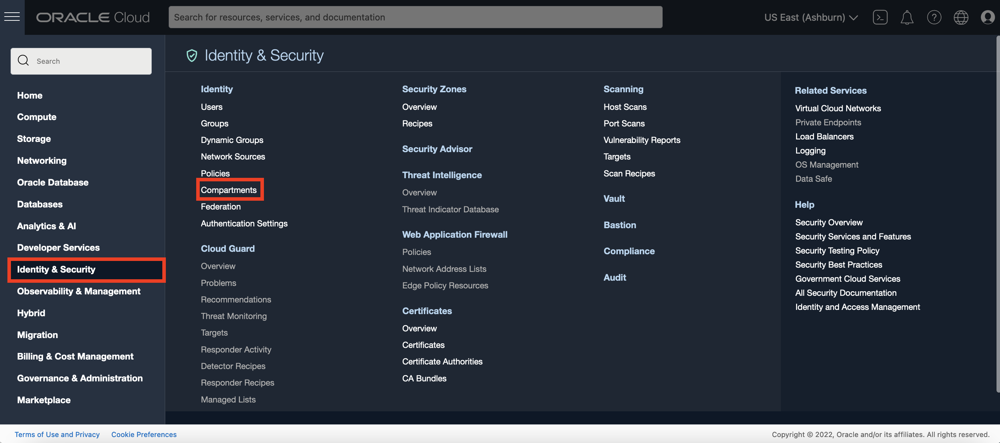

  b. Click 'Create Compartment'

  c. Provide an appropriate name

  d. Provide a description

  e. Select the parent compartment

  f. Click 'Create Compartment'
  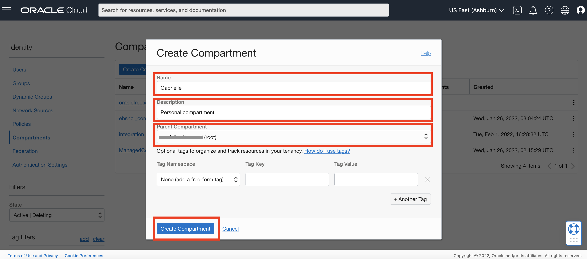

2. Find the compartment OCID. Then, copy and paste this value into a new line on a digital notepad app. You will retrieve this value when building your IAM Policy statements.

3. Make a group and add your user to it, along with any other users who will perform these lab steps.

  a. From the OCI services menu, click 'Groups' under 'Identity'
  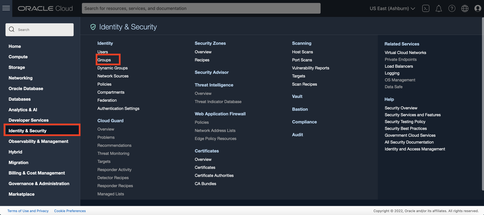

  **Note:** For Free Tier accounts, navigate to 'Groups' by clicking on the profile icon in the upper right-hand corner, and select 'Identity Domain: Default.' Click on 'Groups.'
  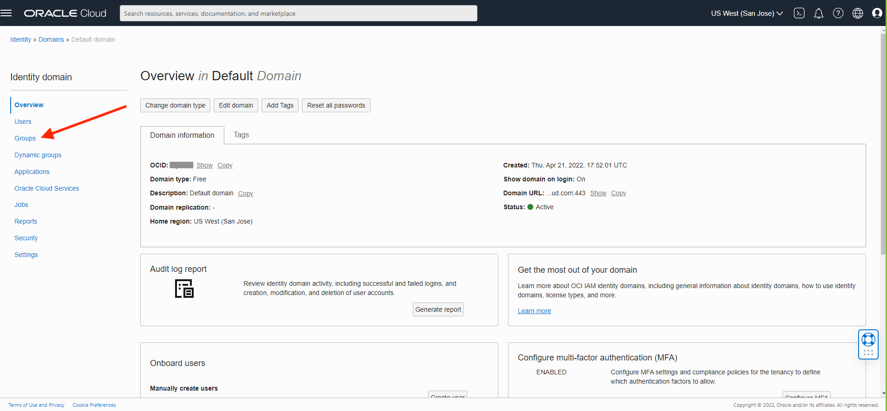

  b. Click 'Create Group'

  c. Provide an adequate group name (e.g. named ImageClassification_Group) and description

  d. Click 'Add User to Group'
  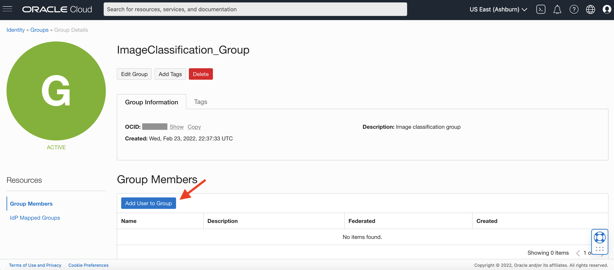

  e. Select user you want to add to the group.


4.  Create a Dynamic Group.

    a. From the OCI services menu, click 'Dynamic Groups' under 'Identity'
    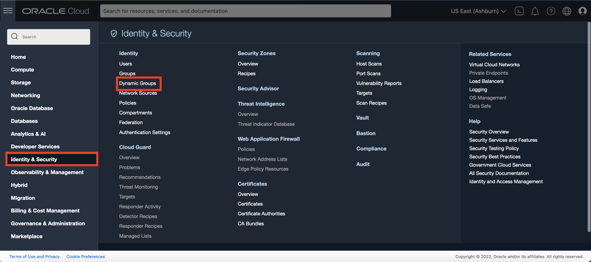

    **Note:** For Free Tier accounts, navigate to 'Dynamic Groups' by clicking on the profile icon in the upper right-hand corner, and select 'Identity Domain: Default.' Click on 'Dynamic Groups.'
    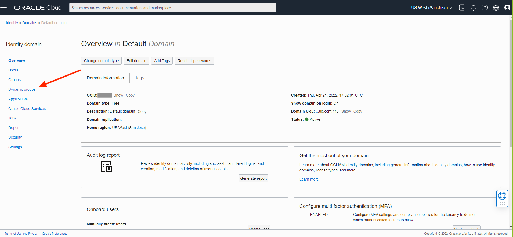

    b. Select 'Create Dynamic Group'

    c. Add an appropriate name (e.g. named DataLabeling_DynamicGroup)

    d. Add a description

    e. Include the following rule. Replace the information in '<>' with your own value.

      ```
      <copy>ALL {datalabelingdataset.compartment.id='<compartment OCID>'}</copy>
      ```
      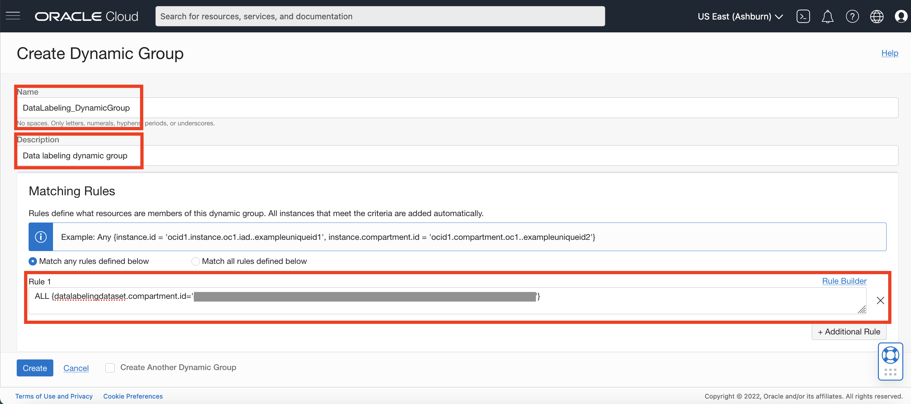

5. Create IAM Policy statements for Dynamic Group and Group.

    a. From the OCI services menu, click 'Policies' under 'Identity'
    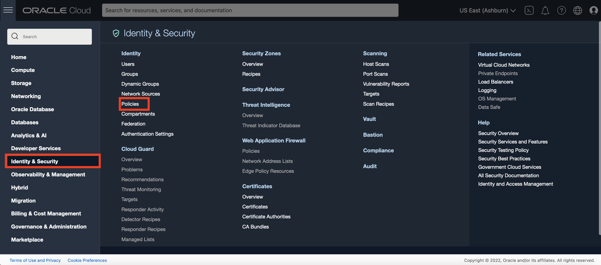

    b. Click on 'Create Policy'

    c. Give the policy an appropriate name (e.g. named DataLabelingPolicy)

    d. Provide a description

    e. Click the toggle to show the manual editor

    d. Copy and paste the following statements into the Policy Builder editor. Replace the information in '<>' with your own values.

      ```
      <copy>Allow dynamic-group DataLabeling_DynamicGroup to read buckets in compartment id <compartment OCID></copy>
      ```
      ```
      <copy>Allow dynamic-group DataLabeling_DynamicGroup to read objects in compartment id <compartment OCID></copy>
      ```
      ```
      <copy>Allow dynamic-group DataLabeling_DynamicGroup to manage objects in compartment id <compartment OCID> where any {request.permission='OBJECT_CREATE'}</copy>
      ```
      ```
      <copy>Allow group ImageClassification_Group to read buckets in compartment id <compartment OCID></copy>
      ```
      ```
      <copy>Allow group ImageClassification_Group to manage objects in compartment id <compartment OCID></copy>
      ```
      ```
      <copy>Allow group ImageClassification_Group to read objectstorage-namespaces in compartment id <compartment OCID></copy>
      ```
      ```
      <copy>Allow group ImageClassification_Group to manage data-labeling-family in compartment id <compartment OCID></copy>
      ```

## **Task 1:** Create an Object Storage Bucket

1. From the OCI services menu, click 'Buckets' under 'Object Storage & Archive Storage.'
  

2. Set your Compartment to the desired Compartment using the drop down under List Scope.
  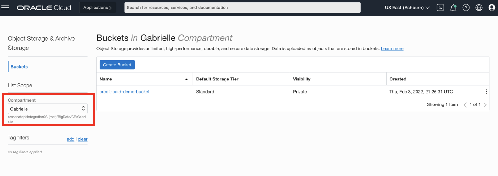

3. Click 'Create Bucket' and enter details for your Bucket:

  a. Bucket Name: enter a name for your Bucket that you can recognize, e.g. image-classification-demo

  b. Default Storage Tier: Standard

  c. Encryption: Encrypt using Oracle managed keys

  d. Click 'Create'
  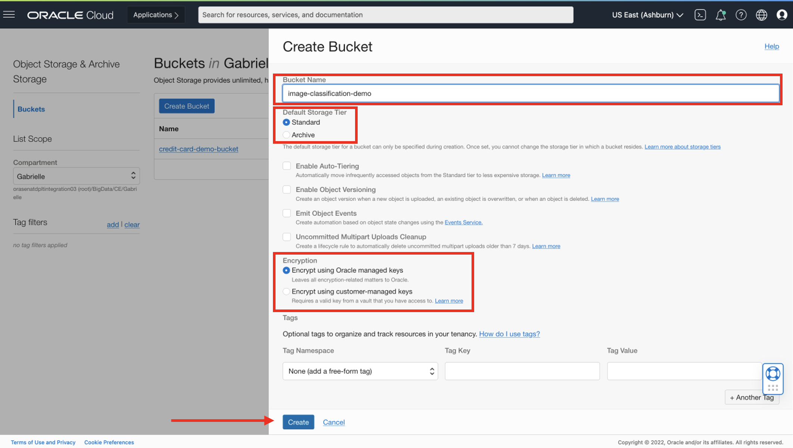

## **Task 2:** Upload the Images From Your Local Machine Into Your Bucket
**Note:** These instructions are Mac OS compatible

1. On your Cloud Shell machine, execute the following commands to set environment variables for the name of your bucket and the OCID of the compartment where your bucket exists. Be sure to replace the information in "<>" with your own values.
    ```
    <copy>export DL_BucketName="<your bucket name>"</copy>
    ```
    ```
    <copy>export DL_Compartment=<OCID of your Compartment></copy>
    ```

2. Execute the following command to set an environment variable for the directory that contains your JPG/JPEG image files.
```
export DL_LabelDirectory=~/Biomedical\ Image\ Classification-\ Training\ Data
```

3. Execute the following command to bulk-upload the JPG/JPEG image files to your bucket.
```
oci os object bulk-upload --bucket-name "${DL_BucketName}" --src-dir "${DL_LabelDirectory}" --content-type 'image/jpeg'
```

<!-- 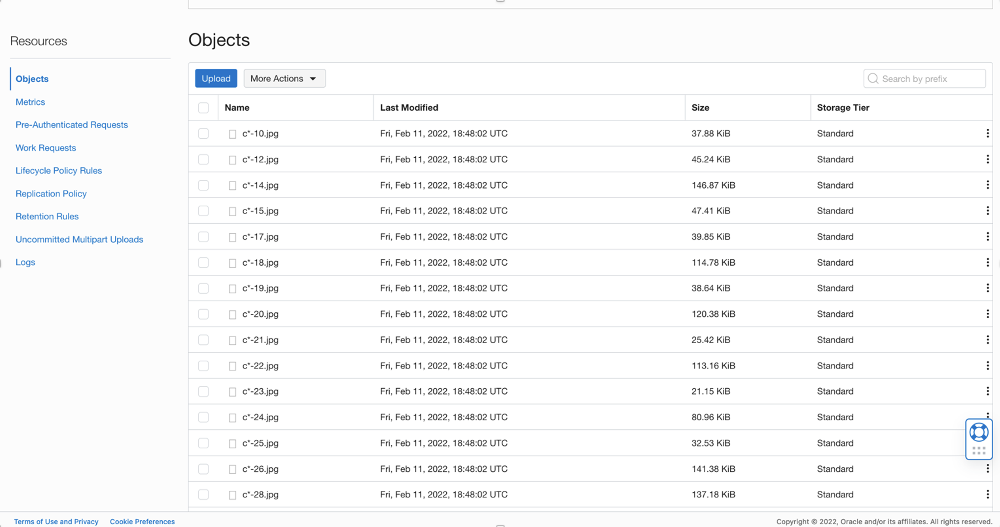 -->
4. Confirm that the images have been uploaded to object storage within their respective folders.


## **Task 3:** Create a Data Labeling Service Dataset
1. From the OCI services menu, click 'Data Labeling' under 'Machine Learning.'


2. Click on 'Datasets.'


3. Set your Compartment to the same Compartment where you created your Bucket using the drop down under List Scope.
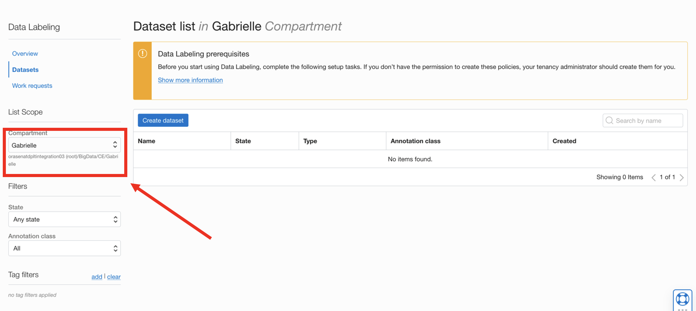

4. Create your dataset by clicking 'Create dataset.'

  a. Name: enter a name for your DLS Dataset that you can recognize, e.g. image-classification-demo

  b. Dataset format: Images

  c. Annotation Class: Single Label

  d. Click 'Next'
  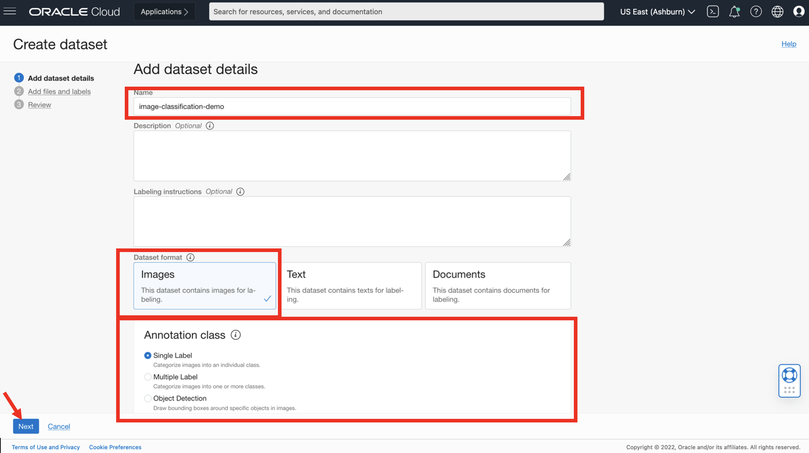

  e. Retrieve files from Object Storage by choosing 'Select from Object Storage'
  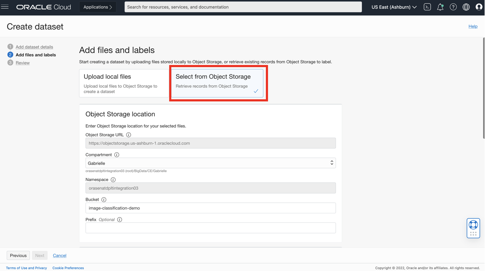

  f. Choose the name of compartment where your Bucket exists
  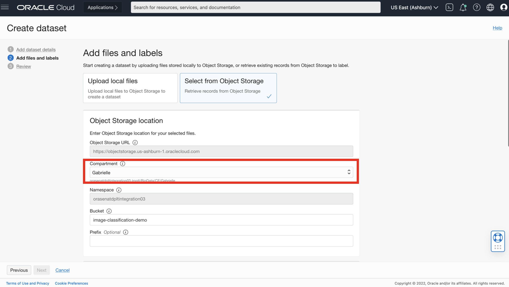

  g. Choose your Bucket by name
  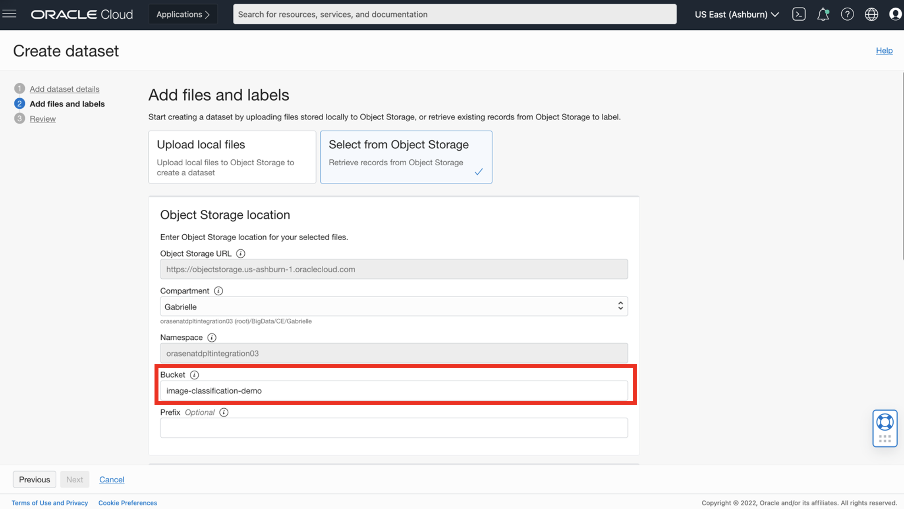

  h. Add Labels: enter all possible labels that you will want to use to label any of your data, pressing enter between each label. In our case, our labels will be as shown below. Note to use capitalized first letters followed by lowercase letters when entering these labels:
    * Cell
    * Debris
    * Stripe
  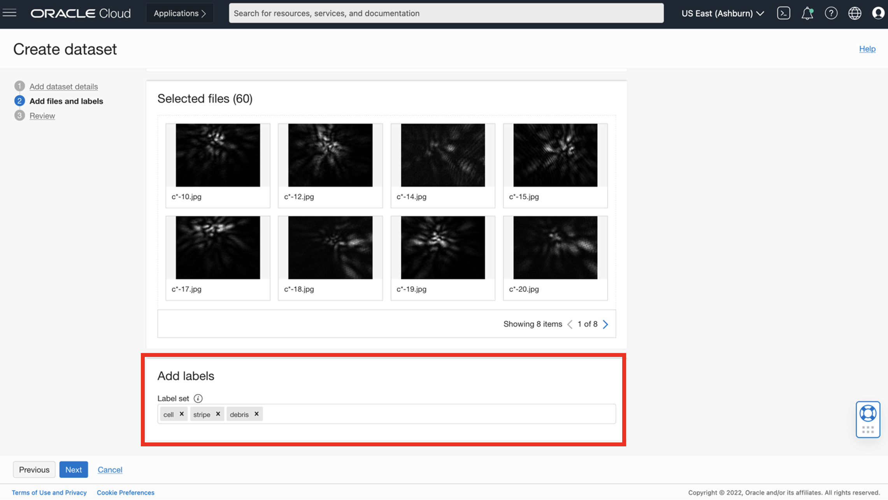

  i. Click 'Next'
  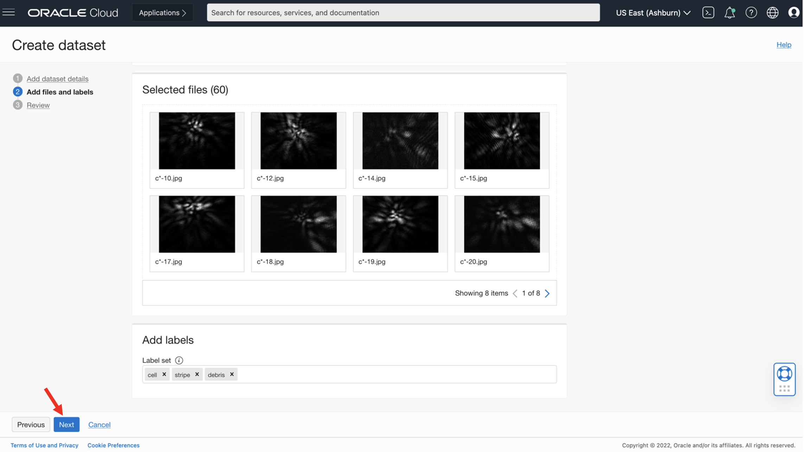

  j. Review the information and deploy your Dataset by clicking 'Create'
  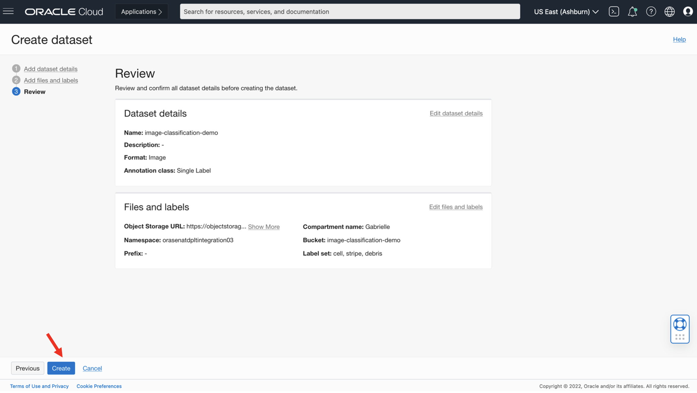

5. Find the Dataset OCID as shown in the screenshot. Then, copy and paste this value into a new line on a digital notepad app. You will retrieve this value in the next Task when configuring the bulk-labeling tool.
  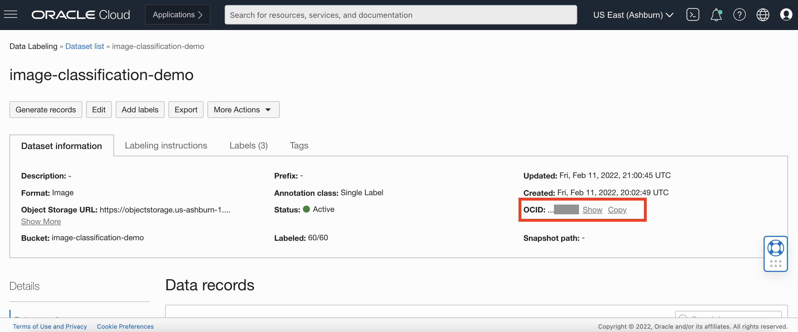

## **Task 4:** Populate Your DLS Dataset With the Data From Your Object Storage Bucket
1. Click into your new Dataset. When all of the data has been imported into your DLS Dataset from your Object Storage Bucket, it will be time to perform a bulk-labeling operation on your data.

2. Run the follwing command to download the bulk-labeling script to the home directory on your Cloud Shell machine:
```
<copy>cd; git clone https://github.com/oracle-samples/oci-data-science-ai-samples.git
cd oci-data-science-ai-samples/data_labeling_examples/bulk_labeling_python</copy>
```
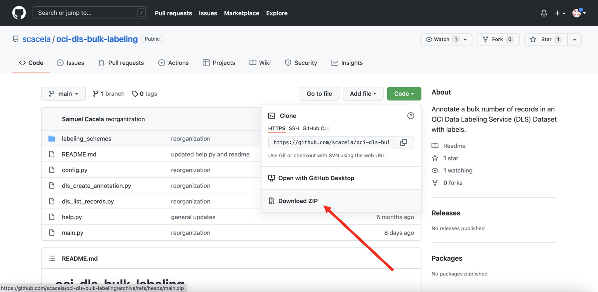

3. Run the following command to obtain the identifier of your tenancy's home region. Copy and paste this value into a new line on a digital notepad app.
```
<copy>echo $OCI_REGION</copy>
```
4. Open the file named 'config.py' from the bulk-labeling tool contents with the command 'vi config.py', and then edit the variables as indicated below. Be sure to replace the information in "<>" with your own values.
```
<copy>CONFIG_FILE_PATH = "/etc/oci/config"</copy>
REGION_IDENTIFIER = "&ltRegion identifier from notepad&gt"
DATASET_ID = "&ltOCID of your DLS Dataset from notepad&gt"
```
5. Open the file named 'classification\_config.py' from the bulk-labeling tool contents with the command 'vi classification\_config.py', and then edit the variables as indicated below. Be sure to replace the information in "<>" with your own values.
```
<copy>LABELS = ["Cell", "Debris", "Stripe"]
LABELING_ALGORITHM = "FIRST_REGEX_MATCH"</copy>
```

6. Install pandas for your user on Cloud Shell, which is a prerequisite for the bulk-labeling script:
```
<copy>pip install --user pandas</copy>
```
7. Run the following command to bulk-label the records in your DLS Dataset:
```
<copy>python bulk_labeling_script.py</copy>
```

8. Verify that your images have been labeled by navigating to the dataset created earlier and selecting one of the images.
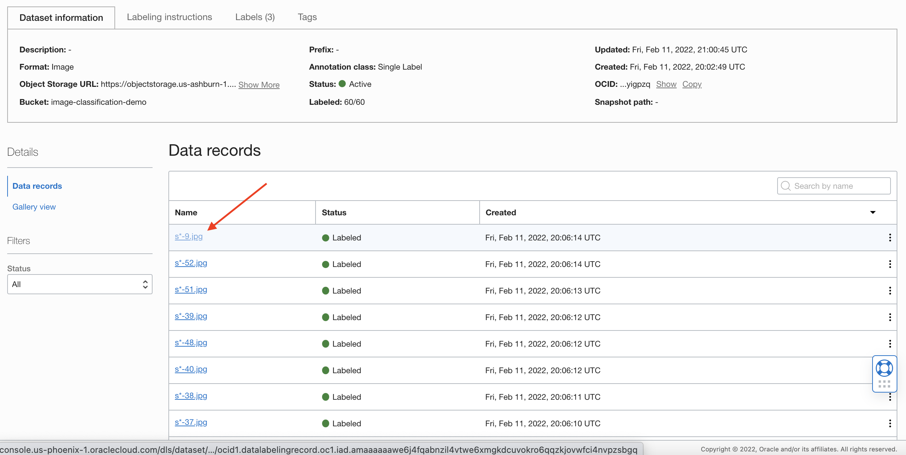
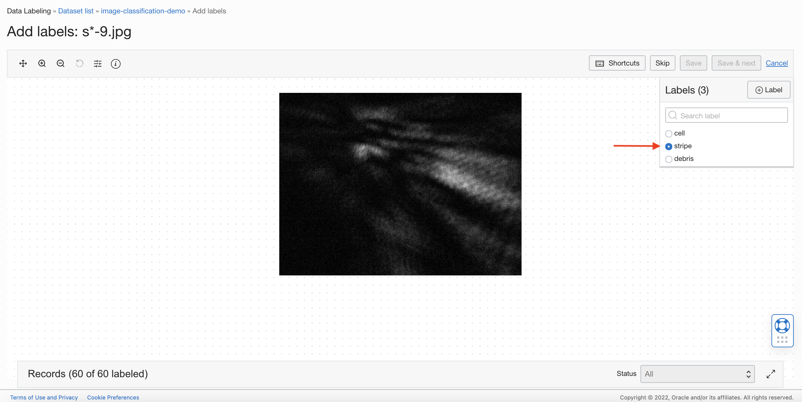

Congratulations on completing this lab!

[You may now **proceed to the next lab**](#next).

## Acknowledgements
* **Authors**
    * Samuel Cacela - Senior Cloud Engineer
    * Gabrielle Prichard - Product Manager, Analytics Platform

* **Last Updated By/Date**
    * Samuel Cacela - Senior Cloud Engineer, June 2023
